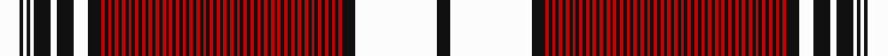

This is one **variant** — a specific cloth: this exact thread count and colourway, with its own
provenance below. It is one weaving of the [sett](/tartans/d/du/dunbar-2/) (the scale-free proportion — the
same cloth at any scale or shade), whose colour order is pattern [KWKRKRKRKRKRKRKRKRKRKRKRKRKRKRKRKRKRKRKRKRKRKRKRKRKRKRKRKRKRKRKRKRKRKRKRKRKWKWKWKWKW](/stripes/kwkrkrkrkrkrkrkrkrkrkrkrkrkrkrkrkrkrkrkrkrkrkrkrkrkrkrkrkrkrkrkrkrkrkrkrkrkwkwkwkwkw/).

Part of the [Dunbar](/tartans/d/du/dunbar-2/) tartan — the named design grouping this sett with its other cloths.

Sourced from tartans-authority.  It is a [84 stripe tartan](/stripes/stripes84/).

Original link <code>http://www.tartansauthority.com/tartan-ferret/display/1248/</code> — retired · [Internet Archive copy](https://web.archive.org/web/*/http://www.tartansauthority.com/tartan-ferret/display/1248/*)

Dataset <small>— provenance for this record, inherited from the source manifest</small>

<dl class="dataset-prov">
<dt>source</dt><dd><a href="/sources/tartans-authority/">Scottish Tartans Authority</a></dd>
<dt>data captured from</dt><dd><a href="https://github.com/thetartan/tartan-database/blob/master/data/tartans-authority/data.csv">https://github.com/thetartan/tartan-database/blob/master/data/tartans-authority/data.csv</a></dd>
<dt>data date</dt><dd>pre 2002 <small>(this record)</small></dd>
<dt>licence</dt><dd><a href="https://creativecommons.org/licenses/by-nc-nd/4.0/">CC BY-NC-ND 4.0</a></dd>
</dl>

Capture chain <small>— the hands this data passed through, oldest first; each capture carries its own licence</small>

<ol class="capture-chain">
<li><a href="https://www.tartansauthority.com/">Scottish Tartans Authority</a> <small>the heritage body’s archive — its tartan-ferret record browser is retired; dead record links are shown unlinked, with an Internet Archive copy (ITI numbers are not SRT references)</small></li>
<li><a href="https://github.com/thetartan/tartan-database">thetartan/tartan-database</a> <small>2016-2017</small> · <a href="https://creativecommons.org/licenses/by-nc-nd/4.0/">CC BY-NC-ND 4.0</a> <small>Levko Kravets's frozen compilation — the capture we vendored, and where its CC licence text came from</small></li>
<li>this dictionary <small>captured 2026-06-10 · commit 5bf86c7566</small> <small>each re-capture is a git commit to data/sources</small></li>
</ol>

## Register references

External register numbers recorded for this tartan.

- Scottish Tartans Authority (ITI): 1248

## Thread count
W/12 K2 W2 K2 W2 K10 W4 K10 W8 K8 R2 K2 R2 K2 R2 K2 R2 K2 R2 K2 R2 K2 R2 K2 R2 K2 R2 K2 R2 K2 R2 K2 R2 K2 R2 K2 R2 K2 R2 K2 R2 K2 R2 K2 R2 K2 R2 K2 R2 K2 R2 K2 R2 K2 R2 K2 R2 K2 R2 K2 R2 K2 R2 K2 R2 K2 R2 K2 R2 K2 R2 K2 R2 K2 R2 K2 R2 K2 R2 K2 R2 K8 W48 K/8

One full sett is **512 threads**.

## Palette
<table><thead><tr><th>Colour</th><th>Shade</th><th>OKLCh</th></tr></thead><tbody><tr><td>K</td><td><code style="background-color:#000000;">#000000</code> <small style="color:#888">#000000</small></td><td><small style="color:#888">oklch(0.0% 0.000 0.0)</small></td></tr><tr><td>R</td><td><code style="background-color:#D60020;">#D60020</code> <small style="color:#888">#D60020</small></td><td><small style="color:#888">oklch(55.2% 0.224 25.5)</small></td></tr><tr><td>W</td><td><code style="background-color:#F7F7F7;">#F7F7F7</code> <small style="color:#888">#F7F7F7</small></td><td><small style="color:#888">oklch(97.6% 0.000 89.9)</small></td></tr></tbody></table>

# Sample pattern

[Sample sheet (PDF)](swatch.pdf) — the woven sample, thread count and palette on one printable A4, rendered on demand (the same sheet the TTD print page downloads).

ID: /variants/s84/w6k1w1k1w1k5w2k5w4k4r1k1r1k1r1k1r1k1r1k1r1k1r1k1r1k1r1k1r1k1r1k1r1k1r1k1r1k1r1k1r1k1r1k1r1k1r1k1r1k1r1k1r1k1r1k1r1k1r1k1r1k1r1k1r1k1r1k1r1k1r1k1r1k1r1k1r1k1r1k1r1k4w24k4~x2/
