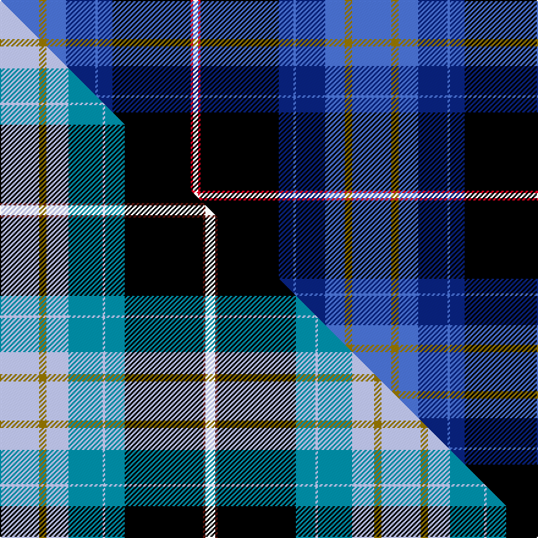

This is one **variant** — a specific cloth: this exact thread count and colourway, with its own
provenance below. It is one weaving of the [sett](/setts/b16y3b8db12b1db6k32r1w2/) (the scale-free proportion — the
same cloth at any scale or shade), whose colour order is pattern [BGBBBBKRW](/stripes/bgbbbbkrw/).

Part of the [Wrens](/tartans/w/wr/wrens/) tartan — the named design grouping this sett with its other cloths.

Sourced from weddslist.  It is a [9 stripe tartan](/stripes/stripes9/).

Original link [http://www.weddslist.com/cgi-bin/tartans/pg.pl?source=sts](http://www.weddslist.com/cgi-bin/tartans/pg.pl?source=sts)

Dataset <small>— provenance for this record, inherited from the source manifest</small>

<dl class="dataset-prov">
<dt>source</dt><dd><a href="/sources/weddslist/">Weddslist</a></dd>
<dt>data captured from</dt><dd><a href="https://github.com/thetartan/tartan-database/blob/master/data/weddslist/data.csv">https://github.com/thetartan/tartan-database/blob/master/data/weddslist/data.csv</a></dd>
<dt>data date</dt><dd>2016-11-17 <small>(dataset default)</small></dd>
<dt>licence</dt><dd><a href="https://creativecommons.org/licenses/by-nc-nd/4.0/">CC BY-NC-ND 4.0</a></dd>
</dl>

Capture chain <small>— the hands this data passed through, oldest first; each capture carries its own licence</small>

<ol class="capture-chain">
<li><a href="https://www.weddslist.com/tartans/">Weddslist</a> <small>the living privately compiled reference</small></li>
<li><a href="https://github.com/thetartan/tartan-database">thetartan/tartan-database</a> <small>2016-2017</small> · <a href="https://creativecommons.org/licenses/by-nc-nd/4.0/">CC BY-NC-ND 4.0</a> <small>Levko Kravets's frozen compilation — the capture we vendored, and where its CC licence text came from</small></li>
<li>this dictionary <small>captured 2026-06-10 · commit 5bf86c7566</small> <small>each re-capture is a git commit to data/sources</small></li>
</ol>

## Thread count
B/32 Y6 B16 DB24 B2 DB12 K64 R2 W/4

One full sett is **288 threads**.

## Palette
<table><thead><tr><th>Colour</th><th>Shade</th><th>OKLCh</th></tr></thead><tbody><tr><td>B</td><td><code style="background-color:#466CC8;">#466CC8</code> <small style="color:#888">#466CC8</small></td><td><small style="color:#888">oklch(55.1% 0.149 265.0)</small></td></tr><tr><td>DB</td><td><code style="background-color:#082077;">#082077</code> <small style="color:#888">#082077</small></td><td><small style="color:#888">oklch(30.0% 0.149 265.1)</small></td></tr><tr><td>K</td><td><code style="background-color:#000000;">#000000</code> <small style="color:#888">#000000</small></td><td><small style="color:#888">oklch(0.0% 0.000 0.0)</small></td></tr><tr><td>W</td><td><code style="background-color:#F7F7F7;">#F7F7F7</code> <small style="color:#888">#F7F7F7</small></td><td><small style="color:#888">oklch(97.6% 0.000 89.9)</small></td></tr><tr><td>R</td><td><code style="background-color:#D60020;">#D60020</code> <small style="color:#888">#D60020</small></td><td><small style="color:#888">oklch(55.2% 0.224 25.5)</small></td></tr><tr><td>Y</td><td><code style="background-color:#8B6E00;">#8B6E00</code> <small style="color:#888">#8B6E00</small></td><td><small style="color:#888">oklch(55.1% 0.113 90.4)</small></td></tr></tbody></table>

# Sample pattern

## Compared to the master

This cloth is one sett of its design; the master sett (the exemplar the design is anchored on) is below for comparison.

Its **ΔTartan distance** from the master is **0.30** — the same measure the nearest-tartans table ranks by (0 is identical; a re-scale of the same cloth is near 0, a recolour or a different proportion further).

<figure class="master-compare" style="margin:0">

this sett
master sett ★

<figcaption style="color:#888;font-size:smaller">One weave of this sett against the <a href="/setts/lb16y3lb9t14lb1t8k32dr1w4/">master sett ★</a>, split on the diagonal: a shared proportion runs seamlessly across it with only the shades shifting; a different proportion breaks on it.</figcaption>
</figure>

## Nearest tartan variants

The nearest existing variants by ΔTartan distance, with this cloth at the top so the swatches line up against it.

ΔTartan

Threads

Variant

Sett

—

288

<a href="/variants/s9/b16y3b8db12b1db6k32r1w2~x2/">Wrens</a>

<a href="/ttd/edit/#slug=lg2dg9k16r2db30lg3dg6w1~x2~lg3304130-dg1202138&amp;base=b16y3b8db12b1db6k32r1w2~x2" title="compare in the TTD">1.77</a>

270

<a href="/variants/s8/lg2dg9k16r2db30lg3dg6w1~x2~lg3304130-dg1202138/">Climb, The</a>

<a href="/ttd/edit/#slug=g1b28k11dr5w1dr5k11ly1k2g1~x2&amp;base=b16y3b8db12b1db6k32r1w2~x2" title="compare in the TTD">1.83</a>

260

<a href="/variants/s10/g1b28k11dr5w1dr5k11ly1k2g1~x2/">Scragg, Moran (Personal)</a>

<a href="/ttd/edit/#slug=dr2db24lb6k6g6k4g2k2g2k1~x2&amp;base=b16y3b8db12b1db6k32r1w2~x2" title="compare in the TTD">2.22</a>

214

<a href="/variants/s10/dr2db24lb6k6g6k4g2k2g2k1~x2/">Crookdake-Cheng (Personal)</a>

<a href="/ttd/edit/#slug=g1db28k11r5w1r5k11y1k2g1~x2&amp;base=b16y3b8db12b1db6k32r1w2~x2" title="compare in the TTD">2.29</a>

260

<a href="/variants/s10/g1db28k11r5w1r5k11y1k2g1~x2/">Scragg Moran (Personal)</a>

<a href="/ttd/edit/#slug=dp3g3w1k25db25k2db2g1r3w2~x2&amp;base=b16y3b8db12b1db6k32r1w2~x2" title="compare in the TTD">2.34</a>

258

<a href="/variants/s10/dp3g3w1k25db25k2db2g1r3w2~x2/">Heart of Oak</a>

<a href="/ttd/edit/#slug=k4w1db26k5db5k32b23k2r4k2b13k2~x2&amp;base=b16y3b8db12b1db6k32r1w2~x2" title="compare in the TTD">2.35</a>

464

<a href="/variants/s12/k4w1db26k5db5k32b23k2r4k2b13k2~x2/">Naomia Melvina Young Wedding Dress</a>

<a href="/ttd/edit/#slug=t33db3t7db3t33r2k22g3dbi49g3k22r2~x2~db1106275-dbi1406275&amp;base=b16y3b8db12b1db6k32r1w2~x2" title="compare in the TTD">2.43</a>

658

<a href="/variants/s12/t33db3t7db3t33r2k22g3dbi49g3k22r2~x2~db1106275-dbi1406275/">U.S. 2001 Air Force</a>

<a href="/ttd/edit/#slug=db4w1k2db25k12b1k2g16k2r1~x2&amp;base=b16y3b8db12b1db6k32r1w2~x2" title="compare in the TTD">2.49</a>

254

<a href="/variants/s10/db4w1k2db25k12b1k2g16k2r1~x2/">Sidey Family (Dundee) (Personal)</a>

<a href="/ttd/edit/#slug=dg12r2db5w1k10t15r10k5dg4db40w4~x2~db1409278-t2405255&amp;base=b16y3b8db12b1db6k32r1w2~x2" title="compare in the TTD">2.54</a>

400

<a href="/variants/s11/dg12r2db5w1k10t15r10k5dg4db40w4~x2~db1409278-t2405255/">Gemmell of Dumfries &amp; Galloway (Personal)</a>

<a href="/ttd/edit/#slug=r2lb5k4y1k4db16k3g2~x4&amp;base=b16y3b8db12b1db6k32r1w2~x2" title="compare in the TTD">2.55</a>

280

<a href="/variants/s8/r2lb5k4y1k4db16k3g2~x4/">Arundel County (Dalgleish)</a>

## Neighbour map

Every grey dot is one of 13621 variants placed by the first two principal components of the ΔTartan feature space (42% of its variance). Red is this tartan; blue dots are its nearest — click one to open its page. The map is a flat projection of a many-dimensional space — [how to read it](/posts/neighbourhood-maps/).

<svg viewBox="0 0 640 380" role="img" style="max-width:100%;height:auto;border:1px solid #e0e0e0;border-radius:4px;display:block" xmlns="http://www.w3.org/2000/svg"><image href="/nn/cloud.v1.png" width="640" height="380"/><a href="/variants/s8/lg2dg9k16r2db30lg3dg6w1~x2~lg3304130-dg1202138/"><circle cx="201.8" cy="99.5" r="4" fill="#3465a4"><title>Climb, The</title></circle></a><a href="/variants/s10/g1b28k11dr5w1dr5k11ly1k2g1~x2/"><circle cx="195.8" cy="78.8" r="4" fill="#3465a4"><title>Scragg, Moran (Personal)</title></circle></a><a href="/variants/s10/dr2db24lb6k6g6k4g2k2g2k1~x2/"><circle cx="171.0" cy="91.6" r="4" fill="#3465a4"><title>Crookdake-Cheng (Personal)</title></circle></a><a href="/variants/s10/g1db28k11r5w1r5k11y1k2g1~x2/"><circle cx="206.3" cy="78.6" r="4" fill="#3465a4"><title>Scragg Moran (Personal)</title></circle></a><a href="/variants/s10/dp3g3w1k25db25k2db2g1r3w2~x2/"><circle cx="202.4" cy="79.0" r="4" fill="#3465a4"><title>Heart of Oak</title></circle></a><a href="/variants/s12/k4w1db26k5db5k32b23k2r4k2b13k2~x2/"><circle cx="191.4" cy="90.6" r="4" fill="#3465a4"><title>Naomia Melvina Young Wedding Dress</title></circle></a><a href="/variants/s12/t33db3t7db3t33r2k22g3dbi49g3k22r2~x2~db1106275-dbi1406275/"><circle cx="167.8" cy="97.5" r="4" fill="#3465a4"><title>U.S. 2001 Air Force</title></circle></a><a href="/variants/s10/db4w1k2db25k12b1k2g16k2r1~x2/"><circle cx="198.1" cy="89.7" r="4" fill="#3465a4"><title>Sidey Family (Dundee) (Personal)</title></circle></a><a href="/variants/s11/dg12r2db5w1k10t15r10k5dg4db40w4~x2~db1409278-t2405255/"><circle cx="172.2" cy="73.2" r="4" fill="#3465a4"><title>Gemmell of Dumfries &amp; Galloway (Personal)</title></circle></a><a href="/variants/s8/r2lb5k4y1k4db16k3g2~x4/"><circle cx="160.0" cy="124.6" r="4" fill="#3465a4"><title>Arundel County (Dalgleish)</title></circle></a><circle cx="175.1" cy="89.9" r="5" fill="#c00000"/><text x="320" y="376" text-anchor="middle" font-size="11" fill="#999">ground</text><text x="11" y="190" text-anchor="middle" font-size="11" fill="#999" transform="rotate(-90 11 190)">complexity</text></svg>

ID: /variants/s9/b16y3b8db12b1db6k32r1w2~x2/
