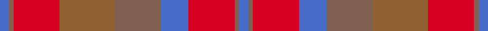

This page is one **sett** — a single exact thread-count. It belongs to the [tartan](/setts/b2o1r10oi12o10b6r10o1b2/)
(the same proportion at any scale), whose colour order is pattern [BRRBRRRRB](/stripes/brrbrrrrb/).

Sourced from weddslist.  It is a [9 stripe tartan](/stripes/stripes9/).

Original link http://www.weddslist.com/cgi-bin/tartans/pg.pl?source=sts

## Thread count
B/4 O2 R20 Oi24 O20 B12 R20 O2 B/4

One full sett is **208 threads**.

## Palette
<table><thead><tr><th>Colour</th><th>Shade</th><th>OKLCh</th></tr></thead><tbody><tr><td>O</td><td><code style="background-color:#906030;">#906030</code> <small style="color:#888">#906030</small></td><td><small style="color:#888">oklch(53.1% 0.089 63.7)</small></td></tr><tr><td>O</td><td><code style="background-color:#806050;">#806050</code> <small style="color:#888">#806050</small></td><td><small style="color:#888">oklch(51.7% 0.049 47.8)</small></td></tr><tr><td>B</td><td><code style="background-color:#466CC8;">#466CC8</code> <small style="color:#888">#466CC8</small></td><td><small style="color:#888">oklch(55.1% 0.149 265.0)</small></td></tr><tr><td>R</td><td><code style="background-color:#D60020;">#D60020</code> <small style="color:#888">#D60020</small></td><td><small style="color:#888">oklch(55.2% 0.224 25.5)</small></td></tr></tbody></table>

# Sample pattern

## Nearest tartan variants

The nearest existing variants by ΔTartan distance, with this cloth at the top so the swatches line up against it.

ΔTartan

Threads

Variant

Sett

—

208

<a href="/variants/s9/b2o1r10oi12o10b6r10o1b2~x2~o2102055-oi2104058/">Unidentified, Sett</a>

<a href="/ttd/edit/#slug=do10o24dr3o3dr24dg3o6do6~x2&amp;base=b2o1r10oi12o10b6r10o1b2~x2~o2102055-oi2104058" title="compare in the TTD">3.97</a>

284

<a href="/variants/s8/do10o24dr3o3dr24dg3o6do6~x2/">Earle's Flame (Fashion)</a>

## Neighbour map

Every grey dot is one of 13620 variants placed by the first two principal components of the ΔTartan feature space (42% of its variance). Red is this tartan; blue dots are its nearest — click one to open its page.

<svg viewBox="0 0 640 380" role="img" style="max-width:100%;height:auto;border:1px solid #e0e0e0;border-radius:4px;display:block" xmlns="http://www.w3.org/2000/svg"><image href="/nn/cloud.v1.png" width="640" height="380"/><a href="/variants/s8/do10o24dr3o3dr24dg3o6do6~x2/"><circle cx="340.8" cy="244.8" r="4" fill="#3465a4"><title>Earle's Flame (Fashion)</title></circle></a><circle cx="317.0" cy="241.3" r="5" fill="#c00000"/><text x="320" y="376" text-anchor="middle" font-size="11" fill="#999">ground</text><text x="11" y="190" text-anchor="middle" font-size="11" fill="#999" transform="rotate(-90 11 190)">complexity</text></svg>

ID: /variants/s9/b2o1r10oi12o10b6r10o1b2~x2~o2102055-oi2104058/
