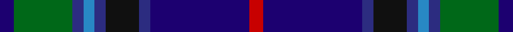

This page is one **sett** — a single exact thread-count. It belongs to the [tartan](/setts/db10g42dbi8t8dbi8k24dbi8db71r10/)
(the same proportion at any scale), whose colour order is pattern [BGBBBKBBR](/stripes/bgbbbkbbr/).

Sourced from register-of-tartans.  It is a [9 stripe tartan](/stripes/stripes9/).

Original link https://www.tartanregister.gov.uk/tartanDetails.aspx?ref=3518

## Also known as

This cloth is also recorded under:

- Robert Burns of Ayr

2 attestations — the source records this cloth was collapsed from (oldest owns this page)

<ul>
<li>01/02/2006 — Robert Burns Legacy (register-of-tartans, <a href="https://www.tartanregister.gov.uk/tartanDetails.aspx?ref=3518">record</a>)</li>
<li>2006 February — Robert Burns of Ayr (Corporate) (tartans-authority, <a href="http://www.tartansauthority.com/tartan-ferret/display/6843/">record</a>)</li>
</ul>

## Register references

External register numbers recorded for this tartan.

- Scottish Register of Tartans: [3518](https://www.tartanregister.gov.uk/tartanDetails.aspx?ref=3518)
- Scottish Tartans Authority (ITI): 6843

## Thread count
DB/10 G42 DBa8 B8 DBa8 K24 DBa8 DB71 R/10

One full sett is **358 threads**.

## Palette

Palette: <strong>Tartan Register</strong>
<table><thead><tr><th>Colour</th><th>Threads</th><th>Shade</th><th>Base</th><th>OKLCh</th></tr></thead><tbody><tr><td>DB/</td><td style="text-align:right;font-variant-numeric:tabular-nums">10</td><td><code style="background-color:#1C0070;">#1C0070</code> <small style="color:#888">#1C0070</small></td><td>B <code style="background-color:#2A418A;">#2A418A</code></td><td><small style="color:#888">oklch(26.3% 0.162 277.1)</small></td></tr><tr><td>G</td><td style="text-align:right;font-variant-numeric:tabular-nums">42</td><td><code style="background-color:#006818;">#006818</code> <small style="color:#888">#006818</small></td><td>G <code style="background-color:#006100;">#006100</code></td><td><small style="color:#888">oklch(45.0% 0.142 145.0)</small></td></tr><tr><td>DBa</td><td style="text-align:right;font-variant-numeric:tabular-nums">8</td><td><code style="background-color:#2C2C80;">#2C2C80</code> <small style="color:#888">#2C2C80</small></td><td>B <code style="background-color:#2A418A;">#2A418A</code></td><td><small style="color:#888">oklch(35.0% 0.138 276.6)</small></td></tr><tr><td>B</td><td style="text-align:right;font-variant-numeric:tabular-nums">8</td><td><code style="background-color:#2888C4;">#2888C4</code> <small style="color:#888">#2888C4</small></td><td>B <code style="background-color:#2A418A;">#2A418A</code></td><td><small style="color:#888">oklch(60.1% 0.125 241.5)</small></td></tr><tr><td>DBa</td><td style="text-align:right;font-variant-numeric:tabular-nums">8</td><td><code style="background-color:#2C2C80;">#2C2C80</code> <small style="color:#888">#2C2C80</small></td><td>B <code style="background-color:#2A418A;">#2A418A</code></td><td><small style="color:#888">oklch(35.0% 0.138 276.6)</small></td></tr><tr><td>K</td><td style="text-align:right;font-variant-numeric:tabular-nums">24</td><td><code style="background-color:#101010;">#101010</code> <small style="color:#888">#101010</small></td><td>K <code style="background-color:#000000;">#000000</code></td><td><small style="color:#888">oklch(17.3% 0.000 89.9)</small></td></tr><tr><td>DBa</td><td style="text-align:right;font-variant-numeric:tabular-nums">8</td><td><code style="background-color:#2C2C80;">#2C2C80</code> <small style="color:#888">#2C2C80</small></td><td>B <code style="background-color:#2A418A;">#2A418A</code></td><td><small style="color:#888">oklch(35.0% 0.138 276.6)</small></td></tr><tr><td>DB</td><td style="text-align:right;font-variant-numeric:tabular-nums">71</td><td><code style="background-color:#1C0070;">#1C0070</code> <small style="color:#888">#1C0070</small></td><td>B <code style="background-color:#2A418A;">#2A418A</code></td><td><small style="color:#888">oklch(26.3% 0.162 277.1)</small></td></tr><tr><td>R/</td><td style="text-align:right;font-variant-numeric:tabular-nums">10</td><td><code style="background-color:#C80000;">#C80000</code> <small style="color:#888">#C80000</small></td><td>R <code style="background-color:#CC0000;">#CC0000</code></td><td><small style="color:#888">oklch(52.3% 0.215 29.2)</small></td></tr></tbody></table>

## Nearest tartans

The nearest existing variants by ΔTartan distance, with this tartan at the top so the swatches line up against it.

ΔTartan

Tartan

Sett

—

<a href="/ttd/edit/#slug=db10g42dbi8t8dbi8k24dbi8db71r10">Robert Burns Legacy</a> <a class="nn-out" href="/variants/s9/db10g42dbi8t8dbi8k24dbi8db71r10/" title="open its dictionary page">↗</a>

0.81

<a href="/ttd/edit/#slug=k3dbi20db8dbi4dg20k2dg2r2dg3lo3~x2&amp;base=db10g42dbi8t8dbi8k24dbi8db71r10">Schmidt (2014)</a> <a class="nn-out" href="/variants/s10/k3dbi20db8dbi4dg20k2dg2r2dg3lo3~x2/" title="open its dictionary page">↗</a>

0.81

<a href="/ttd/edit/#slug=dg5g2b2db15r2t2dg5r2~x4&amp;base=db10g42dbi8t8dbi8k24dbi8db71r10">Remember the Somme 1916</a> <a class="nn-out" href="/variants/s8/dg5g2b2db15r2t2dg5r2~x4/" title="open its dictionary page">↗</a>

0.93

<a href="/ttd/edit/#slug=db4dy5g19dp5dy5k5dy5db36ly3~x2&amp;base=db10g42dbi8t8dbi8k24dbi8db71r10">Suzugamine (Corporate)</a> <a class="nn-out" href="/variants/s9/db4dy5g19dp5dy5k5dy5db36ly3~x2/" title="open its dictionary page">↗</a>

1.14

<a href="/ttd/edit/#slug=db17w2db2r2db2do12dg16lo3~x4&amp;base=db10g42dbi8t8dbi8k24dbi8db71r10">Blairmore House</a> <a class="nn-out" href="/variants/s8/db17w2db2r2db2do12dg16lo3~x4/" title="open its dictionary page">↗</a>

1.14

<a href="/ttd/edit/#slug=b11db5g4w3r3k16db28b2~x2&amp;base=db10g42dbi8t8dbi8k24dbi8db71r10">Scottish Italian</a> <a class="nn-out" href="/variants/s8/b11db5g4w3r3k16db28b2~x2/" title="open its dictionary page">↗</a>

1.17

<a href="/ttd/edit/#slug=k37r4db30n7k10w5n10y7~x2&amp;base=db10g42dbi8t8dbi8k24dbi8db71r10">Yates</a> <a class="nn-out" href="/variants/s8/k37r4db30n7k10w5n10y7~x2/" title="open its dictionary page">↗</a>

1.18

<a href="/ttd/edit/#slug=db9k30db9t3db5r3db5ly3db5g3~x2&amp;base=db10g42dbi8t8dbi8k24dbi8db71r10">Fed. of Circles &amp; Solitaries (Corp.)</a> <a class="nn-out" href="/variants/s10/db9k30db9t3db5r3db5ly3db5g3~x2/" title="open its dictionary page">↗</a>

1.22

<a href="/ttd/edit/#slug=g37dp5g5dp12b10db5b5db40dy4db4lo4~x2&amp;base=db10g42dbi8t8dbi8k24dbi8db71r10">State Seal of North Dakota (Fashion)</a> <a class="nn-out" href="/variants/s11/g37dp5g5dp12b10db5b5db40dy4db4lo4~x2/" title="open its dictionary page">↗</a>

1.23

<a href="/ttd/edit/#slug=k3dp16g5dp3p2dp2k12dt23w2~x2&amp;base=db10g42dbi8t8dbi8k24dbi8db71r10">Creiff Highland Gathering</a> <a class="nn-out" href="/variants/s9/k3dp16g5dp3p2dp2k12dt23w2~x2/" title="open its dictionary page">↗</a>

1.24

<a href="/ttd/edit/#slug=k3ly1dbi1db6m2db1m1db1dbi10w1~x4&amp;base=db10g42dbi8t8dbi8k24dbi8db71r10">Ertico</a> <a class="nn-out" href="/variants/s10/k3ly1dbi1db6m2db1m1db1dbi10w1~x4/" title="open its dictionary page">↗</a>

## Neighbour map

Every grey dot is one of 14360 variants placed by the first two principal components of the ΔTartan feature space (44% of its variance). Red is this tartan; blue dots are its nearest — click one to open its page.

<svg viewBox="0 0 640 380" role="img" style="max-width:100%;height:auto;border:1px solid #e0e0e0;border-radius:4px;display:block" xmlns="http://www.w3.org/2000/svg"><image href="/nn/cloud.v1.png" width="640" height="380"/><a href="/variants/s10/k3dbi20db8dbi4dg20k2dg2r2dg3lo3~x2/"><circle cx="192.7" cy="172.5" r="4" fill="#3465a4"><title>Schmidt (2014)</title></circle></a><a href="/variants/s8/dg5g2b2db15r2t2dg5r2~x4/"><circle cx="190.0" cy="189.0" r="4" fill="#3465a4"><title>Remember the Somme 1916</title></circle></a><a href="/variants/s9/db4dy5g19dp5dy5k5dy5db36ly3~x2/"><circle cx="224.2" cy="156.7" r="4" fill="#3465a4"><title>Suzugamine (Corporate)</title></circle></a><a href="/variants/s8/db17w2db2r2db2do12dg16lo3~x4/"><circle cx="176.9" cy="190.5" r="4" fill="#3465a4"><title>Blairmore House</title></circle></a><a href="/variants/s8/b11db5g4w3r3k16db28b2~x2/"><circle cx="208.2" cy="156.9" r="4" fill="#3465a4"><title>Scottish Italian</title></circle></a><a href="/variants/s8/k37r4db30n7k10w5n10y7~x2/"><circle cx="174.5" cy="179.7" r="4" fill="#3465a4"><title>Yates</title></circle></a><a href="/variants/s10/db9k30db9t3db5r3db5ly3db5g3~x2/"><circle cx="237.8" cy="166.2" r="4" fill="#3465a4"><title>Fed. of Circles &amp; Solitaries (Corp.)</title></circle></a><a href="/variants/s11/g37dp5g5dp12b10db5b5db40dy4db4lo4~x2/"><circle cx="194.8" cy="162.7" r="4" fill="#3465a4"><title>State Seal of North Dakota (Fashion)</title></circle></a><a href="/variants/s9/k3dp16g5dp3p2dp2k12dt23w2~x2/"><circle cx="168.5" cy="160.4" r="4" fill="#3465a4"><title>Creiff Highland Gathering</title></circle></a><a href="/variants/s10/k3ly1dbi1db6m2db1m1db1dbi10w1~x4/"><circle cx="171.8" cy="144.4" r="4" fill="#3465a4"><title>Ertico</title></circle></a><circle cx="193.6" cy="177.2" r="5" fill="#c00000"/></svg>

ID: /variants/s9/db10g42dbi8t8dbi8k24dbi8db71r10/
