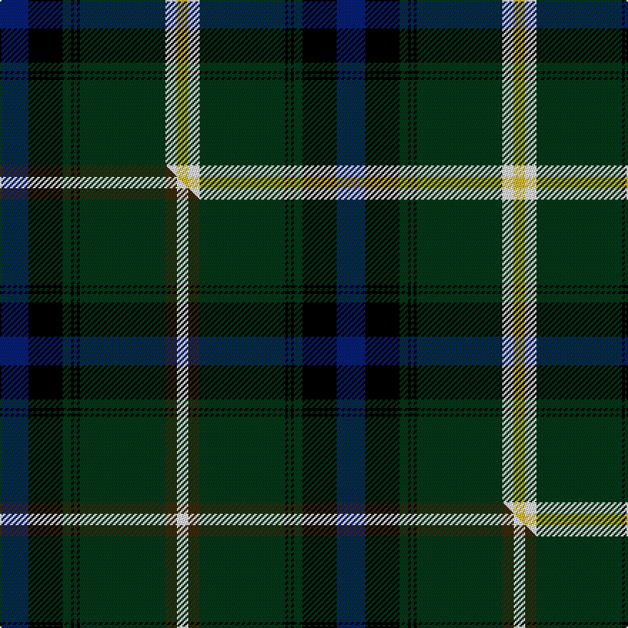

This page is one **sett** — a single exact thread-count. It belongs to the [tartan](/setts/db10k12dg3k1dg1k1dg30w4ly4/)
(the same proportion at any scale), whose colour order is pattern [BKGKGKGWY](/stripes/bkgkgkgwy/).

Part of the [Hutchens](/tartans/hutchens/) tartan — the named design grouping this sett with its other cloths.

Sourced from tartans-authority.  It is a [9 stripe tartan](/stripes/stripes9/).

Original link http://www.tartansauthority.com/tartan-ferret/display/10148/

## Register references

External register numbers recorded for this tartan.

- Scottish Register of Tartans: [10148](https://www.tartanregister.gov.uk/tartanDetails?ref=10148)
- Scottish Tartans Authority (ITI): 10148

## Thread count
DB/20 K24 DG6 K2 DG2 K2 DG60 W8 LY/8

One full sett is **236 threads**.

## Palette
<table><thead><tr><th>Colour</th><th>Shade</th><th>OKLCh</th></tr></thead><tbody><tr><td>DB</td><td><code style="background-color:#082077;">#082077</code> <small style="color:#888">#082077</small></td><td><small style="color:#888">oklch(30.0% 0.149 265.1)</small></td></tr><tr><td>DG</td><td><code style="background-color:#053819;">#053819</code> <small style="color:#888">#053819</small></td><td><small style="color:#888">oklch(30.0% 0.075 151.3)</small></td></tr><tr><td>LY</td><td><code style="background-color:#DCBC32;">#DCBC32</code> <small style="color:#888">#DCBC32</small></td><td><small style="color:#888">oklch(80.0% 0.150 95.2)</small></td></tr><tr><td>K</td><td><code style="background-color:#000000;">#000000</code> <small style="color:#888">#000000</small></td><td><small style="color:#888">oklch(0.0% 0.000 0.0)</small></td></tr><tr><td>W</td><td><code style="background-color:#F7F7F7;">#F7F7F7</code> <small style="color:#888">#F7F7F7</small></td><td><small style="color:#888">oklch(97.6% 0.000 89.9)</small></td></tr></tbody></table>

# Sample pattern

## Compared to the master

This cloth is one sett of its design; the master sett (the exemplar the design is anchored on) is below for comparison.

Its **ΔTartan distance** from the master is **0.60** — the same measure the nearest-tartans table ranks by (0 is identical; a re-scale of the same cloth is near 0, a recolour or a different proportion further).

<figure class="master-compare" style="margin:0">

this sett
master sett ★

<figcaption style="color:#888;font-size:smaller">One weave of this sett against the <a href="/setts/db10k12dg3k1dg1k1dg30dy4w4/">master sett ★</a>, split on the diagonal: a shared proportion runs seamlessly across it with only the shades shifting; a different proportion breaks on it.</figcaption>
</figure>

## Nearest tartan variants

The nearest existing variants by ΔTartan distance, with this cloth at the top so the swatches line up against it.

ΔTartan

Threads

Variant

Sett

—

236

<a href="/variants/s9/db10k12dg3k1dg1k1dg30w4ly4~x2/">Hutchens (Personal)</a>

<a href="/ttd/edit/#slug=w4g30k1g1k1g3k12db10r3~x2&amp;base=db10k12dg3k1dg1k1dg30w4ly4~x2" title="compare in the TTD">0.44</a>

246

<a href="/variants/s9/w4g30k1g1k1g3k12db10r3~x2/">MacDonald of The Isles</a>

<a href="/ttd/edit/#slug=w4g30k1g1k1g3k12db10r3&amp;base=db10k12dg3k1dg1k1dg30w4ly4~x2" title="compare in the TTD">0.44</a>

123

<a href="/variants/s9/w4g30k1g1k1g3k12db10r3/">MacDonnald of ye Ylis</a>

<a href="/ttd/edit/#slug=db10k12dg3k1dg1k1dg30dy4w4~x2&amp;base=db10k12dg3k1dg1k1dg30w4ly4~x2" title="compare in the TTD">0.60</a>

236

<a href="/variants/s9/db10k12dg3k1dg1k1dg30dy4w4~x2/">Hutchens (Kansas) (Personal)</a>

<a href="/ttd/edit/#slug=r4db15k18g3k2g2k2g44y4~x2&amp;base=db10k12dg3k1dg1k1dg30w4ly4~x2" title="compare in the TTD">0.98</a>

360

<a href="/variants/s9/r4db15k18g3k2g2k2g44y4~x2/">Sarafilovic (Corporate)</a>

<a href="/ttd/edit/#slug=w8g15k15g5k2g6k40db20r6&amp;base=db10k12dg3k1dg1k1dg30w4ly4~x2" title="compare in the TTD">1.21</a>

220

<a href="/variants/s9/w8g15k15g5k2g6k40db20r6/">Luker (Personal)</a>

<a href="/ttd/edit/#slug=db24y2k8g16k1g3k1g3r4~x2&amp;base=db10k12dg3k1dg1k1dg30w4ly4~x2" title="compare in the TTD">1.70</a>

192

<a href="/variants/s9/db24y2k8g16k1g3k1g3r4~x2/">Ogilvy Hunting</a>

<a href="/ttd/edit/#slug=dg3w2dg39k3g3k3dg3k20g10r2~x2~dg1502166-g2304144&amp;base=db10k12dg3k1dg1k1dg30w4ly4~x2" title="compare in the TTD">1.94</a>

342

<a href="/variants/s10/dg3w2dg39k3g3k3dg3k20g10r2~x2~dg1502166-g2304144/">Zorra Caledonian Society</a>

<a href="/ttd/edit/#slug=r2db16w1k16g30r1g2~x2&amp;base=db10k12dg3k1dg1k1dg30w4ly4~x2" title="compare in the TTD">2.14</a>

264

<a href="/variants/s7/r2db16w1k16g30r1g2~x2/">Sinclair Hunting (VS)</a>

<a href="/ttd/edit/#slug=g28k1g1k6w1k6dp1k1dp4r3dp14~x4&amp;base=db10k12dg3k1dg1k1dg30w4ly4~x2" title="compare in the TTD">2.24</a>

360

<a href="/variants/s11/g28k1g1k6w1k6dp1k1dp4r3dp14~x4/">New Hampshire</a>

<a href="/ttd/edit/#slug=g28r3k28db8lb1g8r2k3~x2&amp;base=db10k12dg3k1dg1k1dg30w4ly4~x2" title="compare in the TTD">2.31</a>

262

<a href="/variants/s8/g28r3k28db8lb1g8r2k3~x2/">Stansbury (2014)</a>

## Neighbour map

Every grey dot is one of 13620 variants placed by the first two principal components of the ΔTartan feature space (42% of its variance). Red is this tartan; blue dots are its nearest — click one to open its page.

<svg viewBox="0 0 640 380" role="img" style="max-width:100%;height:auto;border:1px solid #e0e0e0;border-radius:4px;display:block" xmlns="http://www.w3.org/2000/svg"><image href="/nn/cloud.v1.png" width="640" height="380"/><a href="/variants/s9/w4g30k1g1k1g3k12db10r3~x2/"><circle cx="240.4" cy="95.7" r="4" fill="#3465a4"><title>MacDonald of The Isles</title></circle></a><a href="/variants/s9/w4g30k1g1k1g3k12db10r3/"><circle cx="240.4" cy="95.7" r="4" fill="#3465a4"><title>MacDonnald of ye Ylis</title></circle></a><a href="/variants/s9/db10k12dg3k1dg1k1dg30dy4w4~x2/"><circle cx="271.3" cy="105.5" r="4" fill="#3465a4"><title>Hutchens (Kansas) (Personal)</title></circle></a><a href="/variants/s9/r4db15k18g3k2g2k2g44y4~x2/"><circle cx="243.6" cy="108.4" r="4" fill="#3465a4"><title>Sarafilovic (Corporate)</title></circle></a><a href="/variants/s9/w8g15k15g5k2g6k40db20r6/"><circle cx="184.4" cy="131.0" r="4" fill="#3465a4"><title>Luker (Personal)</title></circle></a><a href="/variants/s9/db24y2k8g16k1g3k1g3r4~x2/"><circle cx="193.0" cy="119.6" r="4" fill="#3465a4"><title>Ogilvy Hunting</title></circle></a><a href="/variants/s10/dg3w2dg39k3g3k3dg3k20g10r2~x2~dg1502166-g2304144/"><circle cx="258.4" cy="107.3" r="4" fill="#3465a4"><title>Zorra Caledonian Society</title></circle></a><a href="/variants/s7/r2db16w1k16g30r1g2~x2/"><circle cx="225.8" cy="118.2" r="4" fill="#3465a4"><title>Sinclair Hunting (VS)</title></circle></a><a href="/variants/s11/g28k1g1k6w1k6dp1k1dp4r3dp14~x4/"><circle cx="216.4" cy="86.3" r="4" fill="#3465a4"><title>New Hampshire</title></circle></a><a href="/variants/s8/g28r3k28db8lb1g8r2k3~x2/"><circle cx="210.9" cy="112.6" r="4" fill="#3465a4"><title>Stansbury (2014)</title></circle></a><circle cx="250.0" cy="98.4" r="5" fill="#c00000"/><text x="320" y="376" text-anchor="middle" font-size="11" fill="#999">ground</text><text x="11" y="190" text-anchor="middle" font-size="11" fill="#999" transform="rotate(-90 11 190)">complexity</text></svg>

ID: /variants/s9/db10k12dg3k1dg1k1dg30w4ly4~x2/
