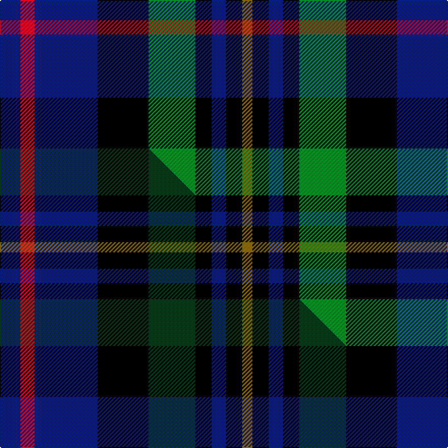

This page is one **sett** — a single exact thread-count. It belongs to the [tartan](/setts/db10r7db31k25g23k8db7k8y5/)
(the same proportion at any scale), whose colour order is pattern [BRBKGKBKG](/stripes/brbkgkbkg/).

Part of the [MacCallum of Berwick](/tartans/maccallum-of-berwick/) tartan — the named design grouping this sett with its other cloths.

Sourced from weddslist.  It is a [9 stripe tartan](/stripes/stripes9/).

Original link http://www.weddslist.com/cgi-bin/tartans/pg.pl?source=sts

## Thread count
DB/20 R14 DB62 K50 G46 K16 DB14 K16 Y/10

One full sett is **466 threads**.

## Palette
<table><thead><tr><th>Colour</th><th>Shade</th><th>OKLCh</th></tr></thead><tbody><tr><td>DB</td><td><code style="background-color:#082077;">#082077</code> <small style="color:#888">#082077</small></td><td><small style="color:#888">oklch(30.0% 0.149 265.1)</small></td></tr><tr><td>G</td><td><code style="background-color:#008B2A;">#008B2A</code> <small style="color:#888">#008B2A</small></td><td><small style="color:#888">oklch(55.4% 0.170 145.9)</small></td></tr><tr><td>K</td><td><code style="background-color:#000000;">#000000</code> <small style="color:#888">#000000</small></td><td><small style="color:#888">oklch(0.0% 0.000 0.0)</small></td></tr><tr><td>R</td><td><code style="background-color:#D60020;">#D60020</code> <small style="color:#888">#D60020</small></td><td><small style="color:#888">oklch(55.2% 0.224 25.5)</small></td></tr><tr><td>Y</td><td><code style="background-color:#8B6E00;">#8B6E00</code> <small style="color:#888">#8B6E00</small></td><td><small style="color:#888">oklch(55.1% 0.113 90.4)</small></td></tr></tbody></table>

# Sample pattern

## Compared to the master

This cloth is one sett of its design; the master sett (the exemplar the design is anchored on) is below for comparison.

Its **ΔTartan distance** from the master is **1.01** — the same measure the nearest-tartans table ranks by (0 is identical; a re-scale of the same cloth is near 0, a recolour or a different proportion further).

<figure class="master-compare" style="margin:0">

this sett
master sett ★

<figcaption style="color:#888;font-size:smaller">One weave of this sett against the <a href="/setts/db10r7db31k25dg23k8db7k8y5/">master sett ★</a>, split on the diagonal: a shared proportion runs seamlessly across it with only the shades shifting; a different proportion breaks on it.</figcaption>
</figure>

## Nearest tartan variants

The nearest existing variants by ΔTartan distance, with this cloth at the top so the swatches line up against it.

ΔTartan

Threads

Variant

Sett

—

466

<a href="/variants/s9/db10r7db31k25g23k8db7k8y5~x2/">MacCallum, of Berwick</a>

<a href="/ttd/edit/#slug=db10r7db31k25dg23k8db7k8y5~x2&amp;base=db10r7db31k25g23k8db7k8y5~x2" title="compare in the TTD">0.00</a>

466

<a href="/variants/s9/db10r7db31k25dg23k8db7k8y5~x2/">MacCallum of Berwick</a>

<a href="/ttd/edit/#slug=db10r7db31k25dg23k8db7r8ly5~x2&amp;base=db10r7db31k25g23k8db7k8y5~x2" title="compare in the TTD">1.11</a>

466

<a href="/variants/s9/db10r7db31k25dg23k8db7r8ly5~x2/">MacAllum of Berwick (Clan?)</a>

<a href="/ttd/edit/#slug=k3w2k3g8k8db8r2db3&amp;base=db10r7db31k25g23k8db7k8y5~x2" title="compare in the TTD">1.78</a>

68

<a href="/variants/s8/k3w2k3g8k8db8r2db3/">Davidson Double</a>

<a href="/ttd/edit/#slug=k3w2k3g8k8db8r2db3~x2&amp;base=db10r7db31k25g23k8db7k8y5~x2" title="compare in the TTD">1.78</a>

136

<a href="/variants/s8/k3w2k3g8k8db8r2db3~x2/">Davidson, Double</a>

<a href="/ttd/edit/#slug=lr8g33k21db6k6db33r6db6&amp;base=db10r7db31k25g23k8db7k8y5~x2" title="compare in the TTD">2.01</a>

224

<a href="/variants/s8/lr8g33k21db6k6db33r6db6/">Royal Highland Corporate Tartan</a>

<a href="/ttd/edit/#slug=ly4dg17k10db3k3db17dr3db3~x2&amp;base=db10r7db31k25g23k8db7k8y5~x2" title="compare in the TTD">2.05</a>

226

<a href="/variants/s8/ly4dg17k10db3k3db17dr3db3~x2/">Royal Highland Society (Corporate)</a>

<a href="/ttd/edit/#slug=db17dr2k16g17k2g17k16dr2db17lr2~x2&amp;base=db10r7db31k25g23k8db7k8y5~x2" title="compare in the TTD">2.46</a>

394

<a href="/variants/s10/db17dr2k16g17k2g17k16dr2db17lr2~x2/">Mitchell</a>

<a href="/ttd/edit/#slug=k8r1db8w1db8r1k8g8k1g8~x2&amp;base=db10r7db31k25g23k8db7k8y5~x2" title="compare in the TTD">2.47</a>

176

<a href="/variants/s10/k8r1db8w1db8r1k8g8k1g8~x2/">Hunter</a>

<a href="/ttd/edit/#slug=g8k7db12r2db12k7g8lb2~x4~db1406275&amp;base=db10r7db31k25g23k8db7k8y5~x2" title="compare in the TTD">2.82</a>

424

<a href="/variants/s8/g8k7db12r2db12k7g8lb2~x4~db1406275/">Forbo Nairn Corporate Tartan</a>

<a href="/ttd/edit/#slug=r2db10k10g10w1k4w1g10k10db10r1~x4&amp;base=db10r7db31k25g23k8db7k8y5~x2" title="compare in the TTD">2.89</a>

540

<a href="/variants/s11/r2db10k10g10w1k4w1g10k10db10r1~x4/">Rose</a>

## Neighbour map

Every grey dot is one of 13620 variants placed by the first two principal components of the ΔTartan feature space (42% of its variance). Red is this tartan; blue dots are its nearest — click one to open its page.

<svg viewBox="0 0 640 380" role="img" style="max-width:100%;height:auto;border:1px solid #e0e0e0;border-radius:4px;display:block" xmlns="http://www.w3.org/2000/svg"><image href="/nn/cloud.v1.png" width="640" height="380"/><a href="/variants/s9/db10r7db31k25dg23k8db7k8y5~x2/"><circle cx="151.7" cy="209.6" r="4" fill="#3465a4"><title>MacCallum of Berwick</title></circle></a><a href="/variants/s9/db10r7db31k25dg23k8db7r8ly5~x2/"><circle cx="121.9" cy="201.6" r="4" fill="#3465a4"><title>MacAllum of Berwick (Clan?)</title></circle></a><a href="/variants/s8/k3w2k3g8k8db8r2db3/"><circle cx="75.8" cy="226.9" r="4" fill="#3465a4"><title>Davidson Double</title></circle></a><a href="/variants/s8/k3w2k3g8k8db8r2db3~x2/"><circle cx="75.8" cy="226.9" r="4" fill="#3465a4"><title>Davidson, Double</title></circle></a><a href="/variants/s8/lr8g33k21db6k6db33r6db6/"><circle cx="110.6" cy="199.4" r="4" fill="#3465a4"><title>Royal Highland Corporate Tartan</title></circle></a><a href="/variants/s8/ly4dg17k10db3k3db17dr3db3~x2/"><circle cx="151.1" cy="207.8" r="4" fill="#3465a4"><title>Royal Highland Society (Corporate)</title></circle></a><a href="/variants/s10/db17dr2k16g17k2g17k16dr2db17lr2~x2/"><circle cx="99.8" cy="188.0" r="4" fill="#3465a4"><title>Mitchell</title></circle></a><a href="/variants/s10/k8r1db8w1db8r1k8g8k1g8~x2/"><circle cx="93.4" cy="187.4" r="4" fill="#3465a4"><title>Hunter</title></circle></a><a href="/variants/s8/g8k7db12r2db12k7g8lb2~x4~db1406275/"><circle cx="116.2" cy="228.4" r="4" fill="#3465a4"><title>Forbo Nairn Corporate Tartan</title></circle></a><a href="/variants/s11/r2db10k10g10w1k4w1g10k10db10r1~x4/"><circle cx="103.7" cy="176.0" r="4" fill="#3465a4"><title>Rose</title></circle></a><circle cx="119.8" cy="200.8" r="5" fill="#c00000"/><text x="320" y="376" text-anchor="middle" font-size="11" fill="#999">ground</text><text x="11" y="190" text-anchor="middle" font-size="11" fill="#999" transform="rotate(-90 11 190)">complexity</text></svg>

ID: /variants/s9/db10r7db31k25g23k8db7k8y5~x2/
