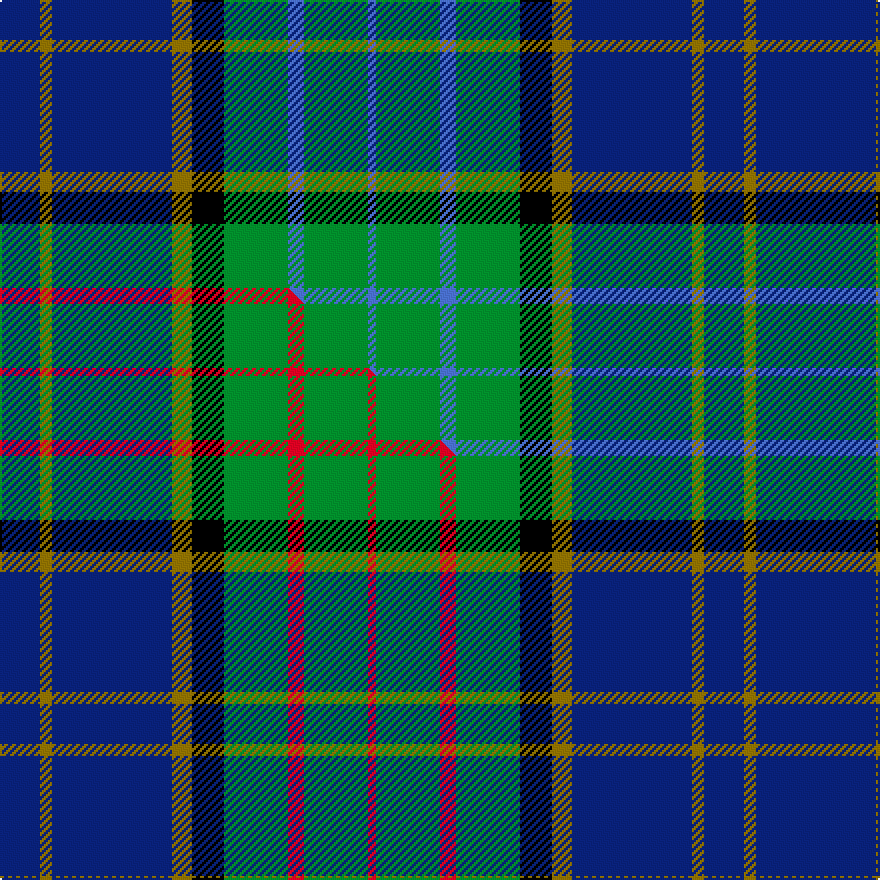

This is one **variant** — a specific cloth: this exact thread count and colourway, with its own
provenance below. It is one weaving of the [sett](/setts/db10y3db30y5k8g16b4g16b2/) (the scale-free proportion — the
same cloth at any scale or shade), whose colour order is pattern [BGBGKGBGB](/stripes/bgbgkgbgb/).

Part of the [MacMillan Hunting](/tartans/macmillan-hunting/) tartan — the named design grouping this sett with its other cloths.

Sourced from weddslist.  It is a [9 stripe tartan](/stripes/stripes9/).

Original link [http://www.weddslist.com/cgi-bin/tartans/pg.pl?source=sts](http://www.weddslist.com/cgi-bin/tartans/pg.pl?source=sts)

Dataset <small>— provenance for this record, inherited from the source manifest</small>

<dl class="dataset-prov">
<dt>source</dt><dd><a href="/sources/weddslist/">Weddslist</a></dd>
<dt>data captured from</dt><dd><a href="https://github.com/thetartan/tartan-database/blob/master/data/weddslist/data.csv">https://github.com/thetartan/tartan-database/blob/master/data/weddslist/data.csv</a></dd>
<dt>data date</dt><dd>2016-11-17 <small>(dataset default)</small></dd>
<dt>licence</dt><dd><a href="https://creativecommons.org/licenses/by-nc-nd/4.0/">CC BY-NC-ND 4.0</a></dd>
</dl>

Capture chain <small>— the hands this data passed through, oldest first; each capture carries its own licence</small>

<ol class="capture-chain">
<li><a href="https://www.weddslist.com/tartans/">Weddslist</a> <small>the living privately compiled reference</small></li>
<li><a href="https://github.com/thetartan/tartan-database">thetartan/tartan-database</a> <small>2016-2017</small> · <a href="https://creativecommons.org/licenses/by-nc-nd/4.0/">CC BY-NC-ND 4.0</a> <small>Levko Kravets's frozen compilation — the capture we vendored, and where its CC licence text came from</small></li>
<li>this dictionary <small>captured 2026-06-10 · commit 5bf86c7566</small> <small>each re-capture is a git commit to data/sources</small></li>
</ol>

## Thread count
DB/20 Y6 DB60 Y10 K16 G32 B8 G32 B/4

One full sett is **352 threads**.

## Palette
<table><thead><tr><th>Colour</th><th>Shade</th><th>OKLCh</th></tr></thead><tbody><tr><td>DB</td><td><code style="background-color:#082077;">#082077</code> <small style="color:#888">#082077</small></td><td><small style="color:#888">oklch(30.0% 0.149 265.1)</small></td></tr><tr><td>G</td><td><code style="background-color:#008B2A;">#008B2A</code> <small style="color:#888">#008B2A</small></td><td><small style="color:#888">oklch(55.4% 0.170 145.9)</small></td></tr><tr><td>K</td><td><code style="background-color:#000000;">#000000</code> <small style="color:#888">#000000</small></td><td><small style="color:#888">oklch(0.0% 0.000 0.0)</small></td></tr><tr><td>B</td><td><code style="background-color:#466CC8;">#466CC8</code> <small style="color:#888">#466CC8</small></td><td><small style="color:#888">oklch(55.1% 0.149 265.0)</small></td></tr><tr><td>Y</td><td><code style="background-color:#8B6E00;">#8B6E00</code> <small style="color:#888">#8B6E00</small></td><td><small style="color:#888">oklch(55.1% 0.113 90.4)</small></td></tr></tbody></table>

# Sample pattern

## Compared to the master

This cloth is one sett of its design; the master sett (the exemplar the design is anchored on) is below for comparison.

Its **ΔTartan distance** from the master is **0.60** — the same measure the nearest-tartans table ranks by (0 is identical; a re-scale of the same cloth is near 0, a recolour or a different proportion further).

<figure class="master-compare" style="margin:0">

this sett
master sett ★

<figcaption style="color:#888;font-size:smaller">One weave of this sett against the <a href="/setts/db10y3db30y5k8g16r4g16r2/">master sett ★</a>, split on the diagonal: a shared proportion runs seamlessly across it with only the shades shifting; a different proportion breaks on it.</figcaption>
</figure>

## Nearest tartan variants

The nearest existing variants by ΔTartan distance, with this cloth at the top so the swatches line up against it.

ΔTartan

Threads

Variant

Sett

—

352

<a href="/variants/s9/db10y3db30y5k8g16b4g16b2~x2/">MacMillan, hunting</a>

<a href="/ttd/edit/#slug=db10y3db30y5k8g16r4g16r2~x2&amp;base=db10y3db30y5k8g16b4g16b2~x2" title="compare in the TTD">0.60</a>

352

<a href="/variants/s9/db10y3db30y5k8g16r4g16r2~x2/">MacMillan Hunting Clan Tartan</a>

<a href="/ttd/edit/#slug=db3r2db22k11g24b2g3~x2&amp;base=db10y3db30y5k8g16b4g16b2~x2" title="compare in the TTD">1.51</a>

256

<a href="/variants/s7/db3r2db22k11g24b2g3~x2/">MacThomas</a>

<a href="/ttd/edit/#slug=db12k4g12ly1g12k4db8r3~x2&amp;base=db10y3db30y5k8g16b4g16b2~x2" title="compare in the TTD">1.73</a>

194

<a href="/variants/s8/db12k4g12ly1g12k4db8r3~x2/">Art Pewter Silver</a>

<a href="/ttd/edit/#slug=db5dp3db32k16g32o3g5~x2&amp;base=db10y3db30y5k8g16b4g16b2~x2" title="compare in the TTD">1.75</a>

364

<a href="/variants/s7/db5dp3db32k16g32o3g5~x2/">MacThomas LC</a>

<a href="/ttd/edit/#slug=db5dp3db32k16g32o3g5&amp;base=db10y3db30y5k8g16b4g16b2~x2" title="compare in the TTD">1.75</a>

182

<a href="/variants/s7/db5dp3db32k16g32o3g5/">MacThomas LC</a>

<a href="/ttd/edit/#slug=db5dr3db32k16g32o3g5~x2&amp;base=db10y3db30y5k8g16b4g16b2~x2" title="compare in the TTD">1.75</a>

364

<a href="/variants/s7/db5dr3db32k16g32o3g5~x2/">MacThomas</a>

<a href="/ttd/edit/#slug=db3r2db22k11g22r2g3~x2&amp;base=db10y3db30y5k8g16b4g16b2~x2" title="compare in the TTD">1.76</a>

248

<a href="/variants/s7/db3r2db22k11g22r2g3~x2/">Gammell (1978) (Personal)</a>

<a href="/ttd/edit/#slug=db3r2db22k11g24o2g3~x2&amp;base=db10y3db30y5k8g16b4g16b2~x2" title="compare in the TTD">1.80</a>

256

<a href="/variants/s7/db3r2db22k11g24o2g3~x2/">MacThomas Clan Tartan</a>

<a href="/ttd/edit/#slug=db30k10g10lb2g15lb2~x2&amp;base=db10y3db30y5k8g16b4g16b2~x2" title="compare in the TTD">1.81</a>

212

<a href="/variants/s6/db30k10g10lb2g15lb2~x2/">MacRobart (Personal)</a>

<a href="/ttd/edit/#slug=g11k2g1dr4db1dr4db13lb2db1~x4&amp;base=db10y3db30y5k8g16b4g16b2~x2" title="compare in the TTD">1.90</a>

264

<a href="/variants/s9/g11k2g1dr4db1dr4db13lb2db1~x4/">Dunbartonshire</a>

## Neighbour map

Every grey dot is one of 13621 variants placed by the first two principal components of the ΔTartan feature space (42% of its variance). Red is this tartan; blue dots are its nearest — click one to open its page.

<svg viewBox="0 0 640 380" role="img" style="max-width:100%;height:auto;border:1px solid #e0e0e0;border-radius:4px;display:block" xmlns="http://www.w3.org/2000/svg"><image href="/nn/cloud.v1.png" width="640" height="380"/><a href="/variants/s9/db10y3db30y5k8g16r4g16r2~x2/"><circle cx="186.8" cy="161.5" r="4" fill="#3465a4"><title>MacMillan Hunting Clan Tartan</title></circle></a><a href="/variants/s7/db3r2db22k11g24b2g3~x2/"><circle cx="183.0" cy="168.1" r="4" fill="#3465a4"><title>MacThomas</title></circle></a><a href="/variants/s8/db12k4g12ly1g12k4db8r3~x2/"><circle cx="162.6" cy="192.4" r="4" fill="#3465a4"><title>Art Pewter Silver</title></circle></a><a href="/variants/s7/db5dp3db32k16g32o3g5~x2/"><circle cx="172.4" cy="176.4" r="4" fill="#3465a4"><title>MacThomas LC</title></circle></a><a href="/variants/s7/db5dp3db32k16g32o3g5/"><circle cx="172.4" cy="176.4" r="4" fill="#3465a4"><title>MacThomas LC</title></circle></a><a href="/variants/s7/db5dr3db32k16g32o3g5~x2/"><circle cx="172.3" cy="176.4" r="4" fill="#3465a4"><title>MacThomas</title></circle></a><a href="/variants/s7/db3r2db22k11g22r2g3~x2/"><circle cx="187.2" cy="184.4" r="4" fill="#3465a4"><title>Gammell (1978) (Personal)</title></circle></a><a href="/variants/s7/db3r2db22k11g24o2g3~x2/"><circle cx="181.8" cy="167.0" r="4" fill="#3465a4"><title>MacThomas Clan Tartan</title></circle></a><a href="/variants/s6/db30k10g10lb2g15lb2~x2/"><circle cx="215.5" cy="188.2" r="4" fill="#3465a4"><title>MacRobart (Personal)</title></circle></a><a href="/variants/s9/g11k2g1dr4db1dr4db13lb2db1~x4/"><circle cx="180.7" cy="155.6" r="4" fill="#3465a4"><title>Dunbartonshire</title></circle></a><circle cx="192.9" cy="165.7" r="5" fill="#c00000"/><text x="320" y="376" text-anchor="middle" font-size="11" fill="#999">ground</text><text x="11" y="190" text-anchor="middle" font-size="11" fill="#999" transform="rotate(-90 11 190)">complexity</text></svg>

ID: /variants/s9/db10y3db30y5k8g16b4g16b2~x2/
