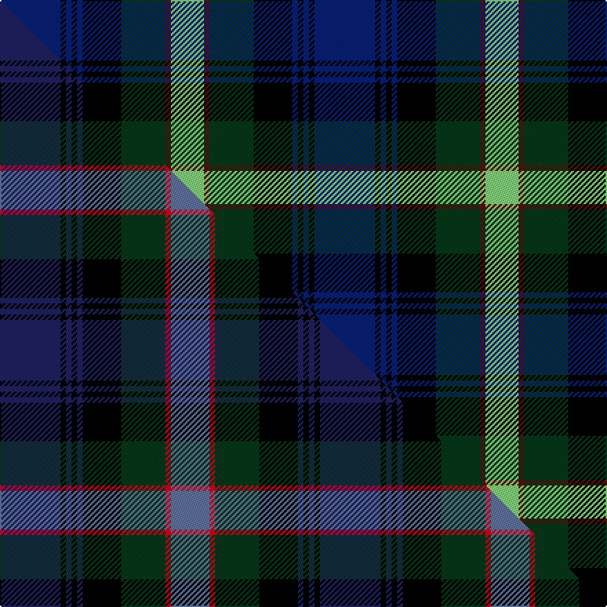

This page is one **sett** — a single exact thread-count. It belongs to the [tartan](/setts/db11k1db1k1db1k7dg8dr1lg6/)
(the same proportion at any scale), whose colour order is pattern [BKBKBKGBY](/stripes/bkbkbkgby/).

Part of the [Damm, Alexander](/tartans/damm-alexander/) tartan — the named design grouping this sett with its other cloths.

Sourced from tartans-authority.  It is a [9 stripe tartan](/stripes/stripes9/).

Original link http://www.tartansauthority.com/tartan-ferret/display/11258/

## Register references

External register numbers recorded for this tartan.

- Scottish Register of Tartans: [11258](https://www.tartanregister.gov.uk/tartanDetails?ref=11258)
- Scottish Tartans Authority (ITI): 11258

## Thread count
DB/44 K4 DB4 K4 DB4 K28 DG32 DR4 LG/24

One full sett is **228 threads**.

## Palette
<table><thead><tr><th>Colour</th><th>Shade</th><th>OKLCh</th></tr></thead><tbody><tr><td>LG</td><td><code style="background-color:#82D67A;">#82D67A</code> <small style="color:#888">#82D67A</small></td><td><small style="color:#888">oklch(80.1% 0.150 142.2)</small></td></tr><tr><td>DB</td><td><code style="background-color:#082077;">#082077</code> <small style="color:#888">#082077</small></td><td><small style="color:#888">oklch(30.0% 0.149 265.1)</small></td></tr><tr><td>DG</td><td><code style="background-color:#053819;">#053819</code> <small style="color:#888">#053819</small></td><td><small style="color:#888">oklch(30.0% 0.075 151.3)</small></td></tr><tr><td>DR</td><td><code style="background-color:#55120C;">#55120C</code> <small style="color:#888">#55120C</small></td><td><small style="color:#888">oklch(30.0% 0.099 29.3)</small></td></tr><tr><td>K</td><td><code style="background-color:#000000;">#000000</code> <small style="color:#888">#000000</small></td><td><small style="color:#888">oklch(0.0% 0.000 0.0)</small></td></tr></tbody></table>

# Sample pattern

## Compared to the master

This cloth is one sett of its design; the master sett (the exemplar the design is anchored on) is below for comparison.

Its **ΔTartan distance** from the master is **1.42** — the same measure the nearest-tartans table ranks by (0 is identical; a re-scale of the same cloth is near 0, a recolour or a different proportion further).

<figure class="master-compare" style="margin:0">

this sett
master sett ★

<figcaption style="color:#888;font-size:smaller">One weave of this sett against the <a href="/setts/db11k1db1k1db1k7dg8r1n7/">master sett ★</a>, split on the diagonal: a shared proportion runs seamlessly across it with only the shades shifting; a different proportion breaks on it.</figcaption>
</figure>

## Nearest tartan variants

The nearest existing variants by ΔTartan distance, with this cloth at the top so the swatches line up against it.

ΔTartan

Threads

Variant

Sett

—

228

<a href="/variants/s9/db11k1db1k1db1k7dg8dr1lg6~x4/">Damm, Alexander (Personal)</a>

<a href="/ttd/edit/#slug=w4dg20k13b2k2b2k2b16lb4~x2&amp;base=db11k1db1k1db1k7dg8dr1lg6~x4" title="compare in the TTD">1.63</a>

244

<a href="/variants/s9/w4dg20k13b2k2b2k2b16lb4~x2/">Royal College of Surgeons of Edinburgh</a>

<a href="/ttd/edit/#slug=db20k3db3k3db3k16g3lo3g12dr2~x2&amp;base=db11k1db1k1db1k7dg8dr1lg6~x4" title="compare in the TTD">2.15</a>

228

<a href="/variants/s10/db20k3db3k3db3k16g3lo3g12dr2~x2/">Barnes Hunting (Personal)</a>

<a href="/ttd/edit/#slug=db20k3db3k3db3k16g2y3g12r2~x2&amp;base=db11k1db1k1db1k7dg8dr1lg6~x4" title="compare in the TTD">2.19</a>

224

<a href="/variants/s10/db20k3db3k3db3k16g2y3g12r2~x2/">Barnes</a>

<a href="/ttd/edit/#slug=w4n20k13db2k2db2k2db16lb4~x2&amp;base=db11k1db1k1db1k7dg8dr1lg6~x4" title="compare in the TTD">2.62</a>

244

<a href="/variants/s9/w4n20k13db2k2db2k2db16lb4~x2/">Royal College of Surgeons of Edinburgh, The</a>

<a href="/ttd/edit/#slug=r2g10k12db1k2db14k1db1g2~x2&amp;base=db11k1db1k1db1k7dg8dr1lg6~x4" title="compare in the TTD">2.65</a>

172

<a href="/variants/s9/r2g10k12db1k2db14k1db1g2~x2/">McWilliams Wedding (Personal)</a>

<a href="/ttd/edit/#slug=db24k2db2r2db2k20g16y2g2y3~x2&amp;base=db11k1db1k1db1k7dg8dr1lg6~x4" title="compare in the TTD">2.82</a>

246

<a href="/variants/s10/db24k2db2r2db2k20g16y2g2y3~x2/">Watson (Name)</a>

<a href="/ttd/edit/#slug=db11k2db2k2db2k11g11r2g3k1y3~x2&amp;base=db11k1db1k1db1k7dg8dr1lg6~x4" title="compare in the TTD">2.83</a>

172

<a href="/variants/s11/db11k2db2k2db2k11g11r2g3k1y3~x2/">Grant, hunting</a>

<a href="/ttd/edit/#slug=db22k4db4k4db4k22g22r6g6k2y3~x2&amp;base=db11k1db1k1db1k7dg8dr1lg6~x4" title="compare in the TTD">2.84</a>

346

<a href="/variants/s11/db22k4db4k4db4k22g22r6g6k2y3~x2/">MacLaren (labelled)</a>

<a href="/ttd/edit/#slug=db24k4db4k4db4k24g24r5g6k2y2~x2&amp;base=db11k1db1k1db1k7dg8dr1lg6~x4" title="compare in the TTD">2.88</a>

360

<a href="/variants/s11/db24k4db4k4db4k24g24r5g6k2y2~x2/">Grant</a>

## Neighbour map

Every grey dot is one of 13620 variants placed by the first two principal components of the ΔTartan feature space (42% of its variance). Red is this tartan; blue dots are its nearest — click one to open its page.

<svg viewBox="0 0 640 380" role="img" style="max-width:100%;height:auto;border:1px solid #e0e0e0;border-radius:4px;display:block" xmlns="http://www.w3.org/2000/svg"><image href="/nn/cloud.v1.png" width="640" height="380"/><a href="/variants/s9/w4dg20k13b2k2b2k2b16lb4~x2/"><circle cx="105.6" cy="160.3" r="4" fill="#3465a4"><title>Royal College of Surgeons of Edinburgh</title></circle></a><a href="/variants/s10/db20k3db3k3db3k16g3lo3g12dr2~x2/"><circle cx="148.1" cy="157.2" r="4" fill="#3465a4"><title>Barnes Hunting (Personal)</title></circle></a><a href="/variants/s10/db20k3db3k3db3k16g2y3g12r2~x2/"><circle cx="155.7" cy="155.7" r="4" fill="#3465a4"><title>Barnes</title></circle></a><a href="/variants/s9/w4n20k13db2k2db2k2db16lb4~x2/"><circle cx="112.1" cy="160.0" r="4" fill="#3465a4"><title>Royal College of Surgeons of Edinburgh, The</title></circle></a><a href="/variants/s9/r2g10k12db1k2db14k1db1g2~x2/"><circle cx="152.1" cy="143.0" r="4" fill="#3465a4"><title>McWilliams Wedding (Personal)</title></circle></a><a href="/variants/s10/db24k2db2r2db2k20g16y2g2y3~x2/"><circle cx="159.0" cy="137.9" r="4" fill="#3465a4"><title>Watson (Name)</title></circle></a><a href="/variants/s11/db11k2db2k2db2k11g11r2g3k1y3~x2/"><circle cx="114.7" cy="154.5" r="4" fill="#3465a4"><title>Grant, hunting</title></circle></a><a href="/variants/s11/db22k4db4k4db4k22g22r6g6k2y3~x2/"><circle cx="117.8" cy="152.4" r="4" fill="#3465a4"><title>MacLaren (labelled)</title></circle></a><a href="/variants/s11/db24k4db4k4db4k24g24r5g6k2y2~x2/"><circle cx="131.4" cy="144.0" r="4" fill="#3465a4"><title>Grant</title></circle></a><circle cx="124.0" cy="160.8" r="5" fill="#c00000"/><text x="320" y="376" text-anchor="middle" font-size="11" fill="#999">ground</text><text x="11" y="190" text-anchor="middle" font-size="11" fill="#999" transform="rotate(-90 11 190)">complexity</text></svg>

ID: /variants/s9/db11k1db1k1db1k7dg8dr1lg6~x4/
