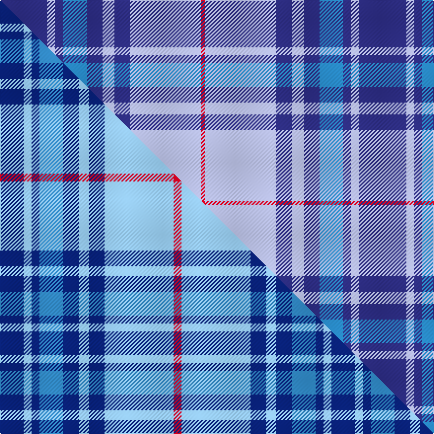

This is one **variant** — a specific cloth: this exact thread count and colourway, with its own
provenance below. It is one weaving of the [sett](/tartans/t/th/thorburn-2/) (the scale-free proportion — the
same cloth at any scale or shade), whose colour order is pattern [BWBBBWBWR](/stripes/bwbbbwbwr/).

Part of the [Thorburn](/tartans/t/th/thorburn-2/) tartan — the named design grouping this sett with its other cloths.

Sourced from tartans-authority.  It is a [9 stripe tartan](/stripes/stripes9/).

Original link <code>http://www.tartansauthority.com/tartan-ferret/display/6615/</code> — retired · [Internet Archive copy](https://web.archive.org/web/*/http://www.tartansauthority.com/tartan-ferret/display/6615/*)

Dataset <small>— provenance for this record, inherited from the source manifest</small>

<dl class="dataset-prov">
<dt>source</dt><dd><a href="/sources/tartans-authority/">Scottish Tartans Authority</a></dd>
<dt>data captured from</dt><dd><a href="https://github.com/thetartan/tartan-database/blob/master/data/tartans-authority/data.csv">https://github.com/thetartan/tartan-database/blob/master/data/tartans-authority/data.csv</a></dd>
<dt>data date</dt><dd>1992 <small>(this record)</small></dd>
<dt>licence</dt><dd><a href="https://creativecommons.org/licenses/by-nc-nd/4.0/">CC BY-NC-ND 4.0</a></dd>
</dl>

Capture chain <small>— the hands this data passed through, oldest first; each capture carries its own licence</small>

<ol class="capture-chain">
<li><a href="https://www.tartansauthority.com/">Scottish Tartans Authority</a> <small>the heritage body’s archive — its tartan-ferret record browser is retired; dead record links are shown unlinked, with an Internet Archive copy (ITI numbers are not SRT references)</small></li>
<li><a href="https://github.com/thetartan/tartan-database">thetartan/tartan-database</a> <small>2016-2017</small> · <a href="https://creativecommons.org/licenses/by-nc-nd/4.0/">CC BY-NC-ND 4.0</a> <small>Levko Kravets's frozen compilation — the capture we vendored, and where its CC licence text came from</small></li>
<li>this dictionary <small>captured 2026-06-10 · commit 5bf86c7566</small> <small>each re-capture is a git commit to data/sources</small></li>
</ol>

## Register references

External register numbers recorded for this tartan.

- Scottish Tartans Authority (ITI): 6615

## Thread count
DB/48 LB8 DB8 T24 DB16 LB12 DB16 LB72 R/4

One full sett is **364 threads**.

## Palette
<table><thead><tr><th>Colour</th><th>Shade</th><th>OKLCh</th></tr></thead><tbody><tr><td>T</td><td><code style="background-color:#2888C4;">#2888C4</code> <small style="color:#888">#2888C4</small></td><td><small style="color:#888">oklch(60.1% 0.125 241.5)</small></td></tr><tr><td>DB</td><td><code style="background-color:#2C2C80;">#2C2C80</code> <small style="color:#888">#2C2C80</small></td><td><small style="color:#888">oklch(35.0% 0.138 276.6)</small></td></tr><tr><td>LB</td><td><code style="background-color:#B5BBDE;">#B5BBDE</code> <small style="color:#888">#B5BBDE</small></td><td><small style="color:#888">oklch(79.9% 0.050 277.6)</small></td></tr><tr><td>R</td><td><code style="background-color:#D60020;">#D60020</code> <small style="color:#888">#D60020</small></td><td><small style="color:#888">oklch(55.2% 0.224 25.5)</small></td></tr></tbody></table>

# Sample pattern

[Sample sheet (PDF)](swatch.pdf) — the woven sample, thread count and palette on one printable A4, rendered on demand (the same sheet the TTD print page downloads).

## Compared to the master

This cloth is one sett of its design; the master sett (the exemplar the design is anchored on) is below for comparison.

Its **ΔTartan distance** from the master is **0.69** — the same measure the nearest-tartans table ranks by (0 is identical; a re-scale of the same cloth is near 0, a recolour or a different proportion further).

<figure class="master-compare" style="margin:0">

this sett
master sett ★

<figcaption style="color:#888;font-size:smaller">One weave of this sett against the <a href="/setts/db12lb4db4t12db8lb5db8lb35r4/">master sett ★</a>, split on the diagonal: a shared proportion runs seamlessly across it with only the shades shifting; a different proportion breaks on it.</figcaption>
</figure>

## Nearest tartan variants

The nearest existing variants by ΔTartan distance, with this cloth at the top so the swatches line up against it.

ΔTartan

Threads

Variant

Sett

—

364

<a href="/variants/s9/db12lb2db2t6db4lb3db4lb18r1~x4~db3514276-t5912243/">Thorburn #1 (Name)</a>

<a href="/ttd/edit/#slug=db12lb4db4t12db8lb5db8lb35r4~x2~lb8007237-t5912243&amp;base=db12lb2db2t6db4lb3db4lb18r1~x4~db3514276-t5912243" title="compare in the TTD">0.69</a>

336

<a href="/variants/s9/db12lb4db4t12db8lb5db8lb35r4~x2~lb8007237-t5912243/">Thorburn (1992)</a>

<a href="/ttd/edit/#slug=db4r3b23db16w5b3r2b3w5b11db2r1db4~x2&amp;base=db12lb2db2t6db4lb3db4lb18r1~x4~db3514276-t5912243" title="compare in the TTD">2.47</a>

312

<a href="/variants/s13/db4r3b23db16w5b3r2b3w5b11db2r1db4~x2/">Illinois, St Andrews Society</a>

<a href="/ttd/edit/#slug=db7r3db26lb2db2lb26y4~x2&amp;base=db12lb2db2t6db4lb3db4lb18r1~x4~db3514276-t5912243" title="compare in the TTD">2.50</a>

258

<a href="/variants/s7/db7r3db26lb2db2lb26y4~x2/">Int. Police Association (Official)</a>

<a href="/ttd/edit/#slug=db14r6db52lb4db4lb51y8&amp;base=db12lb2db2t6db4lb3db4lb18r1~x4~db3514276-t5912243" title="compare in the TTD">2.53</a>

256

<a href="/variants/s7/db14r6db52lb4db4lb51y8/">International Police Association (IPA 2010)</a>

<a href="/ttd/edit/#slug=db42r2lb2r2db5b12lb32db4~x2&amp;base=db12lb2db2t6db4lb3db4lb18r1~x4~db3514276-t5912243" title="compare in the TTD">2.62</a>

312

<a href="/variants/s8/db42r2lb2r2db5b12lb32db4~x2/">Longniddry Lavender (Dance)</a>

<a href="/ttd/edit/#slug=db10w3db3w3db5w8db38lb8db8lb61r6&amp;base=db12lb2db2t6db4lb3db4lb18r1~x4~db3514276-t5912243" title="compare in the TTD">2.75</a>

290

<a href="/variants/s11/db10w3db3w3db5w8db38lb8db8lb61r6/">Caleys Windsor (Corporate)</a>

<a href="/ttd/edit/#slug=db4r3lb23db16w5lb3r2lb3w5lb11db2r1db4~x2&amp;base=db12lb2db2t6db4lb3db4lb18r1~x4~db3514276-t5912243" title="compare in the TTD">2.95</a>

312

<a href="/variants/s13/db4r3lb23db16w5lb3r2lb3w5lb11db2r1db4~x2/">Illinois St Andrews Society Corporate Tartan</a>

<a href="/ttd/edit/#slug=lb14w1lb3y2lb3w1lb4db24r3~x2&amp;base=db12lb2db2t6db4lb3db4lb18r1~x4~db3514276-t5912243" title="compare in the TTD">3.01</a>

186

<a href="/variants/s9/lb14w1lb3y2lb3w1lb4db24r3~x2/">Musselburgh District Tartan</a>

<a href="/ttd/edit/#slug=db3w1db1w1db2w3db15lb2db2lb22r2~x2&amp;base=db12lb2db2t6db4lb3db4lb18r1~x4~db3514276-t5912243" title="compare in the TTD">3.06</a>

206

<a href="/variants/s11/db3w1db1w1db2w3db15lb2db2lb22r2~x2/">Commonwealth Games 1986 #2</a>

<a href="/ttd/edit/#slug=r4t12db36w4db4t16w3db6t3~x2&amp;base=db12lb2db2t6db4lb3db4lb18r1~x4~db3514276-t5912243" title="compare in the TTD">3.12</a>

338

<a href="/variants/s9/r4t12db36w4db4t16w3db6t3~x2/">Callaway (Name)</a>

## Neighbour map

Every grey dot is one of 13662 variants placed by the first two principal components of the ΔTartan feature space (42% of its variance). Red is this tartan; blue dots are its nearest — click one to open its page. The map is a flat projection of a many-dimensional space — [how to read it](/posts/neighbourhood-maps/).

<svg viewBox="0 0 640 380" role="img" style="max-width:100%;height:auto;border:1px solid #e0e0e0;border-radius:4px;display:block" xmlns="http://www.w3.org/2000/svg"><image href="/nn/cloud.v1.png" width="640" height="380"/><a href="/variants/s9/db12lb4db4t12db8lb5db8lb35r4~x2~lb8007237-t5912243/"><circle cx="245.0" cy="199.8" r="4" fill="#3465a4"><title>Thorburn (1992)</title></circle></a><a href="/variants/s13/db4r3b23db16w5b3r2b3w5b11db2r1db4~x2/"><circle cx="283.1" cy="144.2" r="4" fill="#3465a4"><title>Illinois, St Andrews Society</title></circle></a><a href="/variants/s7/db7r3db26lb2db2lb26y4~x2/"><circle cx="287.3" cy="179.4" r="4" fill="#3465a4"><title>Int. Police Association (Official)</title></circle></a><a href="/variants/s7/db14r6db52lb4db4lb51y8/"><circle cx="288.3" cy="179.6" r="4" fill="#3465a4"><title>International Police Association (IPA 2010)</title></circle></a><a href="/variants/s8/db42r2lb2r2db5b12lb32db4~x2/"><circle cx="305.1" cy="151.1" r="4" fill="#3465a4"><title>Longniddry Lavender (Dance)</title></circle></a><a href="/variants/s11/db10w3db3w3db5w8db38lb8db8lb61r6/"><circle cx="273.1" cy="131.0" r="4" fill="#3465a4"><title>Caleys Windsor (Corporate)</title></circle></a><a href="/variants/s13/db4r3lb23db16w5lb3r2lb3w5lb11db2r1db4~x2/"><circle cx="261.5" cy="136.5" r="4" fill="#3465a4"><title>Illinois St Andrews Society Corporate Tartan</title></circle></a><a href="/variants/s9/lb14w1lb3y2lb3w1lb4db24r3~x2/"><circle cx="262.7" cy="124.2" r="4" fill="#3465a4"><title>Musselburgh District Tartan</title></circle></a><a href="/variants/s11/db3w1db1w1db2w3db15lb2db2lb22r2~x2/"><circle cx="277.0" cy="123.9" r="4" fill="#3465a4"><title>Commonwealth Games 1986 #2</title></circle></a><a href="/variants/s9/r4t12db36w4db4t16w3db6t3~x2/"><circle cx="301.0" cy="180.2" r="4" fill="#3465a4"><title>Callaway (Name)</title></circle></a><circle cx="279.9" cy="175.2" r="5" fill="#c00000"/><text x="320" y="376" text-anchor="middle" font-size="11" fill="#999">ground</text><text x="11" y="190" text-anchor="middle" font-size="11" fill="#999" transform="rotate(-90 11 190)">complexity</text></svg>

ID: /variants/s9/db12lb2db2t6db4lb3db4lb18r1~x4~db3514276-t5912243/
