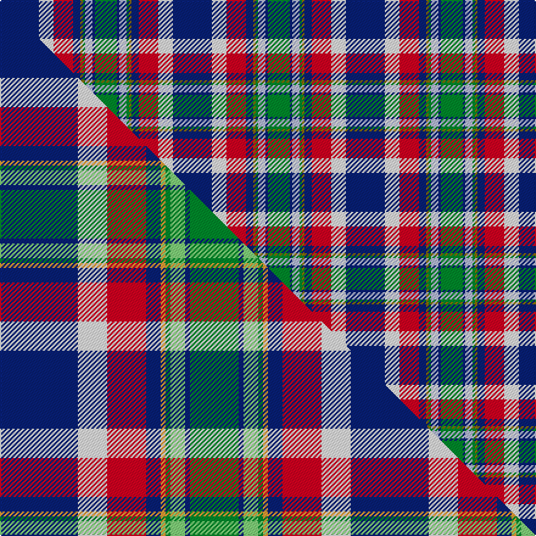

This is one **variant** — a specific cloth: this exact thread count and colourway, with its own
provenance below. It is one weaving of the [sett](/tartans/o/oh/ohio/) (the scale-free proportion — the
same cloth at any scale or shade), whose colour order is pattern [BWRBGGWBG](/stripes/bwrbggwbg/).

Part of the [Ohio](/tartans/o/oh/ohio/) tartan — the named design grouping this sett with its other cloths.

Sourced from house-of-tartan.  It is a [9 stripe tartan](/stripes/stripes9/).

Original link [http://www.house-of-tartan.scotland.net/house/TartanViewjs.asp?colr=Def&tnam=651](http://www.house-of-tartan.scotland.net/house/TartanViewjs.asp?colr=Def&tnam=651)

## Provenance

Earliest known date: 1984 Design is based on the colours of Ohio's flag and state seal. The widths of the stripes in each colour are based on the date Ohio was admitted to the Union. The tartan first went on display at the Ohio Scottish Games in June 1983.

Dataset <small>— provenance for this record, inherited from the source manifest</small>

<dl class="dataset-prov">
<dt>source</dt><dd><a href="/sources/house-of-tartan/">House of Tartan</a></dd>
<dt>data captured from</dt><dd><a href="https://github.com/thetartan/tartan-database/blob/master/data/house-of-tartan/data.csv">https://github.com/thetartan/tartan-database/blob/master/data/house-of-tartan/data.csv</a></dd>
<dt>data date</dt><dd>1984 <small>(this record)</small></dd>
<dt>licence</dt><dd><a href="https://creativecommons.org/licenses/by-nc-nd/4.0/">CC BY-NC-ND 4.0</a></dd>
</dl>

Capture chain <small>— the hands this data passed through, oldest first; each capture carries its own licence</small>

<ol class="capture-chain">
<li><a href="http://www.house-of-tartan.scotland.net/">House of Tartan</a> <small>the weaver/retailer's database — the site is now offline; the URL is kept as the ultimate source's identity</small></li>
<li><a href="https://github.com/thetartan/tartan-database">thetartan/tartan-database</a> <small>2016-2017</small> · <a href="https://creativecommons.org/licenses/by-nc-nd/4.0/">CC BY-NC-ND 4.0</a> <small>Levko Kravets's frozen compilation — the capture we vendored, and where its CC licence text came from</small></li>
<li>this dictionary <small>captured 2026-06-10 · commit 5bf86c7566</small> <small>each re-capture is a git commit to data/sources</small></li>
</ol>

## Thread count
DB/32 W12 R16 DB6 Y2 G2 LB6 DB2 G/18

One full sett is **142 threads**.

## Palette
<table><thead><tr><th>Colour</th><th>Shade</th><th>OKLCh</th></tr></thead><tbody><tr><td>LB</td><td><code style="background-color:#B5BBDE;">#B5BBDE</code> <small style="color:#888">#B5BBDE</small></td><td><small style="color:#888">oklch(79.9% 0.050 277.6)</small></td></tr><tr><td>DB</td><td><code style="background-color:#082077;">#082077</code> <small style="color:#888">#082077</small></td><td><small style="color:#888">oklch(30.0% 0.149 265.1)</small></td></tr><tr><td>G</td><td><code style="background-color:#008B2A;">#008B2A</code> <small style="color:#888">#008B2A</small></td><td><small style="color:#888">oklch(55.4% 0.170 145.9)</small></td></tr><tr><td>W</td><td><code style="background-color:#F7F7F7;">#F7F7F7</code> <small style="color:#888">#F7F7F7</small></td><td><small style="color:#888">oklch(97.6% 0.000 89.9)</small></td></tr><tr><td>R</td><td><code style="background-color:#D60020;">#D60020</code> <small style="color:#888">#D60020</small></td><td><small style="color:#888">oklch(55.2% 0.224 25.5)</small></td></tr><tr><td>Y</td><td><code style="background-color:#8B6E00;">#8B6E00</code> <small style="color:#888">#8B6E00</small></td><td><small style="color:#888">oklch(55.1% 0.113 90.4)</small></td></tr></tbody></table>

# Sample pattern

[Sample sheet (PDF)](swatch.pdf) — the woven sample, thread count and palette on one printable A4, rendered on demand (the same sheet the TTD print page downloads).

## Compared to the master

This cloth is one sett of its design; the master sett (the exemplar the design is anchored on) is below for comparison.

Its **ΔTartan distance** from the master is **0.68** — the same measure the nearest-tartans table ranks by (0 is identical; a re-scale of the same cloth is near 0, a recolour or a different proportion further).

<figure class="master-compare" style="margin:0">

this sett
master sett ★

<figcaption style="color:#888;font-size:smaller">One weave of this sett against the <a href="/setts/db16w6r8db3lo1g1lg3db1g10/">master sett ★</a>, split on the diagonal: a shared proportion runs seamlessly across it with only the shades shifting; a different proportion breaks on it.</figcaption>
</figure>

## Nearest tartan variants

The nearest existing variants by ΔTartan distance, with this cloth at the top so the swatches line up against it.

ΔTartan

Threads

Variant

Sett

—

142

<a href="/variants/s9/db16w6r8db3y1g1lb3db1g9~x2/">Ohio District Tartan</a>

<a href="/ttd/edit/#slug=db16w6r8db3y1g1b3db1g9~x2&amp;base=db16w6r8db3y1g1lb3db1g9~x2" title="compare in the TTD">0.04</a>

142

<a href="/variants/s9/db16w6r8db3y1g1b3db1g9~x2/">Ohio</a>

<a href="/ttd/edit/#slug=db16w6r8db3lo1g1lg3db1g10~x4&amp;base=db16w6r8db3y1g1lb3db1g9~x2" title="compare in the TTD">0.68</a>

288

<a href="/variants/s9/db16w6r8db3lo1g1lg3db1g10~x4/">Ogilvie of Inverquharity or Ohio</a>

<a href="/ttd/edit/#slug=lb27db2lb2db16g5r5y2db2dy14db2~x2&amp;base=db16w6r8db3y1g1lb3db1g9~x2" title="compare in the TTD">1.88</a>

250

<a href="/variants/s10/lb27db2lb2db16g5r5y2db2dy14db2~x2/">Lyon, Jeffrey M (Hunting) (Personal)</a>

<a href="/ttd/edit/#slug=dp4db16y1db1y1db5y4g4w4r4~x2&amp;base=db16w6r8db3y1g1lb3db1g9~x2" title="compare in the TTD">2.49</a>

160

<a href="/variants/s10/dp4db16y1db1y1db5y4g4w4r4~x2/">Yukon #1906 District Tartan</a>

<a href="/ttd/edit/#slug=db60lb5w4o12g42dp12lb5dp12&amp;base=db16w6r8db3y1g1lb3db1g9~x2" title="compare in the TTD">2.52</a>

232

<a href="/variants/s8/db60lb5w4o12g42dp12lb5dp12/">St Columba</a>

<a href="/ttd/edit/#slug=db3y2t12db14r2db4dy6y4w24r2w2db3~x2~db2508270-t5211240&amp;base=db16w6r8db3y1g1lb3db1g9~x2" title="compare in the TTD">2.54</a>

300

<a href="/variants/s12/db3y2t12db14r2db4dy6y4w24r2w2db3~x2~db2508270-t5211240/">Lashbrooke of Barrowfield (Personal)</a>

<a href="/ttd/edit/#slug=db15w2g2ly15r3db21r3g15~x2&amp;base=db16w6r8db3y1g1lb3db1g9~x2" title="compare in the TTD">2.56</a>

244

<a href="/variants/s8/db15w2g2ly15r3db21r3g15~x2/">Loyalhanna</a>

<a href="/ttd/edit/#slug=db45r4n20w3ly9dr4ly3dr9n11~x2&amp;base=db16w6r8db3y1g1lb3db1g9~x2" title="compare in the TTD">2.59</a>

320

<a href="/variants/s9/db45r4n20w3ly9dr4ly3dr9n11~x2/">United Arrows House Check</a>

<a href="/ttd/edit/#slug=db1lb9w3y3db9y1g1r1~x4&amp;base=db16w6r8db3y1g1lb3db1g9~x2" title="compare in the TTD">2.61</a>

216

<a href="/variants/s8/db1lb9w3y3db9y1g1r1~x4/">Curd (2013)</a>

<a href="/ttd/edit/#slug=r3lb25db6dbi3r2t5dbi18w3~x2~db2609279-dbi2616276&amp;base=db16w6r8db3y1g1lb3db1g9~x2" title="compare in the TTD">2.70</a>

248

<a href="/variants/s8/r3lb25db6dbi3r2t5dbi18w3~x2~db2609279-dbi2616276/">Fulbright Foundation</a>

## Neighbour map

Every grey dot is one of 13662 variants placed by the first two principal components of the ΔTartan feature space (42% of its variance). Red is this tartan; blue dots are its nearest — click one to open its page. The map is a flat projection of a many-dimensional space — [how to read it](/posts/neighbourhood-maps/).

<svg viewBox="0 0 640 380" role="img" style="max-width:100%;height:auto;border:1px solid #e0e0e0;border-radius:4px;display:block" xmlns="http://www.w3.org/2000/svg"><image href="/nn/cloud.v1.png" width="640" height="380"/><a href="/variants/s9/db16w6r8db3y1g1b3db1g9~x2/"><circle cx="165.9" cy="146.6" r="4" fill="#3465a4"><title>Ohio</title></circle></a><a href="/variants/s9/db16w6r8db3lo1g1lg3db1g10~x4/"><circle cx="158.1" cy="146.7" r="4" fill="#3465a4"><title>Ogilvie of Inverquharity or Ohio</title></circle></a><a href="/variants/s10/lb27db2lb2db16g5r5y2db2dy14db2~x2/"><circle cx="159.7" cy="137.2" r="4" fill="#3465a4"><title>Lyon, Jeffrey M (Hunting) (Personal)</title></circle></a><a href="/variants/s10/dp4db16y1db1y1db5y4g4w4r4~x2/"><circle cx="215.0" cy="138.8" r="4" fill="#3465a4"><title>Yukon #1906 District Tartan</title></circle></a><a href="/variants/s8/db60lb5w4o12g42dp12lb5dp12/"><circle cx="188.0" cy="152.2" r="4" fill="#3465a4"><title>St Columba</title></circle></a><a href="/variants/s12/db3y2t12db14r2db4dy6y4w24r2w2db3~x2~db2508270-t5211240/"><circle cx="111.3" cy="134.9" r="4" fill="#3465a4"><title>Lashbrooke of Barrowfield (Personal)</title></circle></a><a href="/variants/s8/db15w2g2ly15r3db21r3g15~x2/"><circle cx="195.5" cy="189.7" r="4" fill="#3465a4"><title>Loyalhanna</title></circle></a><a href="/variants/s9/db45r4n20w3ly9dr4ly3dr9n11~x2/"><circle cx="210.5" cy="144.3" r="4" fill="#3465a4"><title>United Arrows House Check</title></circle></a><a href="/variants/s8/db1lb9w3y3db9y1g1r1~x4/"><circle cx="133.0" cy="168.4" r="4" fill="#3465a4"><title>Curd (2013)</title></circle></a><a href="/variants/s8/r3lb25db6dbi3r2t5dbi18w3~x2~db2609279-dbi2616276/"><circle cx="161.4" cy="152.2" r="4" fill="#3465a4"><title>Fulbright Foundation</title></circle></a><circle cx="162.7" cy="145.5" r="5" fill="#c00000"/><text x="320" y="376" text-anchor="middle" font-size="11" fill="#999">ground</text><text x="11" y="190" text-anchor="middle" font-size="11" fill="#999" transform="rotate(-90 11 190)">complexity</text></svg>

ID: /variants/s9/db16w6r8db3y1g1lb3db1g9~x2/
