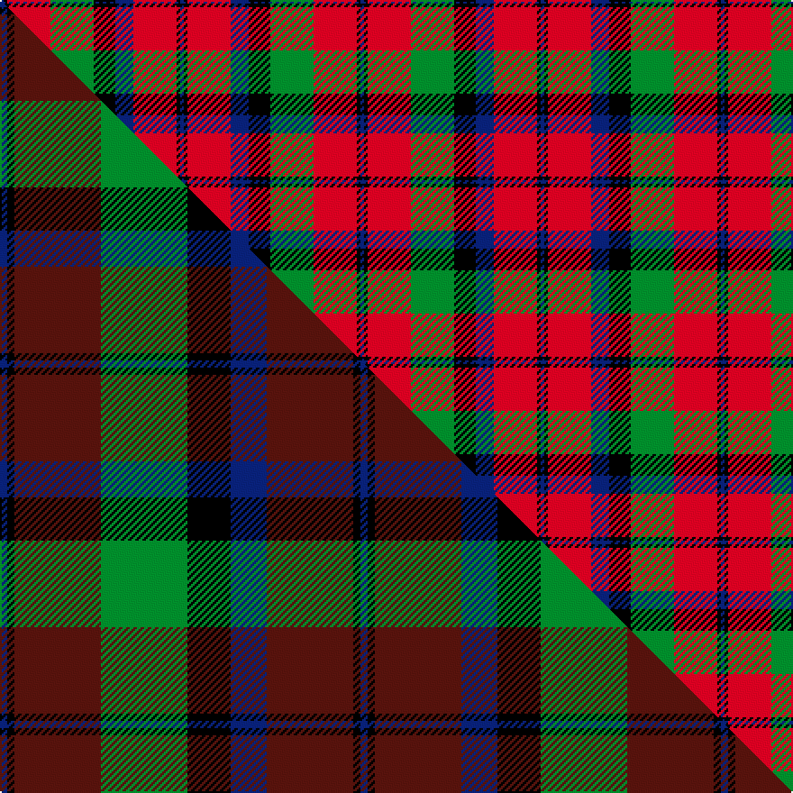

This is one **variant** — a specific cloth: this exact thread count and colourway, with its own
provenance below. It is one weaving of the [sett](/setts/db1k1r12g12k6db5r12k1db1/) (the scale-free proportion — the
same cloth at any scale or shade), whose colour order is pattern [BKRBKGRKB](/stripes/bkrbkgrkb/).

Part of the [Montrose](/tartans/montrose-2/) tartan — the named design grouping this sett with its other cloths.

Sourced from house-of-tartan.  It is a [9 stripe tartan](/stripes/stripes9/).

Original link [http://www.house-of-tartan.scotland.net/house/TartanViewjs.asp?colr=Def&tnam=350](http://www.house-of-tartan.scotland.net/house/TartanViewjs.asp?colr=Def&tnam=350)

## Provenance

Earliest known date: 1819 Canadian fancy. Presented by Mrs K Sinclair

2 attestations — the source records this cloth was collapsed from (oldest owns this page)

<ul>
<li>1819 — Montrose Clan Tartan (house-of-tartan, <a href="http://www.house-of-tartan.scotland.net/house/TartanViewjs.asp?colr=Def&tnam=350">record</a>) </li>
<li>undated — Montrose (weddslist, <a href="http://www.weddslist.com/cgi-bin/tartans/pg.pl?source=sts">record</a>) </li>
</ul>

Dataset <small>— provenance for this record, inherited from the source manifest</small>

<dl class="dataset-prov">
<dt>source</dt><dd><a href="/sources/house-of-tartan/">House of Tartan</a></dd>
<dt>data captured from</dt><dd><a href="https://github.com/thetartan/tartan-database/blob/master/data/house-of-tartan/data.csv">https://github.com/thetartan/tartan-database/blob/master/data/house-of-tartan/data.csv</a></dd>
<dt>data date</dt><dd>1819 <small>(this record)</small></dd>
<dt>licence</dt><dd><a href="https://creativecommons.org/licenses/by-nc-nd/4.0/">CC BY-NC-ND 4.0</a></dd>
</dl>

Capture chain <small>— the hands this data passed through, oldest first; each capture carries its own licence</small>

<ol class="capture-chain">
<li><a href="http://www.house-of-tartan.scotland.net/">House of Tartan</a> <small>the weaver/retailer's database — the site is now offline; the URL is kept as the ultimate source's identity</small></li>
<li><a href="https://github.com/thetartan/tartan-database">thetartan/tartan-database</a> <small>2016-2017</small> · <a href="https://creativecommons.org/licenses/by-nc-nd/4.0/">CC BY-NC-ND 4.0</a> <small>Levko Kravets's frozen compilation — the capture we vendored, and where its CC licence text came from</small></li>
<li>this dictionary <small>captured 2026-06-10 · commit 5bf86c7566</small> <small>each re-capture is a git commit to data/sources</small></li>
</ol>

## Thread count
DB/2 K2 R24 G24 K12 DB10 R24 K2 DB/2

One full sett is **200 threads**.

## Palette
<table><thead><tr><th>Colour</th><th>Shade</th><th>OKLCh</th></tr></thead><tbody><tr><td>DB</td><td><code style="background-color:#082077;">#082077</code> <small style="color:#888">#082077</small></td><td><small style="color:#888">oklch(30.0% 0.149 265.1)</small></td></tr><tr><td>G</td><td><code style="background-color:#008B2A;">#008B2A</code> <small style="color:#888">#008B2A</small></td><td><small style="color:#888">oklch(55.4% 0.170 145.9)</small></td></tr><tr><td>K</td><td><code style="background-color:#000000;">#000000</code> <small style="color:#888">#000000</small></td><td><small style="color:#888">oklch(0.0% 0.000 0.0)</small></td></tr><tr><td>R</td><td><code style="background-color:#D60020;">#D60020</code> <small style="color:#888">#D60020</small></td><td><small style="color:#888">oklch(55.2% 0.224 25.5)</small></td></tr></tbody></table>

# Sample pattern

## Compared to the master

This cloth is one sett of its design; the master sett (the exemplar the design is anchored on) is below for comparison.

Its **ΔTartan distance** from the master is **0.18** — the same measure the nearest-tartans table ranks by (0 is identical; a re-scale of the same cloth is near 0, a recolour or a different proportion further).

<figure class="master-compare" style="margin:0">

this sett
master sett ★

<figcaption style="color:#888;font-size:smaller">One weave of this sett against the <a href="/setts/db1k1dr12g12k6db5dr12k1db1/">master sett ★</a>, split on the diagonal: a shared proportion runs seamlessly across it with only the shades shifting; a different proportion breaks on it.</figcaption>
</figure>

## Nearest tartan variants

The nearest existing variants by ΔTartan distance, with this cloth at the top so the swatches line up against it.

ΔTartan

Threads

Variant

Sett

—

200

<a href="/variants/s9/db1k1r12g12k6db5r12k1db1~x2/">Montrose Clan Tartan</a>

<a href="/ttd/edit/#slug=lb2k2r27g27k12lb12r27k2lb2~x2&amp;base=db1k1r12g12k6db5r12k1db1~x2" title="compare in the TTD">0.25</a>

444

<a href="/variants/s9/lb2k2r27g27k12lb12r27k2lb2~x2/">MacNaughton</a>

<a href="/ttd/edit/#slug=lb1k1r10g10k5lb5r10k1lb1~x4&amp;base=db1k1r12g12k6db5r12k1db1~x2" title="compare in the TTD">0.29</a>

344

<a href="/variants/s9/lb1k1r10g10k5lb5r10k1lb1~x4/">Graham Red</a>

<a href="/ttd/edit/#slug=lb2k2r14g15k8lb7r14k2lb2~x2&amp;base=db1k1r12g12k6db5r12k1db1~x2" title="compare in the TTD">0.51</a>

256

<a href="/variants/s9/lb2k2r14g15k8lb7r14k2lb2~x2/">Montrose</a>

<a href="/ttd/edit/#slug=lb2k2r14g15k8lb7r14k2lb2&amp;base=db1k1r12g12k6db5r12k1db1~x2" title="compare in the TTD">0.51</a>

128

<a href="/variants/s9/lb2k2r14g15k8lb7r14k2lb2/">Montrose</a>

<a href="/ttd/edit/#slug=n28k3r22k8w3k8r22k3n28k3~x2&amp;base=db1k1r12g12k6db5r12k1db1~x2" title="compare in the TTD">1.53</a>

450

<a href="/variants/s10/n28k3r22k8w3k8r22k3n28k3~x2/">Henkel</a>

<a href="/ttd/edit/#slug=k1db1r16g16k12db8r16db1k1~x2&amp;base=db1k1r12g12k6db5r12k1db1~x2" title="compare in the TTD">1.55</a>

284

<a href="/variants/s9/k1db1r16g16k12db8r16db1k1~x2/">MacNaughton Clan Tartan</a>

<a href="/ttd/edit/#slug=k1lb1r16g16k12lb8r16lb1k1~x2&amp;base=db1k1r12g12k6db5r12k1db1~x2" title="compare in the TTD">1.55</a>

284

<a href="/variants/s9/k1lb1r16g16k12lb8r16lb1k1~x2/">MacNaughten</a>

<a href="/ttd/edit/#slug=k1w1r16g16k12w8r16w1k1~x2&amp;base=db1k1r12g12k6db5r12k1db1~x2" title="compare in the TTD">1.85</a>

284

<a href="/variants/s9/k1w1r16g16k12w8r16w1k1~x2/">MacNaughton</a>

<a href="/ttd/edit/#slug=k2r8g2r8k8db1k4r2g12r8g2~x2&amp;base=db1k1r12g12k6db5r12k1db1~x2" title="compare in the TTD">2.00</a>

220

<a href="/variants/s11/k2r8g2r8k8db1k4r2g12r8g2~x2/">MacNichol Clan Tartan</a>

<a href="/ttd/edit/#slug=k2r8g2r8k8t1k4r2g12r8g2~x4&amp;base=db1k1r12g12k6db5r12k1db1~x2" title="compare in the TTD">2.03</a>

440

<a href="/variants/s11/k2r8g2r8k8t1k4r2g12r8g2~x4/">MacNicol Dress (Clan) (Smiths)</a>

## Neighbour map

Every grey dot is one of 13621 variants placed by the first two principal components of the ΔTartan feature space (42% of its variance). Red is this tartan; blue dots are its nearest — click one to open its page.

<svg viewBox="0 0 640 380" role="img" style="max-width:100%;height:auto;border:1px solid #e0e0e0;border-radius:4px;display:block" xmlns="http://www.w3.org/2000/svg"><image href="/nn/cloud.v1.png" width="640" height="380"/><a href="/variants/s9/lb2k2r27g27k12lb12r27k2lb2~x2/"><circle cx="206.9" cy="154.6" r="4" fill="#3465a4"><title>MacNaughton</title></circle></a><a href="/variants/s9/lb1k1r10g10k5lb5r10k1lb1~x4/"><circle cx="177.2" cy="171.1" r="4" fill="#3465a4"><title>Graham Red</title></circle></a><a href="/variants/s9/lb2k2r14g15k8lb7r14k2lb2~x2/"><circle cx="145.2" cy="188.2" r="4" fill="#3465a4"><title>Montrose</title></circle></a><a href="/variants/s9/lb2k2r14g15k8lb7r14k2lb2/"><circle cx="145.2" cy="188.2" r="4" fill="#3465a4"><title>Montrose</title></circle></a><a href="/variants/s10/n28k3r22k8w3k8r22k3n28k3~x2/"><circle cx="195.1" cy="172.5" r="4" fill="#3465a4"><title>Henkel</title></circle></a><a href="/variants/s9/k1db1r16g16k12db8r16db1k1~x2/"><circle cx="188.5" cy="149.4" r="4" fill="#3465a4"><title>MacNaughton Clan Tartan</title></circle></a><a href="/variants/s9/k1lb1r16g16k12lb8r16lb1k1~x2/"><circle cx="184.2" cy="148.8" r="4" fill="#3465a4"><title>MacNaughten</title></circle></a><a href="/variants/s9/k1w1r16g16k12w8r16w1k1~x2/"><circle cx="176.4" cy="146.6" r="4" fill="#3465a4"><title>MacNaughton</title></circle></a><a href="/variants/s11/k2r8g2r8k8db1k4r2g12r8g2~x2/"><circle cx="180.4" cy="167.4" r="4" fill="#3465a4"><title>MacNichol Clan Tartan</title></circle></a><a href="/variants/s11/k2r8g2r8k8t1k4r2g12r8g2~x4/"><circle cx="180.3" cy="167.6" r="4" fill="#3465a4"><title>MacNicol Dress (Clan) (Smiths)</title></circle></a><circle cx="200.1" cy="161.1" r="5" fill="#c00000"/><text x="320" y="376" text-anchor="middle" font-size="11" fill="#999">ground</text><text x="11" y="190" text-anchor="middle" font-size="11" fill="#999" transform="rotate(-90 11 190)">complexity</text></svg>

ID: /variants/s9/db1k1r12g12k6db5r12k1db1~x2/
