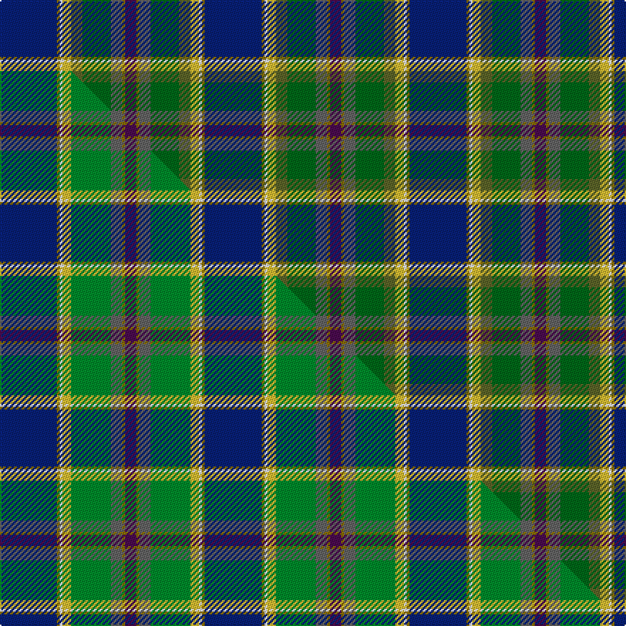

This is one **variant** — a specific cloth: this exact thread count and colourway, with its own
provenance below. It is one weaving of the [sett](/setts/db20y1w1ly3g4dg10n4y1dp4/) (the scale-free proportion — the
same cloth at any scale or shade), whose colour order is pattern [BGBGGYWGB](/stripes/bgbggywgb/).

Part of the [St Columba](/tartans/s/st/st-columba/) tartan — the named design grouping this sett with its other cloths.

Sourced from tartans-authority.  It is a [9 stripe tartan](/stripes/stripes9/).

Original link [https://www.tartanregister.gov.uk/tartanDetails.aspx?ref=3219](https://www.tartanregister.gov.uk/tartanDetails.aspx?ref=3219)

2 attestations — the source records this cloth was collapsed from (oldest owns this page)

<ul>
<li>1997 — St. Columba (two greens) (Corporate) (tartans-authority, <a href="https://www.tartanregister.gov.uk/tartanDetails.aspx?ref=3219">record</a>)  <em>Designed by Peter MacDonald for St.Columba's Church on Mull to commemorate the 1400th aniversary of St. Columba's death. This is the original version which had seven colours including two shades of green. #2383 is a simplified version for production. Tartan Society described this tartan as "Based on all the natural colours of Iona, this tartan was designed to raise money to restore a church roof."</em></li>
<li>undated — St. Columba (two greens) (register-of-tartans, <a href="https://www.tartanregister.gov.uk/tartanDetails.aspx?ref=4849">record</a>)  <em>Designed by Peter MacDonald for St.Columba's Church on Mull to commemorate the 1400th anniversary of St. Columba's death. This is the original version which had seven colours including two shades of green. #2383 (original Scottish Tartans Authority reference) is a simplified version for production. Scottish Tartans Society described this tartan as 'Based on all the natural colours of Iona, this tartan was designed to raise money to restore a church roof.' See www.celticoriginals.com.</em></li>
</ul>

Dataset <small>— provenance for this record, inherited from the source manifest</small>

<dl class="dataset-prov">
<dt>source</dt><dd><a href="/sources/tartans-authority/">Scottish Tartans Authority</a></dd>
<dt>data captured from</dt><dd><a href="https://github.com/thetartan/tartan-database/blob/master/data/tartans-authority/data.csv">https://github.com/thetartan/tartan-database/blob/master/data/tartans-authority/data.csv</a></dd>
<dt>data date</dt><dd>1997 <small>(this record)</small></dd>
<dt>licence</dt><dd><a href="https://creativecommons.org/licenses/by-nc-nd/4.0/">CC BY-NC-ND 4.0</a></dd>
</dl>

Capture chain <small>— the hands this data passed through, oldest first; each capture carries its own licence</small>

<ol class="capture-chain">
<li><a href="https://www.tartansauthority.com/">Scottish Tartans Authority</a> <small>the heritage body's archive — its tartan-ferret record browser is retired (links repaired to the SRT, above)</small></li>
<li><a href="https://github.com/thetartan/tartan-database">thetartan/tartan-database</a> <small>2016-2017</small> · <a href="https://creativecommons.org/licenses/by-nc-nd/4.0/">CC BY-NC-ND 4.0</a> <small>Levko Kravets's frozen compilation — the capture we vendored, and where its CC licence text came from</small></li>
<li>this dictionary <small>captured 2026-06-10 · commit 5bf86c7566</small> <small>each re-capture is a git commit to data/sources</small></li>
</ol>

## Register references

External register numbers recorded for this tartan.

- Scottish Register of Tartans: [4849](https://www.tartanregister.gov.uk/tartanDetails.aspx?ref=4849)
- Scottish Tartans Authority (ITI): 3219

## Thread count
DB/40 Y2 W2 LY6 G8 DG20 N8 Y2 DP/8

One full sett is **144 threads**.

## Palette
<table><thead><tr><th>Colour</th><th>Shade</th><th>OKLCh</th></tr></thead><tbody><tr><td>DB</td><td><code style="background-color:#082077;">#082077</code> <small style="color:#888">#082077</small></td><td><small style="color:#888">oklch(30.0% 0.149 265.1)</small></td></tr><tr><td>DG</td><td><code style="background-color:#006818;">#006818</code> <small style="color:#888">#006818</small></td><td><small style="color:#888">oklch(45.0% 0.142 145.0)</small></td></tr><tr><td>G</td><td><code style="background-color:#5C6428;">#5C6428</code> <small style="color:#888">#5C6428</small></td><td><small style="color:#888">oklch(48.3% 0.084 116.0)</small></td></tr><tr><td>Y</td><td><code style="background-color:#8B6E00;">#8B6E00</code> <small style="color:#888">#8B6E00</small></td><td><small style="color:#888">oklch(55.1% 0.113 90.4)</small></td></tr><tr><td>LY</td><td><code style="background-color:#DCBC32;">#DCBC32</code> <small style="color:#888">#DCBC32</small></td><td><small style="color:#888">oklch(80.0% 0.150 95.2)</small></td></tr><tr><td>N</td><td><code style="background-color:#636363;">#636363</code> <small style="color:#888">#636363</small></td><td><small style="color:#888">oklch(50.0% 0.000 89.9)</small></td></tr><tr><td>DP</td><td><code style="background-color:#4B0B4F;">#4B0B4F</code> <small style="color:#888">#4B0B4F</small></td><td><small style="color:#888">oklch(30.1% 0.125 325.4)</small></td></tr><tr><td>W</td><td><code style="background-color:#F7F7F7;">#F7F7F7</code> <small style="color:#888">#F7F7F7</small></td><td><small style="color:#888">oklch(97.6% 0.000 89.9)</small></td></tr></tbody></table>

# Sample pattern

## Compared to the master

This cloth is one sett of its design; the master sett (the exemplar the design is anchored on) is below for comparison.

Its **ΔTartan distance** from the master is **0.61** — the same measure the nearest-tartans table ranks by (0 is identical; a re-scale of the same cloth is near 0, a recolour or a different proportion further).

<figure class="master-compare" style="margin:0">

this sett
master sett ★

<figcaption style="color:#888;font-size:smaller">One weave of this sett against the <a href="/setts/db20y1w1ly3g14n4y1dp4/">master sett ★</a>, split on the diagonal: a shared proportion runs seamlessly across it with only the shades shifting; a different proportion breaks on it.</figcaption>
</figure>

## Nearest tartan variants

The nearest existing variants by ΔTartan distance, with this cloth at the top so the swatches line up against it.

ΔTartan

Threads

Variant

Sett

—

144

<a href="/variants/s9/db20y1w1ly3g4dg10n4y1dp4~x2~g1903114-dg1806142/">St. Columba (two greens) (Corporate)</a>

<a href="/ttd/edit/#slug=db20y1w1ly3g14n4y1dp4~x2&amp;base=db20y1w1ly3g4dg10n4y1dp4~x2~g1903114-dg1806142" title="compare in the TTD">0.61</a>

144

<a href="/variants/s8/db20y1w1ly3g14n4y1dp4~x2/">St. Columba (one green)</a>

<a href="/ttd/edit/#slug=dy6t16lr3y3lo3g3w2~x4~t2405244-lr3200000-y2104086-lo2605070&amp;base=db20y1w1ly3g4dg10n4y1dp4~x2~g1903114-dg1806142" title="compare in the TTD">2.84</a>

256

<a href="/variants/s7/dy6t16lb3y3o3g3w2~x4~t2405244-lb3200000-y2104086-o2605070/">Atikokan (District)</a>

<a href="/ttd/edit/#slug=db18n4dr4g12lb3r2w2dp10~x2&amp;base=db20y1w1ly3g4dg10n4y1dp4~x2~g1903114-dg1806142" title="compare in the TTD">3.13</a>

164

<a href="/variants/s8/db18n4dr4g12lb3r2w2dp10~x2/">Serco Caledonian Sleeper</a>

<a href="/ttd/edit/#slug=b4dg30db12g3dt2lb3dt26dp4dt2~dg1806142-db1406275-g2408144-dt1204274&amp;base=db20y1w1ly3g4dg10n4y1dp4~x2~g1903114-dg1806142" title="compare in the TTD">3.18</a>

166

<a href="/variants/s9/b4dg30dbi12g3db2lb3db26dp4db2~dg1806142-dbi1406275-g2408144-db1204274/">Begg (Personal)</a>

<a href="/ttd/edit/#slug=w1db16y1dr3y1dg6g2dg6w1~x2&amp;base=db20y1w1ly3g4dg10n4y1dp4~x2~g1903114-dg1806142" title="compare in the TTD">3.20</a>

144

<a href="/variants/s9/w1db16y1dr3y1dg6g2dg6w1~x2/">Kleto, Susan (Personal)</a>

<a href="/ttd/edit/#slug=y8t24db21g18lo4lri3dy2lr1~x2~t2405244-lri3200000&amp;base=db20y1w1ly3g4dg10n4y1dp4~x2~g1903114-dg1806142" title="compare in the TTD">3.25</a>

306

<a href="/variants/s8/y8t24db21g18lo4lb3dy2lr1~x2~t2405244-lb3200000/">Philpotts, Brian</a>

<a href="/ttd/edit/#slug=db18n4r4g12lb3ri2w2dp10~x2~r1807033-ri2109032&amp;base=db20y1w1ly3g4dg10n4y1dp4~x2~g1903114-dg1806142" title="compare in the TTD">3.28</a>

164

<a href="/variants/s8/db18n4r4g12lb3ri2w2dp10~x2~r1807033-ri2109032/">Serco Caledonian Sleeper</a>

<a href="/ttd/edit/#slug=dy31ly6lb3db36dy8g60ly7n7~x2~db1004274-n2203265&amp;base=db20y1w1ly3g4dg10n4y1dp4~x2~g1903114-dg1806142" title="compare in the TTD">3.36</a>

556

<a href="/variants/s8/dy31ly6lb3db36dy8g60ly7n7~x2~db1004274-n2203265/">Little-Dowse Wedding</a>

<a href="/ttd/edit/#slug=dg18g6dy3w1dy3w1lb6db6~x2&amp;base=db20y1w1ly3g4dg10n4y1dp4~x2~g1903114-dg1806142" title="compare in the TTD">3.42</a>

128

<a href="/variants/s8/dg18g6dy3w1dy3w1lb6db6~x2/">Iroquois Falls Centenary</a>

<a href="/ttd/edit/#slug=w1db16ly1r3ly1dg6g2dg6w1~x2~dg1806142-g2408144&amp;base=db20y1w1ly3g4dg10n4y1dp4~x2~g1903114-dg1806142" title="compare in the TTD">3.49</a>

144

<a href="/variants/s9/w1db16ly1r3ly1dg6g2dg6w1~x2~dg1806142-g2408144/">Kleto, Susan (Personal)</a>

## Neighbour map

Every grey dot is one of 13621 variants placed by the first two principal components of the ΔTartan feature space (42% of its variance). Red is this tartan; blue dots are its nearest — click one to open its page. The map is a flat projection of a many-dimensional space — [how to read it](/posts/neighbourhood-maps/).

<svg viewBox="0 0 640 380" role="img" style="max-width:100%;height:auto;border:1px solid #e0e0e0;border-radius:4px;display:block" xmlns="http://www.w3.org/2000/svg"><image href="/nn/cloud.v1.png" width="640" height="380"/><a href="/variants/s8/db20y1w1ly3g14n4y1dp4~x2/"><circle cx="221.7" cy="139.6" r="4" fill="#3465a4"><title>St. Columba (one green)</title></circle></a><a href="/variants/s7/dy6t16lb3y3o3g3w2~x4~t2405244-lb3200000-y2104086-o2605070/"><circle cx="181.3" cy="185.8" r="4" fill="#3465a4"><title>Atikokan (District)</title></circle></a><a href="/variants/s8/db18n4dr4g12lb3r2w2dp10~x2/"><circle cx="98.2" cy="169.1" r="4" fill="#3465a4"><title>Serco Caledonian Sleeper</title></circle></a><a href="/variants/s9/b4dg30dbi12g3db2lb3db26dp4db2~dg1806142-dbi1406275-g2408144-db1204274/"><circle cx="236.2" cy="166.0" r="4" fill="#3465a4"><title>Begg (Personal)</title></circle></a><a href="/variants/s9/w1db16y1dr3y1dg6g2dg6w1~x2/"><circle cx="259.9" cy="157.6" r="4" fill="#3465a4"><title>Kleto, Susan (Personal)</title></circle></a><a href="/variants/s8/y8t24db21g18lo4lb3dy2lr1~x2~t2405244-lb3200000/"><circle cx="155.2" cy="147.3" r="4" fill="#3465a4"><title>Philpotts, Brian</title></circle></a><a href="/variants/s8/db18n4r4g12lb3ri2w2dp10~x2~r1807033-ri2109032/"><circle cx="89.0" cy="162.6" r="4" fill="#3465a4"><title>Serco Caledonian Sleeper</title></circle></a><a href="/variants/s8/dy31ly6lb3db36dy8g60ly7n7~x2~db1004274-n2203265/"><circle cx="219.7" cy="165.2" r="4" fill="#3465a4"><title>Little-Dowse Wedding</title></circle></a><a href="/variants/s8/dg18g6dy3w1dy3w1lb6db6~x2/"><circle cx="201.1" cy="166.3" r="4" fill="#3465a4"><title>Iroquois Falls Centenary</title></circle></a><a href="/variants/s9/w1db16ly1r3ly1dg6g2dg6w1~x2~dg1806142-g2408144/"><circle cx="213.8" cy="138.7" r="4" fill="#3465a4"><title>Kleto, Susan (Personal)</title></circle></a><circle cx="205.6" cy="125.6" r="5" fill="#c00000"/><text x="320" y="376" text-anchor="middle" font-size="11" fill="#999">ground</text><text x="11" y="190" text-anchor="middle" font-size="11" fill="#999" transform="rotate(-90 11 190)">complexity</text></svg>

ID: /variants/s9/db20y1w1ly3g4dg10n4y1dp4~x2~g1903114-dg1806142/
