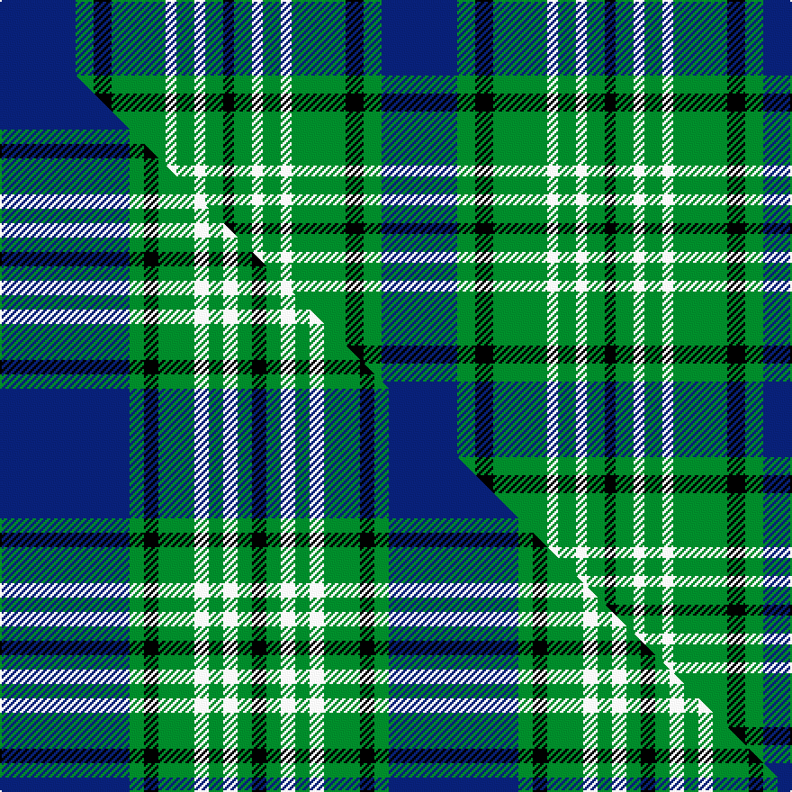

This page is one **sett** — a single exact thread-count. It belongs to the [tartan](/setts/db21g5k5g15w3g5w3g5k3/)
(the same proportion at any scale), whose colour order is pattern [BGKGWGWGK](/stripes/bgkgwgwgk/).

Part of the [Tweedside Hunting](/tartans/tweedside-hunting/) tartan — the named design grouping this sett with its other cloths.

Sourced from weddslist.  It is a [9 stripe tartan](/stripes/stripes9/).

Original link http://www.weddslist.com/cgi-bin/tartans/pg.pl?source=sts

## Provenance

Earliest known date: 20th Century A variation of Wilson's design. There is no record of this sett in any of the old collections which points to dating it in this century. It is the most popular of Tweedside district tartans.

2 attestations — the source records this cloth was collapsed from (oldest owns this page)

<ul>
<li>undated — Tweedside, hunting (weddslist, <a href="http://www.weddslist.com/cgi-bin/tartans/pg.pl?source=sts">record</a>) </li>
<li>undated — Tweedside Hunting District Tartan (house-of-tartan, <a href="http://www.house-of-tartan.scotland.net/house/TartanViewjs.asp?colr=Def&tnam=163">record</a>) </li>
</ul>

## Thread count
DB/42 G10 K10 G30 W6 G10 W6 G10 K/6

One full sett is **212 threads**.

## Palette
<table><thead><tr><th>Colour</th><th>Shade</th><th>OKLCh</th></tr></thead><tbody><tr><td>DB</td><td><code style="background-color:#082077;">#082077</code> <small style="color:#888">#082077</small></td><td><small style="color:#888">oklch(30.0% 0.149 265.1)</small></td></tr><tr><td>G</td><td><code style="background-color:#008B2A;">#008B2A</code> <small style="color:#888">#008B2A</small></td><td><small style="color:#888">oklch(55.4% 0.170 145.9)</small></td></tr><tr><td>K</td><td><code style="background-color:#000000;">#000000</code> <small style="color:#888">#000000</small></td><td><small style="color:#888">oklch(0.0% 0.000 0.0)</small></td></tr><tr><td>W</td><td><code style="background-color:#F7F7F7;">#F7F7F7</code> <small style="color:#888">#F7F7F7</small></td><td><small style="color:#888">oklch(97.6% 0.000 89.9)</small></td></tr></tbody></table>

# Sample pattern

## Compared to the master

This cloth is one sett of its design; the master sett (the exemplar the design is anchored on) is below for comparison.

Its **ΔTartan distance** from the master is **1.50** — the same measure the nearest-tartans table ranks by (0 is identical; a re-scale of the same cloth is near 0, a recolour or a different proportion further).

<figure class="master-compare" style="margin:0">

this sett
master sett ★

<figcaption style="color:#888;font-size:smaller">One weave of this sett against the <a href="/setts/db18g2k2g5w2g2w2g2k2/">master sett ★</a>, split on the diagonal: a shared proportion runs seamlessly across it with only the shades shifting; a different proportion breaks on it.</figcaption>
</figure>

## Nearest tartan variants

The nearest existing variants by ΔTartan distance, with this cloth at the top so the swatches line up against it.

ΔTartan

Threads

Variant

Sett

—

212

<a href="/variants/s9/db21g5k5g15w3g5w3g5k3~x2/">Tweedside, hunting</a>

<a href="/ttd/edit/#slug=b22g4k4g14lb3g4lb3g4k3~x2&amp;base=db21g5k5g15w3g5w3g5k3~x2" title="compare in the TTD">0.84</a>

194

<a href="/variants/s9/b22g4k4g14lb3g4lb3g4k3~x2/">Graden (Personal)</a>

<a href="/ttd/edit/#slug=b26g6k8g3k8g30w3g3~x2&amp;base=db21g5k5g15w3g5w3g5k3~x2" title="compare in the TTD">1.87</a>

290

<a href="/variants/s8/b26g6k8g3k8g30w3g3~x2/">Riley (Personal)</a>

<a href="/ttd/edit/#slug=y1g6k5g1db5g1~x2&amp;base=db21g5k5g15w3g5w3g5k3~x2" title="compare in the TTD">2.42</a>

72

<a href="/variants/s6/y1g6k5g1db5g1~x2/">MacKay (Bonner)</a>

<a href="/ttd/edit/#slug=db19g7db7lb2g20k9g6k4g10w3~x2&amp;base=db21g5k5g15w3g5w3g5k3~x2" title="compare in the TTD">2.49</a>

304

<a href="/variants/s10/db19g7db7lb2g20k9g6k4g10w3~x2/">O'Connell, William (Name)</a>

<a href="/ttd/edit/#slug=g8w1g1r1g4k4db8k1db1k1~x2&amp;base=db21g5k5g15w3g5w3g5k3~x2" title="compare in the TTD">2.69</a>

102

<a href="/variants/s10/g8w1g1r1g4k4db8k1db1k1~x2/">Scott #2</a>

<a href="/ttd/edit/#slug=g8w1g1dr1g4k4db8k1db1k1~x4&amp;base=db21g5k5g15w3g5w3g5k3~x2" title="compare in the TTD">2.69</a>

204

<a href="/variants/s10/g8w1g1dr1g4k4db8k1db1k1~x4/">Allen (1996)</a>

<a href="/ttd/edit/#slug=g8k2w1g4k6db6k1~x2&amp;base=db21g5k5g15w3g5w3g5k3~x2" title="compare in the TTD">2.87</a>

94

<a href="/variants/s7/g8k2w1g4k6db6k1~x2/">MacCallum</a>

<a href="/ttd/edit/#slug=w6g5k6g42db42k5db5k5&amp;base=db21g5k5g15w3g5w3g5k3~x2" title="compare in the TTD">2.98</a>

221

<a href="/variants/s8/w6g5k6g42db42k5db5k5/">Ben Lomond Fashion Tartan</a>

## Neighbour map

Every grey dot is one of 13620 variants placed by the first two principal components of the ΔTartan feature space (42% of its variance). Red is this tartan; blue dots are its nearest — click one to open its page.

<svg viewBox="0 0 640 380" role="img" style="max-width:100%;height:auto;border:1px solid #e0e0e0;border-radius:4px;display:block" xmlns="http://www.w3.org/2000/svg"><image href="/nn/cloud.v1.png" width="640" height="380"/><a href="/variants/s9/b22g4k4g14lb3g4lb3g4k3~x2/"><circle cx="189.6" cy="193.6" r="4" fill="#3465a4"><title>Graden (Personal)</title></circle></a><a href="/variants/s8/b26g6k8g3k8g30w3g3~x2/"><circle cx="209.6" cy="179.4" r="4" fill="#3465a4"><title>Riley (Personal)</title></circle></a><a href="/variants/s6/y1g6k5g1db5g1~x2/"><circle cx="157.0" cy="231.3" r="4" fill="#3465a4"><title>MacKay (Bonner)</title></circle></a><a href="/variants/s10/db19g7db7lb2g20k9g6k4g10w3~x2/"><circle cx="173.7" cy="179.4" r="4" fill="#3465a4"><title>O'Connell, William (Name)</title></circle></a><a href="/variants/s10/g8w1g1r1g4k4db8k1db1k1~x2/"><circle cx="152.0" cy="165.0" r="4" fill="#3465a4"><title>Scott #2</title></circle></a><a href="/variants/s10/g8w1g1dr1g4k4db8k1db1k1~x4/"><circle cx="154.8" cy="166.7" r="4" fill="#3465a4"><title>Allen (1996)</title></circle></a><a href="/variants/s7/g8k2w1g4k6db6k1~x2/"><circle cx="153.1" cy="215.6" r="4" fill="#3465a4"><title>MacCallum</title></circle></a><a href="/variants/s8/w6g5k6g42db42k5db5k5/"><circle cx="191.4" cy="175.7" r="4" fill="#3465a4"><title>Ben Lomond Fashion Tartan</title></circle></a><circle cx="173.7" cy="195.4" r="5" fill="#c00000"/><text x="320" y="376" text-anchor="middle" font-size="11" fill="#999">ground</text><text x="11" y="190" text-anchor="middle" font-size="11" fill="#999" transform="rotate(-90 11 190)">complexity</text></svg>

ID: /variants/s9/db21g5k5g15w3g5w3g5k3~x2/
