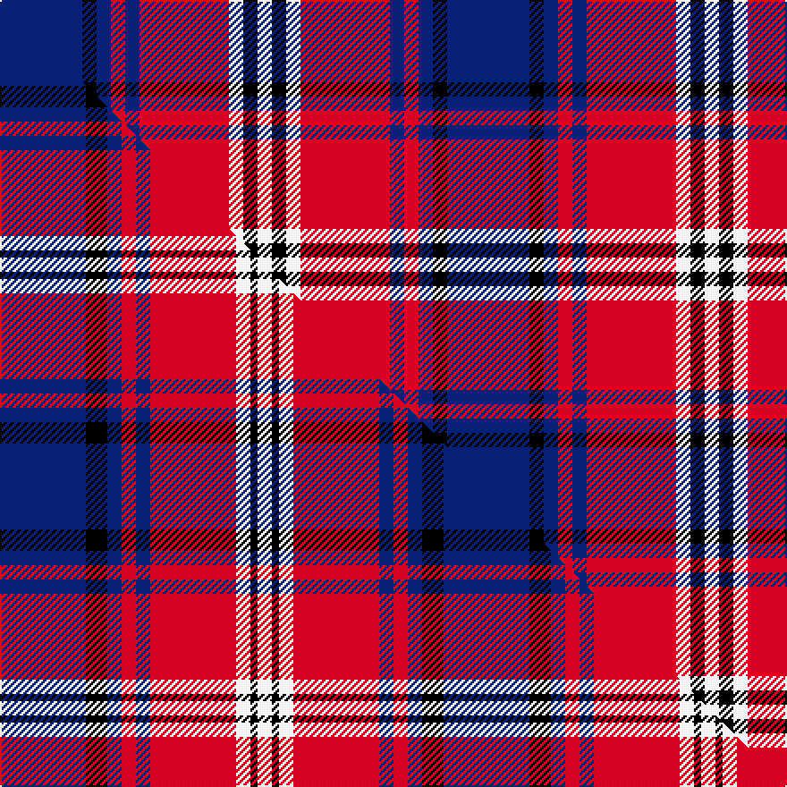

This is one **variant** — a specific cloth: this exact thread count and colourway, with its own
provenance below. It is one weaving of the [sett](/setts/db23k4db4r4db4r25w4k4w4/) (the scale-free proportion — the
same cloth at any scale or shade), whose colour order is pattern [BKBRBRWKW](/stripes/bkbrbrwkw/).

Part of the [Ainslie](/tartans/ainslie/) tartan — the named design grouping this sett with its other cloths.

Sourced from weddslist.  It is a [9 stripe tartan](/stripes/stripes9/).

Original link [http://www.weddslist.com/cgi-bin/tartans/pg.pl?source=sts](http://www.weddslist.com/cgi-bin/tartans/pg.pl?source=sts)

Dataset <small>— provenance for this record, inherited from the source manifest</small>

<dl class="dataset-prov">
<dt>source</dt><dd><a href="/sources/weddslist/">Weddslist</a></dd>
<dt>data captured from</dt><dd><a href="https://github.com/thetartan/tartan-database/blob/master/data/weddslist/data.csv">https://github.com/thetartan/tartan-database/blob/master/data/weddslist/data.csv</a></dd>
<dt>data date</dt><dd>2016-11-17 <small>(dataset default)</small></dd>
<dt>licence</dt><dd><a href="https://creativecommons.org/licenses/by-nc-nd/4.0/">CC BY-NC-ND 4.0</a></dd>
</dl>

Capture chain <small>— the hands this data passed through, oldest first; each capture carries its own licence</small>

<ol class="capture-chain">
<li><a href="https://www.weddslist.com/tartans/">Weddslist</a> <small>the living privately compiled reference</small></li>
<li><a href="https://github.com/thetartan/tartan-database">thetartan/tartan-database</a> <small>2016-2017</small> · <a href="https://creativecommons.org/licenses/by-nc-nd/4.0/">CC BY-NC-ND 4.0</a> <small>Levko Kravets's frozen compilation — the capture we vendored, and where its CC licence text came from</small></li>
<li>this dictionary <small>captured 2026-06-10 · commit 5bf86c7566</small> <small>each re-capture is a git commit to data/sources</small></li>
</ol>

## Thread count
DB/46 K8 DB8 R8 DB8 R50 W8 K8 W/8

One full sett is **250 threads**.

## Palette
<table><thead><tr><th>Colour</th><th>Shade</th><th>OKLCh</th></tr></thead><tbody><tr><td>DB</td><td><code style="background-color:#082077;">#082077</code> <small style="color:#888">#082077</small></td><td><small style="color:#888">oklch(30.0% 0.149 265.1)</small></td></tr><tr><td>K</td><td><code style="background-color:#000000;">#000000</code> <small style="color:#888">#000000</small></td><td><small style="color:#888">oklch(0.0% 0.000 0.0)</small></td></tr><tr><td>W</td><td><code style="background-color:#F7F7F7;">#F7F7F7</code> <small style="color:#888">#F7F7F7</small></td><td><small style="color:#888">oklch(97.6% 0.000 89.9)</small></td></tr><tr><td>R</td><td><code style="background-color:#D60020;">#D60020</code> <small style="color:#888">#D60020</small></td><td><small style="color:#888">oklch(55.2% 0.224 25.5)</small></td></tr></tbody></table>

# Sample pattern

## Compared to the master

This cloth is one sett of its design; the master sett (the exemplar the design is anchored on) is below for comparison.

Its **ΔTartan distance** from the master is **0.53** — the same measure the nearest-tartans table ranks by (0 is identical; a re-scale of the same cloth is near 0, a recolour or a different proportion further).

<figure class="master-compare" style="margin:0">

this sett
master sett ★

<figcaption style="color:#888;font-size:smaller">One weave of this sett against the <a href="/setts/db12k3db2r2db2r12w2k1w2/">master sett ★</a>, split on the diagonal: a shared proportion runs seamlessly across it with only the shades shifting; a different proportion breaks on it.</figcaption>
</figure>

## Nearest tartan variants

The nearest existing variants by ΔTartan distance, with this cloth at the top so the swatches line up against it.

ΔTartan

Threads

Variant

Sett

—

250

<a href="/variants/s9/db23k4db4r4db4r25w4k4w4~x2/">Ainslie</a>

<a href="/ttd/edit/#slug=db12k3db2r2db2r12w2k1w2~x4&amp;base=db23k4db4r4db4r25w4k4w4~x2" title="compare in the TTD">0.53</a>

248

<a href="/variants/s9/db12k3db2r2db2r12w2k1w2~x4/">Ainslie</a>

<a href="/ttd/edit/#slug=db2r2db28k11r27w2r2~x2&amp;base=db23k4db4r4db4r25w4k4w4~x2" title="compare in the TTD">2.27</a>

288

<a href="/variants/s7/db2r2db28k11r27w2r2~x2/">Americana - 1978 #2 (Fashion)</a>

<a href="/ttd/edit/#slug=db12w4r12w5k4o12db20r4db5r4~x2&amp;base=db23k4db4r4db4r25w4k4w4~x2" title="compare in the TTD">2.33</a>

296

<a href="/variants/s10/db12w4r12w5k4o12db20r4db5r4~x2/">Commonwealth</a>

<a href="/ttd/edit/#slug=r3db3r20k20db20g3~x2&amp;base=db23k4db4r4db4r25w4k4w4~x2" title="compare in the TTD">2.37</a>

264

<a href="/variants/s6/r3db3r20k20db20g3~x2/">Unidentified #65</a>

<a href="/ttd/edit/#slug=w5lb34k24lb4dr24lb4~x2&amp;base=db23k4db4r4db4r25w4k4w4~x2" title="compare in the TTD">2.58</a>

362

<a href="/variants/s6/w5lb34k24lb4dr24lb4~x2/">Wcwm 759-3</a>

<a href="/ttd/edit/#slug=ly3db22k3db3k11r20ly3~x2&amp;base=db23k4db4r4db4r25w4k4w4~x2" title="compare in the TTD">2.63</a>

248

<a href="/variants/s7/ly3db22k3db3k11r20ly3~x2/">Biffy Clyro</a>

<a href="/ttd/edit/#slug=dr1k1lr2k2lr2k1lr4k1db9lo1~x4&amp;base=db23k4db4r4db4r25w4k4w4~x2" title="compare in the TTD">2.85</a>

184

<a href="/variants/s10/dr1k1lr2k2lr2k1lr4k1db9lo1~x4/">Hanna of Stirlingshire (Clan)</a>

<a href="/ttd/edit/#slug=y5db2k2db12k16r20k2r4~x2&amp;base=db23k4db4r4db4r25w4k4w4~x2" title="compare in the TTD">2.85</a>

234

<a href="/variants/s8/y5db2k2db12k16r20k2r4~x2/">Aitken</a>

<a href="/ttd/edit/#slug=y3db22k3db3k11r20y3~x2&amp;base=db23k4db4r4db4r25w4k4w4~x2" title="compare in the TTD">2.86</a>

248

<a href="/variants/s7/y3db22k3db3k11r20y3~x2/">Biffy Clyro</a>

<a href="/ttd/edit/#slug=w25dp8w8dp8w8dp46k46lp8k46dp46w46dp8w8&amp;base=db23k4db4r4db4r25w4k4w4~x2" title="compare in the TTD">2.96</a>

589

<a href="/variants/s13/w25dp8w8dp8w8dp46k46lp8k46dp46w46dp8w8/">Poulter SG 102 (Fashion)</a>

## Neighbour map

Every grey dot is one of 13621 variants placed by the first two principal components of the ΔTartan feature space (42% of its variance). Red is this tartan; blue dots are its nearest — click one to open its page.

<svg viewBox="0 0 640 380" role="img" style="max-width:100%;height:auto;border:1px solid #e0e0e0;border-radius:4px;display:block" xmlns="http://www.w3.org/2000/svg"><image href="/nn/cloud.v1.png" width="640" height="380"/><a href="/variants/s9/db12k3db2r2db2r12w2k1w2~x4/"><circle cx="197.8" cy="152.2" r="4" fill="#3465a4"><title>Ainslie</title></circle></a><a href="/variants/s7/db2r2db28k11r27w2r2~x2/"><circle cx="226.7" cy="150.3" r="4" fill="#3465a4"><title>Americana - 1978 #2 (Fashion)</title></circle></a><a href="/variants/s10/db12w4r12w5k4o12db20r4db5r4~x2/"><circle cx="122.9" cy="197.6" r="4" fill="#3465a4"><title>Commonwealth</title></circle></a><a href="/variants/s6/r3db3r20k20db20g3~x2/"><circle cx="139.1" cy="211.4" r="4" fill="#3465a4"><title>Unidentified #65</title></circle></a><a href="/variants/s6/w5lb34k24lb4dr24lb4~x2/"><circle cx="175.6" cy="205.4" r="4" fill="#3465a4"><title>Wcwm 759-3</title></circle></a><a href="/variants/s7/ly3db22k3db3k11r20ly3~x2/"><circle cx="152.7" cy="189.8" r="4" fill="#3465a4"><title>Biffy Clyro</title></circle></a><a href="/variants/s10/dr1k1lr2k2lr2k1lr4k1db9lo1~x4/"><circle cx="135.3" cy="147.9" r="4" fill="#3465a4"><title>Hanna of Stirlingshire (Clan)</title></circle></a><a href="/variants/s8/y5db2k2db12k16r20k2r4~x2/"><circle cx="160.9" cy="170.5" r="4" fill="#3465a4"><title>Aitken</title></circle></a><a href="/variants/s7/y3db22k3db3k11r20y3~x2/"><circle cx="162.9" cy="192.3" r="4" fill="#3465a4"><title>Biffy Clyro</title></circle></a><a href="/variants/s13/w25dp8w8dp8w8dp46k46lp8k46dp46w46dp8w8/"><circle cx="114.1" cy="184.8" r="4" fill="#3465a4"><title>Poulter SG 102 (Fashion)</title></circle></a><circle cx="173.5" cy="176.5" r="5" fill="#c00000"/><text x="320" y="376" text-anchor="middle" font-size="11" fill="#999">ground</text><text x="11" y="190" text-anchor="middle" font-size="11" fill="#999" transform="rotate(-90 11 190)">complexity</text></svg>

ID: /variants/s9/db23k4db4r4db4r25w4k4w4~x2/
