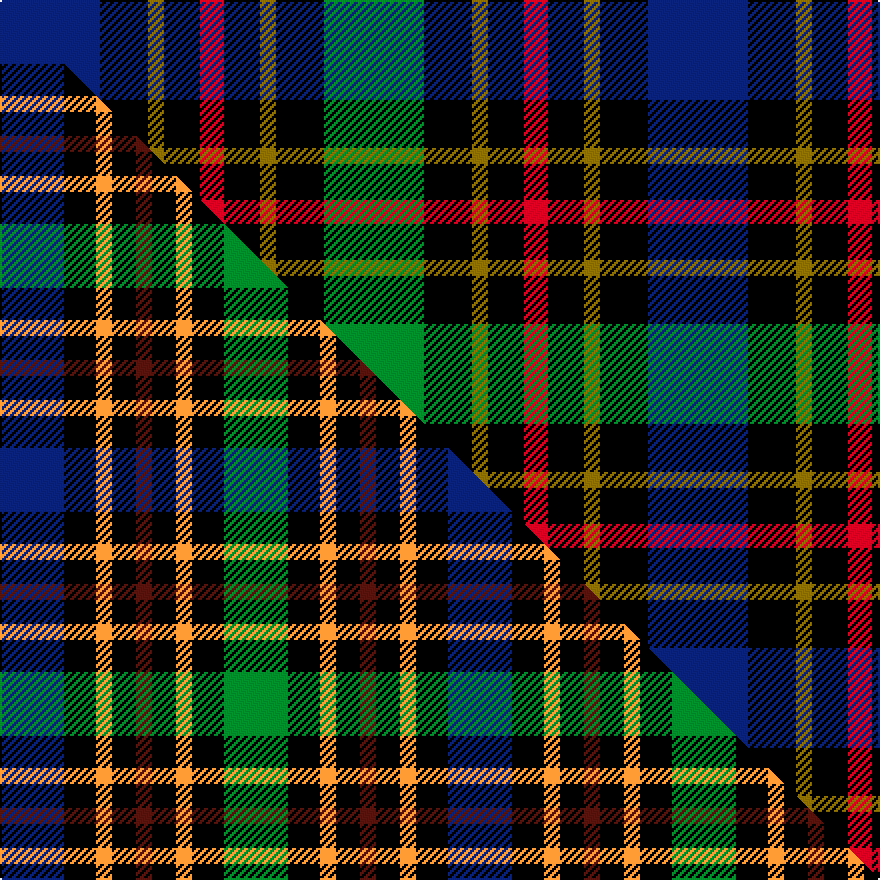

This page is one **sett** — a single exact thread-count. It belongs to the [tartan](/setts/db25k12y4k9r6k9y4k12g25/)
(the same proportion at any scale), whose colour order is pattern [BKGKRKGKG](/stripes/bkgkrkgkg/).

Part of the [Vosko](/tartans/vosko/) tartan — the named design grouping this sett with its other cloths.

Sourced from weddslist.  It is a [9 stripe tartan](/stripes/stripes9/).

Original link [http://www.weddslist.com/cgi-bin/tartans/pg.pl?source=sts](http://www.weddslist.com/cgi-bin/tartans/pg.pl?source=sts)

## Provenance

Earliest known date: 1989 Designed for a wedding.

2 attestations — the source records this cloth was collapsed from (oldest owns this page)

<ul>
<li>undated — Vosko (weddslist, <a href="http://www.weddslist.com/cgi-bin/tartans/pg.pl?source=sts">record</a>) </li>
<li>undated — Vosko Family Tartan (house-of-tartan, <a href="http://www.house-of-tartan.scotland.net/house/TartanViewjs.asp?colr=Def&tnam=373">record</a>) </li>
</ul>

Dataset <small>— provenance for this record, inherited from the source manifest</small>

<dl class="dataset-prov">
<dt>source</dt><dd><a href="/sources/weddslist/">Weddslist</a></dd>
<dt>data captured from</dt><dd><a href="https://github.com/thetartan/tartan-database/blob/master/data/weddslist/data.csv">https://github.com/thetartan/tartan-database/blob/master/data/weddslist/data.csv</a></dd>
<dt>data date</dt><dd>2016-11-17 <small>(dataset default)</small></dd>
<dt>licence</dt><dd><a href="https://creativecommons.org/licenses/by-nc-nd/4.0/">CC BY-NC-ND 4.0</a></dd>
</dl>

Capture chain <small>— the hands this data passed through, oldest first; each capture carries its own licence</small>

<ol class="capture-chain">
<li><a href="https://www.weddslist.com/tartans/">Weddslist</a> <small>the living privately compiled reference</small></li>
<li><a href="https://github.com/thetartan/tartan-database">thetartan/tartan-database</a> <small>2016-2017</small> · <a href="https://creativecommons.org/licenses/by-nc-nd/4.0/">CC BY-NC-ND 4.0</a> <small>Levko Kravets's frozen compilation — the capture we vendored, and where its CC licence text came from</small></li>
<li>this dictionary <small>captured 2026-06-10 · commit 5bf86c7566</small> <small>each re-capture is a git commit to data/sources</small></li>
</ol>

## Thread count
G/50 K24 Y8 K18 R12 K18 Y8 K24 DB/50

One full sett is **324 threads**.

## Palette
<table><thead><tr><th>Colour</th><th>Shade</th><th>OKLCh</th></tr></thead><tbody><tr><td>DB</td><td><code style="background-color:#082077;">#082077</code> <small style="color:#888">#082077</small></td><td><small style="color:#888">oklch(30.0% 0.149 265.1)</small></td></tr><tr><td>G</td><td><code style="background-color:#008B2A;">#008B2A</code> <small style="color:#888">#008B2A</small></td><td><small style="color:#888">oklch(55.4% 0.170 145.9)</small></td></tr><tr><td>K</td><td><code style="background-color:#000000;">#000000</code> <small style="color:#888">#000000</small></td><td><small style="color:#888">oklch(0.0% 0.000 0.0)</small></td></tr><tr><td>R</td><td><code style="background-color:#D60020;">#D60020</code> <small style="color:#888">#D60020</small></td><td><small style="color:#888">oklch(55.2% 0.224 25.5)</small></td></tr><tr><td>Y</td><td><code style="background-color:#8B6E00;">#8B6E00</code> <small style="color:#888">#8B6E00</small></td><td><small style="color:#888">oklch(55.1% 0.113 90.4)</small></td></tr></tbody></table>

# Sample pattern

## Compared to the master

This cloth is one sett of its design; the master sett (the exemplar the design is anchored on) is below for comparison.

Its **ΔTartan distance** from the master is **1.01** — the same measure the nearest-tartans table ranks by (0 is identical; a re-scale of the same cloth is near 0, a recolour or a different proportion further).

<figure class="master-compare" style="margin:0">

this sett
master sett ★

<figcaption style="color:#888;font-size:smaller">One weave of this sett against the <a href="/setts/db8k4lo2k3dr2k3lo2k4g8/">master sett ★</a>, split on the diagonal: a shared proportion runs seamlessly across it with only the shades shifting; a different proportion breaks on it.</figcaption>
</figure>

## Nearest tartan variants

The nearest existing variants by ΔTartan distance, with this cloth at the top so the swatches line up against it.

ΔTartan

Threads

Variant

Sett

—

324

<a href="/variants/s9/db25k12y4k9r6k9y4k12g25~x2/">Vosko</a>

<a href="/ttd/edit/#slug=db20k10lo3k7dr4k7lo3k8g20~x2&amp;base=db25k12y4k9r6k9y4k12g25~x2" title="compare in the TTD">0.74</a>

248

<a href="/variants/s9/db20k10lo3k7dr4k7lo3k8g20~x2/">Scottish Tartan Society</a>

<a href="/ttd/edit/#slug=db10n3db10r3k21g20k15r3~x2&amp;base=db25k12y4k9r6k9y4k12g25~x2" title="compare in the TTD">1.00</a>

314

<a href="/variants/s8/db10n3db10r3k21g20k15r3~x2/">Williamson/Smart</a>

<a href="/ttd/edit/#slug=db8k4lo2k3dr2k3lo2k4g8~x4&amp;base=db25k12y4k9r6k9y4k12g25~x2" title="compare in the TTD">1.01</a>

224

<a href="/variants/s9/db8k4lo2k3dr2k3lo2k4g8~x4/">Vosko</a>

<a href="/ttd/edit/#slug=db10r7db31k25g23k8db7k8y5~x2&amp;base=db25k12y4k9r6k9y4k12g25~x2" title="compare in the TTD">1.60</a>

466

<a href="/variants/s9/db10r7db31k25g23k8db7k8y5~x2/">MacCallum, of Berwick</a>

<a href="/ttd/edit/#slug=k8r1db8w1db8r1k8g8k1g8~x2&amp;base=db25k12y4k9r6k9y4k12g25~x2" title="compare in the TTD">1.84</a>

176

<a href="/variants/s10/k8r1db8w1db8r1k8g8k1g8~x2/">Hunter</a>

<a href="/ttd/edit/#slug=k19g3db19lo5db19g3k19g19r7g19~x2&amp;base=db25k12y4k9r6k9y4k12g25~x2" title="compare in the TTD">1.88</a>

452

<a href="/variants/s10/k19g3db19lo5db19g3k19g19r7g19~x2/">Casely Family Tartan</a>

<a href="/ttd/edit/#slug=r2k8y1k8g8db8k2w2~x2&amp;base=db25k12y4k9r6k9y4k12g25~x2" title="compare in the TTD">1.89</a>

148

<a href="/variants/s8/r2k8y1k8g8db8k2w2~x2/">Hislop hunting</a>

<a href="/ttd/edit/#slug=k4t21dy10y4k20r6t3~x2&amp;base=db25k12y4k9r6k9y4k12g25~x2" title="compare in the TTD">1.89</a>

258

<a href="/variants/s7/k4t21dy10y4k20r6t3~x2/">Swankie (Personal)</a>

<a href="/ttd/edit/#slug=g11lb3g5r3g5k22db22k5~x2&amp;base=db25k12y4k9r6k9y4k12g25~x2" title="compare in the TTD">1.91</a>

272

<a href="/variants/s8/g11lb3g5r3g5k22db22k5~x2/">Wood (Personal)</a>

<a href="/ttd/edit/#slug=r1k2dg4k1dg1k2db3k1w1~x6&amp;base=db25k12y4k9r6k9y4k12g25~x2" title="compare in the TTD">1.91</a>

180

<a href="/variants/s9/r1k2dg4k1dg1k2db3k1w1~x6/">MacKean dress</a>

## Neighbour map

Every grey dot is one of 13621 variants placed by the first two principal components of the ΔTartan feature space (42% of its variance). Red is this tartan; blue dots are its nearest — click one to open its page.

<svg viewBox="0 0 640 380" role="img" style="max-width:100%;height:auto;border:1px solid #e0e0e0;border-radius:4px;display:block" xmlns="http://www.w3.org/2000/svg"><image href="/nn/cloud.v1.png" width="640" height="380"/><a href="/variants/s9/db20k10lo3k7dr4k7lo3k8g20~x2/"><circle cx="105.7" cy="194.2" r="4" fill="#3465a4"><title>Scottish Tartan Society</title></circle></a><a href="/variants/s8/db10n3db10r3k21g20k15r3~x2/"><circle cx="126.1" cy="197.7" r="4" fill="#3465a4"><title>Williamson/Smart</title></circle></a><a href="/variants/s9/db8k4lo2k3dr2k3lo2k4g8~x4/"><circle cx="71.4" cy="224.2" r="4" fill="#3465a4"><title>Vosko</title></circle></a><a href="/variants/s9/db10r7db31k25g23k8db7k8y5~x2/"><circle cx="119.8" cy="201.3" r="4" fill="#3465a4"><title>MacCallum, of Berwick</title></circle></a><a href="/variants/s10/k8r1db8w1db8r1k8g8k1g8~x2/"><circle cx="93.4" cy="187.9" r="4" fill="#3465a4"><title>Hunter</title></circle></a><a href="/variants/s10/k19g3db19lo5db19g3k19g19r7g19~x2/"><circle cx="73.6" cy="210.5" r="4" fill="#3465a4"><title>Casely Family Tartan</title></circle></a><a href="/variants/s8/r2k8y1k8g8db8k2w2~x2/"><circle cx="115.5" cy="176.6" r="4" fill="#3465a4"><title>Hislop hunting</title></circle></a><a href="/variants/s7/k4t21dy10y4k20r6t3~x2/"><circle cx="108.7" cy="195.7" r="4" fill="#3465a4"><title>Swankie (Personal)</title></circle></a><a href="/variants/s8/g11lb3g5r3g5k22db22k5~x2/"><circle cx="114.1" cy="186.0" r="4" fill="#3465a4"><title>Wood (Personal)</title></circle></a><a href="/variants/s9/r1k2dg4k1dg1k2db3k1w1~x6/"><circle cx="84.9" cy="224.3" r="4" fill="#3465a4"><title>MacKean dress</title></circle></a><circle cx="101.4" cy="198.2" r="5" fill="#c00000"/><text x="320" y="376" text-anchor="middle" font-size="11" fill="#999">ground</text><text x="11" y="190" text-anchor="middle" font-size="11" fill="#999" transform="rotate(-90 11 190)">complexity</text></svg>

ID: /variants/s9/db25k12y4k9r6k9y4k12g25~x2/
