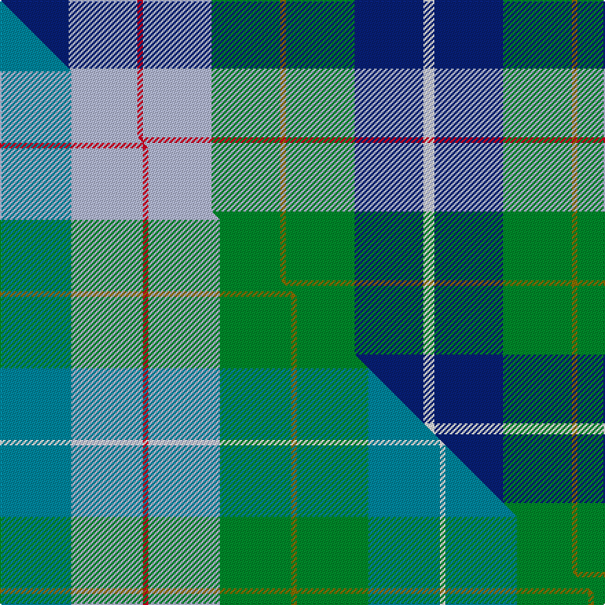

This is one **variant** — a specific cloth: this exact thread count and colourway, with its own
provenance below. It is one weaving of the [sett](/tartans/r/ro/royal-columbian/) (the scale-free proportion — the
same cloth at any scale or shade), whose colour order is pattern [BWRWGGGBW](/stripes/bwrwgggbw/).

Part of the [Royal Columbian](/tartans/r/ro/royal-columbian/) tartan — the named design grouping this sett with its other cloths.

Sourced from weddslist.  It is a [9 stripe tartan](/stripes/stripes9/).

Original link [http://www.weddslist.com/cgi-bin/tartans/pg.pl?source=sts](http://www.weddslist.com/cgi-bin/tartans/pg.pl?source=sts)

Dataset <small>— provenance for this record, inherited from the source manifest</small>

<dl class="dataset-prov">
<dt>source</dt><dd><a href="/sources/weddslist/">Weddslist</a></dd>
<dt>data captured from</dt><dd><a href="https://github.com/thetartan/tartan-database/blob/master/data/weddslist/data.csv">https://github.com/thetartan/tartan-database/blob/master/data/weddslist/data.csv</a></dd>
<dt>data date</dt><dd>2016-11-17 <small>(dataset default)</small></dd>
<dt>licence</dt><dd><a href="https://creativecommons.org/licenses/by-nc-nd/4.0/">CC BY-NC-ND 4.0</a></dd>
</dl>

Capture chain <small>— the hands this data passed through, oldest first; each capture carries its own licence</small>

<ol class="capture-chain">
<li><a href="https://www.weddslist.com/tartans/">Weddslist</a> <small>the living privately compiled reference</small></li>
<li><a href="https://github.com/thetartan/tartan-database">thetartan/tartan-database</a> <small>2016-2017</small> · <a href="https://creativecommons.org/licenses/by-nc-nd/4.0/">CC BY-NC-ND 4.0</a> <small>Levko Kravets's frozen compilation — the capture we vendored, and where its CC licence text came from</small></li>
<li>this dictionary <small>captured 2026-06-10 · commit 5bf86c7566</small> <small>each re-capture is a git commit to data/sources</small></li>
</ol>

## Thread count
DB/50 LB50 R4 LB50 G50 Y4 G50 DB50 W/8

One full sett is **574 threads**.

## Palette
<table><thead><tr><th>Colour</th><th>Shade</th><th>OKLCh</th></tr></thead><tbody><tr><td>DB</td><td><code style="background-color:#082077;">#082077</code> <small style="color:#888">#082077</small></td><td><small style="color:#888">oklch(30.0% 0.149 265.1)</small></td></tr><tr><td>LB</td><td><code style="background-color:#B5BBDE;">#B5BBDE</code> <small style="color:#888">#B5BBDE</small></td><td><small style="color:#888">oklch(79.9% 0.050 277.6)</small></td></tr><tr><td>G</td><td><code style="background-color:#008B2A;">#008B2A</code> <small style="color:#888">#008B2A</small></td><td><small style="color:#888">oklch(55.4% 0.170 145.9)</small></td></tr><tr><td>Y</td><td><code style="background-color:#8B6E00;">#8B6E00</code> <small style="color:#888">#8B6E00</small></td><td><small style="color:#888">oklch(55.1% 0.113 90.4)</small></td></tr><tr><td>W</td><td><code style="background-color:#F7F7F7;">#F7F7F7</code> <small style="color:#888">#F7F7F7</small></td><td><small style="color:#888">oklch(97.6% 0.000 89.9)</small></td></tr><tr><td>R</td><td><code style="background-color:#D60020;">#D60020</code> <small style="color:#888">#D60020</small></td><td><small style="color:#888">oklch(55.2% 0.224 25.5)</small></td></tr></tbody></table>

# Sample pattern

## Compared to the master

This cloth is one sett of its design; the master sett (the exemplar the design is anchored on) is below for comparison.

Its **ΔTartan distance** from the master is **0.21** — the same measure the nearest-tartans table ranks by (0 is identical; a re-scale of the same cloth is near 0, a recolour or a different proportion further).

<figure class="master-compare" style="margin:0">

this sett
master sett ★

<figcaption style="color:#888;font-size:smaller">One weave of this sett against the <a href="/setts/t13lb13r1lb13g13y1g13t13w1/">master sett ★</a>, split on the diagonal: a shared proportion runs seamlessly across it with only the shades shifting; a different proportion breaks on it.</figcaption>
</figure>

## Nearest tartan variants

The nearest existing variants by ΔTartan distance, with this cloth at the top so the swatches line up against it.

ΔTartan

Threads

Variant

Sett

—

574

<a href="/variants/s9/db25lb25r2lb25g25y2g25db25w4~x2/">Royal Columbian</a>

<a href="/ttd/edit/#slug=db25w2db25lb25r2lb25g25dy2g25~x2&amp;base=db25lb25r2lb25g25y2g25db25w4~x2" title="compare in the TTD">0.03</a>

524

<a href="/variants/s9/db25w2db25lb25r2lb25g25dy2g25~x2/">Royal Columbian Canadian Tartan</a>

<a href="/ttd/edit/#slug=lb6g20lb6w15db5w2db15n4db10r2~x2&amp;base=db25lb25r2lb25g25y2g25db25w4~x2" title="compare in the TTD">2.23</a>

324

<a href="/variants/s10/lb6g20lb6w15db5w2db15n4db10r2~x2/">Copar a'Beannichte Dress (Personal)</a>

<a href="/ttd/edit/#slug=dg20g6w15db5w2db15n4db10r2~x2~dg1806142-g2504202&amp;base=db25lb25r2lb25g25y2g25db25w4~x2" title="compare in the TTD">2.38</a>

272

<a href="/variants/s9/dg20g6w15db5w2db15n4db10r2~x2~dg1806142-g2504202/">Copar a'Beannichte Dress (Personal)</a>

<a href="/ttd/edit/#slug=db3g13lb1r3lb1db10ly1~x2&amp;base=db25lb25r2lb25g25y2g25db25w4~x2" title="compare in the TTD">2.43</a>

120

<a href="/variants/s7/db3g13lb1r3lb1db10ly1~x2/">Heckenberg Htg (Personal)</a>

<a href="/ttd/edit/#slug=lb16g2lb16db18y2db13g11r2g9db12r2y2~x2~g2408144&amp;base=db25lb25r2lb25g25y2g25db25w4~x2" title="compare in the TTD">2.93</a>

384

<a href="/variants/s12/lb16g2lb16db18y2db13g11r2g9db12r2y2~x2~g2408144/">E.C.R. (Corporate)</a>

<a href="/ttd/edit/#slug=w3db28g26r3g26db26lb12db3lb3&amp;base=db25lb25r2lb25g25y2g25db25w4~x2" title="compare in the TTD">2.93</a>

254

<a href="/variants/s9/w3db28g26r3g26db26lb12db3lb3/">Seaford House</a>

<a href="/ttd/edit/#slug=ly7g11db4lb31db4g11dy4db14w3db4~x2&amp;base=db25lb25r2lb25g25y2g25db25w4~x2" title="compare in the TTD">2.94</a>

350

<a href="/variants/s10/ly7g11db4lb31db4g11dy4db14w3db4~x2/">State Seal of Nebraska (Fashion)</a>

<a href="/ttd/edit/#slug=b4y2b16db15g16w3g3w4~x2&amp;base=db25lb25r2lb25g25y2g25db25w4~x2" title="compare in the TTD">3.08</a>

236

<a href="/variants/s8/b4y2b16db15g16w3g3w4~x2/">Business Air</a>

<a href="/ttd/edit/#slug=lb18db3lb10db3lb10db14ly2r7ly2g14ly2db14~x2&amp;base=db25lb25r2lb25g25y2g25db25w4~x2" title="compare in the TTD">3.24</a>

332

<a href="/variants/s12/lb18db3lb10db3lb10db14ly2r7ly2g14ly2db14~x2/">Ralston (UK)</a>

<a href="/ttd/edit/#slug=g6dp14t22db6ly16w1db6t6~x2~g2408144&amp;base=db25lb25r2lb25g25y2g25db25w4~x2" title="compare in the TTD">3.27</a>

284

<a href="/variants/s8/g6dp14t22db6ly16w1db6t6~x2~g2408144/">Scotia</a>

## Neighbour map

Every grey dot is one of 13657 variants placed by the first two principal components of the ΔTartan feature space (42% of its variance). Red is this tartan; blue dots are its nearest — click one to open its page. The map is a flat projection of a many-dimensional space — [how to read it](/posts/neighbourhood-maps/).

<svg viewBox="0 0 640 380" role="img" style="max-width:100%;height:auto;border:1px solid #e0e0e0;border-radius:4px;display:block" xmlns="http://www.w3.org/2000/svg"><image href="/nn/cloud.v1.png" width="640" height="380"/><a href="/variants/s9/db25w2db25lb25r2lb25g25dy2g25~x2/"><circle cx="138.6" cy="195.3" r="4" fill="#3465a4"><title>Royal Columbian Canadian Tartan</title></circle></a><a href="/variants/s10/lb6g20lb6w15db5w2db15n4db10r2~x2/"><circle cx="100.5" cy="181.0" r="4" fill="#3465a4"><title>Copar a'Beannichte Dress (Personal)</title></circle></a><a href="/variants/s9/dg20g6w15db5w2db15n4db10r2~x2~dg1806142-g2504202/"><circle cx="116.3" cy="181.7" r="4" fill="#3465a4"><title>Copar a'Beannichte Dress (Personal)</title></circle></a><a href="/variants/s7/db3g13lb1r3lb1db10ly1~x2/"><circle cx="234.7" cy="183.8" r="4" fill="#3465a4"><title>Heckenberg Htg (Personal)</title></circle></a><a href="/variants/s12/lb16g2lb16db18y2db13g11r2g9db12r2y2~x2~g2408144/"><circle cx="134.5" cy="176.6" r="4" fill="#3465a4"><title>E.C.R. (Corporate)</title></circle></a><a href="/variants/s9/w3db28g26r3g26db26lb12db3lb3/"><circle cx="207.0" cy="197.4" r="4" fill="#3465a4"><title>Seaford House</title></circle></a><a href="/variants/s10/ly7g11db4lb31db4g11dy4db14w3db4~x2/"><circle cx="140.9" cy="179.7" r="4" fill="#3465a4"><title>State Seal of Nebraska (Fashion)</title></circle></a><a href="/variants/s8/b4y2b16db15g16w3g3w4~x2/"><circle cx="163.0" cy="228.6" r="4" fill="#3465a4"><title>Business Air</title></circle></a><a href="/variants/s12/lb18db3lb10db3lb10db14ly2r7ly2g14ly2db14~x2/"><circle cx="150.2" cy="195.3" r="4" fill="#3465a4"><title>Ralston (UK)</title></circle></a><a href="/variants/s8/g6dp14t22db6ly16w1db6t6~x2~g2408144/"><circle cx="176.4" cy="183.5" r="4" fill="#3465a4"><title>Scotia</title></circle></a><circle cx="132.1" cy="198.0" r="5" fill="#c00000"/><text x="320" y="376" text-anchor="middle" font-size="11" fill="#999">ground</text><text x="11" y="190" text-anchor="middle" font-size="11" fill="#999" transform="rotate(-90 11 190)">complexity</text></svg>

ID: /variants/s9/db25lb25r2lb25g25y2g25db25w4~x2/
