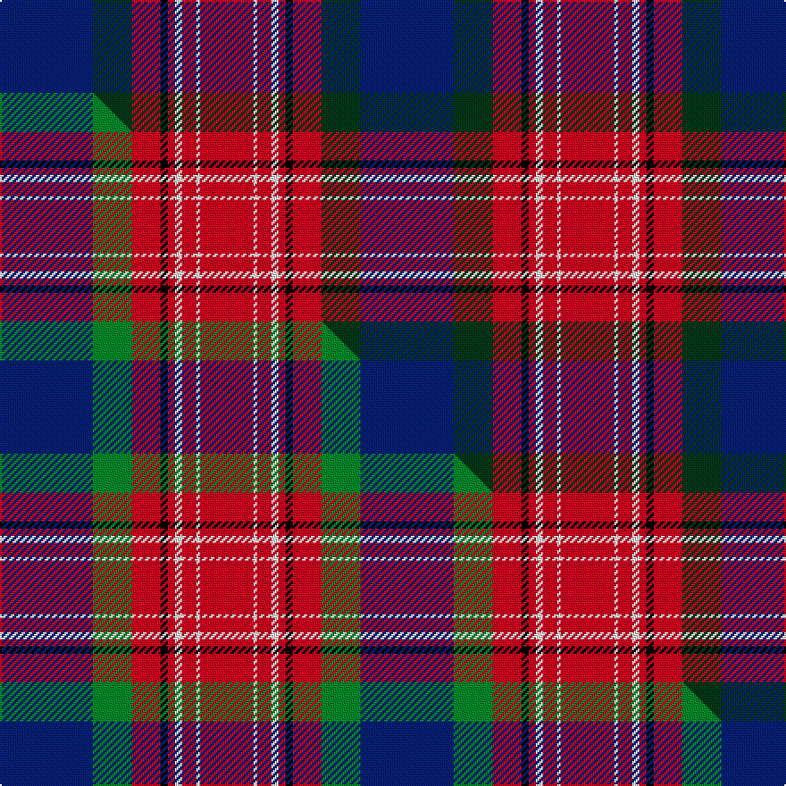

This is one **variant** — a specific cloth: this exact thread count and colourway, with its own
provenance below. It is one weaving of the [sett](/tartans/r/ro/royal-scottish-assurance/) (the scale-free proportion — the
same cloth at any scale or shade), whose colour order is pattern [BGRKRWRWR](/stripes/bgrkrwrwr/).

Part of the [Royal Scottish Assurance](/tartans/r/ro/royal-scottish-assurance/) tartan — the named design grouping this sett with its other cloths.

Sourced from weddslist.  It is a [9 stripe tartan](/stripes/stripes9/).

Original link [http://www.weddslist.com/cgi-bin/tartans/pg.pl?source=sts](http://www.weddslist.com/cgi-bin/tartans/pg.pl?source=sts)

Dataset <small>— provenance for this record, inherited from the source manifest</small>

<dl class="dataset-prov">
<dt>source</dt><dd><a href="/sources/weddslist/">Weddslist</a></dd>
<dt>data captured from</dt><dd><a href="https://github.com/thetartan/tartan-database/blob/master/data/weddslist/data.csv">https://github.com/thetartan/tartan-database/blob/master/data/weddslist/data.csv</a></dd>
<dt>data date</dt><dd>2016-11-17 <small>(dataset default)</small></dd>
<dt>licence</dt><dd><a href="https://creativecommons.org/licenses/by-nc-nd/4.0/">CC BY-NC-ND 4.0</a></dd>
</dl>

Capture chain <small>— the hands this data passed through, oldest first; each capture carries its own licence</small>

<ol class="capture-chain">
<li><a href="https://www.weddslist.com/tartans/">Weddslist</a> <small>the living privately compiled reference</small></li>
<li><a href="https://github.com/thetartan/tartan-database">thetartan/tartan-database</a> <small>2016-2017</small> · <a href="https://creativecommons.org/licenses/by-nc-nd/4.0/">CC BY-NC-ND 4.0</a> <small>Levko Kravets's frozen compilation — the capture we vendored, and where its CC licence text came from</small></li>
<li>this dictionary <small>captured 2026-06-10 · commit 5bf86c7566</small> <small>each re-capture is a git commit to data/sources</small></li>
</ol>

## Thread count
DB/52 DG22 R16 K4 R4 W4 R8 W2 R/30

One full sett is **202 threads**.

## Palette
<table><thead><tr><th>Colour</th><th>Shade</th><th>OKLCh</th></tr></thead><tbody><tr><td>DB</td><td><code style="background-color:#082077;">#082077</code> <small style="color:#888">#082077</small></td><td><small style="color:#888">oklch(30.0% 0.149 265.1)</small></td></tr><tr><td>DG</td><td><code style="background-color:#053819;">#053819</code> <small style="color:#888">#053819</small></td><td><small style="color:#888">oklch(30.0% 0.075 151.3)</small></td></tr><tr><td>K</td><td><code style="background-color:#000000;">#000000</code> <small style="color:#888">#000000</small></td><td><small style="color:#888">oklch(0.0% 0.000 0.0)</small></td></tr><tr><td>W</td><td><code style="background-color:#F7F7F7;">#F7F7F7</code> <small style="color:#888">#F7F7F7</small></td><td><small style="color:#888">oklch(97.6% 0.000 89.9)</small></td></tr><tr><td>R</td><td><code style="background-color:#D60020;">#D60020</code> <small style="color:#888">#D60020</small></td><td><small style="color:#888">oklch(55.2% 0.224 25.5)</small></td></tr></tbody></table>

# Sample pattern

## Compared to the master

This cloth is one sett of its design; the master sett (the exemplar the design is anchored on) is below for comparison.

Its **ΔTartan distance** from the master is **0.09** — the same measure the nearest-tartans table ranks by (0 is identical; a re-scale of the same cloth is near 0, a recolour or a different proportion further).

<figure class="master-compare" style="margin:0">

this sett
master sett ★

<figcaption style="color:#888;font-size:smaller">One weave of this sett against the <a href="/setts/db26g11r8k2r2w2r4w1r15/">master sett ★</a>, split on the diagonal: a shared proportion runs seamlessly across it with only the shades shifting; a different proportion breaks on it.</figcaption>
</figure>

## Nearest tartan variants

The nearest existing variants by ΔTartan distance, with this cloth at the top so the swatches line up against it.

ΔTartan

Threads

Variant

Sett

—

202

<a href="/variants/s9/db26dg11r8k2r2w2r4w1r15~x2/">Royal Scottish Assurance</a>

<a href="/ttd/edit/#slug=db26g11r8k2r2w2r4w1r15~x2&amp;base=db26dg11r8k2r2w2r4w1r15~x2" title="compare in the TTD">0.09</a>

202

<a href="/variants/s9/db26g11r8k2r2w2r4w1r15~x2/">Royal Scottish Assurance (Corporate)</a>

<a href="/ttd/edit/#slug=lb4y1r28db24k5lb5k3~x4&amp;base=db26dg11r8k2r2w2r4w1r15~x2" title="compare in the TTD">1.73</a>

532

<a href="/variants/s7/lb4y1r28db24k5lb5k3~x4/">McKnight #2 (Personal)</a>

<a href="/ttd/edit/#slug=db8w3db25k3db4k8r31y2r5~x2&amp;base=db26dg11r8k2r2w2r4w1r15~x2" title="compare in the TTD">2.02</a>

330

<a href="/variants/s9/db8w3db25k3db4k8r31y2r5~x2/">Caledon (Corporate)</a>

<a href="/ttd/edit/#slug=r25k1y2k1y2k1r10db18w2db12~x2&amp;base=db26dg11r8k2r2w2r4w1r15~x2" title="compare in the TTD">2.13</a>

222

<a href="/variants/s10/r25k1y2k1y2k1r10db18w2db12~x2/">Richardson</a>

<a href="/ttd/edit/#slug=db8k4db31lo5r26k5y10lo5k2&amp;base=db26dg11r8k2r2w2r4w1r15~x2" title="compare in the TTD">2.17</a>

182

<a href="/variants/s9/db8k4db31lo5r26k5y10lo5k2/">McGurk (Personal)</a>

<a href="/ttd/edit/#slug=dbi4y1r28db25k10dbi5k3~x2~dbi3912267-db2508270&amp;base=db26dg11r8k2r2w2r4w1r15~x2" title="compare in the TTD">2.19</a>

290

<a href="/variants/s7/dbi4y1r28db25k10dbi5k3~x2~dbi3912267-db2508270/">McKnight (Personal)</a>

<a href="/ttd/edit/#slug=db49k2g2k2g2k10r38db5r4k4n10~x2~db3514276-g5610195&amp;base=db26dg11r8k2r2w2r4w1r15~x2" title="compare in the TTD">2.26</a>

394

<a href="/variants/s11/db49k2g2k2g2k10r38db5r4k4n10~x2~db3514276-g5610195/">Porsche Bank Austria</a>

<a href="/ttd/edit/#slug=dg1r24dg8k8dg8r1k4db16w1~x2&amp;base=db26dg11r8k2r2w2r4w1r15~x2" title="compare in the TTD">2.33</a>

280

<a href="/variants/s9/dg1r24dg8k8dg8r1k4db16w1~x2/">Manson</a>

<a href="/ttd/edit/#slug=r48k10db12k2r3k2db12k10n10k2y3~x2&amp;base=db26dg11r8k2r2w2r4w1r15~x2" title="compare in the TTD">2.42</a>

354

<a href="/variants/s11/r48k10db12k2r3k2db12k10n10k2y3~x2/">Brooks Brothers (WCWM)</a>

<a href="/ttd/edit/#slug=k3r2db30r1k18o30r2o3~x2&amp;base=db26dg11r8k2r2w2r4w1r15~x2" title="compare in the TTD">2.43</a>

344

<a href="/variants/s8/k3r2db30r1k18o30r2o3~x2/">Bannockbane Navy Fashion Tartan</a>

## Neighbour map

Every grey dot is one of 13662 variants placed by the first two principal components of the ΔTartan feature space (42% of its variance). Red is this tartan; blue dots are its nearest — click one to open its page. The map is a flat projection of a many-dimensional space — [how to read it](/posts/neighbourhood-maps/).

<svg viewBox="0 0 640 380" role="img" style="max-width:100%;height:auto;border:1px solid #e0e0e0;border-radius:4px;display:block" xmlns="http://www.w3.org/2000/svg"><image href="/nn/cloud.v1.png" width="640" height="380"/><a href="/variants/s9/db26g11r8k2r2w2r4w1r15~x2/"><circle cx="207.6" cy="112.2" r="4" fill="#3465a4"><title>Royal Scottish Assurance (Corporate)</title></circle></a><a href="/variants/s7/lb4y1r28db24k5lb5k3~x4/"><circle cx="207.8" cy="116.4" r="4" fill="#3465a4"><title>McKnight #2 (Personal)</title></circle></a><a href="/variants/s9/db8w3db25k3db4k8r31y2r5~x2/"><circle cx="199.6" cy="125.5" r="4" fill="#3465a4"><title>Caledon (Corporate)</title></circle></a><a href="/variants/s10/r25k1y2k1y2k1r10db18w2db12~x2/"><circle cx="260.8" cy="99.7" r="4" fill="#3465a4"><title>Richardson</title></circle></a><a href="/variants/s9/db8k4db31lo5r26k5y10lo5k2/"><circle cx="164.1" cy="135.2" r="4" fill="#3465a4"><title>McGurk (Personal)</title></circle></a><a href="/variants/s7/dbi4y1r28db25k10dbi5k3~x2~dbi3912267-db2508270/"><circle cx="202.0" cy="127.6" r="4" fill="#3465a4"><title>McKnight (Personal)</title></circle></a><a href="/variants/s11/db49k2g2k2g2k10r38db5r4k4n10~x2~db3514276-g5610195/"><circle cx="230.5" cy="88.2" r="4" fill="#3465a4"><title>Porsche Bank Austria</title></circle></a><a href="/variants/s9/dg1r24dg8k8dg8r1k4db16w1~x2/"><circle cx="161.8" cy="121.0" r="4" fill="#3465a4"><title>Manson</title></circle></a><a href="/variants/s11/r48k10db12k2r3k2db12k10n10k2y3~x2/"><circle cx="211.8" cy="85.5" r="4" fill="#3465a4"><title>Brooks Brothers (WCWM)</title></circle></a><a href="/variants/s8/k3r2db30r1k18o30r2o3~x2/"><circle cx="196.0" cy="107.5" r="4" fill="#3465a4"><title>Bannockbane Navy Fashion Tartan</title></circle></a><circle cx="213.8" cy="112.6" r="5" fill="#c00000"/><text x="320" y="376" text-anchor="middle" font-size="11" fill="#999">ground</text><text x="11" y="190" text-anchor="middle" font-size="11" fill="#999" transform="rotate(-90 11 190)">complexity</text></svg>

ID: /variants/s9/db26dg11r8k2r2w2r4w1r15~x2/
