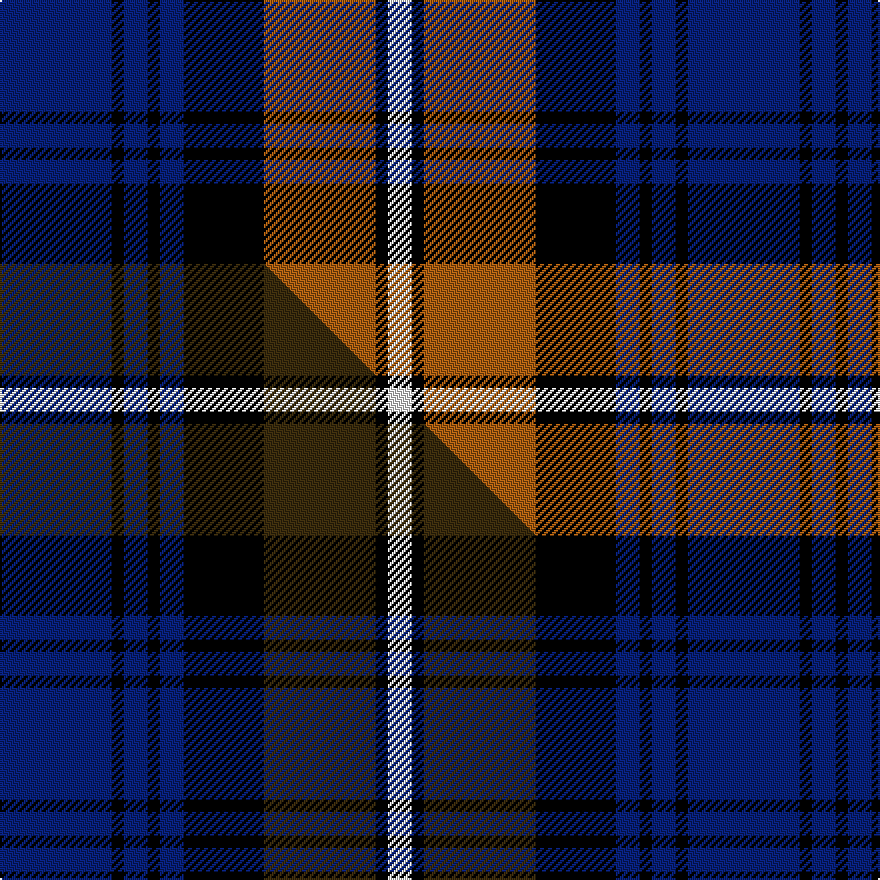

This is one **variant** — a specific cloth: this exact thread count and colourway, with its own
provenance below. It is one weaving of the [sett](/tartans/f/fo/forbes-2/) (the scale-free proportion — the
same cloth at any scale or shade), whose colour order is pattern [BKBKBKRKW](/stripes/bkbkbkrkw/).

Part of the [Forbes](/tartans/f/fo/forbes-2/) tartan — the named design grouping this sett with its other cloths.

Sourced from weddslist.  It is a [9 stripe tartan](/stripes/stripes9/).

Original link [http://www.weddslist.com/cgi-bin/tartans/pg.pl?source=sts](http://www.weddslist.com/cgi-bin/tartans/pg.pl?source=sts)

Dataset <small>— provenance for this record, inherited from the source manifest</small>

<dl class="dataset-prov">
<dt>source</dt><dd><a href="/sources/weddslist/">Weddslist</a></dd>
<dt>data captured from</dt><dd><a href="https://github.com/thetartan/tartan-database/blob/master/data/weddslist/data.csv">https://github.com/thetartan/tartan-database/blob/master/data/weddslist/data.csv</a></dd>
<dt>data date</dt><dd>2016-11-17 <small>(dataset default)</small></dd>
<dt>licence</dt><dd><a href="https://creativecommons.org/licenses/by-nc-nd/4.0/">CC BY-NC-ND 4.0</a></dd>
</dl>

Capture chain <small>— the hands this data passed through, oldest first; each capture carries its own licence</small>

<ol class="capture-chain">
<li><a href="https://www.weddslist.com/tartans/">Weddslist</a> <small>the living privately compiled reference</small></li>
<li><a href="https://github.com/thetartan/tartan-database">thetartan/tartan-database</a> <small>2016-2017</small> · <a href="https://creativecommons.org/licenses/by-nc-nd/4.0/">CC BY-NC-ND 4.0</a> <small>Levko Kravets's frozen compilation — the capture we vendored, and where its CC licence text came from</small></li>
<li>this dictionary <small>captured 2026-06-10 · commit 5bf86c7566</small> <small>each re-capture is a git commit to data/sources</small></li>
</ol>

## Thread count
DB/56 K6 DB12 K6 DB12 K40 O56 K6 W/12

One full sett is **344 threads**.

## Palette
<table><thead><tr><th>Colour</th><th>Shade</th><th>OKLCh</th></tr></thead><tbody><tr><td>DB</td><td><code style="background-color:#082077;">#082077</code> <small style="color:#888">#082077</small></td><td><small style="color:#888">oklch(30.0% 0.149 265.1)</small></td></tr><tr><td>K</td><td><code style="background-color:#000000;">#000000</code> <small style="color:#888">#000000</small></td><td><small style="color:#888">oklch(0.0% 0.000 0.0)</small></td></tr><tr><td>W</td><td><code style="background-color:#F7F7F7;">#F7F7F7</code> <small style="color:#888">#F7F7F7</small></td><td><small style="color:#888">oklch(97.6% 0.000 89.9)</small></td></tr><tr><td>O</td><td><code style="background-color:#A65C11;">#A65C11</code> <small style="color:#888">#A65C11</small></td><td><small style="color:#888">oklch(55.0% 0.125 58.3)</small></td></tr></tbody></table>

# Sample pattern

## Compared to the master

This cloth is one sett of its design; the master sett (the exemplar the design is anchored on) is below for comparison.

Its **ΔTartan distance** from the master is **1.00** — the same measure the nearest-tartans table ranks by (0 is identical; a re-scale of the same cloth is near 0, a recolour or a different proportion further).

<figure class="master-compare" style="margin:0">

this sett
master sett ★

<figcaption style="color:#888;font-size:smaller">One weave of this sett against the <a href="/setts/db28k3db6k3db6k20dy28k3w6/">master sett ★</a>, split on the diagonal: a shared proportion runs seamlessly across it with only the shades shifting; a different proportion breaks on it.</figcaption>
</figure>

## Nearest tartan variants

The nearest existing variants by ΔTartan distance, with this cloth at the top so the swatches line up against it.

ΔTartan

Threads

Variant

Sett

—

344

<a href="/variants/s9/db28k3db6k3db6k20o28k3w6~x2/">Forbes</a>

<a href="/ttd/edit/#slug=db28k3db6k3db6k20dy28k3w6~x2&amp;base=db28k3db6k3db6k20o28k3w6~x2" title="compare in the TTD">1.00</a>

344

<a href="/variants/s9/db28k3db6k3db6k20dy28k3w6~x2/">Forbes #5</a>

<a href="/ttd/edit/#slug=db8k2db2k2db2k8g7k1w1~x2&amp;base=db28k3db6k3db6k20o28k3w6~x2" title="compare in the TTD">1.46</a>

114

<a href="/variants/s9/db8k2db2k2db2k8g7k1w1~x2/">Forbes #3</a>

<a href="/ttd/edit/#slug=r3k12g4db12r1k2r1~x4&amp;base=db28k3db6k3db6k20o28k3w6~x2" title="compare in the TTD">1.92</a>

264

<a href="/variants/s7/r3k12g4db12r1k2r1~x4/">Sandberg</a>

<a href="/ttd/edit/#slug=r3db6k1db1k1db1k6g9k2~x2&amp;base=db28k3db6k3db6k20o28k3w6~x2" title="compare in the TTD">1.98</a>

110

<a href="/variants/s9/r3db6k1db1k1db1k6g9k2~x2/">Urquhart</a>

<a href="/ttd/edit/#slug=k5db3k3db23n4k25n23lb3n5~x2&amp;base=db28k3db6k3db6k20o28k3w6~x2" title="compare in the TTD">2.01</a>

356

<a href="/variants/s9/k5db3k3db23n4k25n23lb3n5~x2/">Cahonas Scotland</a>

<a href="/ttd/edit/#slug=lp10dp9n59dp9k59dp9lp5&amp;base=db28k3db6k3db6k20o28k3w6~x2" title="compare in the TTD">2.06</a>

305

<a href="/variants/s7/lp10dp9n59dp9k59dp9lp5/">Central Newcastle School</a>

<a href="/ttd/edit/#slug=r9db11k3db3k3db3k20g20k3~x2&amp;base=db28k3db6k3db6k20o28k3w6~x2" title="compare in the TTD">2.08</a>

276

<a href="/variants/s9/r9db11k3db3k3db3k20g20k3~x2/">Urquhart Broad Red Clan Tartan</a>

<a href="/ttd/edit/#slug=k2r1dg10k10lb4k2lb2k2lb5k2lb2~x2&amp;base=db28k3db6k3db6k20o28k3w6~x2" title="compare in the TTD">2.17</a>

160

<a href="/variants/s11/k2r1dg10k10lb4k2lb2k2lb5k2lb2~x2/">Bijral</a>

<a href="/ttd/edit/#slug=db10k1db1k1db2k8g10w1~x4&amp;base=db28k3db6k3db6k20o28k3w6~x2" title="compare in the TTD">2.26</a>

228

<a href="/variants/s8/db10k1db1k1db2k8g10w1~x4/">Lamont</a>

<a href="/ttd/edit/#slug=db10k1db1k1db2k8g10w1~x2&amp;base=db28k3db6k3db6k20o28k3w6~x2" title="compare in the TTD">2.26</a>

114

<a href="/variants/s8/db10k1db1k1db2k8g10w1~x2/">Lamont</a>

## Neighbour map

Every grey dot is one of 13657 variants placed by the first two principal components of the ΔTartan feature space (42% of its variance). Red is this tartan; blue dots are its nearest — click one to open its page. The map is a flat projection of a many-dimensional space — [how to read it](/posts/neighbourhood-maps/).

<svg viewBox="0 0 640 380" role="img" style="max-width:100%;height:auto;border:1px solid #e0e0e0;border-radius:4px;display:block" xmlns="http://www.w3.org/2000/svg"><image href="/nn/cloud.v1.png" width="640" height="380"/><a href="/variants/s9/db28k3db6k3db6k20dy28k3w6~x2/"><circle cx="179.9" cy="181.1" r="4" fill="#3465a4"><title>Forbes #5</title></circle></a><a href="/variants/s9/db8k2db2k2db2k8g7k1w1~x2/"><circle cx="157.7" cy="191.9" r="4" fill="#3465a4"><title>Forbes #3</title></circle></a><a href="/variants/s7/r3k12g4db12r1k2r1~x4/"><circle cx="183.7" cy="171.0" r="4" fill="#3465a4"><title>Sandberg</title></circle></a><a href="/variants/s9/r3db6k1db1k1db1k6g9k2~x2/"><circle cx="127.0" cy="181.8" r="4" fill="#3465a4"><title>Urquhart</title></circle></a><a href="/variants/s9/k5db3k3db23n4k25n23lb3n5~x2/"><circle cx="169.3" cy="185.9" r="4" fill="#3465a4"><title>Cahonas Scotland</title></circle></a><a href="/variants/s7/lp10dp9n59dp9k59dp9lp5/"><circle cx="184.5" cy="168.3" r="4" fill="#3465a4"><title>Central Newcastle School</title></circle></a><a href="/variants/s9/r9db11k3db3k3db3k20g20k3~x2/"><circle cx="132.7" cy="190.8" r="4" fill="#3465a4"><title>Urquhart Broad Red Clan Tartan</title></circle></a><a href="/variants/s11/k2r1dg10k10lb4k2lb2k2lb5k2lb2~x2/"><circle cx="154.2" cy="162.9" r="4" fill="#3465a4"><title>Bijral</title></circle></a><a href="/variants/s8/db10k1db1k1db2k8g10w1~x4/"><circle cx="171.4" cy="178.7" r="4" fill="#3465a4"><title>Lamont</title></circle></a><a href="/variants/s8/db10k1db1k1db2k8g10w1~x2/"><circle cx="171.4" cy="178.7" r="4" fill="#3465a4"><title>Lamont</title></circle></a><circle cx="155.4" cy="170.0" r="5" fill="#c00000"/><text x="320" y="376" text-anchor="middle" font-size="11" fill="#999">ground</text><text x="11" y="190" text-anchor="middle" font-size="11" fill="#999" transform="rotate(-90 11 190)">complexity</text></svg>

ID: /variants/s9/db28k3db6k3db6k20o28k3w6~x2/
