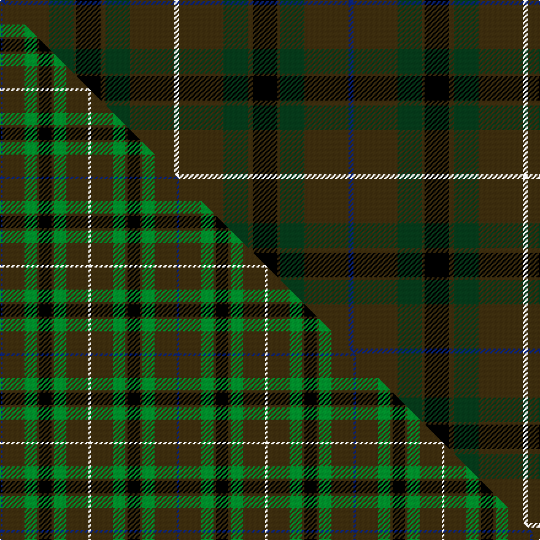

This is one **variant** — a specific cloth: this exact thread count and colourway, with its own
provenance below. It is one weaving of the [sett](/tartans/d/du/duchess-of-york/) (the scale-free proportion — the
same cloth at any scale or shade), whose colour order is pattern [BGGGKGGGW](/stripes/bgggkgggw/).

Part of the [Duchess of York](/tartans/d/du/duchess-of-york/) tartan — the named design grouping this sett with its other cloths.

Sourced from tartans-authority.  It is a [9 stripe tartan](/stripes/stripes9/).

Original link <code>http://www.tartansauthority.com/tartan-ferret/display/607/</code> — retired · [Internet Archive copy](https://web.archive.org/web/*/http://www.tartansauthority.com/tartan-ferret/display/607/*)

Dataset <small>— provenance for this record, inherited from the source manifest</small>

<dl class="dataset-prov">
<dt>source</dt><dd><a href="/sources/tartans-authority/">Scottish Tartans Authority</a></dd>
<dt>data captured from</dt><dd><a href="https://github.com/thetartan/tartan-database/blob/master/data/tartans-authority/data.csv">https://github.com/thetartan/tartan-database/blob/master/data/tartans-authority/data.csv</a></dd>
<dt>data date</dt><dd>1930 <small>(this record)</small></dd>
<dt>licence</dt><dd><a href="https://creativecommons.org/licenses/by-nc-nd/4.0/">CC BY-NC-ND 4.0</a></dd>
</dl>

Capture chain <small>— the hands this data passed through, oldest first; each capture carries its own licence</small>

<ol class="capture-chain">
<li><a href="https://www.tartansauthority.com/">Scottish Tartans Authority</a> <small>the heritage body’s archive — its tartan-ferret record browser is retired; dead record links are shown unlinked, with an Internet Archive copy (ITI numbers are not SRT references)</small></li>
<li><a href="https://github.com/thetartan/tartan-database">thetartan/tartan-database</a> <small>2016-2017</small> · <a href="https://creativecommons.org/licenses/by-nc-nd/4.0/">CC BY-NC-ND 4.0</a> <small>Levko Kravets's frozen compilation — the capture we vendored, and where its CC licence text came from</small></li>
<li>this dictionary <small>captured 2026-06-10 · commit 5bf86c7566</small> <small>each re-capture is a git commit to data/sources</small></li>
</ol>

## Register references

External register numbers recorded for this tartan.

- Scottish Tartans Authority (ITI): 607

## Thread count
DB/4 DY36 DG20 DY2 K20 DY4 DG20 DY36 W/4

One full sett is **284 threads**.

## Palette
<table><thead><tr><th>Colour</th><th>Shade</th><th>OKLCh</th></tr></thead><tbody><tr><td>DB</td><td><code style="background-color:#082077;">#082077</code> <small style="color:#888">#082077</small></td><td><small style="color:#888">oklch(30.0% 0.149 265.1)</small></td></tr><tr><td>DG</td><td><code style="background-color:#053819;">#053819</code> <small style="color:#888">#053819</small></td><td><small style="color:#888">oklch(30.0% 0.075 151.3)</small></td></tr><tr><td>K</td><td><code style="background-color:#000000;">#000000</code> <small style="color:#888">#000000</small></td><td><small style="color:#888">oklch(0.0% 0.000 0.0)</small></td></tr><tr><td>DY</td><td><code style="background-color:#3A2B0D;">#3A2B0D</code> <small style="color:#888">#3A2B0D</small></td><td><small style="color:#888">oklch(30.0% 0.049 82.0)</small></td></tr><tr><td>W</td><td><code style="background-color:#F7F7F7;">#F7F7F7</code> <small style="color:#888">#F7F7F7</small></td><td><small style="color:#888">oklch(97.6% 0.000 89.9)</small></td></tr></tbody></table>

# Sample pattern

## Compared to the master

This cloth is one sett of its design; the master sett (the exemplar the design is anchored on) is below for comparison.

Its **ΔTartan distance** from the master is **0.57** — the same measure the nearest-tartans table ranks by (0 is identical; a re-scale of the same cloth is near 0, a recolour or a different proportion further).

<figure class="master-compare" style="margin:0">

this sett
master sett ★

<figcaption style="color:#888;font-size:smaller">One weave of this sett against the <a href="/setts/db1dy9g5dy1k5dy1g5dy9w1/">master sett ★</a>, split on the diagonal: a shared proportion runs seamlessly across it with only the shades shifting; a different proportion breaks on it.</figcaption>
</figure>

## Nearest tartan variants

The nearest existing variants by ΔTartan distance, with this cloth at the top so the swatches line up against it.

ΔTartan

Threads

Variant

Sett

—

284

<a href="/variants/s9/db2dy18dg10dy1k10dy2dg10dy18w2~x2/">Duchess of York (Fashion)</a>

<a href="/ttd/edit/#slug=dg18k1dr9k12dr9k1dg18k1n6dg1~x2&amp;base=db2dy18dg10dy1k10dy2dg10dy18w2~x2" title="compare in the TTD">2.72</a>

266

<a href="/variants/s10/dg18k1dr9k12dr9k1dg18k1n6dg1~x2/">Arizona Jones</a>

<a href="/ttd/edit/#slug=dy6w1do18k6do4k4do8k1do8k2dy5~x2&amp;base=db2dy18dg10dy1k10dy2dg10dy18w2~x2" title="compare in the TTD">3.01</a>

230

<a href="/variants/s11/dy6w1do18k6do4k4do8k1do8k2dy5~x2/">Bute Heather, Weathered</a>

<a href="/ttd/edit/#slug=k4dg16db11dr16dg25lo2lb3~x2&amp;base=db2dy18dg10dy1k10dy2dg10dy18w2~x2" title="compare in the TTD">3.19</a>

294

<a href="/variants/s7/k4dg16db11dr16dg25lo2lb3~x2/">Mayo, County</a>

<a href="/ttd/edit/#slug=dy6r3dy34k16y3dt22r4~x2&amp;base=db2dy18dg10dy1k10dy2dg10dy18w2~x2" title="compare in the TTD">3.25</a>

332

<a href="/variants/s7/dy6r3dy34k16y3dt22r4~x2/">Ballantrae (Macnaughtons)</a>

<a href="/ttd/edit/#slug=db1k8db2dg16dr6dg16db2k8w1~x2&amp;base=db2dy18dg10dy1k10dy2dg10dy18w2~x2" title="compare in the TTD">3.46</a>

236

<a href="/variants/s9/db1k8db2dg16dr6dg16db2k8w1~x2/">Basel Tattoo (Official)</a>

<a href="/ttd/edit/#slug=do15dy2do5dy5k18db5do5db2do15~x2&amp;base=db2dy18dg10dy1k10dy2dg10dy18w2~x2" title="compare in the TTD">3.68</a>

228

<a href="/variants/s9/do15dy2do5dy5k18db5do5db2do15~x2/">Laois, County</a>

<a href="/ttd/edit/#slug=k2lb1dr2dg6dr2db4dr2k2dr15dg2dr2k1~x4&amp;base=db2dy18dg10dy1k10dy2dg10dy18w2~x2" title="compare in the TTD">3.75</a>

316

<a href="/variants/s12/k2lb1dr2dg6dr2db4dr2k2dr15dg2dr2k1~x4/">MacClure</a>

<a href="/ttd/edit/#slug=dy6o2dy12k4dp14k1dy3ly2~x2&amp;base=db2dy18dg10dy1k10dy2dg10dy18w2~x2" title="compare in the TTD">3.81</a>

160

<a href="/variants/s8/dy6o2dy12k4dp14k1dy3ly2~x2/">Mica, Green (Fashion)</a>

<a href="/ttd/edit/#slug=ki2k20dg30k2dg4k2dg30k3ki30k35dr2~ki0700000&amp;base=db2dy18dg10dy1k10dy2dg10dy18w2~x2" title="compare in the TTD">3.84</a>

316

<a href="/variants/s11/ki2k20dg30k2dg4k2dg30k3ki30k35dr2~ki0700000/">Phillips (Welsh Name)</a>

<a href="/ttd/edit/#slug=dg9w2dg24dt37r3dt37dg24w2dg9o4~x2~dt1103284&amp;base=db2dy18dg10dy1k10dy2dg10dy18w2~x2" title="compare in the TTD">3.88</a>

578

<a href="/variants/s10/dg9w2dg24db37r3db37dg24w2dg9o4~x2~db1103284/">Hardie</a>

## Neighbour map

Every grey dot is one of 13656 variants placed by the first two principal components of the ΔTartan feature space (42% of its variance). Red is this tartan; blue dots are its nearest — click one to open its page. The map is a flat projection of a many-dimensional space — [how to read it](/posts/neighbourhood-maps/).

<svg viewBox="0 0 640 380" role="img" style="max-width:100%;height:auto;border:1px solid #e0e0e0;border-radius:4px;display:block" xmlns="http://www.w3.org/2000/svg"><image href="/nn/cloud.v1.png" width="640" height="380"/><a href="/variants/s10/dg18k1dr9k12dr9k1dg18k1n6dg1~x2/"><circle cx="313.4" cy="181.4" r="4" fill="#3465a4"><title>Arizona Jones</title></circle></a><a href="/variants/s11/dy6w1do18k6do4k4do8k1do8k2dy5~x2/"><circle cx="391.3" cy="183.6" r="4" fill="#3465a4"><title>Bute Heather, Weathered</title></circle></a><a href="/variants/s7/k4dg16db11dr16dg25lo2lb3~x2/"><circle cx="293.9" cy="184.0" r="4" fill="#3465a4"><title>Mayo, County</title></circle></a><a href="/variants/s7/dy6r3dy34k16y3dt22r4~x2/"><circle cx="262.7" cy="191.5" r="4" fill="#3465a4"><title>Ballantrae (Macnaughtons)</title></circle></a><a href="/variants/s9/db1k8db2dg16dr6dg16db2k8w1~x2/"><circle cx="289.8" cy="167.6" r="4" fill="#3465a4"><title>Basel Tattoo (Official)</title></circle></a><a href="/variants/s9/do15dy2do5dy5k18db5do5db2do15~x2/"><circle cx="344.3" cy="224.1" r="4" fill="#3465a4"><title>Laois, County</title></circle></a><a href="/variants/s12/k2lb1dr2dg6dr2db4dr2k2dr15dg2dr2k1~x4/"><circle cx="333.1" cy="139.1" r="4" fill="#3465a4"><title>MacClure</title></circle></a><a href="/variants/s8/dy6o2dy12k4dp14k1dy3ly2~x2/"><circle cx="271.8" cy="174.6" r="4" fill="#3465a4"><title>Mica, Green (Fashion)</title></circle></a><a href="/variants/s11/ki2k20dg30k2dg4k2dg30k3ki30k35dr2~ki0700000/"><circle cx="288.2" cy="163.5" r="4" fill="#3465a4"><title>Phillips (Welsh Name)</title></circle></a><a href="/variants/s10/dg9w2dg24db37r3db37dg24w2dg9o4~x2~db1103284/"><circle cx="381.5" cy="190.7" r="4" fill="#3465a4"><title>Hardie</title></circle></a><circle cx="327.7" cy="180.4" r="5" fill="#c00000"/><text x="320" y="376" text-anchor="middle" font-size="11" fill="#999">ground</text><text x="11" y="190" text-anchor="middle" font-size="11" fill="#999" transform="rotate(-90 11 190)">complexity</text></svg>

ID: /variants/s9/db2dy18dg10dy1k10dy2dg10dy18w2~x2/
