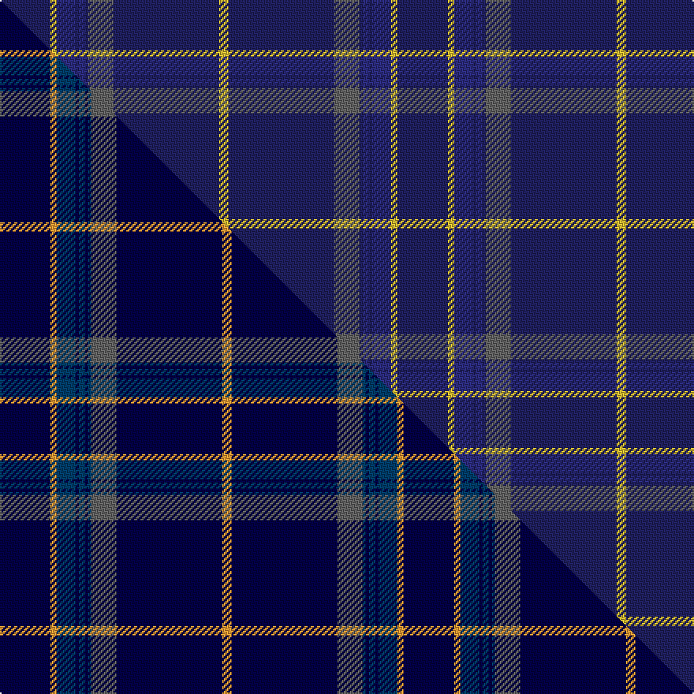

This page is one **sett** — a single exact thread-count. It belongs to the [tartan](/setts/db32ly4dbi12db2dbi4db2n16db67ly6/)
(the same proportion at any scale), whose colour order is pattern [BYBBBBBBY](/stripes/bybbbbbby/).

Part of the [Calum's Cabin](/tartans/calum-s-cabin/) tartan — the named design grouping this sett with its other cloths.

Sourced from tartans-authority.  It is a [9 stripe tartan](/stripes/stripes9/).

Original link http://www.tartansauthority.com/tartan-ferret/display/11237/

## Register references

External register numbers recorded for this tartan.

- Scottish Register of Tartans: [11237](https://www.tartanregister.gov.uk/tartanDetails?ref=11237)
- Scottish Tartans Authority (ITI): 11237

## Thread count
DB/32 LY4 DBi12 DB2 DBi4 DB2 N16 DB67 LY/6

One full sett is **252 threads**.

## Palette
<table><thead><tr><th>Colour</th><th>Shade</th><th>OKLCh</th></tr></thead><tbody><tr><td>DB</td><td><code style="background-color:#2C2C80;">#2C2C80</code> <small style="color:#888">#2C2C80</small></td><td><small style="color:#888">oklch(35.0% 0.138 276.6)</small></td></tr><tr><td>DB</td><td><code style="background-color:#202060;">#202060</code> <small style="color:#888">#202060</small></td><td><small style="color:#888">oklch(28.9% 0.111 276.9)</small></td></tr><tr><td>N</td><td><code style="background-color:#636363;">#636363</code> <small style="color:#888">#636363</small></td><td><small style="color:#888">oklch(50.0% 0.000 89.9)</small></td></tr><tr><td>LY</td><td><code style="background-color:#DCBC32;">#DCBC32</code> <small style="color:#888">#DCBC32</small></td><td><small style="color:#888">oklch(80.0% 0.150 95.2)</small></td></tr></tbody></table>

# Sample pattern

## Compared to the master

This cloth is one sett of its design; the master sett (the exemplar the design is anchored on) is below for comparison.

Its **ΔTartan distance** from the master is **3.92** — the same measure the nearest-tartans table ranks by (0 is identical; a re-scale of the same cloth is near 0, a recolour or a different proportion further).

<figure class="master-compare" style="margin:0">

this sett
master sett ★

<figcaption style="color:#888;font-size:smaller">One weave of this sett against the <a href="/setts/db32lo4dbi12db2dbi4db2dbi2n16db67lo6/">master sett ★</a>, split on the diagonal: a shared proportion runs seamlessly across it with only the shades shifting; a different proportion breaks on it.</figcaption>
</figure>

## Nearest variants

The nearest existing variants by ΔTartan distance, with this cloth at the top so the swatches line up against it.

ΔTartan

Threads

Variant

Sett

—

252

<a href="/variants/s9/db32ly4dbi12db2dbi4db2n16db67ly6~db1204274-dbi1406275/">Calum's Cabin</a>

0.90

—

<a href="/variants/s10/db32lo4dbi12db2dbi4db2dbi2n16db67lo6~db0705267-dbi1404245/">Calum's Cabin</a>

1.79

—

<a href="/variants/s10/w6db32n3db3n1db3n2dbi4db1y2~x2~db1204274-dbi1406275/">X Marks the Scot</a>

<a href="/ttd/edit/#slug=t4db2t1db23lb2t2~x2~t2405244-lb3103284&amp;base=db32ly4dbi12db2dbi4db2n16db67ly6~db1204274-dbi1406275" title="compare in the TTD">1.79</a>

124

<a href="/variants/s6/t4db2t1db23lb2t2~x2~t2405244-lb3103284/">Covenant College (Corporate)</a>

<a href="/ttd/edit/#slug=dbi8w4db6dbi2db6n10db63w3~dbi1406275-db1404245&amp;base=db32ly4dbi12db2dbi4db2n16db67ly6~db1204274-dbi1406275" title="compare in the TTD">2.14</a>

193

<a href="/variants/s8/dbi8w4db6dbi2db6n10db63w3~dbi1406275-db1404245/">Pride of the Clyde</a>

<a href="/ttd/edit/#slug=db29dbi2db1dbi1db1dbi1lb8lo1~x4~db1106275-dbi1406275&amp;base=db32ly4dbi12db2dbi4db2n16db67ly6~db1204274-dbi1406275" title="compare in the TTD">2.39</a>

232

<a href="/variants/s8/db29dbi2db1dbi1db1dbi1lb8lo1~x4~db1106275-dbi1406275/">Marist School, The</a>

<a href="/ttd/edit/#slug=db21n2lr1n2db1dr2db1y6~x4&amp;base=db32ly4dbi12db2dbi4db2n16db67ly6~db1204274-dbi1406275" title="compare in the TTD">2.47</a>

180

<a href="/variants/s8/db21n2lr1n2db1dr2db1y6~x4/">Blue Rust (Corporate)</a>

<a href="/ttd/edit/#slug=t11db7t3db70lb4db6~x2~db1004274&amp;base=db32ly4dbi12db2dbi4db2n16db67ly6~db1204274-dbi1406275" title="compare in the TTD">2.50</a>

370

<a href="/variants/s6/t11db7t3db70lb4db6~x2~db1004274/">Auchairne</a>

<a href="/ttd/edit/#slug=dr68db9lb10db13lo1db1lo2~x2&amp;base=db32ly4dbi12db2dbi4db2n16db67ly6~db1204274-dbi1406275" title="compare in the TTD">2.67</a>

276

<a href="/variants/s7/dr68db9lb10db13lo1db1lo2~x2/">Canadian Legion Branch 50</a>

<a href="/ttd/edit/#slug=t42db10lo2db2lb2db2t10lb6db2lb3t2~x2&amp;base=db32ly4dbi12db2dbi4db2n16db67ly6~db1204274-dbi1406275" title="compare in the TTD">2.80</a>

244

<a href="/variants/s11/t42db10lo2db2lb2db2t10lb6db2lb3t2~x2/">Goil Dress</a>

<a href="/ttd/edit/#slug=y4t3y1t17db40t2db3~x2&amp;base=db32ly4dbi12db2dbi4db2n16db67ly6~db1204274-dbi1406275" title="compare in the TTD">2.90</a>

266

<a href="/variants/s7/y4t3y1t17db40t2db3~x2/">Danzas</a>

## Neighbour map

Every grey dot is one of 13620 variants placed by the first two principal components of the ΔTartan feature space (42% of its variance). Red is this tartan; blue dots are its nearest — click one to open its page.

<svg viewBox="0 0 640 380" role="img" style="max-width:100%;height:auto;border:1px solid #e0e0e0;border-radius:4px;display:block" xmlns="http://www.w3.org/2000/svg"><image href="/nn/cloud.v1.png" width="640" height="380"/><a href="/variants/s10/db32lo4dbi12db2dbi4db2dbi2n16db67lo6~db0705267-dbi1404245/"><circle cx="501.3" cy="147.1" r="4" fill="#3465a4"><title>Calum's Cabin</title></circle></a><a href="/variants/s10/w6db32n3db3n1db3n2dbi4db1y2~x2~db1204274-dbi1406275/"><circle cx="437.4" cy="103.7" r="4" fill="#3465a4"><title>X Marks the Scot</title></circle></a><a href="/variants/s6/t4db2t1db23lb2t2~x2~t2405244-lb3103284/"><circle cx="621.1" cy="181.2" r="4" fill="#3465a4"><title>Covenant College (Corporate)</title></circle></a><a href="/variants/s8/dbi8w4db6dbi2db6n10db63w3~dbi1406275-db1404245/"><circle cx="564.9" cy="162.8" r="4" fill="#3465a4"><title>Pride of the Clyde</title></circle></a><a href="/variants/s8/db29dbi2db1dbi1db1dbi1lb8lo1~x4~db1106275-dbi1406275/"><circle cx="497.7" cy="135.4" r="4" fill="#3465a4"><title>Marist School, The</title></circle></a><a href="/variants/s8/db21n2lr1n2db1dr2db1y6~x4/"><circle cx="439.5" cy="150.1" r="4" fill="#3465a4"><title>Blue Rust (Corporate)</title></circle></a><a href="/variants/s6/t11db7t3db70lb4db6~x2~db1004274/"><circle cx="626.0" cy="193.2" r="4" fill="#3465a4"><title>Auchairne</title></circle></a><a href="/variants/s7/dr68db9lb10db13lo1db1lo2~x2/"><circle cx="506.0" cy="133.3" r="4" fill="#3465a4"><title>Canadian Legion Branch 50</title></circle></a><a href="/variants/s11/t42db10lo2db2lb2db2t10lb6db2lb3t2~x2/"><circle cx="482.5" cy="168.6" r="4" fill="#3465a4"><title>Goil Dress</title></circle></a><a href="/variants/s7/y4t3y1t17db40t2db3~x2/"><circle cx="502.5" cy="171.3" r="4" fill="#3465a4"><title>Danzas</title></circle></a><circle cx="551.7" cy="170.1" r="5" fill="#c00000"/><text x="320" y="376" text-anchor="middle" font-size="11" fill="#999">ground</text><text x="11" y="190" text-anchor="middle" font-size="11" fill="#999" transform="rotate(-90 11 190)">complexity</text></svg>

ID: /variants/s9/db32ly4dbi12db2dbi4db2n16db67ly6~db1204274-dbi1406275/
