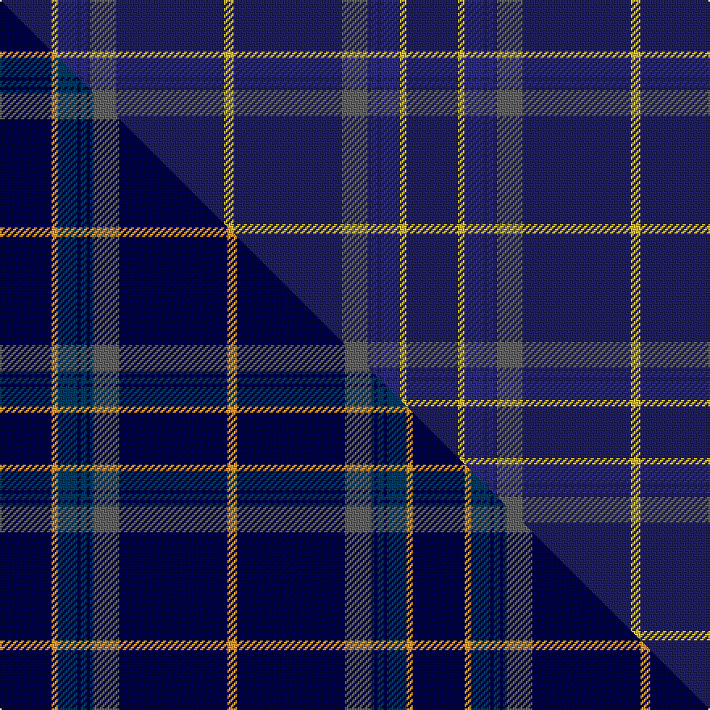

This is one **variant** — a specific cloth: this exact thread count and colourway, with its own
provenance below. It is one weaving of the [sett](/tartans/c/ca/calum-s-cabin/) (the scale-free proportion — the
same cloth at any scale or shade), whose colour order is pattern [BYBBBBBBY](/stripes/bybbbbbby/).

Part of the [Calum's Cabin](/tartans/c/ca/calum-s-cabin/) tartan — the named design grouping this sett with its other cloths.

Sourced from tartans-authority.  It is a [9 stripe tartan](/stripes/stripes9/).

Original link <code>http://www.tartansauthority.com/tartan-ferret/display/11237/</code> — retired · [Internet Archive copy](https://web.archive.org/web/*/http://www.tartansauthority.com/tartan-ferret/display/11237/*)

Dataset <small>— provenance for this record, inherited from the source manifest</small>

<dl class="dataset-prov">
<dt>source</dt><dd><a href="/sources/tartans-authority/">Scottish Tartans Authority</a></dd>
<dt>data captured from</dt><dd><a href="https://github.com/thetartan/tartan-database/blob/master/data/tartans-authority/data.csv">https://github.com/thetartan/tartan-database/blob/master/data/tartans-authority/data.csv</a></dd>
<dt>data date</dt><dd>2015 <small>(this record)</small></dd>
<dt>licence</dt><dd><a href="https://creativecommons.org/licenses/by-nc-nd/4.0/">CC BY-NC-ND 4.0</a></dd>
</dl>

Capture chain <small>— the hands this data passed through, oldest first; each capture carries its own licence</small>

<ol class="capture-chain">
<li><a href="https://www.tartansauthority.com/">Scottish Tartans Authority</a> <small>the heritage body’s archive — its tartan-ferret record browser is retired; dead record links are shown unlinked, with an Internet Archive copy (ITI numbers are not SRT references)</small></li>
<li><a href="https://github.com/thetartan/tartan-database">thetartan/tartan-database</a> <small>2016-2017</small> · <a href="https://creativecommons.org/licenses/by-nc-nd/4.0/">CC BY-NC-ND 4.0</a> <small>Levko Kravets's frozen compilation — the capture we vendored, and where its CC licence text came from</small></li>
<li>this dictionary <small>captured 2026-06-10 · commit 5bf86c7566</small> <small>each re-capture is a git commit to data/sources</small></li>
</ol>

## Register references

External register numbers recorded for this tartan.

- Scottish Register of Tartans: [11237](https://www.tartanregister.gov.uk/tartanDetails?ref=11237)
- Scottish Tartans Authority (ITI): 11237

## Thread count
DB/32 LY4 DBi12 DB2 DBi4 DB2 N16 DB67 LY/6

One full sett is **252 threads**.

## Palette
<table><thead><tr><th>Colour</th><th>Shade</th><th>OKLCh</th></tr></thead><tbody><tr><td>DB</td><td><code style="background-color:#2C2C80;">#2C2C80</code> <small style="color:#888">#2C2C80</small></td><td><small style="color:#888">oklch(35.0% 0.138 276.6)</small></td></tr><tr><td>DB</td><td><code style="background-color:#202060;">#202060</code> <small style="color:#888">#202060</small></td><td><small style="color:#888">oklch(28.9% 0.111 276.9)</small></td></tr><tr><td>N</td><td><code style="background-color:#636363;">#636363</code> <small style="color:#888">#636363</small></td><td><small style="color:#888">oklch(50.0% 0.000 89.9)</small></td></tr><tr><td>LY</td><td><code style="background-color:#DCBC32;">#DCBC32</code> <small style="color:#888">#DCBC32</small></td><td><small style="color:#888">oklch(80.0% 0.150 95.2)</small></td></tr></tbody></table>

# Sample pattern

## Compared to the master

This cloth is one sett of its design; the master sett (the exemplar the design is anchored on) is below for comparison.

Its **ΔTartan distance** from the master is **0.92** — the same measure the nearest-tartans table ranks by (0 is identical; a re-scale of the same cloth is near 0, a recolour or a different proportion further).

<figure class="master-compare" style="margin:0">

this sett
master sett ★

<figcaption style="color:#888;font-size:smaller">One weave of this sett against the <a href="/setts/db32lo4dbi12db2dbi4db2dbi2n16db67lo6/">master sett ★</a>, split on the diagonal: a shared proportion runs seamlessly across it with only the shades shifting; a different proportion breaks on it.</figcaption>
</figure>

## Nearest tartan variants

The nearest existing variants by ΔTartan distance, with this cloth at the top so the swatches line up against it.

ΔTartan

Threads

Variant

Sett

—

252

<a href="/variants/s9/db32ly4dbi12db2dbi4db2n16db67ly6~db2911276-dbi3514276/">Calum's Cabin</a>

<a href="/ttd/edit/#slug=db32lo4dbi12db2dbi4db2dbi2n16db67lo6~db1812264-dbi3409246&amp;base=db32ly4dbi12db2dbi4db2n16db67ly6~db2911276-dbi3514276" title="compare in the TTD">0.92</a>

256

<a href="/variants/s10/db32lo4dbi12db2dbi4db2dbi2n16db67lo6~db1812264-dbi3409246/">Calum's Cabin</a>

<a href="/ttd/edit/#slug=dbi7db5lr6db5r7db2dbi2db70lr2~dbi3514276-db3409246&amp;base=db32ly4dbi12db2dbi4db2n16db67ly6~db2911276-dbi3514276" title="compare in the TTD">1.76</a>

203

<a href="/variants/s9/dbi7db5lr6db5r7db2dbi2db70lr2~dbi3514276-db3409246/">United States Trade sett Tartan</a>

<a href="/ttd/edit/#slug=w6db32n3db3n1db3n2dbi4db1y2~x2~db2911276-dbi3514276&amp;base=db32ly4dbi12db2dbi4db2n16db67ly6~db2911276-dbi3514276" title="compare in the TTD">1.80</a>

212

<a href="/variants/s10/w6db32n3db3n1db3n2dbi4db1y2~x2~db2911276-dbi3514276/">X Marks the Scot</a>

<a href="/ttd/edit/#slug=db16lb4db1lb2db24w1y4~x2&amp;base=db32ly4dbi12db2dbi4db2n16db67ly6~db2911276-dbi3514276" title="compare in the TTD">1.83</a>

168

<a href="/variants/s7/db16lb4db1lb2db24w1y4~x2/">Talisker</a>

<a href="/ttd/edit/#slug=dbi8w4db6dbi2db6n10db63w3~dbi3514276-db3409246&amp;base=db32ly4dbi12db2dbi4db2n16db67ly6~db2911276-dbi3514276" title="compare in the TTD">2.17</a>

193

<a href="/variants/s8/dbi8w4db6dbi2db6n10db63w3~dbi3514276-db3409246/">Pride of the Clyde</a>

<a href="/ttd/edit/#slug=b10db6b3db62w4db5~x2&amp;base=db32ly4dbi12db2dbi4db2n16db67ly6~db2911276-dbi3514276" title="compare in the TTD">2.30</a>

330

<a href="/variants/s6/b10db6b3db62w4db5~x2/">Auchairne</a>

<a href="/ttd/edit/#slug=db62w2db4w5db6y2dr8y3w4~x2&amp;base=db32ly4dbi12db2dbi4db2n16db67ly6~db2911276-dbi3514276" title="compare in the TTD">2.31</a>

252

<a href="/variants/s9/db62w2db4w5db6y2dr8y3w4~x2/">George, Stuart (Personal)</a>

<a href="/ttd/edit/#slug=db4w3t6db40t8db12g3~x2&amp;base=db32ly4dbi12db2dbi4db2n16db67ly6~db2911276-dbi3514276" title="compare in the TTD">2.54</a>

290

<a href="/variants/s7/db4w3t6db40t8db12g3~x2/">JetBlue (Corporate)</a>

<a href="/ttd/edit/#slug=b21y38b20y2b64w6&amp;base=db32ly4dbi12db2dbi4db2n16db67ly6~db2911276-dbi3514276" title="compare in the TTD">2.69</a>

275

<a href="/variants/s6/b21y38b20y2b64w6/">European Union</a>

<a href="/ttd/edit/#slug=db32w1db1y2db1r1db4dg16~x4&amp;base=db32ly4dbi12db2dbi4db2n16db67ly6~db2911276-dbi3514276" title="compare in the TTD">2.76</a>

272

<a href="/variants/s8/db32w1db1y2db1r1db4dg16~x4/">Royal Agricultural Winter Fair</a>

## Neighbour map

Every grey dot is one of 13662 variants placed by the first two principal components of the ΔTartan feature space (42% of its variance). Red is this tartan; blue dots are its nearest — click one to open its page. The map is a flat projection of a many-dimensional space — [how to read it](/posts/neighbourhood-maps/).

<svg viewBox="0 0 640 380" role="img" style="max-width:100%;height:auto;border:1px solid #e0e0e0;border-radius:4px;display:block" xmlns="http://www.w3.org/2000/svg"><image href="/nn/cloud.v1.png" width="640" height="380"/><a href="/variants/s10/db32lo4dbi12db2dbi4db2dbi2n16db67lo6~db1812264-dbi3409246/"><circle cx="501.1" cy="147.3" r="4" fill="#3465a4"><title>Calum's Cabin</title></circle></a><a href="/variants/s9/dbi7db5lr6db5r7db2dbi2db70lr2~dbi3514276-db3409246/"><circle cx="567.2" cy="113.6" r="4" fill="#3465a4"><title>United States Trade sett Tartan</title></circle></a><a href="/variants/s10/w6db32n3db3n1db3n2dbi4db1y2~x2~db2911276-dbi3514276/"><circle cx="437.3" cy="103.8" r="4" fill="#3465a4"><title>X Marks the Scot</title></circle></a><a href="/variants/s7/db16lb4db1lb2db24w1y4~x2/"><circle cx="519.6" cy="165.5" r="4" fill="#3465a4"><title>Talisker</title></circle></a><a href="/variants/s8/dbi8w4db6dbi2db6n10db63w3~dbi3514276-db3409246/"><circle cx="564.7" cy="163.1" r="4" fill="#3465a4"><title>Pride of the Clyde</title></circle></a><a href="/variants/s6/b10db6b3db62w4db5~x2/"><circle cx="623.2" cy="198.0" r="4" fill="#3465a4"><title>Auchairne</title></circle></a><a href="/variants/s9/db62w2db4w5db6y2dr8y3w4~x2/"><circle cx="495.9" cy="110.5" r="4" fill="#3465a4"><title>George, Stuart (Personal)</title></circle></a><a href="/variants/s7/db4w3t6db40t8db12g3~x2/"><circle cx="483.9" cy="196.1" r="4" fill="#3465a4"><title>JetBlue (Corporate)</title></circle></a><a href="/variants/s6/b21y38b20y2b64w6/"><circle cx="535.9" cy="220.2" r="4" fill="#3465a4"><title>European Union</title></circle></a><a href="/variants/s8/db32w1db1y2db1r1db4dg16~x4/"><circle cx="487.9" cy="133.6" r="4" fill="#3465a4"><title>Royal Agricultural Winter Fair</title></circle></a><circle cx="551.5" cy="170.4" r="5" fill="#c00000"/><text x="320" y="376" text-anchor="middle" font-size="11" fill="#999">ground</text><text x="11" y="190" text-anchor="middle" font-size="11" fill="#999" transform="rotate(-90 11 190)">complexity</text></svg>

ID: /variants/s9/db32ly4dbi12db2dbi4db2n16db67ly6~db2911276-dbi3514276/
