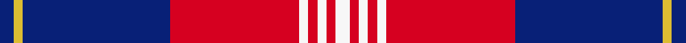

This page is one **sett** — a single exact thread-count. It belongs to the [tartan](/setts/db3ly2db32r28w2r2w2r2w3/)
(the same proportion at any scale), whose colour order is pattern [BYBRWRWRW](/stripes/bybrwrwrw/).

Sourced from register-of-tartans.  It is a [9 stripe tartan](/stripes/stripes9/).

Original link [https://www.tartanregister.gov.uk/tartanDetails.aspx?ref=5809](https://www.tartanregister.gov.uk/tartanDetails.aspx?ref=5809)

2 attestations — the source records this cloth was collapsed from (oldest owns this page)

<ul>
<li>01/01/2008 — Sea Dog Bamse, Pride of Norway (register-of-tartans, <a href="https://www.tartanregister.gov.uk/tartanDetails.aspx?ref=5809">record</a>)  <em>Bamse was a Norwegian St Bernard dog that had escaped to Scotland, accompanying his master, the captain of who captained the Norwegian minesweeper KNM Thorodd. In 2008 Scottish authors Angus Whitson and Andrew Orr wrote a book on his exploits and designed this tartan to commemorate his life and work.The symbolism of the Sea Dog Bamse tartan is inspired principally by the colours of Norway's national flag and ensign of the Royal Norwegian Navy. Red for blood, the Viking colour, blue for the ocean and white for the snow. Those colours are mirrored in the Scottish Saltire, the Scottish national flag and in the Royal Standard of Scotland which is a red lion rampant on a gold field - Gold, also represented in the Royal Standard, is priceless, as is the value of Freedom, the gift which Bamse fought and died for. The heraldic colours of Nordkapp or North Cape, identifying Bamse's hometown of Honningsvag, are represented in Red and Gold. The heraldic crest of the Royal Burgh of Montrose is a red rose with the motto (in Latin) "Mare ditat, Rosa decorat" The Sea dictates, the Rose adorns.The ensigns armorial of the City of Dundee are: "Azure, a pot of three growing lilies Argent", Three silver (white) lilies on a blue field.The tartan has been designed with the four colours of red, blue, white and gold which unite the countries and places with which Sea Dog Bamse is associated. We hope that Norwegians will adopt and wear the new tartan which honours the life of a truly remarkable wartime canine hero, whose memory remains bright in Scotland and Norway.</em></li>
<li>Dec. 2008 — Sea Dog Bamse (Commemorative) (tartans-authority, <a href="https://www.tartanregister.gov.uk/tartanDetails.aspx?ref=7858">record</a>)  <em>Bamse was a Norwegian St Bernard dog that had escaped to Scotland, accompanying his master, the captain of who captained the Norwegian minesweeper KNM Thorodd. In 2008 Scottish authors Angus Whitson and Andrew Orr wrote a book on his exploits and designed this tartan to commemorate his life and work. The symbolism of the Sea Dog Bamse tartan is inspired principally by the colours of Norway's national flag and ensign of the Royal Norwegian Navy. Red for blood, the Viking colour, blue for the ocean and white for the snow. Those colours are mirrored in the Scottish Saltire, the Scottish national flag and in the Royal Standard of Scotland which is a red lion rampant on a gold field - Gold, also represented in the Royal Standard, is priceless, as is the value of Freedom, the gift which Bamse fought and died for. The heraldic colours of Nordkapp or North Cape, identifying Bamse's hometown of Honningsvag, are represented in Red and Gold. The heraldic crest of the Royal Burgh of Montrose is a red rose with the motto (in Latin) "Mare ditat, Rosa decorat" The Sea dictates, the Rose adorns. The ensigns armorial of the City of Dundee are "Azure, a pot of three growing lilies Argent" Three silver (white) lilies on a blue field. The tartan has been designed with the four colours of red, blue, white and gold which unite the countries and places with which Sea Dog Bamse is associated. We hope that Norwegians will adopt and wear the new tartan which honours the life of a truly remarkable wartime canine hero, whose memory remains bright in Scotland and Norway.</em></li>
</ul>

Dataset <small>— provenance for this record, inherited from the source manifest</small>

<dl class="dataset-prov">
<dt>source</dt><dd><a href="/sources/register-of-tartans/">Scottish Register of Tartans</a></dd>
<dt>data captured from</dt><dd><a href="https://github.com/thetartan/tartan-database/blob/master/data/register-of-tartans/data.csv">https://github.com/thetartan/tartan-database/blob/master/data/register-of-tartans/data.csv</a></dd>
<dt>data date</dt><dd>2008 <small>(this record)</small></dd>
<dt>licence</dt><dd><a href="https://www.tartanregister.gov.uk/copyright">Crown copyright</a></dd>
</dl>

Capture chain <small>— the hands this data passed through, oldest first; each capture carries its own licence</small>

<ol class="capture-chain">
<li><a href="https://www.tartanregister.gov.uk/">Scottish Register of Tartans</a> · <a href="https://www.tartanregister.gov.uk/copyright">Crown copyright</a> <small>the living register — still published by National Records of Scotland</small></li>
<li><a href="https://github.com/thetartan/tartan-database">thetartan/tartan-database</a> <small>2016-2017</small> · <a href="https://creativecommons.org/licenses/by-nc-nd/4.0/">CC BY-NC-ND 4.0</a> <small>Levko Kravets's frozen compilation — the capture we vendored, and where its CC licence text came from</small></li>
<li>this dictionary <small>captured 2026-06-10 · commit 5bf86c7566</small> <small>each re-capture is a git commit to data/sources</small></li>
</ol>

## Register references

External register numbers recorded for this tartan.

- Scottish Register of Tartans: [5809](https://www.tartanregister.gov.uk/tartanDetails.aspx?ref=5809)
- Scottish Tartans Authority (ITI): 7858

## Thread count
DB/6 LY4 DB64 R56 W4 R4 W4 R4 W/6

One full sett is **292 threads**.

## Palette
<table><thead><tr><th>Colour</th><th>Shade</th><th>OKLCh</th></tr></thead><tbody><tr><td>DB</td><td><code style="background-color:#082077;">#082077</code> <small style="color:#888">#082077</small></td><td><small style="color:#888">oklch(30.0% 0.149 265.1)</small></td></tr><tr><td>LY</td><td><code style="background-color:#DCBC32;">#DCBC32</code> <small style="color:#888">#DCBC32</small></td><td><small style="color:#888">oklch(80.0% 0.150 95.2)</small></td></tr><tr><td>W</td><td><code style="background-color:#F7F7F7;">#F7F7F7</code> <small style="color:#888">#F7F7F7</small></td><td><small style="color:#888">oklch(97.6% 0.000 89.9)</small></td></tr><tr><td>R</td><td><code style="background-color:#D60020;">#D60020</code> <small style="color:#888">#D60020</small></td><td><small style="color:#888">oklch(55.2% 0.224 25.5)</small></td></tr></tbody></table>

# Sample pattern

## Nearest tartan variants

The nearest existing variants by ΔTartan distance, with this cloth at the top so the swatches line up against it.

ΔTartan

Threads

Variant

Sett

—

292

<a href="/variants/s9/db3ly2db32r28w2r2w2r2w3~x2/">Sea Dog Bamse, Pride of Norway</a>

<a href="/ttd/edit/#slug=db24w3db4y6db4w3db15r52db6&amp;base=db3ly2db32r28w2r2w2r2w3~x2" title="compare in the TTD">1.29</a>

204

<a href="/variants/s9/db24w3db4y6db4w3db15r52db6/">Mercer, James (Personal)</a>

<a href="/ttd/edit/#slug=db16w2db3y4db3w2db10r35db4~x2&amp;base=db3ly2db32r28w2r2w2r2w3~x2" title="compare in the TTD">1.33</a>

276

<a href="/variants/s9/db16w2db3y4db3w2db10r35db4~x2/">Mercer Personal Tartan</a>

<a href="/ttd/edit/#slug=db3dy1db14r14dy1r1dy1r1db2~x4&amp;base=db3ly2db32r28w2r2w2r2w3~x2" title="compare in the TTD">1.78</a>

284

<a href="/variants/s9/db3dy1db14r14dy1r1dy1r1db2~x4/">Breckon</a>

<a href="/ttd/edit/#slug=db6ly2db27r27ly2r2ly2r2db4~x2&amp;base=db3ly2db32r28w2r2w2r2w3~x2" title="compare in the TTD">1.82</a>

276

<a href="/variants/s9/db6ly2db27r27ly2r2ly2r2db4~x2/">New Breckon (Fashion?)</a>

<a href="/ttd/edit/#slug=ly3db8w3db34r34g4r4w2~x2&amp;base=db3ly2db32r28w2r2w2r2w3~x2" title="compare in the TTD">2.15</a>

358

<a href="/variants/s8/ly3db8w3db34r34g4r4w2~x2/">Manitoba Masonic (Corporate)</a>

<a href="/ttd/edit/#slug=y3db8w3db34r34dg4r4w2~x2&amp;base=db3ly2db32r28w2r2w2r2w3~x2" title="compare in the TTD">2.15</a>

358

<a href="/variants/s8/y3db8w3db34r34dg4r4w2~x2/">Manitoba Masonic</a>

<a href="/ttd/edit/#slug=r6w3r17db3r3db25r3~x2&amp;base=db3ly2db32r28w2r2w2r2w3~x2" title="compare in the TTD">2.30</a>

222

<a href="/variants/s7/r6w3r17db3r3db25r3~x2/">Bon Accord</a>

<a href="/ttd/edit/#slug=r4y2r34db10g4db4lb4db23w3~x2&amp;base=db3ly2db32r28w2r2w2r2w3~x2" title="compare in the TTD">2.57</a>

338

<a href="/variants/s9/r4y2r34db10g4db4lb4db23w3~x2/">Heirloom Red Alba (Fashion)</a>

<a href="/ttd/edit/#slug=g1r1db16r16db1w1~x2&amp;base=db3ly2db32r28w2r2w2r2w3~x2" title="compare in the TTD">2.63</a>

140

<a href="/variants/s6/g1r1db16r16db1w1~x2/">Galloway, dress</a>

<a href="/ttd/edit/#slug=db4r4db44w6db5o4db3o8db3o16db4r24w4&amp;base=db3ly2db32r28w2r2w2r2w3~x2" title="compare in the TTD">2.71</a>

250

<a href="/variants/s13/db4r4db44w6db5o4db3o8db3o16db4r24w4/">Largs (1981) (District)</a>

## Neighbour map

Every grey dot is one of 13621 variants placed by the first two principal components of the ΔTartan feature space (42% of its variance). Red is this tartan; blue dots are its nearest — click one to open its page.

<svg viewBox="0 0 640 380" role="img" style="max-width:100%;height:auto;border:1px solid #e0e0e0;border-radius:4px;display:block" xmlns="http://www.w3.org/2000/svg"><image href="/nn/cloud.v1.png" width="640" height="380"/><a href="/variants/s9/db24w3db4y6db4w3db15r52db6/"><circle cx="298.1" cy="145.7" r="4" fill="#3465a4"><title>Mercer, James (Personal)</title></circle></a><a href="/variants/s9/db16w2db3y4db3w2db10r35db4~x2/"><circle cx="299.2" cy="145.8" r="4" fill="#3465a4"><title>Mercer Personal Tartan</title></circle></a><a href="/variants/s9/db3dy1db14r14dy1r1dy1r1db2~x4/"><circle cx="349.0" cy="164.8" r="4" fill="#3465a4"><title>Breckon</title></circle></a><a href="/variants/s9/db6ly2db27r27ly2r2ly2r2db4~x2/"><circle cx="332.2" cy="164.6" r="4" fill="#3465a4"><title>New Breckon (Fashion?)</title></circle></a><a href="/variants/s8/ly3db8w3db34r34g4r4w2~x2/"><circle cx="263.1" cy="135.9" r="4" fill="#3465a4"><title>Manitoba Masonic (Corporate)</title></circle></a><a href="/variants/s8/y3db8w3db34r34dg4r4w2~x2/"><circle cx="268.8" cy="137.2" r="4" fill="#3465a4"><title>Manitoba Masonic</title></circle></a><a href="/variants/s7/r6w3r17db3r3db25r3~x2/"><circle cx="303.6" cy="204.1" r="4" fill="#3465a4"><title>Bon Accord</title></circle></a><a href="/variants/s9/r4y2r34db10g4db4lb4db23w3~x2/"><circle cx="234.0" cy="123.8" r="4" fill="#3465a4"><title>Heirloom Red Alba (Fashion)</title></circle></a><a href="/variants/s6/g1r1db16r16db1w1~x2/"><circle cx="326.5" cy="163.0" r="4" fill="#3465a4"><title>Galloway, dress</title></circle></a><a href="/variants/s13/db4r4db44w6db5o4db3o8db3o16db4r24w4/"><circle cx="264.1" cy="139.7" r="4" fill="#3465a4"><title>Largs (1981) (District)</title></circle></a><circle cx="291.5" cy="134.7" r="5" fill="#c00000"/><text x="320" y="376" text-anchor="middle" font-size="11" fill="#999">ground</text><text x="11" y="190" text-anchor="middle" font-size="11" fill="#999" transform="rotate(-90 11 190)">complexity</text></svg>

ID: /variants/s9/db3ly2db32r28w2r2w2r2w3~x2/
