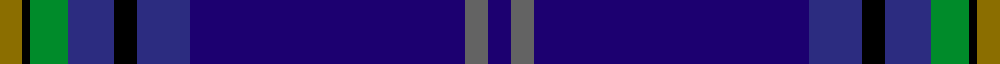

This page is one **sett** — a single exact thread-count. It belongs to the [tartan](/setts/db3n3db36dbi7k3dbi6g5k1y3/)
(the same proportion at any scale), whose colour order is pattern [BBBBKBGKG](/stripes/bbbbkbgkg/).

Sourced from register-of-tartans.  It is a [9 stripe tartan](/stripes/stripes9/).

Original link https://www.tartanregister.gov.uk/tartanDetails.aspx?ref=1820

2 attestations — the source records this cloth was collapsed from (oldest owns this page)

<ul>
<li>01/01/2000 — Incorporation of Weavers (Glasgow) (register-of-tartans, <a href="https://www.tartanregister.gov.uk/tartanDetails.aspx?ref=1820">record</a>)  <em>Designed by Maria Mackellar for the Millennium project but not woven until 2006. Maria was (in 2007) the very first Lady Deacon of the Incorporation in the whole of its long history. The Weavers of Glasgow date back to the middle ages when members of the craft were those entitled to make and sell woven clothes within the ancient burgh. The craft became incorporated by a charter from the famous Archbishop Gavin Dunbar as feudal lord of Glasgow in 1528, but is known to have been in existence at least as far back as 1514. Even in those days, when their main function was to control standards in the weaving trade, the Weavers also had a charitable role 'to help and comfort of their decayit brethren ... and other godlie shows.' This work has continued right up to the present day. Threadcount from Lochcarron 2007.</em></li>
<li>2000 — Incorporation of Weavers (Corporate) (tartans-authority, <a href="http://www.tartansauthority.com/tartan-ferret/display/7249/">record</a>)  <em>Designed by Maria Mackellar for the Millenium project but not woven until 2006. Maria was (in 2007) the very first Lady Deacon of the Incorporation in the whole of its long history. The Weavers of Glasgow date back to the middle ages when members of the craft were those entitled to make and sell woven clothes within the ancient burgh. The craft became incorporated by a charter from the famous Archbishop Gavin Dunbar as feudal lord of Glasgow in 1528, but is known to have been in existence at least as far back as 1514. Even in those days, when their main function was to control standards in the weaving trade, the Weavers also had a charitable role "to help and comfort of their decayit brethereine ... and other godlie shows." This work has continued right up to the present day. Threadcount from Lochcarron 2007.</em></li>
</ul>

## Register references

External register numbers recorded for this tartan.

- Scottish Register of Tartans: [1820](https://www.tartanregister.gov.uk/tartanDetails.aspx?ref=1820)
- Scottish Tartans Authority (ITI): 7249

## Thread count
Y/6 K2 G10 DBi12 K6 DBi14 DB72 N6 DB/6

One full sett is **256 threads**.

## Palette
<table><thead><tr><th>Colour</th><th>Shade</th><th>OKLCh</th></tr></thead><tbody><tr><td>B</td><td><code style="background-color:#82D67A;">#82D67A</code> <small style="color:#888">#82D67A</small></td><td><small style="color:#888">oklch(80.1% 0.150 142.2)</small></td></tr><tr><td>DB</td><td><code style="background-color:#2C2C80;">#2C2C80</code> <small style="color:#888">#2C2C80</small></td><td><small style="color:#888">oklch(35.0% 0.138 276.6)</small></td></tr><tr><td>DBa</td><td><code style="background-color:#1C0070;">#1C0070</code> <small style="color:#888">#1C0070</small></td><td><small style="color:#888">oklch(26.3% 0.162 277.1)</small></td></tr><tr><td>G</td><td><code style="background-color:#008B2A;">#008B2A</code> <small style="color:#888">#008B2A</small></td><td><small style="color:#888">oklch(55.4% 0.170 145.9)</small></td></tr><tr><td>K</td><td><code style="background-color:#000000;">#000000</code> <small style="color:#888">#000000</small></td><td><small style="color:#888">oklch(0.0% 0.000 0.0)</small></td></tr><tr><td>LN</td><td><code style="background-color:#F7F7F7;">#F7F7F7</code> <small style="color:#888">#F7F7F7</small></td><td><small style="color:#888">oklch(97.6% 0.000 89.9)</small></td></tr><tr><td>N</td><td><code style="background-color:#636363;">#636363</code> <small style="color:#888">#636363</small></td><td><small style="color:#888">oklch(50.0% 0.000 89.9)</small></td></tr><tr><td>Y</td><td><code style="background-color:#8B6E00;">#8B6E00</code> <small style="color:#888">#8B6E00</small></td><td><small style="color:#888">oklch(55.1% 0.113 90.4)</small></td></tr></tbody></table>

# Sample pattern

## Nearest variants

The nearest existing variants by ΔTartan distance, with this cloth at the top so the swatches line up against it.

ΔTartan

Threads

Variant

Sett

—

256

<a href="/variants/s9/db3n3db36dbi7k3dbi6g5k1y3~x2~db1106275-dbi1406275/">Incorporation of Weavers (Glasgow)</a>

2.20

—

<a href="/variants/s10/db6y3k2y5dbi30g2k4g2dbi6db4~x2~db1204274-dbi1406275/">St. Andrews University (Corporate)</a>

<a href="/ttd/edit/#slug=r1db2dt1k3dt19db3y1db2y1~x4~db1208266-dt1102249&amp;base=db3n3db36dbi7k3dbi6g5k1y3~x2~db1106275-dbi1406275" title="compare in the TTD">2.73</a>

256

<a href="/variants/s9/r1db2dt1k3dt19db3y1db2y1~x4~db1208266-dt1102249/">Pagus Wasia</a>

<a href="/ttd/edit/#slug=k46w1ki3lb4ki3db3ki2db11ki1lb2~x2~k0504259-ki0700000&amp;base=db3n3db36dbi7k3dbi6g5k1y3~x2~db1106275-dbi1406275" title="compare in the TTD">2.78</a>

208

<a href="/variants/s10/k46w1ki3lb4ki3db3ki2db11ki1lb2~x2~k0504259-ki0700000/">Seacliff Academy</a>

<a href="/ttd/edit/#slug=db40dbi8ly3dbi6k3dbi6r4~x2~db1004274-dbi1406275&amp;base=db3n3db36dbi7k3dbi6g5k1y3~x2~db1106275-dbi1406275" title="compare in the TTD">2.96</a>

192

<a href="/variants/s7/db40dbi8ly3dbi6k3dbi6r4~x2~db1004274-dbi1406275/">Edinburgh &amp; Lothian T.B. (Corporate)</a>

## Neighbour map

Every grey dot is one of 13620 variants placed by the first two principal components of the ΔTartan feature space (42% of its variance). Red is this tartan; blue dots are its nearest — click one to open its page.

<svg viewBox="0 0 640 380" role="img" style="max-width:100%;height:auto;border:1px solid #e0e0e0;border-radius:4px;display:block" xmlns="http://www.w3.org/2000/svg"><image href="/nn/cloud.v1.png" width="640" height="380"/><a href="/variants/s10/db6y3k2y5dbi30g2k4g2dbi6db4~x2~db1204274-dbi1406275/"><circle cx="323.5" cy="137.2" r="4" fill="#3465a4"><title>St. Andrews University (Corporate)</title></circle></a><a href="/variants/s9/r1db2dt1k3dt19db3y1db2y1~x4~db1208266-dt1102249/"><circle cx="403.4" cy="129.5" r="4" fill="#3465a4"><title>Pagus Wasia</title></circle></a><a href="/variants/s10/k46w1ki3lb4ki3db3ki2db11ki1lb2~x2~k0504259-ki0700000/"><circle cx="381.9" cy="65.7" r="4" fill="#3465a4"><title>Seacliff Academy</title></circle></a><a href="/variants/s7/db40dbi8ly3dbi6k3dbi6r4~x2~db1004274-dbi1406275/"><circle cx="370.6" cy="163.3" r="4" fill="#3465a4"><title>Edinburgh &amp; Lothian T.B. (Corporate)</title></circle></a><circle cx="371.7" cy="94.1" r="5" fill="#c00000"/><text x="320" y="376" text-anchor="middle" font-size="11" fill="#999">ground</text><text x="11" y="190" text-anchor="middle" font-size="11" fill="#999" transform="rotate(-90 11 190)">complexity</text></svg>

ID: /variants/s9/db3n3db36dbi7k3dbi6g5k1y3~x2~db1106275-dbi1406275/
