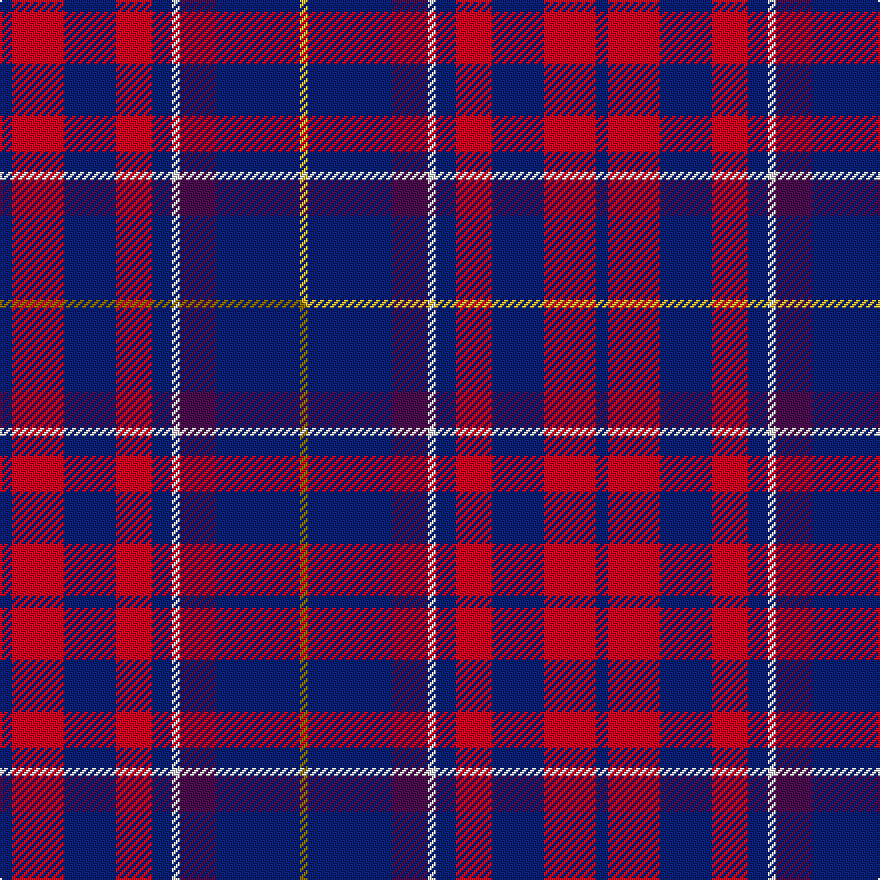

This page is one **sett** — a single exact thread-count. It belongs to the [tartan](/setts/db3r13db13r9db5w2dp9db21ly2/)
(the same proportion at any scale), whose colour order is pattern [BRBRBWBBY](/stripes/brbrbwbby/).

Part of the [Telfer, Brian William](/tartans/telfer-brian-william/) tartan — the named design grouping this sett with its other cloths.

Sourced from tartans-authority.  It is a [9 stripe tartan](/stripes/stripes9/).

Original link http://www.tartansauthority.com/tartan-ferret/display/11212/

## Register references

External register numbers recorded for this tartan.

- Scottish Register of Tartans: [11212](https://www.tartanregister.gov.uk/tartanDetails?ref=11212)
- Scottish Tartans Authority (ITI): 11212

## Thread count
DB/6 R26 DB26 R18 DB10 W4 DP18 DB42 LY/4

One full sett is **298 threads**.

## Palette
<table><thead><tr><th>Colour</th><th>Shade</th><th>OKLCh</th></tr></thead><tbody><tr><td>DB</td><td><code style="background-color:#082077;">#082077</code> <small style="color:#888">#082077</small></td><td><small style="color:#888">oklch(30.0% 0.149 265.1)</small></td></tr><tr><td>DP</td><td><code style="background-color:#4B0B4F;">#4B0B4F</code> <small style="color:#888">#4B0B4F</small></td><td><small style="color:#888">oklch(30.1% 0.125 325.4)</small></td></tr><tr><td>R</td><td><code style="background-color:#D60020;">#D60020</code> <small style="color:#888">#D60020</small></td><td><small style="color:#888">oklch(55.2% 0.224 25.5)</small></td></tr><tr><td>W</td><td><code style="background-color:#F7F7F7;">#F7F7F7</code> <small style="color:#888">#F7F7F7</small></td><td><small style="color:#888">oklch(97.6% 0.000 89.9)</small></td></tr><tr><td>LY</td><td><code style="background-color:#DCBC32;">#DCBC32</code> <small style="color:#888">#DCBC32</small></td><td><small style="color:#888">oklch(80.0% 0.150 95.2)</small></td></tr></tbody></table>

# Sample pattern

## Compared to the master

This cloth is one sett of its design; the master sett (the exemplar the design is anchored on) is below for comparison.

Its **ΔTartan distance** from the master is **0.20** — the same measure the nearest-tartans table ranks by (0 is identical; a re-scale of the same cloth is near 0, a recolour or a different proportion further).

<figure class="master-compare" style="margin:0">

this sett
master sett ★

<figcaption style="color:#888;font-size:smaller">One weave of this sett against the <a href="/setts/db3r13db13r9db5w2dp9db21y2/">master sett ★</a>, split on the diagonal: a shared proportion runs seamlessly across it with only the shades shifting; a different proportion breaks on it.</figcaption>
</figure>

## Nearest variants

The nearest existing variants by ΔTartan distance, with this cloth at the top so the swatches line up against it.

ΔTartan

Threads

Variant

Sett

—

298

<a href="/variants/s9/db3r13db13r9db5w2dp9db21ly2~x2/">Telfer, Brian William (Personal)</a>

<a href="/ttd/edit/#slug=db3r13db13r9db5w2dp9db21y2~x2&amp;base=db3r13db13r9db5w2dp9db21ly2~x2" title="compare in the TTD">0.00</a>

298

<a href="/variants/s9/db3r13db13r9db5w2dp9db21y2~x2/">Telfer, Brian William (Personal)</a>

<a href="/ttd/edit/#slug=r10db4r6db30k10db5w2~x2&amp;base=db3r13db13r9db5w2dp9db21ly2~x2" title="compare in the TTD">2.28</a>

244

<a href="/variants/s7/r10db4r6db30k10db5w2~x2/">Heritage of Wales (Fashion)</a>

<a href="/ttd/edit/#slug=dg8db5k1db17r10db2r10n2~x2&amp;base=db3r13db13r9db5w2dp9db21ly2~x2" title="compare in the TTD">2.36</a>

200

<a href="/variants/s8/dg8db5k1db17r10db2r10n2~x2/">Harrower, John Anthony (Personal)</a>

<a href="/ttd/edit/#slug=db3dbi1g5db3r9db1r1db2~x4~db0906265-dbi1208266&amp;base=db3r13db13r9db5w2dp9db21ly2~x2" title="compare in the TTD">2.55</a>

180

<a href="/variants/s8/db3dbi1g5db3r9db1r1db2~x4~db0906265-dbi1208266/">Unidentified #61</a>

<a href="/ttd/edit/#slug=db32r4db4dy4db9n9db4n16w7~x2&amp;base=db3r13db13r9db5w2dp9db21ly2~x2" title="compare in the TTD">2.56</a>

278

<a href="/variants/s9/db32r4db4dy4db9n9db4n16w7~x2/">Nevada State American District Tartan</a>

<a href="/ttd/edit/#slug=r30db5r3db33g8k3db8w2~x2&amp;base=db3r13db13r9db5w2dp9db21ly2~x2" title="compare in the TTD">2.61</a>

304

<a href="/variants/s8/r30db5r3db33g8k3db8w2~x2/">Saint Margaret of Scotland Youth Group</a>

<a href="/ttd/edit/#slug=r12y3w14db10y2db24r2~x2&amp;base=db3r13db13r9db5w2dp9db21ly2~x2" title="compare in the TTD">2.98</a>

240

<a href="/variants/s7/r12y3w14db10y2db24r2~x2/">Yusra (Malay) (Personal)</a>

<a href="/ttd/edit/#slug=r12ly3w14db10ly2db24r2~x2&amp;base=db3r13db13r9db5w2dp9db21ly2~x2" title="compare in the TTD">2.98</a>

240

<a href="/variants/s7/r12ly3w14db10ly2db24r2~x2/">Yusra (Personal)</a>

## Neighbour map

Every grey dot is one of 13620 variants placed by the first two principal components of the ΔTartan feature space (42% of its variance). Red is this tartan; blue dots are its nearest — click one to open its page.

<svg viewBox="0 0 640 380" role="img" style="max-width:100%;height:auto;border:1px solid #e0e0e0;border-radius:4px;display:block" xmlns="http://www.w3.org/2000/svg"><image href="/nn/cloud.v1.png" width="640" height="380"/><a href="/variants/s9/db3r13db13r9db5w2dp9db21y2~x2/"><circle cx="274.8" cy="192.2" r="4" fill="#3465a4"><title>Telfer, Brian William (Personal)</title></circle></a><a href="/variants/s7/r10db4r6db30k10db5w2~x2/"><circle cx="296.8" cy="162.0" r="4" fill="#3465a4"><title>Heritage of Wales (Fashion)</title></circle></a><a href="/variants/s8/dg8db5k1db17r10db2r10n2~x2/"><circle cx="228.3" cy="165.3" r="4" fill="#3465a4"><title>Harrower, John Anthony (Personal)</title></circle></a><a href="/variants/s8/db3dbi1g5db3r9db1r1db2~x4~db0906265-dbi1208266/"><circle cx="210.4" cy="202.2" r="4" fill="#3465a4"><title>Unidentified #61</title></circle></a><a href="/variants/s9/db32r4db4dy4db9n9db4n16w7~x2/"><circle cx="275.5" cy="192.8" r="4" fill="#3465a4"><title>Nevada State American District Tartan</title></circle></a><a href="/variants/s8/r30db5r3db33g8k3db8w2~x2/"><circle cx="254.9" cy="133.6" r="4" fill="#3465a4"><title>Saint Margaret of Scotland Youth Group</title></circle></a><a href="/variants/s7/r12y3w14db10y2db24r2~x2/"><circle cx="231.0" cy="189.6" r="4" fill="#3465a4"><title>Yusra (Malay) (Personal)</title></circle></a><a href="/variants/s7/r12ly3w14db10ly2db24r2~x2/"><circle cx="228.4" cy="189.2" r="4" fill="#3465a4"><title>Yusra (Personal)</title></circle></a><circle cx="268.2" cy="190.1" r="5" fill="#c00000"/><text x="320" y="376" text-anchor="middle" font-size="11" fill="#999">ground</text><text x="11" y="190" text-anchor="middle" font-size="11" fill="#999" transform="rotate(-90 11 190)">complexity</text></svg>

ID: /variants/s9/db3r13db13r9db5w2dp9db21ly2~x2/
