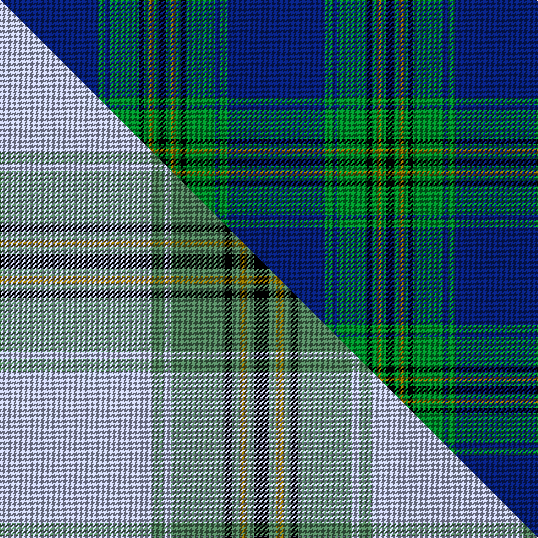

This is one **variant** — a specific cloth: this exact thread count and colourway, with its own
provenance below. It is one weaving of the [sett](/setts/db40g3db2g12k2g2y2g2k3/) (the scale-free proportion — the
same cloth at any scale or shade), whose colour order is pattern [BGBGKGGGK](/stripes/bgbgkgggk/).

Part of the [Oliver Hunting](/tartans/o/ol/oliver-hunting/) tartan — the named design grouping this sett with its other cloths.

Sourced from house-of-tartan.  It is a [9 stripe tartan](/stripes/stripes9/).

Original link [http://www.house-of-tartan.scotland.net/house/TartanViewjs.asp?colr=Def&tnam=126](http://www.house-of-tartan.scotland.net/house/TartanViewjs.asp?colr=Def&tnam=126)

## Provenance

Earliest known date: 1973 Designed for the Oliver Society in 1973 and based on a cottage weavers formula named 'Tweedside', dating from around 1820. The Tweedside District sett also appeared in one of the notebooks belonging to Wilson's of Bannockburn.

2 attestations — the source records this cloth was collapsed from (oldest owns this page)

<ul>
<li>1973 — Oliver Hunting Family Tartan (house-of-tartan, <a href="http://www.house-of-tartan.scotland.net/house/TartanViewjs.asp?colr=Def&tnam=126">record</a>) </li>
<li>undated — Oliver, hunting (weddslist, <a href="http://www.weddslist.com/cgi-bin/tartans/pg.pl?source=sts">record</a>) </li>
</ul>

Dataset <small>— provenance for this record, inherited from the source manifest</small>

<dl class="dataset-prov">
<dt>source</dt><dd><a href="/sources/house-of-tartan/">House of Tartan</a></dd>
<dt>data captured from</dt><dd><a href="https://github.com/thetartan/tartan-database/blob/master/data/house-of-tartan/data.csv">https://github.com/thetartan/tartan-database/blob/master/data/house-of-tartan/data.csv</a></dd>
<dt>data date</dt><dd>1973 <small>(this record)</small></dd>
<dt>licence</dt><dd><a href="https://creativecommons.org/licenses/by-nc-nd/4.0/">CC BY-NC-ND 4.0</a></dd>
</dl>

Capture chain <small>— the hands this data passed through, oldest first; each capture carries its own licence</small>

<ol class="capture-chain">
<li><a href="http://www.house-of-tartan.scotland.net/">House of Tartan</a> <small>the weaver/retailer's database — the site is now offline; the URL is kept as the ultimate source's identity</small></li>
<li><a href="https://github.com/thetartan/tartan-database">thetartan/tartan-database</a> <small>2016-2017</small> · <a href="https://creativecommons.org/licenses/by-nc-nd/4.0/">CC BY-NC-ND 4.0</a> <small>Levko Kravets's frozen compilation — the capture we vendored, and where its CC licence text came from</small></li>
<li>this dictionary <small>captured 2026-06-10 · commit 5bf86c7566</small> <small>each re-capture is a git commit to data/sources</small></li>
</ol>

## Thread count
DB/80 G6 DB4 G24 K4 G4 Y4 G4 K/6

One full sett is **186 threads**.

## Palette
<table><thead><tr><th>Colour</th><th>Shade</th><th>OKLCh</th></tr></thead><tbody><tr><td>DB</td><td><code style="background-color:#082077;">#082077</code> <small style="color:#888">#082077</small></td><td><small style="color:#888">oklch(30.0% 0.149 265.1)</small></td></tr><tr><td>G</td><td><code style="background-color:#008B2A;">#008B2A</code> <small style="color:#888">#008B2A</small></td><td><small style="color:#888">oklch(55.4% 0.170 145.9)</small></td></tr><tr><td>K</td><td><code style="background-color:#000000;">#000000</code> <small style="color:#888">#000000</small></td><td><small style="color:#888">oklch(0.0% 0.000 0.0)</small></td></tr><tr><td>Y</td><td><code style="background-color:#8B6E00;">#8B6E00</code> <small style="color:#888">#8B6E00</small></td><td><small style="color:#888">oklch(55.1% 0.113 90.4)</small></td></tr></tbody></table>

# Sample pattern

## Compared to the master

This cloth is one sett of its design; the master sett (the exemplar the design is anchored on) is below for comparison.

Its **ΔTartan distance** from the master is **0.36** — the same measure the nearest-tartans table ranks by (0 is identical; a re-scale of the same cloth is near 0, a recolour or a different proportion further).

<figure class="master-compare" style="margin:0">

this sett
master sett ★

<figcaption style="color:#888;font-size:smaller">One weave of this sett against the <a href="/setts/lb62g5lb3g22k3g3y3g3k6/">master sett ★</a>, split on the diagonal: a shared proportion runs seamlessly across it with only the shades shifting; a different proportion breaks on it.</figcaption>
</figure>

## Nearest tartan variants

The nearest existing variants by ΔTartan distance, with this cloth at the top so the swatches line up against it.

ΔTartan

Threads

Variant

Sett

—

186

<a href="/variants/s9/db40g3db2g12k2g2y2g2k3~x2/">Oliver Hunting Family Tartan</a>

<a href="/ttd/edit/#slug=db2w2db43t5dt4k8dt2w2~x2~db1404245-dt1204274&amp;base=db40g3db2g12k2g2y2g2k3~x2" title="compare in the TTD">2.34</a>

264

<a href="/variants/s8/dbi2w2dbi43t5db4k8db2w2~x2~dbi1404245-db1204274/">Fife Flyers</a>

<a href="/ttd/edit/#slug=g16k2g2k2g2db32r3db32g16k2g2~x2&amp;base=db40g3db2g12k2g2y2g2k3~x2" title="compare in the TTD">2.53</a>

408

<a href="/variants/s11/g16k2g2k2g2db32r3db32g16k2g2~x2/">MacLachlan, Green Dress (Fashion)</a>

<a href="/ttd/edit/#slug=o4b2k4b40k3b3k4b3g13b4~x2&amp;base=db40g3db2g12k2g2y2g2k3~x2" title="compare in the TTD">2.54</a>

304

<a href="/variants/s10/o4b2k4b40k3b3k4b3g13b4~x2/">Galway</a>

<a href="/ttd/edit/#slug=g23db3k8db4g4db56dy8&amp;base=db40g3db2g12k2g2y2g2k3~x2" title="compare in the TTD">2.62</a>

181

<a href="/variants/s7/g23db3k8db4g4db56dy8/">Tern House</a>

<a href="/ttd/edit/#slug=g23db3k8db4g4db56ly8&amp;base=db40g3db2g12k2g2y2g2k3~x2" title="compare in the TTD">2.80</a>

181

<a href="/variants/s7/g23db3k8db4g4db56ly8/">Tern House</a>

<a href="/ttd/edit/#slug=db50k12n2k2w2k2n12db7k7w2~x2&amp;base=db40g3db2g12k2g2y2g2k3~x2" title="compare in the TTD">2.95</a>

288

<a href="/variants/s10/db50k12n2k2w2k2n12db7k7w2~x2/">Skye (Fashion)</a>

<a href="/ttd/edit/#slug=db20dy1db1dy1dg8k1w3~x2&amp;base=db40g3db2g12k2g2y2g2k3~x2" title="compare in the TTD">2.98</a>

94

<a href="/variants/s7/db20dy1db1dy1dg8k1w3~x2/">Chestico</a>

<a href="/ttd/edit/#slug=db44k3db3k3db3k14y4k3w2k2w2~x2&amp;base=db40g3db2g12k2g2y2g2k3~x2" title="compare in the TTD">3.06</a>

240

<a href="/variants/s11/db44k3db3k3db3k14y4k3w2k2w2~x2/">Kang (Personal)</a>

<a href="/ttd/edit/#slug=t36db6t5r3k2r3t5db18~x2&amp;base=db40g3db2g12k2g2y2g2k3~x2" title="compare in the TTD">3.16</a>

204

<a href="/variants/s8/t36db6t5r3k2r3t5db18~x2/">Leonard (Name)</a>

<a href="/ttd/edit/#slug=db50k14g3dr2g3dr2g3dr2g3k2lo2~x2&amp;base=db40g3db2g12k2g2y2g2k3~x2" title="compare in the TTD">3.19</a>

240

<a href="/variants/s11/db50k14g3dr2g3dr2g3dr2g3k2lo2~x2/">Minnock (Name)</a>

## Neighbour map

Every grey dot is one of 13621 variants placed by the first two principal components of the ΔTartan feature space (42% of its variance). Red is this tartan; blue dots are its nearest — click one to open its page.

<svg viewBox="0 0 640 380" role="img" style="max-width:100%;height:auto;border:1px solid #e0e0e0;border-radius:4px;display:block" xmlns="http://www.w3.org/2000/svg"><image href="/nn/cloud.v1.png" width="640" height="380"/><a href="/variants/s8/dbi2w2dbi43t5db4k8db2w2~x2~dbi1404245-db1204274/"><circle cx="380.0" cy="107.3" r="4" fill="#3465a4"><title>Fife Flyers</title></circle></a><a href="/variants/s11/g16k2g2k2g2db32r3db32g16k2g2~x2/"><circle cx="321.1" cy="139.4" r="4" fill="#3465a4"><title>MacLachlan, Green Dress (Fashion)</title></circle></a><a href="/variants/s10/o4b2k4b40k3b3k4b3g13b4~x2/"><circle cx="363.0" cy="117.8" r="4" fill="#3465a4"><title>Galway</title></circle></a><a href="/variants/s7/g23db3k8db4g4db56dy8/"><circle cx="352.2" cy="155.0" r="4" fill="#3465a4"><title>Tern House</title></circle></a><a href="/variants/s7/g23db3k8db4g4db56ly8/"><circle cx="324.7" cy="146.5" r="4" fill="#3465a4"><title>Tern House</title></circle></a><a href="/variants/s10/db50k12n2k2w2k2n12db7k7w2~x2/"><circle cx="335.5" cy="106.0" r="4" fill="#3465a4"><title>Skye (Fashion)</title></circle></a><a href="/variants/s7/db20dy1db1dy1dg8k1w3~x2/"><circle cx="330.3" cy="124.1" r="4" fill="#3465a4"><title>Chestico</title></circle></a><a href="/variants/s11/db44k3db3k3db3k14y4k3w2k2w2~x2/"><circle cx="344.1" cy="93.3" r="4" fill="#3465a4"><title>Kang (Personal)</title></circle></a><a href="/variants/s8/t36db6t5r3k2r3t5db18~x2/"><circle cx="357.4" cy="155.4" r="4" fill="#3465a4"><title>Leonard (Name)</title></circle></a><a href="/variants/s11/db50k14g3dr2g3dr2g3dr2g3k2lo2~x2/"><circle cx="327.0" cy="76.5" r="4" fill="#3465a4"><title>Minnock (Name)</title></circle></a><circle cx="372.3" cy="117.2" r="5" fill="#c00000"/><text x="320" y="376" text-anchor="middle" font-size="11" fill="#999">ground</text><text x="11" y="190" text-anchor="middle" font-size="11" fill="#999" transform="rotate(-90 11 190)">complexity</text></svg>

ID: /variants/s9/db40g3db2g12k2g2y2g2k3~x2/
