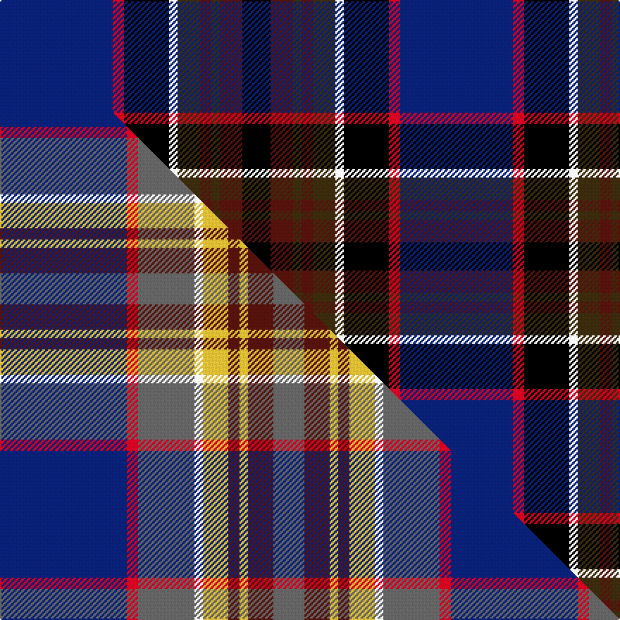

This is one **variant** — a specific cloth: this exact thread count and colourway, with its own
provenance below. It is one weaving of the [sett](/tartans/u/un/united-arrows-house-check/) (the scale-free proportion — the
same cloth at any scale or shade), whose colour order is pattern [BRKWGBGBK](/stripes/brkwgbgbk/).

Part of the [United Arrows House Check](/tartans/u/un/united-arrows-house-check/) tartan — the named design grouping this sett with its other cloths.

Sourced from tartans-authority.  It is a [9 stripe tartan](/stripes/stripes9/).

Original link <code>http://www.tartansauthority.com/tartan-ferret/display/11037/</code> — retired · [Internet Archive copy](https://web.archive.org/web/*/http://www.tartansauthority.com/tartan-ferret/display/11037/*)

Dataset <small>— provenance for this record, inherited from the source manifest</small>

<dl class="dataset-prov">
<dt>source</dt><dd><a href="/sources/tartans-authority/">Scottish Tartans Authority</a></dd>
<dt>data captured from</dt><dd><a href="https://github.com/thetartan/tartan-database/blob/master/data/tartans-authority/data.csv">https://github.com/thetartan/tartan-database/blob/master/data/tartans-authority/data.csv</a></dd>
<dt>data date</dt><dd>2014 <small>(this record)</small></dd>
<dt>licence</dt><dd><a href="https://creativecommons.org/licenses/by-nc-nd/4.0/">CC BY-NC-ND 4.0</a></dd>
</dl>

Capture chain <small>— the hands this data passed through, oldest first; each capture carries its own licence</small>

<ol class="capture-chain">
<li><a href="https://www.tartansauthority.com/">Scottish Tartans Authority</a> <small>the heritage body’s archive — its tartan-ferret record browser is retired; dead record links are shown unlinked, with an Internet Archive copy (ITI numbers are not SRT references)</small></li>
<li><a href="https://github.com/thetartan/tartan-database">thetartan/tartan-database</a> <small>2016-2017</small> · <a href="https://creativecommons.org/licenses/by-nc-nd/4.0/">CC BY-NC-ND 4.0</a> <small>Levko Kravets's frozen compilation — the capture we vendored, and where its CC licence text came from</small></li>
<li>this dictionary <small>captured 2026-06-10 · commit 5bf86c7566</small> <small>each re-capture is a git commit to data/sources</small></li>
</ol>

## Register references

External register numbers recorded for this tartan.

- Scottish Register of Tartans: [11037](https://www.tartanregister.gov.uk/tartanDetails?ref=11037)
- Scottish Tartans Authority (ITI): 11037

## Thread count
DB/80 R8 K32 W6 DY16 DR8 DY6 DR16 K/20

One full sett is **284 threads**.

## Palette
<table><thead><tr><th>Colour</th><th>Shade</th><th>OKLCh</th></tr></thead><tbody><tr><td>DB</td><td><code style="background-color:#082077;">#082077</code> <small style="color:#888">#082077</small></td><td><small style="color:#888">oklch(30.0% 0.149 265.1)</small></td></tr><tr><td>DR</td><td><code style="background-color:#55120C;">#55120C</code> <small style="color:#888">#55120C</small></td><td><small style="color:#888">oklch(30.0% 0.099 29.3)</small></td></tr><tr><td>K</td><td><code style="background-color:#000000;">#000000</code> <small style="color:#888">#000000</small></td><td><small style="color:#888">oklch(0.0% 0.000 0.0)</small></td></tr><tr><td>R</td><td><code style="background-color:#D60020;">#D60020</code> <small style="color:#888">#D60020</small></td><td><small style="color:#888">oklch(55.2% 0.224 25.5)</small></td></tr><tr><td>DY</td><td><code style="background-color:#3A2B0D;">#3A2B0D</code> <small style="color:#888">#3A2B0D</small></td><td><small style="color:#888">oklch(30.0% 0.049 82.0)</small></td></tr><tr><td>W</td><td><code style="background-color:#F7F7F7;">#F7F7F7</code> <small style="color:#888">#F7F7F7</small></td><td><small style="color:#888">oklch(97.6% 0.000 89.9)</small></td></tr></tbody></table>

# Sample pattern

## Compared to the master

This cloth is one sett of its design; the master sett (the exemplar the design is anchored on) is below for comparison.

Its **ΔTartan distance** from the master is **0.36** — the same measure the nearest-tartans table ranks by (0 is identical; a re-scale of the same cloth is near 0, a recolour or a different proportion further).

<figure class="master-compare" style="margin:0">

this sett
master sett ★

<figcaption style="color:#888;font-size:smaller">One weave of this sett against the <a href="/setts/db45r4n20w3ly9dr4ly3dr9n11/">master sett ★</a>, split on the diagonal: a shared proportion runs seamlessly across it with only the shades shifting; a different proportion breaks on it.</figcaption>
</figure>

## Nearest tartan variants

The nearest existing variants by ΔTartan distance, with this cloth at the top so the swatches line up against it.

ΔTartan

Threads

Variant

Sett

—

284

<a href="/variants/s9/db40r4k16w3dy8dr4dy3dr8k10~x2/">United Arrows House Check</a>

<a href="/ttd/edit/#slug=w8db50k4r8k6r12g17dp7k4&amp;base=db40r4k16w3dy8dr4dy3dr8k10~x2" title="compare in the TTD">1.88</a>

220

<a href="/variants/s9/w8db50k4r8k6r12g17dp7k4/">Edinburgh</a>

<a href="/ttd/edit/#slug=k3dp16g5dp3b2dp2k12db23w2~x2&amp;base=db40r4k16w3dy8dr4dy3dr8k10~x2" title="compare in the TTD">2.03</a>

262

<a href="/variants/s9/k3dp16g5dp3b2dp2k12db23w2~x2/">Creiff Highland Gathering</a>

<a href="/ttd/edit/#slug=dr1db15k2ly1k1t1k5dr4k1dr2w1~x4&amp;base=db40r4k16w3dy8dr4dy3dr8k10~x2" title="compare in the TTD">2.05</a>

264

<a href="/variants/s11/dr1db15k2ly1k1t1k5dr4k1dr2w1~x4/">Glen Stewart</a>

<a href="/ttd/edit/#slug=k3g1dr1db6n2db1n1db1dr10w1~x4&amp;base=db40r4k16w3dy8dr4dy3dr8k10~x2" title="compare in the TTD">2.10</a>

200

<a href="/variants/s10/k3g1dr1db6n2db1n1db1dr10w1~x4/">Crieff Primary School</a>

<a href="/ttd/edit/#slug=w1db12k9dg1k1dg5lb1dg3lo1~x4&amp;base=db40r4k16w3dy8dr4dy3dr8k10~x2" title="compare in the TTD">2.11</a>

264

<a href="/variants/s9/w1db12k9dg1k1dg5lb1dg3lo1~x4/">St. Andrews Golf Club (Corporate)</a>

<a href="/ttd/edit/#slug=dy9k8dy30k4lb8k4db24k54dr14k4lr8~lb7609282-lr70&amp;base=db40r4k16w3dy8dr4dy3dr8k10~x2" title="compare in the TTD">2.12</a>

317

<a href="/variants/s11/dy9k8dy30k4lb8k4db24k54dr14k4lr8~lb7609282-lr70/">Dublin County, Crest Range</a>

<a href="/ttd/edit/#slug=y2k2dbi14db4k5r2y5r1~x4~dbi2920264-db2911276&amp;base=db40r4k16w3dy8dr4dy3dr8k10~x2" title="compare in the TTD">2.24</a>

268

<a href="/variants/s8/y2k2dbi14db4k5r2y5r1~x4~dbi2920264-db2911276/">Lovell (2014)</a>

<a href="/ttd/edit/#slug=y2k2dbi14db4k5r2y5r1~x4~dbi3514276-db2911276&amp;base=db40r4k16w3dy8dr4dy3dr8k10~x2" title="compare in the TTD">2.25</a>

268

<a href="/variants/s8/y2k2dbi14db4k5r2y5r1~x4~dbi3514276-db2911276/">Lovell (2014)</a>

<a href="/ttd/edit/#slug=k3dp16dg5dp3o2dp2k12db23w2~x2&amp;base=db40r4k16w3dy8dr4dy3dr8k10~x2" title="compare in the TTD">2.25</a>

262

<a href="/variants/s9/k3dp16dg5dp3o2dp2k12db23w2~x2/">Crieff Highland Gathering Corporate Tartan</a>

<a href="/ttd/edit/#slug=k3ly1dbi1db6r2db1r1db1dbi10lb1~x4~dbi3912267-db2508270&amp;base=db40r4k16w3dy8dr4dy3dr8k10~x2" title="compare in the TTD">2.39</a>

200

<a href="/variants/s10/k3ly1dbi1db6r2db1r1db1dbi10lb1~x4~dbi3912267-db2508270/">Ertico</a>

## Neighbour map

Every grey dot is one of 13662 variants placed by the first two principal components of the ΔTartan feature space (42% of its variance). Red is this tartan; blue dots are its nearest — click one to open its page. The map is a flat projection of a many-dimensional space — [how to read it](/posts/neighbourhood-maps/).

<svg viewBox="0 0 640 380" role="img" style="max-width:100%;height:auto;border:1px solid #e0e0e0;border-radius:4px;display:block" xmlns="http://www.w3.org/2000/svg"><image href="/nn/cloud.v1.png" width="640" height="380"/><a href="/variants/s9/w8db50k4r8k6r12g17dp7k4/"><circle cx="141.0" cy="119.9" r="4" fill="#3465a4"><title>Edinburgh</title></circle></a><a href="/variants/s9/k3dp16g5dp3b2dp2k12db23w2~x2/"><circle cx="146.8" cy="148.3" r="4" fill="#3465a4"><title>Creiff Highland Gathering</title></circle></a><a href="/variants/s11/dr1db15k2ly1k1t1k5dr4k1dr2w1~x4/"><circle cx="199.7" cy="102.1" r="4" fill="#3465a4"><title>Glen Stewart</title></circle></a><a href="/variants/s10/k3g1dr1db6n2db1n1db1dr10w1~x4/"><circle cx="177.8" cy="140.0" r="4" fill="#3465a4"><title>Crieff Primary School</title></circle></a><a href="/variants/s9/w1db12k9dg1k1dg5lb1dg3lo1~x4/"><circle cx="139.0" cy="135.5" r="4" fill="#3465a4"><title>St. Andrews Golf Club (Corporate)</title></circle></a><a href="/variants/s11/dy9k8dy30k4lb8k4db24k54dr14k4lr8~lb7609282-lr70/"><circle cx="169.6" cy="124.2" r="4" fill="#3465a4"><title>Dublin County, Crest Range</title></circle></a><a href="/variants/s8/y2k2dbi14db4k5r2y5r1~x4~dbi2920264-db2911276/"><circle cx="163.7" cy="153.7" r="4" fill="#3465a4"><title>Lovell (2014)</title></circle></a><a href="/variants/s8/y2k2dbi14db4k5r2y5r1~x4~dbi3514276-db2911276/"><circle cx="174.4" cy="155.7" r="4" fill="#3465a4"><title>Lovell (2014)</title></circle></a><a href="/variants/s9/k3dp16dg5dp3o2dp2k12db23w2~x2/"><circle cx="162.7" cy="152.8" r="4" fill="#3465a4"><title>Crieff Highland Gathering Corporate Tartan</title></circle></a><a href="/variants/s10/k3ly1dbi1db6r2db1r1db1dbi10lb1~x4~dbi3912267-db2508270/"><circle cx="178.6" cy="143.8" r="4" fill="#3465a4"><title>Ertico</title></circle></a><circle cx="175.8" cy="129.6" r="5" fill="#c00000"/><text x="320" y="376" text-anchor="middle" font-size="11" fill="#999">ground</text><text x="11" y="190" text-anchor="middle" font-size="11" fill="#999" transform="rotate(-90 11 190)">complexity</text></svg>

ID: /variants/s9/db40r4k16w3dy8dr4dy3dr8k10~x2/
