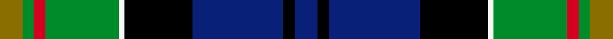

This page is one **sett** — a single exact thread-count. It belongs to the [tartan](/setts/db4k2db16k12w1g13r2g2y4/)
(the same proportion at any scale), whose colour order is pattern [BKBKWGRGG](/stripes/bkbkwgrgg/).

Sourced from register-of-tartans.  It is a [9 stripe tartan](/stripes/stripes9/).

Original link [https://www.tartanregister.gov.uk/tartanDetails.aspx?ref=857](https://www.tartanregister.gov.uk/tartanDetails.aspx?ref=857)

## Provenance

Earliest known date: 2002 Designed by Peter MacDonald for Jeremy Cusack, Guernsey, Channel Isles. Copyright Peter MacDonald but can be worn by all Cusacks.

3 attestations — the source records this cloth was collapsed from (oldest owns this page)

<ul>
<li>01/01/1999 — Cusack (register-of-tartans, <a href="https://www.tartanregister.gov.uk/tartanDetails.aspx?ref=857">record</a>)  <em>Designed by Peter MacDonald for Jeremy Cusack, Guernsey, Channel Isles. Copyright Peter MacDonald but can be worn by all Cusacks. Orders throught Peter MacDonald.</em></li>
<li>pre 2002 — Cusack (Name) (tartans-authority, <a href="https://www.tartanregister.gov.uk/tartanDetails.aspx?ref=4649">record</a>)  <em>Designed by Peter MacDonald for Jeremy Cusack, Guernsey, Channel Isles. Copyright Peter MacDonald but can be worn by all Cusacks. Orders through Peter MacDonald</em></li>
<li>undated — Cusack Clan/Family Tartan (house-of-tartan, <a href="http://www.house-of-tartan.scotland.net/house/TartanViewjs.asp?colr=Def&tnam=4649">record</a>) </li>
</ul>

Dataset <small>— provenance for this record, inherited from the source manifest</small>

<dl class="dataset-prov">
<dt>source</dt><dd><a href="/sources/register-of-tartans/">Scottish Register of Tartans</a></dd>
<dt>data captured from</dt><dd><a href="https://github.com/thetartan/tartan-database/blob/master/data/register-of-tartans/data.csv">https://github.com/thetartan/tartan-database/blob/master/data/register-of-tartans/data.csv</a></dd>
<dt>data date</dt><dd>1999 <small>(this record)</small></dd>
<dt>licence</dt><dd><a href="https://www.tartanregister.gov.uk/copyright">Crown copyright</a></dd>
</dl>

Capture chain <small>— the hands this data passed through, oldest first; each capture carries its own licence</small>

<ol class="capture-chain">
<li><a href="https://www.tartanregister.gov.uk/">Scottish Register of Tartans</a> · <a href="https://www.tartanregister.gov.uk/copyright">Crown copyright</a> <small>the living register — still published by National Records of Scotland</small></li>
<li><a href="https://github.com/thetartan/tartan-database">thetartan/tartan-database</a> <small>2016-2017</small> · <a href="https://creativecommons.org/licenses/by-nc-nd/4.0/">CC BY-NC-ND 4.0</a> <small>Levko Kravets's frozen compilation — the capture we vendored, and where its CC licence text came from</small></li>
<li>this dictionary <small>captured 2026-06-10 · commit 5bf86c7566</small> <small>each re-capture is a git commit to data/sources</small></li>
</ol>

## Register references

External register numbers recorded for this tartan.

- Scottish Register of Tartans: [857](https://www.tartanregister.gov.uk/tartanDetails.aspx?ref=857)
- Scottish Tartans Authority (ITI): 4649
- Scottish Tartans World Register: 2775

## Thread count
Y/8 G4 R4 G26 W2 K24 DB32 K4 DB/8

One full sett is **208 threads**.

## Palette
<table><thead><tr><th>Colour</th><th>Shade</th><th>OKLCh</th></tr></thead><tbody><tr><td>DB</td><td><code style="background-color:#082077;">#082077</code> <small style="color:#888">#082077</small></td><td><small style="color:#888">oklch(30.0% 0.149 265.1)</small></td></tr><tr><td>R</td><td><code style="background-color:#D60020;">#D60020</code> <small style="color:#888">#D60020</small></td><td><small style="color:#888">oklch(55.2% 0.224 25.5)</small></td></tr><tr><td>Y</td><td><code style="background-color:#8B6E00;">#8B6E00</code> <small style="color:#888">#8B6E00</small></td><td><small style="color:#888">oklch(55.1% 0.113 90.4)</small></td></tr><tr><td>G</td><td><code style="background-color:#008B2A;">#008B2A</code> <small style="color:#888">#008B2A</small></td><td><small style="color:#888">oklch(55.4% 0.170 145.9)</small></td></tr><tr><td>K</td><td><code style="background-color:#000000;">#000000</code> <small style="color:#888">#000000</small></td><td><small style="color:#888">oklch(0.0% 0.000 0.0)</small></td></tr><tr><td>W</td><td><code style="background-color:#F7F7F7;">#F7F7F7</code> <small style="color:#888">#F7F7F7</small></td><td><small style="color:#888">oklch(97.6% 0.000 89.9)</small></td></tr></tbody></table>

# Sample pattern

## Nearest tartan variants

The nearest existing variants by ΔTartan distance, with this cloth at the top so the swatches line up against it.

ΔTartan

Threads

Variant

Sett

—

208

<a href="/variants/s9/db4k2db16k12w1g13r2g2y4~x2/">Cusack</a>

<a href="/ttd/edit/#slug=y1k3g15k14db16r2w1~x2&amp;base=db4k2db16k12w1g13r2g2y4~x2" title="compare in the TTD">1.44</a>

204

<a href="/variants/s7/y1k3g15k14db16r2w1~x2/">Macneil of Barra - Chief (Personal)</a>

<a href="/ttd/edit/#slug=r7g20y2g4k5db4k2db20k3w1~x2&amp;base=db4k2db16k12w1g13r2g2y4~x2" title="compare in the TTD">1.45</a>

256

<a href="/variants/s10/r7g20y2g4k5db4k2db20k3w1~x2/">McMeeken</a>

<a href="/ttd/edit/#slug=r7g20ly2g4k5db4k2db20k3w1~x2&amp;base=db4k2db16k12w1g13r2g2y4~x2" title="compare in the TTD">1.45</a>

256

<a href="/variants/s10/r7g20ly2g4k5db4k2db20k3w1~x2/">McMeeken (Name)</a>

<a href="/ttd/edit/#slug=r3g2db27k19g27dp2y3~x2&amp;base=db4k2db16k12w1g13r2g2y4~x2" title="compare in the TTD">1.46</a>

320

<a href="/variants/s7/r3g2db27k19g27dp2y3~x2/">Christian Hunting (Personal)</a>

<a href="/ttd/edit/#slug=y2k6g33k33db33r3w2~x2&amp;base=db4k2db16k12w1g13r2g2y4~x2" title="compare in the TTD">1.53</a>

440

<a href="/variants/s7/y2k6g33k33db33r3w2~x2/">MacNeil - 1840 (Chief's sett)</a>

<a href="/ttd/edit/#slug=r2k8y1k8g13db13lo1r2~x2&amp;base=db4k2db16k12w1g13r2g2y4~x2" title="compare in the TTD">1.61</a>

184

<a href="/variants/s8/r2k8y1k8g13db13lo1r2~x2/">Sey (Name)</a>

<a href="/ttd/edit/#slug=k2w2k8y8db24g13k3dr1~x2&amp;base=db4k2db16k12w1g13r2g2y4~x2" title="compare in the TTD">1.68</a>

238

<a href="/variants/s8/k2w2k8y8db24g13k3dr1~x2/">Froben, Christian (Personal)</a>

<a href="/ttd/edit/#slug=r3db3k2db18ly2k25g20r2g3lb3~x2&amp;base=db4k2db16k12w1g13r2g2y4~x2" title="compare in the TTD">1.71</a>

312

<a href="/variants/s10/r3db3k2db18ly2k25g20r2g3lb3~x2/">Loch Freuchie (District)</a>

<a href="/ttd/edit/#slug=w4k1g19y1k19db13r2db4r2~x2&amp;base=db4k2db16k12w1g13r2g2y4~x2" title="compare in the TTD">1.80</a>

248

<a href="/variants/s9/w4k1g19y1k19db13r2db4r2~x2/">Whitson</a>

<a href="/ttd/edit/#slug=r3db3k2db13y2k25g20r2g3lb3~x2&amp;base=db4k2db16k12w1g13r2g2y4~x2" title="compare in the TTD">1.81</a>

292

<a href="/variants/s10/r3db3k2db13y2k25g20r2g3lb3~x2/">Loch Freuchie</a>

## Neighbour map

Every grey dot is one of 13621 variants placed by the first two principal components of the ΔTartan feature space (42% of its variance). Red is this tartan; blue dots are its nearest — click one to open its page.

<svg viewBox="0 0 640 380" role="img" style="max-width:100%;height:auto;border:1px solid #e0e0e0;border-radius:4px;display:block" xmlns="http://www.w3.org/2000/svg"><image href="/nn/cloud.v1.png" width="640" height="380"/><a href="/variants/s7/y1k3g15k14db16r2w1~x2/"><circle cx="121.6" cy="142.2" r="4" fill="#3465a4"><title>Macneil of Barra - Chief (Personal)</title></circle></a><a href="/variants/s10/r7g20y2g4k5db4k2db20k3w1~x2/"><circle cx="141.6" cy="114.8" r="4" fill="#3465a4"><title>McMeeken</title></circle></a><a href="/variants/s10/r7g20ly2g4k5db4k2db20k3w1~x2/"><circle cx="139.0" cy="114.4" r="4" fill="#3465a4"><title>McMeeken (Name)</title></circle></a><a href="/variants/s7/r3g2db27k19g27dp2y3~x2/"><circle cx="134.7" cy="149.2" r="4" fill="#3465a4"><title>Christian Hunting (Personal)</title></circle></a><a href="/variants/s7/y2k6g33k33db33r3w2~x2/"><circle cx="133.9" cy="138.0" r="4" fill="#3465a4"><title>MacNeil - 1840 (Chief's sett)</title></circle></a><a href="/variants/s8/r2k8y1k8g13db13lo1r2~x2/"><circle cx="99.1" cy="148.1" r="4" fill="#3465a4"><title>Sey (Name)</title></circle></a><a href="/variants/s8/k2w2k8y8db24g13k3dr1~x2/"><circle cx="154.4" cy="118.4" r="4" fill="#3465a4"><title>Froben, Christian (Personal)</title></circle></a><a href="/variants/s10/r3db3k2db18ly2k25g20r2g3lb3~x2/"><circle cx="106.5" cy="122.8" r="4" fill="#3465a4"><title>Loch Freuchie (District)</title></circle></a><a href="/variants/s9/w4k1g19y1k19db13r2db4r2~x2/"><circle cx="103.3" cy="116.2" r="4" fill="#3465a4"><title>Whitson</title></circle></a><a href="/variants/s10/r3db3k2db13y2k25g20r2g3lb3~x2/"><circle cx="115.2" cy="121.6" r="4" fill="#3465a4"><title>Loch Freuchie</title></circle></a><circle cx="124.9" cy="136.9" r="5" fill="#c00000"/><text x="320" y="376" text-anchor="middle" font-size="11" fill="#999">ground</text><text x="11" y="190" text-anchor="middle" font-size="11" fill="#999" transform="rotate(-90 11 190)">complexity</text></svg>

ID: /variants/s9/db4k2db16k12w1g13r2g2y4~x2/
