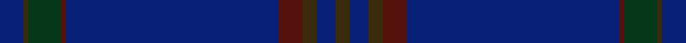

This is one **variant** — a specific cloth: this exact thread count and colourway, with its own
provenance below. It is one weaving of the [sett](/tartans/b/br/brooks-brothers-signature/) (the scale-free proportion — the
same cloth at any scale or shade), whose colour order is pattern [BGGBBBGBG](/stripes/bggbbbgbg/).

Part of the [Brooks Brothers Signature](/tartans/b/br/brooks-brothers-signature/) tartan — the named design grouping this sett with its other cloths.

Sourced from register-of-tartans.  It is a [9 stripe tartan](/stripes/stripes9/).

Original link [https://www.tartanregister.gov.uk/tartanDetails.aspx?ref=10652](https://www.tartanregister.gov.uk/tartanDetails.aspx?ref=10652)

Dataset <small>— provenance for this record, inherited from the source manifest</small>

<dl class="dataset-prov">
<dt>source</dt><dd><a href="/sources/register-of-tartans/">Scottish Register of Tartans</a></dd>
<dt>data captured from</dt><dd><a href="https://github.com/thetartan/tartan-database/blob/master/data/register-of-tartans/data.csv">https://github.com/thetartan/tartan-database/blob/master/data/register-of-tartans/data.csv</a></dd>
<dt>data date</dt><dd>01/05/2012 <small>(this record)</small></dd>
<dt>licence</dt><dd><a href="https://www.tartanregister.gov.uk/copyright">Crown copyright</a></dd>
</dl>

Capture chain <small>— the hands this data passed through, oldest first; each capture carries its own licence</small>

<ol class="capture-chain">
<li><a href="https://www.tartanregister.gov.uk/">Scottish Register of Tartans</a> · <a href="https://www.tartanregister.gov.uk/copyright">Crown copyright</a> <small>the living register — still published by National Records of Scotland</small></li>
<li><a href="https://github.com/thetartan/tartan-database">thetartan/tartan-database</a> <small>2016-2017</small> · <a href="https://creativecommons.org/licenses/by-nc-nd/4.0/">CC BY-NC-ND 4.0</a> <small>Levko Kravets's frozen compilation — the capture we vendored, and where its CC licence text came from</small></li>
<li>this dictionary <small>captured 2026-06-10 · commit 5bf86c7566</small> <small>each re-capture is a git commit to data/sources</small></li>
</ol>

## Register references

External register numbers recorded for this tartan.

- Scottish Register of Tartans: [10652](https://www.tartanregister.gov.uk/tartanDetails.aspx?ref=10652)

## Thread count
DB/10 DY2 DG14 DR2 DB90 DR10 DY6 DB8 DY/6

One full sett is **280 threads**.

## Palette
<table><thead><tr><th>Colour</th><th>Shade</th><th>OKLCh</th></tr></thead><tbody><tr><td>DB</td><td><code style="background-color:#082077;">#082077</code> <small style="color:#888">#082077</small></td><td><small style="color:#888">oklch(30.0% 0.149 265.1)</small></td></tr><tr><td>DR</td><td><code style="background-color:#55120C;">#55120C</code> <small style="color:#888">#55120C</small></td><td><small style="color:#888">oklch(30.0% 0.099 29.3)</small></td></tr><tr><td>DG</td><td><code style="background-color:#053819;">#053819</code> <small style="color:#888">#053819</small></td><td><small style="color:#888">oklch(30.0% 0.075 151.3)</small></td></tr><tr><td>DY</td><td><code style="background-color:#3A2B0D;">#3A2B0D</code> <small style="color:#888">#3A2B0D</small></td><td><small style="color:#888">oklch(30.0% 0.049 82.0)</small></td></tr></tbody></table>

# Sample pattern

## Nearest tartan variants

The nearest existing variants by ΔTartan distance, with this cloth at the top so the swatches line up against it.

ΔTartan

Threads

Variant

Sett

—

280

<a href="/variants/s9/db5dy1dg7dr1db45dr5dy3db4dy3~x2/">Brooks Brothers Signature</a>

<a href="/ttd/edit/#slug=db9dy12db44dy12db9dr3~x2&amp;base=db5dy1dg7dr1db45dr5dy3db4dy3~x2" title="compare in the TTD">1.68</a>

332

<a href="/variants/s6/db9dy12db44dy12db9dr3~x2/">Elliot</a>

<a href="/ttd/edit/#slug=n4db1dr15db42dr6db4dy1~x2&amp;base=db5dy1dg7dr1db45dr5dy3db4dy3~x2" title="compare in the TTD">1.80</a>

282

<a href="/variants/s7/n4db1dr15db42dr6db4dy1~x2/">Lion Brand Sportswear</a>

<a href="/ttd/edit/#slug=dt45db7w3db27r1db7~x2&amp;base=db5dy1dg7dr1db45dr5dy3db4dy3~x2" title="compare in the TTD">1.99</a>

256

<a href="/variants/s6/dt45db7w3db27r1db7~x2/">U.S. Navy/Edzell (Military)</a>

<a href="/ttd/edit/#slug=db65k2db4k2db10dr24~x2&amp;base=db5dy1dg7dr1db45dr5dy3db4dy3~x2" title="compare in the TTD">2.46</a>

250

<a href="/variants/s6/db65k2db4k2db10dr24~x2/">Norsemen, The</a>

<a href="/ttd/edit/#slug=db65k2db4lb2db10dr24~x2&amp;base=db5dy1dg7dr1db45dr5dy3db4dy3~x2" title="compare in the TTD">2.49</a>

250

<a href="/variants/s6/db65k2db4lb2db10dr24~x2/">Norsemen (Corporate)</a>

<a href="/ttd/edit/#slug=dt32ly4db12dt2db4dt2n16dt67ly6~dt1204274-db1406275&amp;base=db5dy1dg7dr1db45dr5dy3db4dy3~x2" title="compare in the TTD">3.33</a>

252

<a href="/variants/s9/db32ly4dbi12db2dbi4db2n16db67ly6~db1204274-dbi1406275/">Calum's Cabin</a>

<a href="/ttd/edit/#slug=g16t6dr6t4w2t80lo3t10y2~w3600000&amp;base=db5dy1dg7dr1db45dr5dy3db4dy3~x2" title="compare in the TTD">3.37</a>

240

<a href="/variants/s9/g16t6dr6t4w2t80lo3t10y2~w3600000/">Heart of Strathearn</a>

<a href="/ttd/edit/#slug=g16t6dr6t4w2t80lo3t10y2&amp;base=db5dy1dg7dr1db45dr5dy3db4dy3~x2" title="compare in the TTD">3.40</a>

240

<a href="/variants/s9/g16t6dr6t4w2t80lo3t10y2/">Heart of Strathearn (Corporate)</a>

<a href="/ttd/edit/#slug=t79n2t10n5w2n5t10w2dg8g6w2~x2~g2004173&amp;base=db5dy1dg7dr1db45dr5dy3db4dy3~x2" title="compare in the TTD">3.90</a>

362

<a href="/variants/s11/t79n2t10n5w2n5t10w2dg8g6w2~x2~g2004173/">Dallas (Lochcarron) (Personal)</a>

<a href="/ttd/edit/#slug=db32w1db1y2db1r1db4dg16~x4&amp;base=db5dy1dg7dr1db45dr5dy3db4dy3~x2" title="compare in the TTD">3.95</a>

272

<a href="/variants/s8/db32w1db1y2db1r1db4dg16~x4/">Royal Agricultural Winter Fair</a>

## Neighbour map

Every grey dot is one of 13656 variants placed by the first two principal components of the ΔTartan feature space (42% of its variance). Red is this tartan; blue dots are its nearest — click one to open its page. The map is a flat projection of a many-dimensional space — [how to read it](/posts/neighbourhood-maps/).

<svg viewBox="0 0 640 380" role="img" style="max-width:100%;height:auto;border:1px solid #e0e0e0;border-radius:4px;display:block" xmlns="http://www.w3.org/2000/svg"><image href="/nn/cloud.v1.png" width="640" height="380"/><a href="/variants/s6/db9dy12db44dy12db9dr3~x2/"><circle cx="626.0" cy="278.0" r="4" fill="#3465a4"><title>Elliot</title></circle></a><a href="/variants/s7/n4db1dr15db42dr6db4dy1~x2/"><circle cx="582.7" cy="177.9" r="4" fill="#3465a4"><title>Lion Brand Sportswear</title></circle></a><a href="/variants/s6/dt45db7w3db27r1db7~x2/"><circle cx="460.6" cy="181.8" r="4" fill="#3465a4"><title>U.S. Navy/Edzell (Military)</title></circle></a><a href="/variants/s6/db65k2db4k2db10dr24~x2/"><circle cx="588.4" cy="162.9" r="4" fill="#3465a4"><title>Norsemen, The</title></circle></a><a href="/variants/s6/db65k2db4lb2db10dr24~x2/"><circle cx="566.7" cy="156.2" r="4" fill="#3465a4"><title>Norsemen (Corporate)</title></circle></a><a href="/variants/s9/db32ly4dbi12db2dbi4db2n16db67ly6~db1204274-dbi1406275/"><circle cx="551.6" cy="170.3" r="4" fill="#3465a4"><title>Calum's Cabin</title></circle></a><a href="/variants/s9/g16t6dr6t4w2t80lo3t10y2~w3600000/"><circle cx="611.9" cy="127.7" r="4" fill="#3465a4"><title>Heart of Strathearn</title></circle></a><a href="/variants/s9/g16t6dr6t4w2t80lo3t10y2/"><circle cx="605.0" cy="125.3" r="4" fill="#3465a4"><title>Heart of Strathearn (Corporate)</title></circle></a><a href="/variants/s11/t79n2t10n5w2n5t10w2dg8g6w2~x2~g2004173/"><circle cx="610.1" cy="129.2" r="4" fill="#3465a4"><title>Dallas (Lochcarron) (Personal)</title></circle></a><a href="/variants/s8/db32w1db1y2db1r1db4dg16~x4/"><circle cx="487.9" cy="133.5" r="4" fill="#3465a4"><title>Royal Agricultural Winter Fair</title></circle></a><circle cx="626.0" cy="166.8" r="5" fill="#c00000"/><text x="320" y="376" text-anchor="middle" font-size="11" fill="#999">ground</text><text x="11" y="190" text-anchor="middle" font-size="11" fill="#999" transform="rotate(-90 11 190)">complexity</text></svg>

ID: /variants/s9/db5dy1dg7dr1db45dr5dy3db4dy3~x2/
