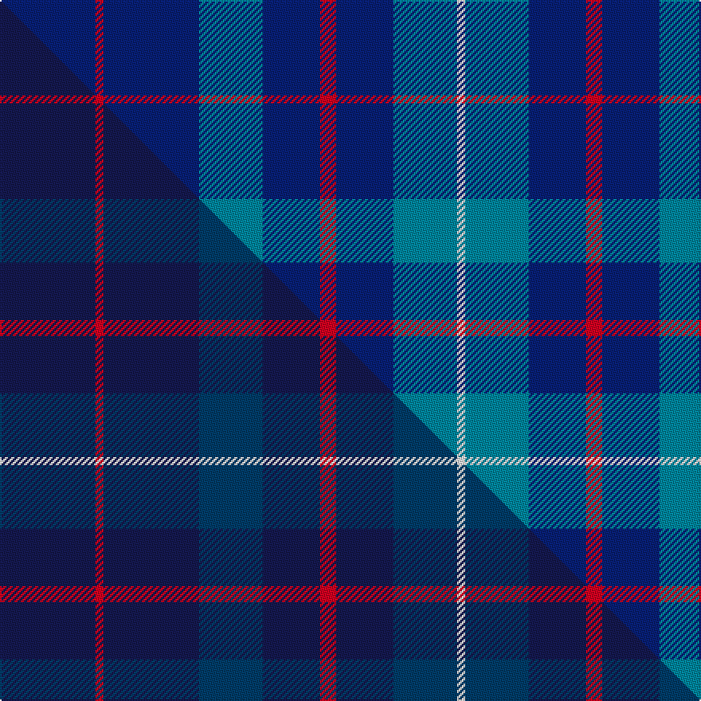

This page is one **sett** — a single exact thread-count. It belongs to the [tartan](/setts/db60r5db60t40db36r10db36t40w5/)
(the same proportion at any scale), whose colour order is pattern [BRBBBRBBW](/stripes/brbbbrbbw/).

Part of the [Brash](/tartans/brash/) tartan — the named design grouping this sett with its other cloths.

Sourced from tartans-authority.  It is a [9 stripe tartan](/stripes/stripes9/).

Original link http://www.tartansauthority.com/tartan-ferret/display/11276/

## Register references

External register numbers recorded for this tartan.

- Scottish Register of Tartans: [11276](https://www.tartanregister.gov.uk/tartanDetails?ref=11276)
- Scottish Tartans Authority (ITI): 11276

## Thread count
DB/60 R5 DB60 T40 DB36 R10 DB36 T40 W/5

One full sett is **519 threads**.

## Palette
<table><thead><tr><th>Colour</th><th>Shade</th><th>OKLCh</th></tr></thead><tbody><tr><td>T</td><td><code style="background-color:#00879F;">#00879F</code> <small style="color:#888">#00879F</small></td><td><small style="color:#888">oklch(57.4% 0.102 216.1)</small></td></tr><tr><td>DB</td><td><code style="background-color:#082077;">#082077</code> <small style="color:#888">#082077</small></td><td><small style="color:#888">oklch(30.0% 0.149 265.1)</small></td></tr><tr><td>R</td><td><code style="background-color:#D60020;">#D60020</code> <small style="color:#888">#D60020</small></td><td><small style="color:#888">oklch(55.2% 0.224 25.5)</small></td></tr><tr><td>W</td><td><code style="background-color:#F7F7F7;">#F7F7F7</code> <small style="color:#888">#F7F7F7</small></td><td><small style="color:#888">oklch(97.6% 0.000 89.9)</small></td></tr></tbody></table>

# Sample pattern

## Compared to the master

This cloth is one sett of its design; the master sett (the exemplar the design is anchored on) is below for comparison.

Its **ΔTartan distance** from the master is **3.00** — the same measure the nearest-tartans table ranks by (0 is identical; a re-scale of the same cloth is near 0, a recolour or a different proportion further).

<figure class="master-compare" style="margin:0">

this sett
master sett ★

<figcaption style="color:#888;font-size:smaller">One weave of this sett against the <a href="/setts/db60r5db60dbi40db36r10db36dbi40w5/">master sett ★</a>, split on the diagonal: a shared proportion runs seamlessly across it with only the shades shifting; a different proportion breaks on it.</figcaption>
</figure>

## Nearest variants

The nearest existing variants by ΔTartan distance, with this cloth at the top so the swatches line up against it.

ΔTartan

Threads

Variant

Sett

—

519

<a href="/variants/s9/db60r5db60t40db36r10db36t40w5/">Brash</a>

<a href="/ttd/edit/#slug=db20t2w5r2db10t5db20t2w5r5~x2&amp;base=db60r5db60t40db36r10db36t40w5" title="compare in the TTD">2.55</a>

254

<a href="/variants/s10/db20t2w5r2db10t5db20t2w5r5~x2/">Mortell (Personal)</a>

<a href="/ttd/edit/#slug=db20lb2w5r2db10lb5db20lb2w5r5~x2&amp;base=db60r5db60t40db36r10db36t40w5" title="compare in the TTD">2.55</a>

254

<a href="/variants/s10/db20lb2w5r2db10lb5db20lb2w5r5~x2/">Mortell (Personal)</a>

<a href="/ttd/edit/#slug=db1r1db10t1db1t5db1w1~x6&amp;base=db60r5db60t40db36r10db36t40w5" title="compare in the TTD">2.64</a>

240

<a href="/variants/s8/db1r1db10t1db1t5db1w1~x6/">A2 (Personal)</a>

<a href="/ttd/edit/#slug=db1r1db10t1db1t5db1w1~x6~db1404245&amp;base=db60r5db60t40db36r10db36t40w5" title="compare in the TTD">2.64</a>

240

<a href="/variants/s8/db1r1db10t1db1t5db1w1~x6~db1404245/">A2 (Personal)</a>

<a href="/ttd/edit/#slug=r4t12db36w4db4t16w3db6t3~x2&amp;base=db60r5db60t40db36r10db36t40w5" title="compare in the TTD">2.70</a>

338

<a href="/variants/s9/r4t12db36w4db4t16w3db6t3~x2/">Callaway (Name)</a>

<a href="/ttd/edit/#slug=w1db8r3db2r1db2r3db8ly1~x4&amp;base=db60r5db60t40db36r10db36t40w5" title="compare in the TTD">2.94</a>

224

<a href="/variants/s9/w1db8r3db2r1db2r3db8ly1~x4/">Louisville Fire &amp; Rescue P&amp;D</a>

<a href="/ttd/edit/#slug=db3lb14db3n16db34r3~x2&amp;base=db60r5db60t40db36r10db36t40w5" title="compare in the TTD">2.96</a>

280

<a href="/variants/s6/db3lb14db3n16db34r3~x2/">Thorburn (Lochcarron)</a>

## Neighbour map

Every grey dot is one of 13620 variants placed by the first two principal components of the ΔTartan feature space (42% of its variance). Red is this tartan; blue dots are its nearest — click one to open its page.

<svg viewBox="0 0 640 380" role="img" style="max-width:100%;height:auto;border:1px solid #e0e0e0;border-radius:4px;display:block" xmlns="http://www.w3.org/2000/svg"><image href="/nn/cloud.v1.png" width="640" height="380"/><a href="/variants/s10/db20t2w5r2db10t5db20t2w5r5~x2/"><circle cx="326.6" cy="183.0" r="4" fill="#3465a4"><title>Mortell (Personal)</title></circle></a><a href="/variants/s10/db20lb2w5r2db10lb5db20lb2w5r5~x2/"><circle cx="320.8" cy="180.5" r="4" fill="#3465a4"><title>Mortell (Personal)</title></circle></a><a href="/variants/s8/db1r1db10t1db1t5db1w1~x6/"><circle cx="368.6" cy="183.7" r="4" fill="#3465a4"><title>A2 (Personal)</title></circle></a><a href="/variants/s8/db1r1db10t1db1t5db1w1~x6~db1404245/"><circle cx="392.1" cy="193.7" r="4" fill="#3465a4"><title>A2 (Personal)</title></circle></a><a href="/variants/s9/r4t12db36w4db4t16w3db6t3~x2/"><circle cx="301.3" cy="180.1" r="4" fill="#3465a4"><title>Callaway (Name)</title></circle></a><a href="/variants/s9/w1db8r3db2r1db2r3db8ly1~x4/"><circle cx="365.7" cy="197.0" r="4" fill="#3465a4"><title>Louisville Fire &amp; Rescue P&amp;D</title></circle></a><a href="/variants/s6/db3lb14db3n16db34r3~x2/"><circle cx="311.0" cy="205.7" r="4" fill="#3465a4"><title>Thorburn (Lochcarron)</title></circle></a><circle cx="382.5" cy="223.4" r="5" fill="#c00000"/><text x="320" y="376" text-anchor="middle" font-size="11" fill="#999">ground</text><text x="11" y="190" text-anchor="middle" font-size="11" fill="#999" transform="rotate(-90 11 190)">complexity</text></svg>

ID: /variants/s9/db60r5db60t40db36r10db36t40w5/
