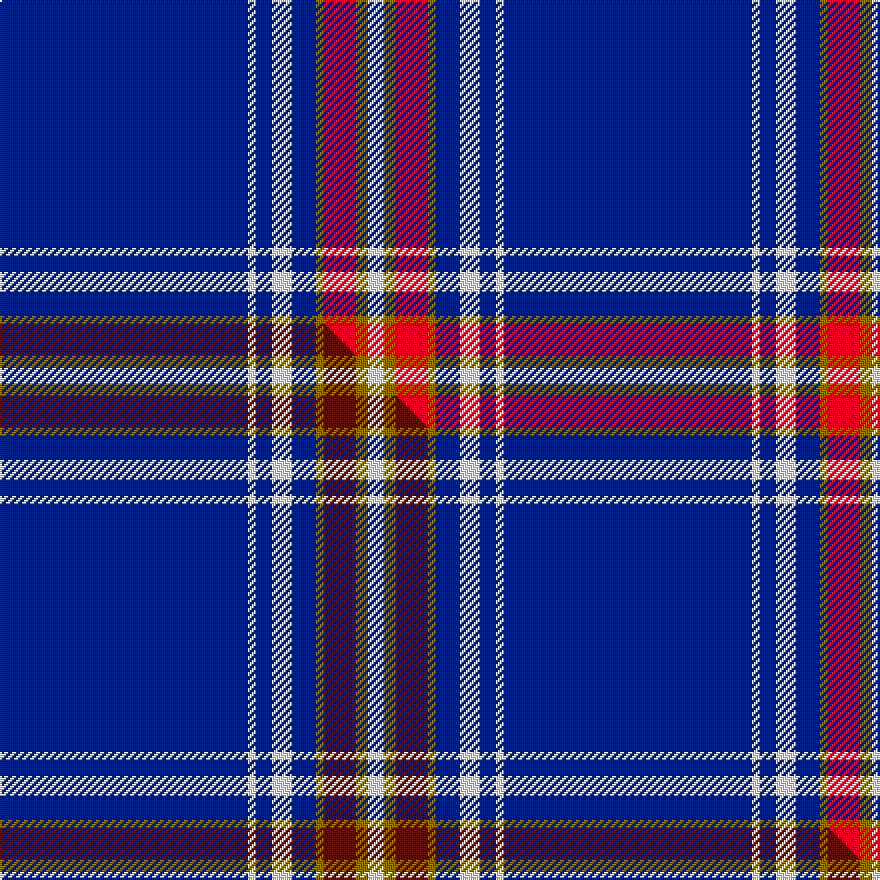

This is one **variant** — a specific cloth: this exact thread count and colourway, with its own
provenance below. It is one weaving of the [sett](/setts/db62w2db4w5db6y2r8y3w4/) (the scale-free proportion — the
same cloth at any scale or shade), whose colour order is pattern [BWBWBGRGW](/stripes/bwbwbgrgw/).

Part of the [George, Stuart](/tartans/george-stuart/) tartan — the named design grouping this sett with its other cloths.

Sourced from tartans-authority.  It is a [9 stripe tartan](/stripes/stripes9/).

Original link [https://www.tartanregister.gov.uk/tartanDetails.aspx?ref=10981](https://www.tartanregister.gov.uk/tartanDetails.aspx?ref=10981)

Dataset <small>— provenance for this record, inherited from the source manifest</small>

<dl class="dataset-prov">
<dt>source</dt><dd><a href="/sources/tartans-authority/">Scottish Tartans Authority</a></dd>
<dt>data captured from</dt><dd><a href="https://github.com/thetartan/tartan-database/blob/master/data/tartans-authority/data.csv">https://github.com/thetartan/tartan-database/blob/master/data/tartans-authority/data.csv</a></dd>
<dt>data date</dt><dd>2014 <small>(this record)</small></dd>
<dt>licence</dt><dd><a href="https://creativecommons.org/licenses/by-nc-nd/4.0/">CC BY-NC-ND 4.0</a></dd>
</dl>

Capture chain <small>— the hands this data passed through, oldest first; each capture carries its own licence</small>

<ol class="capture-chain">
<li><a href="https://www.tartansauthority.com/">Scottish Tartans Authority</a> <small>the heritage body's archive — its tartan-ferret record browser is retired (links repaired to the SRT, above)</small></li>
<li><a href="https://github.com/thetartan/tartan-database">thetartan/tartan-database</a> <small>2016-2017</small> · <a href="https://creativecommons.org/licenses/by-nc-nd/4.0/">CC BY-NC-ND 4.0</a> <small>Levko Kravets's frozen compilation — the capture we vendored, and where its CC licence text came from</small></li>
<li>this dictionary <small>captured 2026-06-10 · commit 5bf86c7566</small> <small>each re-capture is a git commit to data/sources</small></li>
</ol>

## Register references

External register numbers recorded for this tartan.

- Scottish Register of Tartans: [10981](https://www.tartanregister.gov.uk/tartanDetails?ref=10981)
- Scottish Tartans Authority (ITI): 10981

## Thread count
DB/124 W4 DB8 W10 DB12 Y4 R16 Y6 W/8

One full sett is **252 threads**.

## Palette
<table><thead><tr><th>Colour</th><th>Shade</th><th>OKLCh</th></tr></thead><tbody><tr><td>DB</td><td><code style="background-color:#082077;">#082077</code> <small style="color:#888">#082077</small></td><td><small style="color:#888">oklch(30.0% 0.149 265.1)</small></td></tr><tr><td>R</td><td><code style="background-color:#D60020;">#D60020</code> <small style="color:#888">#D60020</small></td><td><small style="color:#888">oklch(55.2% 0.224 25.5)</small></td></tr><tr><td>W</td><td><code style="background-color:#F7F7F7;">#F7F7F7</code> <small style="color:#888">#F7F7F7</small></td><td><small style="color:#888">oklch(97.6% 0.000 89.9)</small></td></tr><tr><td>Y</td><td><code style="background-color:#8B6E00;">#8B6E00</code> <small style="color:#888">#8B6E00</small></td><td><small style="color:#888">oklch(55.1% 0.113 90.4)</small></td></tr></tbody></table>

# Sample pattern

## Compared to the master

This cloth is one sett of its design; the master sett (the exemplar the design is anchored on) is below for comparison.

Its **ΔTartan distance** from the master is **0.05** — the same measure the nearest-tartans table ranks by (0 is identical; a re-scale of the same cloth is near 0, a recolour or a different proportion further).

<figure class="master-compare" style="margin:0">

this sett
master sett ★

<figcaption style="color:#888;font-size:smaller">One weave of this sett against the <a href="/setts/db62w2db4w5db6y2dr8y3w4/">master sett ★</a>, split on the diagonal: a shared proportion runs seamlessly across it with only the shades shifting; a different proportion breaks on it.</figcaption>
</figure>

## Nearest tartan variants

The nearest existing variants by ΔTartan distance, with this cloth at the top so the swatches line up against it.

ΔTartan

Threads

Variant

Sett

—

252

<a href="/variants/s9/db62w2db4w5db6y2r8y3w4~x2/">George, Stuart (Personal)</a>

<a href="/ttd/edit/#slug=db62w2db4w5db6y2dr8y3w4~x2&amp;base=db62w2db4w5db6y2r8y3w4~x2" title="compare in the TTD">0.05</a>

252

<a href="/variants/s9/db62w2db4w5db6y2dr8y3w4~x2/">George, Stuart (Personal)</a>

<a href="/ttd/edit/#slug=db61r6w2r8y2db3y2db15~x2&amp;base=db62w2db4w5db6y2r8y3w4~x2" title="compare in the TTD">1.44</a>

244

<a href="/variants/s8/db61r6w2r8y2db3y2db15~x2/">Duke of York (Royal)</a>

<a href="/ttd/edit/#slug=db122r11w4r15y4db6y4db30&amp;base=db62w2db4w5db6y2r8y3w4~x2" title="compare in the TTD">1.44</a>

240

<a href="/variants/s8/db122r11w4r15y4db6y4db30/">Inverness, Duke of York</a>

<a href="/ttd/edit/#slug=db61w4db2w7b2g3y2db16~x2&amp;base=db62w2db4w5db6y2r8y3w4~x2" title="compare in the TTD">1.50</a>

234

<a href="/variants/s8/db61w4db2w7b2g3y2db16~x2/">Boat of Garten (District)</a>

<a href="/ttd/edit/#slug=db35k10db4w2db3r2y2~x2&amp;base=db62w2db4w5db6y2r8y3w4~x2" title="compare in the TTD">1.51</a>

158

<a href="/variants/s7/db35k10db4w2db3r2y2~x2/">Laidlaw's Highland Drovers (Corp)</a>

<a href="/ttd/edit/#slug=b80k12dg3k3w3b24k3b4w3~x2&amp;base=db62w2db4w5db6y2r8y3w4~x2" title="compare in the TTD">1.55</a>

374

<a href="/variants/s9/b80k12dg3k3w3b24k3b4w3~x2/">Suffolk County Police</a>

<a href="/ttd/edit/#slug=db16lb4db1lb2db24w1y4~x2&amp;base=db62w2db4w5db6y2r8y3w4~x2" title="compare in the TTD">1.66</a>

168

<a href="/variants/s7/db16lb4db1lb2db24w1y4~x2/">Talisker</a>

<a href="/ttd/edit/#slug=w6db2w3db2g2db20r1~x2&amp;base=db62w2db4w5db6y2r8y3w4~x2" title="compare in the TTD">1.69</a>

130

<a href="/variants/s7/w6db2w3db2g2db20r1~x2/">Gonzaga University’s True Blue and White</a>

<a href="/ttd/edit/#slug=db64r8db1w8db4b15w4~x2&amp;base=db62w2db4w5db6y2r8y3w4~x2" title="compare in the TTD">1.70</a>

280

<a href="/variants/s7/db64r8db1w8db4b15w4~x2/">North Carolina</a>

<a href="/ttd/edit/#slug=db60g10db3lb6y2db9r2w2~x2&amp;base=db62w2db4w5db6y2r8y3w4~x2" title="compare in the TTD">1.72</a>

252

<a href="/variants/s8/db60g10db3lb6y2db9r2w2~x2/">St. Petersburg City (District)</a>

## Neighbour map

Every grey dot is one of 13621 variants placed by the first two principal components of the ΔTartan feature space (42% of its variance). Red is this tartan; blue dots are its nearest — click one to open its page.

<svg viewBox="0 0 640 380" role="img" style="max-width:100%;height:auto;border:1px solid #e0e0e0;border-radius:4px;display:block" xmlns="http://www.w3.org/2000/svg"><image href="/nn/cloud.v1.png" width="640" height="380"/><a href="/variants/s9/db62w2db4w5db6y2dr8y3w4~x2/"><circle cx="495.9" cy="110.5" r="4" fill="#3465a4"><title>George, Stuart (Personal)</title></circle></a><a href="/variants/s8/db61r6w2r8y2db3y2db15~x2/"><circle cx="542.7" cy="114.6" r="4" fill="#3465a4"><title>Duke of York (Royal)</title></circle></a><a href="/variants/s8/db122r11w4r15y4db6y4db30/"><circle cx="550.9" cy="114.2" r="4" fill="#3465a4"><title>Inverness, Duke of York</title></circle></a><a href="/variants/s8/db61w4db2w7b2g3y2db16~x2/"><circle cx="525.0" cy="106.2" r="4" fill="#3465a4"><title>Boat of Garten (District)</title></circle></a><a href="/variants/s7/db35k10db4w2db3r2y2~x2/"><circle cx="411.9" cy="121.1" r="4" fill="#3465a4"><title>Laidlaw's Highland Drovers (Corp)</title></circle></a><a href="/variants/s9/b80k12dg3k3w3b24k3b4w3~x2/"><circle cx="485.3" cy="92.5" r="4" fill="#3465a4"><title>Suffolk County Police</title></circle></a><a href="/variants/s7/db16lb4db1lb2db24w1y4~x2/"><circle cx="519.8" cy="165.7" r="4" fill="#3465a4"><title>Talisker</title></circle></a><a href="/variants/s7/w6db2w3db2g2db20r1~x2/"><circle cx="374.4" cy="143.5" r="4" fill="#3465a4"><title>Gonzaga University’s True Blue and White</title></circle></a><a href="/variants/s7/db64r8db1w8db4b15w4~x2/"><circle cx="423.8" cy="107.0" r="4" fill="#3465a4"><title>North Carolina</title></circle></a><a href="/variants/s8/db60g10db3lb6y2db9r2w2~x2/"><circle cx="470.1" cy="89.0" r="4" fill="#3465a4"><title>St. Petersburg City (District)</title></circle></a><circle cx="468.1" cy="92.7" r="5" fill="#c00000"/><text x="320" y="376" text-anchor="middle" font-size="11" fill="#999">ground</text><text x="11" y="190" text-anchor="middle" font-size="11" fill="#999" transform="rotate(-90 11 190)">complexity</text></svg>

ID: /variants/s9/db62w2db4w5db6y2r8y3w4~x2/
