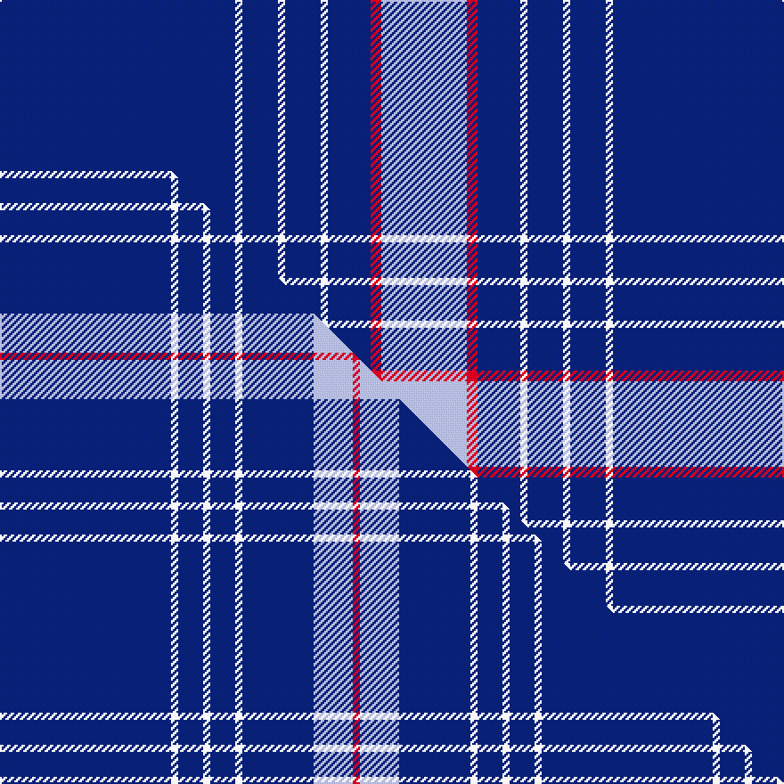

This page is one **sett** — a single exact thread-count. It belongs to the [tartan](/setts/db66w2db10w2db10w2db12r3lb24/)
(the same proportion at any scale), whose colour order is pattern [BWBWBWBRW](/stripes/bwbwbwbrw/).

Part of the [RAAF](/tartans/raaf-2/) tartan — the named design grouping this sett with its other cloths.

Sourced from register-of-tartans.  It is a [9 stripe tartan](/stripes/stripes9/).

Original link [https://www.tartanregister.gov.uk/tartanDetails.aspx?ref=4846](https://www.tartanregister.gov.uk/tartanDetails.aspx?ref=4846)

Dataset <small>— provenance for this record, inherited from the source manifest</small>

<dl class="dataset-prov">
<dt>source</dt><dd><a href="/sources/register-of-tartans/">Scottish Register of Tartans</a></dd>
<dt>data captured from</dt><dd><a href="https://github.com/thetartan/tartan-database/blob/master/data/register-of-tartans/data.csv">https://github.com/thetartan/tartan-database/blob/master/data/register-of-tartans/data.csv</a></dd>
<dt>data date</dt><dd>2017-01-06 <small>(dataset default)</small></dd>
<dt>licence</dt><dd><a href="https://www.tartanregister.gov.uk/copyright">Crown copyright</a></dd>
</dl>

Capture chain <small>— the hands this data passed through, oldest first; each capture carries its own licence</small>

<ol class="capture-chain">
<li><a href="https://www.tartanregister.gov.uk/">Scottish Register of Tartans</a> · <a href="https://www.tartanregister.gov.uk/copyright">Crown copyright</a> <small>the living register — still published by National Records of Scotland</small></li>
<li><a href="https://github.com/thetartan/tartan-database">thetartan/tartan-database</a> <small>2016-2017</small> · <a href="https://creativecommons.org/licenses/by-nc-nd/4.0/">CC BY-NC-ND 4.0</a> <small>Levko Kravets's frozen compilation — the capture we vendored, and where its CC licence text came from</small></li>
<li>this dictionary <small>captured 2026-06-10 · commit 5bf86c7566</small> <small>each re-capture is a git commit to data/sources</small></li>
</ol>

## Register references

External register numbers recorded for this tartan.

- Scottish Register of Tartans: [4846](https://www.tartanregister.gov.uk/tartanDetails.aspx?ref=4846)
- Scottish Tartans Authority (ITI): 3142

## Thread count
DB/132 W4 DB20 W4 DB20 W4 DB24 R6 LB/48

One full sett is **344 threads**.

## Palette
<table><thead><tr><th>Colour</th><th>Shade</th><th>OKLCh</th></tr></thead><tbody><tr><td>LB</td><td><code style="background-color:#B5BBDE;">#B5BBDE</code> <small style="color:#888">#B5BBDE</small></td><td><small style="color:#888">oklch(79.9% 0.050 277.6)</small></td></tr><tr><td>DB</td><td><code style="background-color:#082077;">#082077</code> <small style="color:#888">#082077</small></td><td><small style="color:#888">oklch(30.0% 0.149 265.1)</small></td></tr><tr><td>W</td><td><code style="background-color:#F7F7F7;">#F7F7F7</code> <small style="color:#888">#F7F7F7</small></td><td><small style="color:#888">oklch(97.6% 0.000 89.9)</small></td></tr><tr><td>R</td><td><code style="background-color:#D60020;">#D60020</code> <small style="color:#888">#D60020</small></td><td><small style="color:#888">oklch(55.2% 0.224 25.5)</small></td></tr></tbody></table>

# Sample pattern

## Compared to the master

This cloth is one sett of its design; the master sett (the exemplar the design is anchored on) is below for comparison.

Its **ΔTartan distance** from the master is **0.70** — the same measure the nearest-tartans table ranks by (0 is identical; a re-scale of the same cloth is near 0, a recolour or a different proportion further).

<figure class="master-compare" style="margin:0">

this sett
master sett ★

<figcaption style="color:#888;font-size:smaller">One weave of this sett against the <a href="/setts/db48w2db7w2db7w2db20lb11r2/">master sett ★</a>, split on the diagonal: a shared proportion runs seamlessly across it with only the shades shifting; a different proportion breaks on it.</figcaption>
</figure>

## Nearest tartan variants

The nearest existing variants by ΔTartan distance, with this cloth at the top so the swatches line up against it.

ΔTartan

Threads

Variant

Sett

—

344

<a href="/variants/s9/db66w2db10w2db10w2db12r3lb24~x2/">RAAF</a>

<a href="/ttd/edit/#slug=db48w2db7w2db7w2db20lb11r2~x2&amp;base=db66w2db10w2db10w2db12r3lb24~x2" title="compare in the TTD">0.70</a>

304

<a href="/variants/s9/db48w2db7w2db7w2db20lb11r2~x2/">RAAF #4</a>

<a href="/ttd/edit/#slug=r5db20r3db20w6db3lb2db1~x2&amp;base=db66w2db10w2db10w2db12r3lb24~x2" title="compare in the TTD">1.69</a>

228

<a href="/variants/s8/r5db20r3db20w6db3lb2db1~x2/">Masai Shuka 29 (Artefact)</a>

<a href="/ttd/edit/#slug=w6dt32n3dt3n1dt3n2db4dt1y2~x2~dt1204274-db1406275&amp;base=db66w2db10w2db10w2db12r3lb24~x2" title="compare in the TTD">1.69</a>

212

<a href="/variants/s10/w6db32n3db3n1db3n2dbi4db1y2~x2~db1204274-dbi1406275/">X Marks the Scot</a>

<a href="/ttd/edit/#slug=t7db5lr6db5r7db2t2db70lr2&amp;base=db66w2db10w2db10w2db12r3lb24~x2" title="compare in the TTD">1.99</a>

203

<a href="/variants/s9/t7db5lr6db5r7db2t2db70lr2/">United States (Personal)</a>

<a href="/ttd/edit/#slug=db4r2db25lb7w1db5w2db5w1lb7db26r2~x2&amp;base=db66w2db10w2db10w2db12r3lb24~x2" title="compare in the TTD">2.23</a>

336

<a href="/variants/s12/db4r2db25lb7w1db5w2db5w1lb7db26r2~x2/">Glasgow Caledonian University (Corp)</a>

<a href="/ttd/edit/#slug=db64r8db1w8db4b15w4~x2&amp;base=db66w2db10w2db10w2db12r3lb24~x2" title="compare in the TTD">2.23</a>

280

<a href="/variants/s7/db64r8db1w8db4b15w4~x2/">North Carolina</a>

<a href="/ttd/edit/#slug=db42w5db1w1y9db1dg2w1db1r1~x4&amp;base=db66w2db10w2db10w2db12r3lb24~x2" title="compare in the TTD">2.30</a>

340

<a href="/variants/s10/db42w5db1w1y9db1dg2w1db1r1~x4/">Stratford (Ontario), City of</a>

<a href="/ttd/edit/#slug=db6w4db3w6db8y3db52y3db8r4&amp;base=db66w2db10w2db10w2db12r3lb24~x2" title="compare in the TTD">2.32</a>

184

<a href="/variants/s10/db6w4db3w6db8y3db52y3db8r4/">Dundee F.C.</a>

<a href="/ttd/edit/#slug=db6w4db3w6db8lo3db52lo3db8r4&amp;base=db66w2db10w2db10w2db12r3lb24~x2" title="compare in the TTD">2.32</a>

184

<a href="/variants/s10/db6w4db3w6db8lo3db52lo3db8r4/">Dundee F.C. Corporate Tartan</a>

<a href="/ttd/edit/#slug=db3w2db2w3db6y2db26y2db6r2~x2&amp;base=db66w2db10w2db10w2db12r3lb24~x2" title="compare in the TTD">2.42</a>

206

<a href="/variants/s10/db3w2db2w3db6y2db26y2db6r2~x2/">Dundee Football Club</a>

## Neighbour map

Every grey dot is one of 13621 variants placed by the first two principal components of the ΔTartan feature space (42% of its variance). Red is this tartan; blue dots are its nearest — click one to open its page.

<svg viewBox="0 0 640 380" role="img" style="max-width:100%;height:auto;border:1px solid #e0e0e0;border-radius:4px;display:block" xmlns="http://www.w3.org/2000/svg"><image href="/nn/cloud.v1.png" width="640" height="380"/><a href="/variants/s9/db48w2db7w2db7w2db20lb11r2~x2/"><circle cx="505.7" cy="129.0" r="4" fill="#3465a4"><title>RAAF #4</title></circle></a><a href="/variants/s8/r5db20r3db20w6db3lb2db1~x2/"><circle cx="417.0" cy="153.6" r="4" fill="#3465a4"><title>Masai Shuka 29 (Artefact)</title></circle></a><a href="/variants/s10/w6db32n3db3n1db3n2dbi4db1y2~x2~db1204274-dbi1406275/"><circle cx="437.3" cy="103.8" r="4" fill="#3465a4"><title>X Marks the Scot</title></circle></a><a href="/variants/s9/t7db5lr6db5r7db2t2db70lr2/"><circle cx="547.5" cy="79.0" r="4" fill="#3465a4"><title>United States (Personal)</title></circle></a><a href="/variants/s12/db4r2db25lb7w1db5w2db5w1lb7db26r2~x2/"><circle cx="440.7" cy="119.2" r="4" fill="#3465a4"><title>Glasgow Caledonian University (Corp)</title></circle></a><a href="/variants/s7/db64r8db1w8db4b15w4~x2/"><circle cx="423.8" cy="107.1" r="4" fill="#3465a4"><title>North Carolina</title></circle></a><a href="/variants/s10/db42w5db1w1y9db1dg2w1db1r1~x4/"><circle cx="436.1" cy="63.7" r="4" fill="#3465a4"><title>Stratford (Ontario), City of</title></circle></a><a href="/variants/s10/db6w4db3w6db8y3db52y3db8r4/"><circle cx="481.1" cy="123.9" r="4" fill="#3465a4"><title>Dundee F.C.</title></circle></a><a href="/variants/s10/db6w4db3w6db8lo3db52lo3db8r4/"><circle cx="475.0" cy="122.1" r="4" fill="#3465a4"><title>Dundee F.C. Corporate Tartan</title></circle></a><a href="/variants/s10/db3w2db2w3db6y2db26y2db6r2~x2/"><circle cx="470.8" cy="143.9" r="4" fill="#3465a4"><title>Dundee Football Club</title></circle></a><circle cx="466.6" cy="113.3" r="5" fill="#c00000"/><text x="320" y="376" text-anchor="middle" font-size="11" fill="#999">ground</text><text x="11" y="190" text-anchor="middle" font-size="11" fill="#999" transform="rotate(-90 11 190)">complexity</text></svg>

ID: /variants/s9/db66w2db10w2db10w2db12r3lb24~x2/
