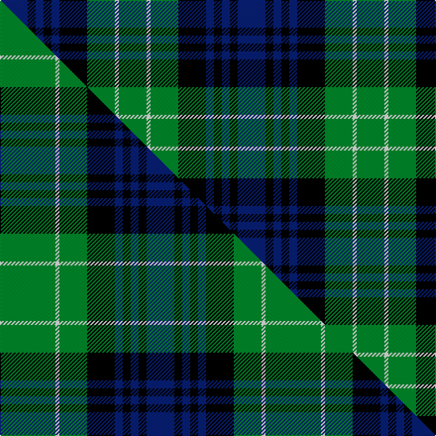

This page is one **sett** — a single exact thread-count. It belongs to the [tartan](/setts/db7k2db2k2db2k7g7w1g7/)
(the same proportion at any scale), whose colour order is pattern [BKBKBKGWG](/stripes/bkbkbkgwg/).

Part of the [Abercrombie](/tartans/abercrombie/) tartan — the named design grouping this sett with its other cloths.

Sourced from logan-1831.  It is a [9 stripe tartan](/stripes/stripes9/).

Original link /posts/logans-scottish-gael/

## Provenance

<figure class="logan-scan">

<figcaption>Logan, The Scottish Gaël (1831), vol. II p. 402 — page-scan crop (379,1151)–(634,1567)</figcaption>
</figure>

James Logan recorded the **Abercrombie** sett in 1831, on page 402 of the *Table of Clan Tartans* in *The Scottish Gaël* — the earliest systematic published collection of clan setts. Logan gives the stripe widths in eighths of an inch, measured across the cloth and reflected about each end (a half-sett):

> 3½ green · ½ white · 3½ green · 3½ black · 1 blue · 1 black · 1 blue · 1 black · 3½ blue

In threads (at 8 to the eighth-inch) that is `G/28 W4 G28 K28 B8 K8 B8 K8 B/28`. Logan named his colours rather than dyeing to a standard, so the palette here is the Dictionary's modern reading of his names.

See [Logan's Scottish Gaël](/posts/logans-scottish-gael/) for the full table and method.

## Related setts

Later records of the **Abercrombie** name adjusted Logan's counts: [Abercrombie](/setts/s9/g14w1g7k7b2k2b2k2b7~b2c2c80-g006818-k101010-we0e0e0~x4/); [Abercrombie (McKinlay)](/setts/s9/k12r1g14w1g14k14r1b8k2~b2c4084-g005020-k101010-rdc0000-we0e0e0~x2/); [Abercrombie (Wilsons No 2/64)](/setts/s7/k6g6y1g6k6b6k1~b5a008c-g005020-k101010-ye8c000~x4/); [Abercrombie](/setts/s9/g14w1g7k7b2k2b2k2b7~b00004c-g004c00-k000000-wd0d0d0~x2/). Compare their thread counts with Logan's above.

## Thread count
DB/28 K8 DB8 K8 DB8 K28 G28 W4 G/28

One full sett is **240 threads**.

## Palette
<table><thead><tr><th>Colour</th><th>Shade</th><th>OKLCh</th></tr></thead><tbody><tr><td>DB</td><td><code style="background-color:#082077;">#082077</code> <small style="color:#888">#082077</small></td><td><small style="color:#888">oklch(30.0% 0.149 265.1)</small></td></tr><tr><td>G</td><td><code style="background-color:#008B2A;">#008B2A</code> <small style="color:#888">#008B2A</small></td><td><small style="color:#888">oklch(55.4% 0.170 145.9)</small></td></tr><tr><td>K</td><td><code style="background-color:#000000;">#000000</code> <small style="color:#888">#000000</small></td><td><small style="color:#888">oklch(0.0% 0.000 0.0)</small></td></tr><tr><td>W</td><td><code style="background-color:#F7F7F7;">#F7F7F7</code> <small style="color:#888">#F7F7F7</small></td><td><small style="color:#888">oklch(97.6% 0.000 89.9)</small></td></tr></tbody></table>

# Sample pattern

## Compared to the master

This cloth is one sett of its design; the master sett (the exemplar the design is anchored on) is below for comparison.

Its **ΔTartan distance** from the master is **1.59** — the same measure the nearest-tartans table ranks by (0 is identical; a re-scale of the same cloth is near 0, a recolour or a different proportion further).

<figure class="master-compare" style="margin:0">

this sett
master sett ★

<figcaption style="color:#888;font-size:smaller">One weave of this sett against the <a href="/setts/g14w1g7k7db2k2db2k2db7/">master sett ★</a>, split on the diagonal: a shared proportion runs seamlessly across it with only the shades shifting; a different proportion breaks on it.</figcaption>
</figure>

## Nearest tartan variants

The nearest existing variants by ΔTartan distance, with this cloth at the top so the swatches line up against it.

ΔTartan

Threads

Variant

Sett

—

240

<a href="/variants/s9/db7k2db2k2db2k7g7w1g7~x4/">Abercrombie</a>

<a href="/ttd/edit/#slug=k3db17k20g18w4g18k20db18k2db2~x2&amp;base=db7k2db2k2db2k7g7w1g7~x4" title="compare in the TTD">1.51</a>

478

<a href="/variants/s10/k3db17k20g18w4g18k20db18k2db2~x2/">Argyll Campbell</a>

<a href="/ttd/edit/#slug=g27k21db12k4db40k4db12k21g27w4~x2&amp;base=db7k2db2k2db2k7g7w1g7~x4" title="compare in the TTD">1.59</a>

626

<a href="/variants/s10/g27k21db12k4db40k4db12k21g27w4~x2/">Granger/Grainger (Personal)</a>

<a href="/ttd/edit/#slug=db4g6w1g6k6db6k2~x2&amp;base=db7k2db2k2db2k7g7w1g7~x4" title="compare in the TTD">2.38</a>

112

<a href="/variants/s7/db4g6w1g6k6db6k2~x2/">MacNeil of Colonsay</a>

<a href="/ttd/edit/#slug=db4g6w1g6k6db6k2~x4&amp;base=db7k2db2k2db2k7g7w1g7~x4" title="compare in the TTD">2.38</a>

224

<a href="/variants/s7/db4g6w1g6k6db6k2~x4/">MacNeil of Colonsay</a>

<a href="/ttd/edit/#slug=db16g14w2g14k13db12k4~x2&amp;base=db7k2db2k2db2k7g7w1g7~x4" title="compare in the TTD">2.45</a>

260

<a href="/variants/s7/db16g14w2g14k13db12k4~x2/">MacNeil of Colonsay (Clan)</a>

<a href="/ttd/edit/#slug=t10k3t10k14r2g14k4~x2&amp;base=db7k2db2k2db2k7g7w1g7~x4" title="compare in the TTD">2.83</a>

200

<a href="/variants/s7/t10k3t10k14r2g14k4~x2/">Fletcher #2</a>

<a href="/ttd/edit/#slug=g24db6lb3k6db12k15g4~x2&amp;base=db7k2db2k2db2k7g7w1g7~x4" title="compare in the TTD">2.92</a>

224

<a href="/variants/s7/g24db6lb3k6db12k15g4~x2/">Blaylock Annandale</a>

<a href="/ttd/edit/#slug=db6k1db6k8r1g8k2&amp;base=db7k2db2k2db2k7g7w1g7~x4" title="compare in the TTD">2.97</a>

56

<a href="/variants/s7/db6k1db6k8r1g8k2/">Fletcher</a>

<a href="/ttd/edit/#slug=db6k1db6k8r1g8k2~x2&amp;base=db7k2db2k2db2k7g7w1g7~x4" title="compare in the TTD">2.97</a>

112

<a href="/variants/s7/db6k1db6k8r1g8k2~x2/">Fletcher</a>

## Neighbour map

Every grey dot is one of 13620 variants placed by the first two principal components of the ΔTartan feature space (42% of its variance). Red is this tartan; blue dots are its nearest — click one to open its page.

<svg viewBox="0 0 640 380" role="img" style="max-width:100%;height:auto;border:1px solid #e0e0e0;border-radius:4px;display:block" xmlns="http://www.w3.org/2000/svg"><image href="/nn/cloud.v1.png" width="640" height="380"/><a href="/variants/s10/k3db17k20g18w4g18k20db18k2db2~x2/"><circle cx="135.0" cy="196.4" r="4" fill="#3465a4"><title>Argyll Campbell</title></circle></a><a href="/variants/s10/g27k21db12k4db40k4db12k21g27w4~x2/"><circle cx="145.5" cy="195.5" r="4" fill="#3465a4"><title>Granger/Grainger (Personal)</title></circle></a><a href="/variants/s7/db4g6w1g6k6db6k2~x2/"><circle cx="117.6" cy="253.9" r="4" fill="#3465a4"><title>MacNeil of Colonsay</title></circle></a><a href="/variants/s7/db4g6w1g6k6db6k2~x4/"><circle cx="117.6" cy="253.9" r="4" fill="#3465a4"><title>MacNeil of Colonsay</title></circle></a><a href="/variants/s7/db16g14w2g14k13db12k4~x2/"><circle cx="131.9" cy="242.2" r="4" fill="#3465a4"><title>MacNeil of Colonsay (Clan)</title></circle></a><a href="/variants/s7/t10k3t10k14r2g14k4~x2/"><circle cx="120.7" cy="227.2" r="4" fill="#3465a4"><title>Fletcher #2</title></circle></a><a href="/variants/s7/g24db6lb3k6db12k15g4~x2/"><circle cx="150.2" cy="212.3" r="4" fill="#3465a4"><title>Blaylock Annandale</title></circle></a><a href="/variants/s7/db6k1db6k8r1g8k2/"><circle cx="148.1" cy="217.2" r="4" fill="#3465a4"><title>Fletcher</title></circle></a><a href="/variants/s7/db6k1db6k8r1g8k2~x2/"><circle cx="148.1" cy="217.2" r="4" fill="#3465a4"><title>Fletcher</title></circle></a><circle cx="130.7" cy="215.7" r="5" fill="#c00000"/><text x="320" y="376" text-anchor="middle" font-size="11" fill="#999">ground</text><text x="11" y="190" text-anchor="middle" font-size="11" fill="#999" transform="rotate(-90 11 190)">complexity</text></svg>

ID: /variants/s9/db7k2db2k2db2k7g7w1g7~x4/
