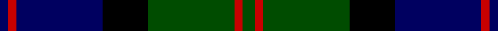

This page is one **sett** — a single exact thread-count. It belongs to the [tartan](/setts/dg1dg1r2dg21k11db21r2db1db1/)
(the same proportion at any scale), whose colour order is pattern [BBRBKGRGG](/stripes/bbrbkgrgg/).

Part of the [MacThomas](/tartans/macthomas/) tartan — the named design grouping this sett with its other cloths.

Sourced from weddslist.  It is a [9 stripe tartan](/stripes/stripes9/).

Original link http://www.weddslist.com/cgi-bin/tartans/pg.pl?source=rb

## Thread count
DB/2 DB2 R4 DB42 K22 G42 R4 G2 G/2

One full sett is **240 threads**.

## Palette

Palette: <strong>Tartan Register</strong> <small style="color:#888">(3 of 4 colours)</small>
<table><thead><tr><th>Colour</th><th>Threads</th><th>Shade</th><th>Base</th><th>OKLCh</th></tr></thead><tbody><tr><td>DB/</td><td style="text-align:right;font-variant-numeric:tabular-nums">2</td><td><code style="background-color:#000060;">#000060</code> <small style="color:#888">#000060</small></td><td>B <code style="background-color:#2A418A;">#2A418A</code></td><td><small style="color:#888">oklch(22.1% 0.153 264.1)</small></td></tr><tr><td>DB</td><td style="text-align:right;font-variant-numeric:tabular-nums">2</td><td><code style="background-color:#000060;">#000060</code> <small style="color:#888">#000060</small></td><td>B <code style="background-color:#2A418A;">#2A418A</code></td><td><small style="color:#888">oklch(22.1% 0.153 264.1)</small></td></tr><tr><td>R</td><td style="text-align:right;font-variant-numeric:tabular-nums">4</td><td><code style="background-color:#C80000;">#C80000</code> <small style="color:#888">#C80000</small></td><td>R <code style="background-color:#CC0000;">#CC0000</code></td><td><small style="color:#888">oklch(52.3% 0.215 29.2)</small></td></tr><tr><td>DB</td><td style="text-align:right;font-variant-numeric:tabular-nums">42</td><td><code style="background-color:#000060;">#000060</code> <small style="color:#888">#000060</small></td><td>B <code style="background-color:#2A418A;">#2A418A</code></td><td><small style="color:#888">oklch(22.1% 0.153 264.1)</small></td></tr><tr><td>K</td><td style="text-align:right;font-variant-numeric:tabular-nums">22</td><td><code style="background-color:#000000;">#000000</code> <small style="color:#888">#000000</small></td><td>K <code style="background-color:#000000;">#000000</code></td><td><small style="color:#888">oklch(0.0% 0.000 0.0)</small></td></tr><tr><td>G</td><td style="text-align:right;font-variant-numeric:tabular-nums">42</td><td><code style="background-color:#004C00;">#004C00</code> <small style="color:#888">#004C00</small></td><td>G <code style="background-color:#006100;">#006100</code></td><td><small style="color:#888">oklch(36.1% 0.123 142.5)</small></td></tr><tr><td>R</td><td style="text-align:right;font-variant-numeric:tabular-nums">4</td><td><code style="background-color:#C80000;">#C80000</code> <small style="color:#888">#C80000</small></td><td>R <code style="background-color:#CC0000;">#CC0000</code></td><td><small style="color:#888">oklch(52.3% 0.215 29.2)</small></td></tr><tr><td>G</td><td style="text-align:right;font-variant-numeric:tabular-nums">2</td><td><code style="background-color:#004C00;">#004C00</code> <small style="color:#888">#004C00</small></td><td>G <code style="background-color:#006100;">#006100</code></td><td><small style="color:#888">oklch(36.1% 0.123 142.5)</small></td></tr><tr><td>G/</td><td style="text-align:right;font-variant-numeric:tabular-nums">2</td><td><code style="background-color:#004C00;">#004C00</code> <small style="color:#888">#004C00</small></td><td>G <code style="background-color:#006100;">#006100</code></td><td><small style="color:#888">oklch(36.1% 0.123 142.5)</small></td></tr></tbody></table>

## Compared to the master

This cloth is one sett of its design; the master sett (the exemplar the design is anchored on) is below for comparison.

<figure style="margin:0"><figcaption style="color:#888;font-size:smaller">this sett</figcaption></figure>
<figure style="margin:0"><figcaption style="color:#888;font-size:smaller"><a href="/setts/dg5lp3dg32k16b32m3b5/">master sett →</a></figcaption></figure>

## Nearest tartans

The nearest existing variants by ΔTartan distance, with this tartan at the top so the swatches line up against it.

ΔTartan

Tartan

Sett

—

<a href="/ttd/edit/#slug=dg1dg1r2dg21k11db21r2db1db1~x2">MacThomas</a> <a class="nn-out" href="/variants/s9/dg1dg1r2dg21k11db21r2db1db1~x2/" title="open its dictionary page">↗</a>

0.97

<a href="/ttd/edit/#slug=k1r1k18g12db18g1db1~x2&amp;base=dg1dg1r2dg21k11db21r2db1db1~x2">Meoni (Personal)</a> <a class="nn-out" href="/variants/s7/k1r1k18g12db18g1db1~x2/" title="open its dictionary page">↗</a>

1.03

<a href="/ttd/edit/#slug=k4db2g24r1g2r1g2k20db24k1db2k4~x2&amp;base=dg1dg1r2dg21k11db21r2db1db1~x2">Jedforest</a> <a class="nn-out" href="/variants/s12/k4db2g24r1g2r1g2k20db24k1db2k4~x2/" title="open its dictionary page">↗</a>

1.05

<a href="/ttd/edit/#slug=db28ly1db2k16dg24k1dg2r3~x2&amp;base=dg1dg1r2dg21k11db21r2db1db1~x2">Ogilvy VS</a> <a class="nn-out" href="/variants/s8/db28ly1db2k16dg24k1dg2r3~x2/" title="open its dictionary page">↗</a>

1.05

<a href="/ttd/edit/#slug=db24ly2k8dg16k1dg3k1dg3r4~x2&amp;base=dg1dg1r2dg21k11db21r2db1db1~x2">Ogilvy Hunting</a> <a class="nn-out" href="/variants/s9/db24ly2k8dg16k1dg3k1dg3r4~x2/" title="open its dictionary page">↗</a>

1.10

<a href="/ttd/edit/#slug=k4db16k12dg24r1dg2k2~x2&amp;base=dg1dg1r2dg21k11db21r2db1db1~x2">Dundas</a> <a class="nn-out" href="/variants/s7/k4db16k12dg24r1dg2k2~x2/" title="open its dictionary page">↗</a>

1.13

<a href="/ttd/edit/#slug=r3k2db25k28dg25k2r1db2~x2&amp;base=dg1dg1r2dg21k11db21r2db1db1~x2">Common Kilt</a> <a class="nn-out" href="/variants/s8/r3k2db25k28dg25k2r1db2~x2/" title="open its dictionary page">↗</a>

1.16

<a href="/ttd/edit/#slug=k2db3g16b1k13b1db18k2db2~x2&amp;base=dg1dg1r2dg21k11db21r2db1db1~x2">Hebridean Old</a> <a class="nn-out" href="/variants/s9/k2db3g16b1k13b1db18k2db2~x2/" title="open its dictionary page">↗</a>

1.17

<a href="/ttd/edit/#slug=db4lr2db24k3db3k3db8k24dg48k3dg3r2~x2&amp;base=dg1dg1r2dg21k11db21r2db1db1~x2">Urquhart</a> <a class="nn-out" href="/variants/s12/db4lr2db24k3db3k3db8k24dg48k3dg3r2~x2/" title="open its dictionary page">↗</a>

1.17

<a href="/ttd/edit/#slug=db4lr2db24k3db3k3db8k24dg48k3dg3r2&amp;base=dg1dg1r2dg21k11db21r2db1db1~x2">Urquhart</a> <a class="nn-out" href="/variants/s12/db4lr2db24k3db3k3db8k24dg48k3dg3r2/" title="open its dictionary page">↗</a>

1.17

<a href="/ttd/edit/#slug=db4k2db2k2db2k14ly1g22ly1k14db12k2db2~x4&amp;base=dg1dg1r2dg21k11db21r2db1db1~x2">Campbell of Breadalbane</a> <a class="nn-out" href="/variants/s13/db4k2db2k2db2k14ly1g22ly1k14db12k2db2~x4/" title="open its dictionary page">↗</a>

## Neighbour map

Every grey dot is one of 14360 variants placed by the first two principal components of the ΔTartan feature space (44% of its variance). Red is this tartan; blue dots are its nearest — click one to open its page.

<svg viewBox="0 0 640 380" role="img" style="max-width:100%;height:auto;border:1px solid #e0e0e0;border-radius:4px;display:block" xmlns="http://www.w3.org/2000/svg"><image href="/nn/cloud.v1.png" width="640" height="380"/><a href="/variants/s7/k1r1k18g12db18g1db1~x2/"><circle cx="232.0" cy="178.8" r="4" fill="#3465a4"><title>Meoni (Personal)</title></circle></a><a href="/variants/s12/k4db2g24r1g2r1g2k20db24k1db2k4~x2/"><circle cx="262.0" cy="148.4" r="4" fill="#3465a4"><title>Jedforest</title></circle></a><a href="/variants/s8/db28ly1db2k16dg24k1dg2r3~x2/"><circle cx="250.1" cy="147.9" r="4" fill="#3465a4"><title>Ogilvy VS</title></circle></a><a href="/variants/s9/db24ly2k8dg16k1dg3k1dg3r4~x2/"><circle cx="225.7" cy="140.0" r="4" fill="#3465a4"><title>Ogilvy Hunting</title></circle></a><a href="/variants/s7/k4db16k12dg24r1dg2k2~x2/"><circle cx="275.3" cy="188.5" r="4" fill="#3465a4"><title>Dundas</title></circle></a><a href="/variants/s8/r3k2db25k28dg25k2r1db2~x2/"><circle cx="274.5" cy="175.9" r="4" fill="#3465a4"><title>Common Kilt</title></circle></a><a href="/variants/s9/k2db3g16b1k13b1db18k2db2~x2/"><circle cx="220.3" cy="161.2" r="4" fill="#3465a4"><title>Hebridean Old</title></circle></a><a href="/variants/s12/db4lr2db24k3db3k3db8k24dg48k3dg3r2~x2/"><circle cx="264.4" cy="131.2" r="4" fill="#3465a4"><title>Urquhart</title></circle></a><a href="/variants/s12/db4lr2db24k3db3k3db8k24dg48k3dg3r2/"><circle cx="264.4" cy="131.2" r="4" fill="#3465a4"><title>Urquhart</title></circle></a><a href="/variants/s13/db4k2db2k2db2k14ly1g22ly1k14db12k2db2~x4/"><circle cx="276.6" cy="155.0" r="4" fill="#3465a4"><title>Campbell of Breadalbane</title></circle></a><circle cx="259.2" cy="161.0" r="5" fill="#c00000"/></svg>

ID: /variants/s9/dg1dg1r2dg21k11db21r2db1db1~x2/
