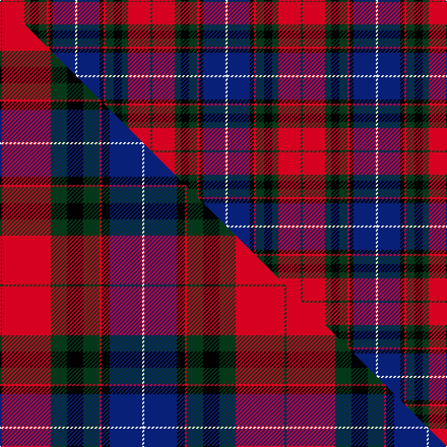

This is one **variant** — a specific cloth: this exact thread count and colourway, with its own
provenance below. It is one weaving of the [sett](/setts/dg1r11dg3k4dg4r1k2db11w1/) (the scale-free proportion — the
same cloth at any scale or shade), whose colour order is pattern [GRGKGRKBW](/stripes/grgkgrkbw/).

Part of the [Manson](/tartans/manson/) tartan — the named design grouping this sett with its other cloths.

Sourced from tartans-authority.  It is a [9 stripe tartan](/stripes/stripes9/).

Original link [https://www.tartanregister.gov.uk/tartanDetails.aspx?ref=987](https://www.tartanregister.gov.uk/tartanDetails.aspx?ref=987)

Dataset <small>— provenance for this record, inherited from the source manifest</small>

<dl class="dataset-prov">
<dt>source</dt><dd><a href="/sources/tartans-authority/">Scottish Tartans Authority</a></dd>
<dt>data captured from</dt><dd><a href="https://github.com/thetartan/tartan-database/blob/master/data/tartans-authority/data.csv">https://github.com/thetartan/tartan-database/blob/master/data/tartans-authority/data.csv</a></dd>
<dt>data date</dt><dd>1984 <small>(this record)</small></dd>
<dt>licence</dt><dd><a href="https://creativecommons.org/licenses/by-nc-nd/4.0/">CC BY-NC-ND 4.0</a></dd>
</dl>

Capture chain <small>— the hands this data passed through, oldest first; each capture carries its own licence</small>

<ol class="capture-chain">
<li><a href="https://www.tartansauthority.com/">Scottish Tartans Authority</a> <small>the heritage body's archive — its tartan-ferret record browser is retired (links repaired to the SRT, above)</small></li>
<li><a href="https://github.com/thetartan/tartan-database">thetartan/tartan-database</a> <small>2016-2017</small> · <a href="https://creativecommons.org/licenses/by-nc-nd/4.0/">CC BY-NC-ND 4.0</a> <small>Levko Kravets's frozen compilation — the capture we vendored, and where its CC licence text came from</small></li>
<li>this dictionary <small>captured 2026-06-10 · commit 5bf86c7566</small> <small>each re-capture is a git commit to data/sources</small></li>
</ol>

## Register references

External register numbers recorded for this tartan.

- Scottish Tartans Authority (ITI): 987

## Thread count
DG/2 R22 DG6 K8 DG8 R2 K4 DB22 W/2

One full sett is **148 threads**.

## Palette
<table><thead><tr><th>Colour</th><th>Shade</th><th>OKLCh</th></tr></thead><tbody><tr><td>DB</td><td><code style="background-color:#082077;">#082077</code> <small style="color:#888">#082077</small></td><td><small style="color:#888">oklch(30.0% 0.149 265.1)</small></td></tr><tr><td>DG</td><td><code style="background-color:#053819;">#053819</code> <small style="color:#888">#053819</small></td><td><small style="color:#888">oklch(30.0% 0.075 151.3)</small></td></tr><tr><td>K</td><td><code style="background-color:#000000;">#000000</code> <small style="color:#888">#000000</small></td><td><small style="color:#888">oklch(0.0% 0.000 0.0)</small></td></tr><tr><td>W</td><td><code style="background-color:#F7F7F7;">#F7F7F7</code> <small style="color:#888">#F7F7F7</small></td><td><small style="color:#888">oklch(97.6% 0.000 89.9)</small></td></tr><tr><td>R</td><td><code style="background-color:#D60020;">#D60020</code> <small style="color:#888">#D60020</small></td><td><small style="color:#888">oklch(55.2% 0.224 25.5)</small></td></tr></tbody></table>

# Sample pattern

## Compared to the master

This cloth is one sett of its design; the master sett (the exemplar the design is anchored on) is below for comparison.

Its **ΔTartan distance** from the master is **0.57** — the same measure the nearest-tartans table ranks by (0 is identical; a re-scale of the same cloth is near 0, a recolour or a different proportion further).

<figure class="master-compare" style="margin:0">

this sett
master sett ★

<figcaption style="color:#888;font-size:smaller">One weave of this sett against the <a href="/setts/dg1r24dg8k8dg8r1k4db16w1/">master sett ★</a>, split on the diagonal: a shared proportion runs seamlessly across it with only the shades shifting; a different proportion breaks on it.</figcaption>
</figure>

## Nearest tartan variants

The nearest existing variants by ΔTartan distance, with this cloth at the top so the swatches line up against it.

ΔTartan

Threads

Variant

Sett

—

148

<a href="/variants/s9/dg1r11dg3k4dg4r1k2db11w1~x2/">Manson (Name)</a>

<a href="/ttd/edit/#slug=dg1r24dg8k8dg8r1k4db16w1~x2&amp;base=dg1r11dg3k4dg4r1k2db11w1~x2" title="compare in the TTD">0.57</a>

280

<a href="/variants/s9/dg1r24dg8k8dg8r1k4db16w1~x2/">Manson</a>

<a href="/ttd/edit/#slug=k3dg17k9r2db17r2db2r17dg2w2~x2&amp;base=dg1r11dg3k4dg4r1k2db11w1~x2" title="compare in the TTD">1.15</a>

282

<a href="/variants/s10/k3dg17k9r2db17r2db2r17dg2w2~x2/">MacInroy (Rattray)</a>

<a href="/ttd/edit/#slug=db1r20g6k6g6r1k6db20w1~x2&amp;base=dg1r11dg3k4dg4r1k2db11w1~x2" title="compare in the TTD">1.50</a>

264

<a href="/variants/s9/db1r20g6k6g6r1k6db20w1~x2/">Bush Pilot</a>

<a href="/ttd/edit/#slug=db22r3db2r3db2k17o18dg4~x2&amp;base=dg1r11dg3k4dg4r1k2db11w1~x2" title="compare in the TTD">1.61</a>

232

<a href="/variants/s8/db22r3db2r3db2k17o18dg4~x2/">Scotch House 2000, antique</a>

<a href="/ttd/edit/#slug=r6db6r3db3r3db28k21g28r21k2y4&amp;base=dg1r11dg3k4dg4r1k2db11w1~x2" title="compare in the TTD">1.88</a>

240

<a href="/variants/s11/r6db6r3db3r3db28k21g28r21k2y4/">MacLagan of Glenquiech</a>

<a href="/ttd/edit/#slug=o18k3o4lb3o4k18n20k2r4~x2~o2500000-n1900000&amp;base=dg1r11dg3k4dg4r1k2db11w1~x2" title="compare in the TTD">2.01</a>

260

<a href="/variants/s9/o18k3o4lb3o4k18n20k2r4~x2~o2500000-n1900000/">Heart of the Highlands</a>

<a href="/ttd/edit/#slug=dt18k5r26k5g25k5dt18y2~x2~dt1204274&amp;base=dg1r11dg3k4dg4r1k2db11w1~x2" title="compare in the TTD">2.19</a>

376

<a href="/variants/s8/db18k5r26k5g25k5db18y2~x2~db1204274/">St. Clement of Rome School</a>

<a href="/ttd/edit/#slug=o4k16oi5n8oi2dp2oi2dp2n8k3~x2~oi2500000-n1900000&amp;base=dg1r11dg3k4dg4r1k2db11w1~x2" title="compare in the TTD">2.20</a>

194

<a href="/variants/s10/o4k16oi5n8oi2dp2oi2dp2n8k3~x2~oi2500000-n1900000/">Ryukoku University Heian JHS (Corp)</a>

<a href="/ttd/edit/#slug=db8k4db31lo5r26k5y10lo5k2&amp;base=dg1r11dg3k4dg4r1k2db11w1~x2" title="compare in the TTD">2.20</a>

182

<a href="/variants/s9/db8k4db31lo5r26k5y10lo5k2/">McGurk (Personal)</a>

<a href="/ttd/edit/#slug=k14db22k5dy11k5y24k11dy11r54dy8k10&amp;base=dg1r11dg3k4dg4r1k2db11w1~x2" title="compare in the TTD">2.22</a>

326

<a href="/variants/s11/k14db22k5dy11k5y24k11dy11r54dy8k10/">Derry County, Crest Range</a>

## Neighbour map

Every grey dot is one of 13621 variants placed by the first two principal components of the ΔTartan feature space (42% of its variance). Red is this tartan; blue dots are its nearest — click one to open its page.

<svg viewBox="0 0 640 380" role="img" style="max-width:100%;height:auto;border:1px solid #e0e0e0;border-radius:4px;display:block" xmlns="http://www.w3.org/2000/svg"><image href="/nn/cloud.v1.png" width="640" height="380"/><a href="/variants/s9/dg1r24dg8k8dg8r1k4db16w1~x2/"><circle cx="161.9" cy="121.4" r="4" fill="#3465a4"><title>Manson</title></circle></a><a href="/variants/s10/k3dg17k9r2db17r2db2r17dg2w2~x2/"><circle cx="101.7" cy="160.1" r="4" fill="#3465a4"><title>MacInroy (Rattray)</title></circle></a><a href="/variants/s9/db1r20g6k6g6r1k6db20w1~x2/"><circle cx="134.2" cy="126.2" r="4" fill="#3465a4"><title>Bush Pilot</title></circle></a><a href="/variants/s8/db22r3db2r3db2k17o18dg4~x2/"><circle cx="147.4" cy="160.6" r="4" fill="#3465a4"><title>Scotch House 2000, antique</title></circle></a><a href="/variants/s11/r6db6r3db3r3db28k21g28r21k2y4/"><circle cx="105.9" cy="138.3" r="4" fill="#3465a4"><title>MacLagan of Glenquiech</title></circle></a><a href="/variants/s9/o18k3o4lb3o4k18n20k2r4~x2~o2500000-n1900000/"><circle cx="120.7" cy="160.1" r="4" fill="#3465a4"><title>Heart of the Highlands</title></circle></a><a href="/variants/s8/db18k5r26k5g25k5db18y2~x2~db1204274/"><circle cx="124.7" cy="170.6" r="4" fill="#3465a4"><title>St. Clement of Rome School</title></circle></a><a href="/variants/s10/o4k16oi5n8oi2dp2oi2dp2n8k3~x2~oi2500000-n1900000/"><circle cx="118.1" cy="168.7" r="4" fill="#3465a4"><title>Ryukoku University Heian JHS (Corp)</title></circle></a><a href="/variants/s9/db8k4db31lo5r26k5y10lo5k2/"><circle cx="164.2" cy="135.7" r="4" fill="#3465a4"><title>McGurk (Personal)</title></circle></a><a href="/variants/s11/k14db22k5dy11k5y24k11dy11r54dy8k10/"><circle cx="97.8" cy="147.5" r="4" fill="#3465a4"><title>Derry County, Crest Range</title></circle></a><circle cx="120.8" cy="153.6" r="5" fill="#c00000"/><text x="320" y="376" text-anchor="middle" font-size="11" fill="#999">ground</text><text x="11" y="190" text-anchor="middle" font-size="11" fill="#999" transform="rotate(-90 11 190)">complexity</text></svg>

ID: /variants/s9/dg1r11dg3k4dg4r1k2db11w1~x2/
