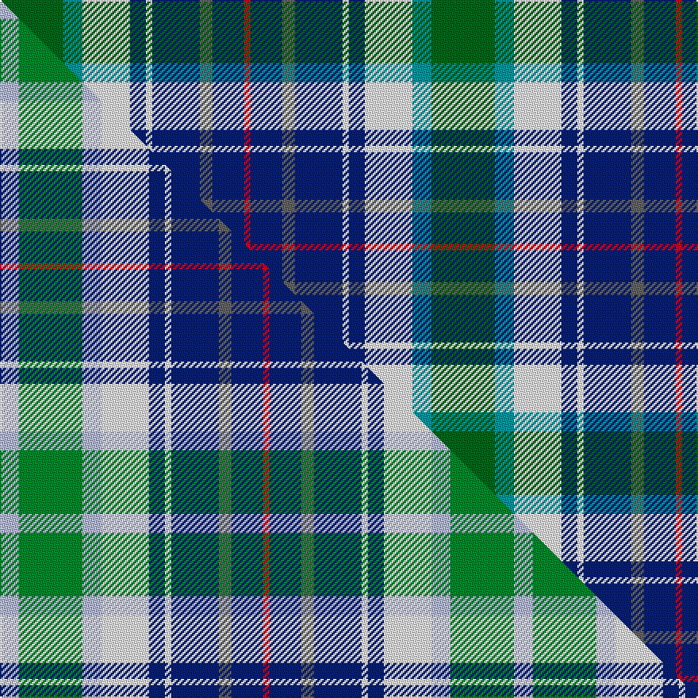

This is one **variant** — a specific cloth: this exact thread count and colourway, with its own
provenance below. It is one weaving of the [sett](/setts/dg20g6w15db5w2db15n4db10r2/) (the scale-free proportion — the
same cloth at any scale or shade), whose colour order is pattern [GGWBWBBBR](/stripes/ggwbwbbbr/).

Part of the [Copar a'Beannichte Dress](/tartans/c/co/copar-a-beannichte-dress/) tartan — the named design grouping this sett with its other cloths.

Sourced from tartans-authority.  It is a [9 stripe tartan](/stripes/stripes9/).

Original link [https://www.tartanregister.gov.uk/tartanDetails.aspx?ref=6484](https://www.tartanregister.gov.uk/tartanDetails.aspx?ref=6484)

Dataset <small>— provenance for this record, inherited from the source manifest</small>

<dl class="dataset-prov">
<dt>source</dt><dd><a href="/sources/tartans-authority/">Scottish Tartans Authority</a></dd>
<dt>data captured from</dt><dd><a href="https://github.com/thetartan/tartan-database/blob/master/data/tartans-authority/data.csv">https://github.com/thetartan/tartan-database/blob/master/data/tartans-authority/data.csv</a></dd>
<dt>data date</dt><dd>2004 <small>(this record)</small></dd>
<dt>licence</dt><dd><a href="https://creativecommons.org/licenses/by-nc-nd/4.0/">CC BY-NC-ND 4.0</a></dd>
</dl>

Capture chain <small>— the hands this data passed through, oldest first; each capture carries its own licence</small>

<ol class="capture-chain">
<li><a href="https://www.tartansauthority.com/">Scottish Tartans Authority</a> <small>the heritage body's archive — its tartan-ferret record browser is retired (links repaired to the SRT, above)</small></li>
<li><a href="https://github.com/thetartan/tartan-database">thetartan/tartan-database</a> <small>2016-2017</small> · <a href="https://creativecommons.org/licenses/by-nc-nd/4.0/">CC BY-NC-ND 4.0</a> <small>Levko Kravets's frozen compilation — the capture we vendored, and where its CC licence text came from</small></li>
<li>this dictionary <small>captured 2026-06-10 · commit 5bf86c7566</small> <small>each re-capture is a git commit to data/sources</small></li>
</ol>

## Register references

External register numbers recorded for this tartan.

- Scottish Tartans Authority (ITI): 6484

## Thread count
DG/40 G12 W30 DB10 W4 DB30 N8 DB20 R/4

One full sett is **272 threads**.

## Palette
<table><thead><tr><th>Colour</th><th>Shade</th><th>OKLCh</th></tr></thead><tbody><tr><td>G</td><td><code style="background-color:#0098A0;">#0098A0</code> <small style="color:#888">#0098A0</small></td><td><small style="color:#888">oklch(61.8% 0.105 201.4)</small></td></tr><tr><td>DB</td><td><code style="background-color:#082077;">#082077</code> <small style="color:#888">#082077</small></td><td><small style="color:#888">oklch(30.0% 0.149 265.1)</small></td></tr><tr><td>DG</td><td><code style="background-color:#006818;">#006818</code> <small style="color:#888">#006818</small></td><td><small style="color:#888">oklch(45.0% 0.142 145.0)</small></td></tr><tr><td>W</td><td><code style="background-color:#F7F7F7;">#F7F7F7</code> <small style="color:#888">#F7F7F7</small></td><td><small style="color:#888">oklch(97.6% 0.000 89.9)</small></td></tr><tr><td>N</td><td><code style="background-color:#636363;">#636363</code> <small style="color:#888">#636363</small></td><td><small style="color:#888">oklch(50.0% 0.000 89.9)</small></td></tr><tr><td>R</td><td><code style="background-color:#D60020;">#D60020</code> <small style="color:#888">#D60020</small></td><td><small style="color:#888">oklch(55.2% 0.224 25.5)</small></td></tr></tbody></table>

# Sample pattern

## Compared to the master

This cloth is one sett of its design; the master sett (the exemplar the design is anchored on) is below for comparison.

Its **ΔTartan distance** from the master is **0.36** — the same measure the nearest-tartans table ranks by (0 is identical; a re-scale of the same cloth is near 0, a recolour or a different proportion further).

<figure class="master-compare" style="margin:0">

this sett
master sett ★

<figcaption style="color:#888;font-size:smaller">One weave of this sett against the <a href="/setts/lb6g20lb6w15db5w2db15n4db10r2/">master sett ★</a>, split on the diagonal: a shared proportion runs seamlessly across it with only the shades shifting; a different proportion breaks on it.</figcaption>
</figure>

## Nearest tartan variants

The nearest existing variants by ΔTartan distance, with this cloth at the top so the swatches line up against it.

ΔTartan

Threads

Variant

Sett

—

272

<a href="/variants/s9/dg20g6w15db5w2db15n4db10r2~x2~dg1806142-g2504202/">Copar a'Beannichte Dress (Personal)</a>

<a href="/ttd/edit/#slug=lb6g20lb6w15db5w2db15n4db10r2~x2&amp;base=dg20g6w15db5w2db15n4db10r2~x2~dg1806142-g2504202" title="compare in the TTD">0.36</a>

324

<a href="/variants/s10/lb6g20lb6w15db5w2db15n4db10r2~x2/">Copar a'Beannichte Dress (Personal)</a>

<a href="/ttd/edit/#slug=lb16g2lb16db18y2db13g11r2g9db12r2y2~x2~g2408144&amp;base=dg20g6w15db5w2db15n4db10r2~x2~dg1806142-g2504202" title="compare in the TTD">1.68</a>

384

<a href="/variants/s12/lb16g2lb16db18y2db13g11r2g9db12r2y2~x2~g2408144/">E.C.R. (Corporate)</a>

<a href="/ttd/edit/#slug=db25w2db25lb25r2lb25g25dy2g25~x2&amp;base=dg20g6w15db5w2db15n4db10r2~x2~dg1806142-g2504202" title="compare in the TTD">2.31</a>

524

<a href="/variants/s9/db25w2db25lb25r2lb25g25dy2g25~x2/">Royal Columbian Canadian Tartan</a>

<a href="/ttd/edit/#slug=db25lb25r2lb25g25y2g25db25w4~x2&amp;base=dg20g6w15db5w2db15n4db10r2~x2~dg1806142-g2504202" title="compare in the TTD">2.38</a>

574

<a href="/variants/s9/db25lb25r2lb25g25y2g25db25w4~x2/">Royal Columbian</a>

<a href="/ttd/edit/#slug=o1t6g2lb1k8lb1g2lb9k1lb4ly1~x4~o2503076-ly3104101&amp;base=dg20g6w15db5w2db15n4db10r2~x2~dg1806142-g2504202" title="compare in the TTD">2.55</a>

280

<a href="/variants/s11/ly1t6g2lb1k8lb1g2lb9k1lb4lyi1~x4~ly2503076-lyi3104101/">Tiree</a>

<a href="/ttd/edit/#slug=db16w6r8db3lo1g1lg3db1g10~x4&amp;base=dg20g6w15db5w2db15n4db10r2~x2~dg1806142-g2504202" title="compare in the TTD">2.64</a>

288

<a href="/variants/s9/db16w6r8db3lo1g1lg3db1g10~x4/">Ogilvie of Inverquharity or Ohio</a>

<a href="/ttd/edit/#slug=db9n3db2w2db9n6db3w3db3g18dg8r2~x2&amp;base=dg20g6w15db5w2db15n4db10r2~x2~dg1806142-g2504202" title="compare in the TTD">2.64</a>

250

<a href="/variants/s12/db9n3db2w2db9n6db3w3db3g18dg8r2~x2/">Patterson, William J.M. (Personal)</a>

<a href="/ttd/edit/#slug=db1lb9w3y3db9y1g1r1~x4&amp;base=dg20g6w15db5w2db15n4db10r2~x2~dg1806142-g2504202" title="compare in the TTD">2.68</a>

216

<a href="/variants/s8/db1lb9w3y3db9y1g1r1~x4/">Curd (2013)</a>

<a href="/ttd/edit/#slug=db16w6r8db3y1g1b3db1g9~x2&amp;base=dg20g6w15db5w2db15n4db10r2~x2~dg1806142-g2504202" title="compare in the TTD">2.70</a>

142

<a href="/variants/s9/db16w6r8db3y1g1b3db1g9~x2/">Ohio</a>

<a href="/ttd/edit/#slug=db16w6r8db3y1g1lb3db1g9~x2&amp;base=dg20g6w15db5w2db15n4db10r2~x2~dg1806142-g2504202" title="compare in the TTD">2.72</a>

142

<a href="/variants/s9/db16w6r8db3y1g1lb3db1g9~x2/">Ohio District Tartan</a>

## Neighbour map

Every grey dot is one of 13656 variants placed by the first two principal components of the ΔTartan feature space (42% of its variance). Red is this tartan; blue dots are its nearest — click one to open its page. The map is a flat projection of a many-dimensional space — [how to read it](/posts/neighbourhood-maps/).

<svg viewBox="0 0 640 380" role="img" style="max-width:100%;height:auto;border:1px solid #e0e0e0;border-radius:4px;display:block" xmlns="http://www.w3.org/2000/svg"><image href="/nn/cloud.v1.png" width="640" height="380"/><a href="/variants/s10/lb6g20lb6w15db5w2db15n4db10r2~x2/"><circle cx="100.5" cy="181.0" r="4" fill="#3465a4"><title>Copar a'Beannichte Dress (Personal)</title></circle></a><a href="/variants/s12/lb16g2lb16db18y2db13g11r2g9db12r2y2~x2~g2408144/"><circle cx="134.5" cy="176.6" r="4" fill="#3465a4"><title>E.C.R. (Corporate)</title></circle></a><a href="/variants/s9/db25w2db25lb25r2lb25g25dy2g25~x2/"><circle cx="138.7" cy="195.3" r="4" fill="#3465a4"><title>Royal Columbian Canadian Tartan</title></circle></a><a href="/variants/s9/db25lb25r2lb25g25y2g25db25w4~x2/"><circle cx="132.1" cy="198.0" r="4" fill="#3465a4"><title>Royal Columbian</title></circle></a><a href="/variants/s11/ly1t6g2lb1k8lb1g2lb9k1lb4lyi1~x4~ly2503076-lyi3104101/"><circle cx="114.6" cy="148.2" r="4" fill="#3465a4"><title>Tiree</title></circle></a><a href="/variants/s9/db16w6r8db3lo1g1lg3db1g10~x4/"><circle cx="158.1" cy="146.7" r="4" fill="#3465a4"><title>Ogilvie of Inverquharity or Ohio</title></circle></a><a href="/variants/s12/db9n3db2w2db9n6db3w3db3g18dg8r2~x2/"><circle cx="138.1" cy="174.1" r="4" fill="#3465a4"><title>Patterson, William J.M. (Personal)</title></circle></a><a href="/variants/s8/db1lb9w3y3db9y1g1r1~x4/"><circle cx="133.1" cy="168.4" r="4" fill="#3465a4"><title>Curd (2013)</title></circle></a><a href="/variants/s9/db16w6r8db3y1g1b3db1g9~x2/"><circle cx="165.9" cy="146.6" r="4" fill="#3465a4"><title>Ohio</title></circle></a><a href="/variants/s9/db16w6r8db3y1g1lb3db1g9~x2/"><circle cx="162.7" cy="145.4" r="4" fill="#3465a4"><title>Ohio District Tartan</title></circle></a><circle cx="116.3" cy="181.7" r="5" fill="#c00000"/><text x="320" y="376" text-anchor="middle" font-size="11" fill="#999">ground</text><text x="11" y="190" text-anchor="middle" font-size="11" fill="#999" transform="rotate(-90 11 190)">complexity</text></svg>

ID: /variants/s9/dg20g6w15db5w2db15n4db10r2~x2~dg1806142-g2504202/
