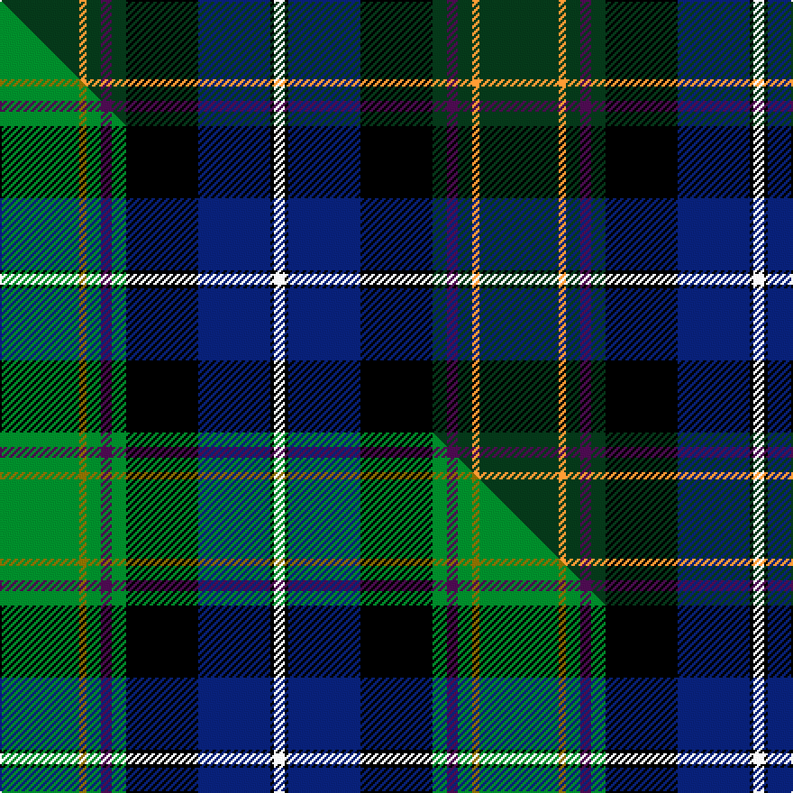

This is one **variant** — a specific cloth: this exact thread count and colourway, with its own
provenance below. It is one weaving of the [sett](/tartans/n/na/national-wedding/) (the scale-free proportion — the
same cloth at any scale or shade), whose colour order is pattern [GYGBGKBKW](/stripes/gygbgkbkw/).

Part of the [National Wedding](/tartans/n/na/national-wedding/) tartan — the named design grouping this sett with its other cloths.

Sourced from tartans-authority.  It is a [9 stripe tartan](/stripes/stripes9/).

Original link <code>http://www.tartansauthority.com/tartan-ferret/display/5628/</code> — retired · [Internet Archive copy](https://web.archive.org/web/*/http://www.tartansauthority.com/tartan-ferret/display/5628/*)

Dataset <small>— provenance for this record, inherited from the source manifest</small>

<dl class="dataset-prov">
<dt>source</dt><dd><a href="/sources/tartans-authority/">Scottish Tartans Authority</a></dd>
<dt>data captured from</dt><dd><a href="https://github.com/thetartan/tartan-database/blob/master/data/tartans-authority/data.csv">https://github.com/thetartan/tartan-database/blob/master/data/tartans-authority/data.csv</a></dd>
<dt>data date</dt><dd>May 1999 <small>(this record)</small></dd>
<dt>licence</dt><dd><a href="https://creativecommons.org/licenses/by-nc-nd/4.0/">CC BY-NC-ND 4.0</a></dd>
</dl>

Capture chain <small>— the hands this data passed through, oldest first; each capture carries its own licence</small>

<ol class="capture-chain">
<li><a href="https://www.tartansauthority.com/">Scottish Tartans Authority</a> <small>the heritage body’s archive — its tartan-ferret record browser is retired; dead record links are shown unlinked, with an Internet Archive copy (ITI numbers are not SRT references)</small></li>
<li><a href="https://github.com/thetartan/tartan-database">thetartan/tartan-database</a> <small>2016-2017</small> · <a href="https://creativecommons.org/licenses/by-nc-nd/4.0/">CC BY-NC-ND 4.0</a> <small>Levko Kravets's frozen compilation — the capture we vendored, and where its CC licence text came from</small></li>
<li>this dictionary <small>captured 2026-06-10 · commit 5bf86c7566</small> <small>each re-capture is a git commit to data/sources</small></li>
</ol>

## Register references

External register numbers recorded for this tartan.

- Scottish Tartans Authority (ITI): 5628

## Thread count
DG/44 LO4 DG8 DP6 DG8 K40 DB40 K2 W/6

One full sett is **266 threads**.

## Palette
<table><thead><tr><th>Colour</th><th>Shade</th><th>OKLCh</th></tr></thead><tbody><tr><td>DB</td><td><code style="background-color:#082077;">#082077</code> <small style="color:#888">#082077</small></td><td><small style="color:#888">oklch(30.0% 0.149 265.1)</small></td></tr><tr><td>DG</td><td><code style="background-color:#053819;">#053819</code> <small style="color:#888">#053819</small></td><td><small style="color:#888">oklch(30.0% 0.075 151.3)</small></td></tr><tr><td>LO</td><td><code style="background-color:#FF9C34;">#FF9C34</code> <small style="color:#888">#FF9C34</small></td><td><small style="color:#888">oklch(77.9% 0.161 61.8)</small></td></tr><tr><td>K</td><td><code style="background-color:#000000;">#000000</code> <small style="color:#888">#000000</small></td><td><small style="color:#888">oklch(0.0% 0.000 0.0)</small></td></tr><tr><td>W</td><td><code style="background-color:#F7F7F7;">#F7F7F7</code> <small style="color:#888">#F7F7F7</small></td><td><small style="color:#888">oklch(97.6% 0.000 89.9)</small></td></tr><tr><td>DP</td><td><code style="background-color:#4B0B4F;">#4B0B4F</code> <small style="color:#888">#4B0B4F</small></td><td><small style="color:#888">oklch(30.1% 0.125 325.4)</small></td></tr></tbody></table>

# Sample pattern

## Compared to the master

This cloth is one sett of its design; the master sett (the exemplar the design is anchored on) is below for comparison.

Its **ΔTartan distance** from the master is **0.41** — the same measure the nearest-tartans table ranks by (0 is identical; a re-scale of the same cloth is near 0, a recolour or a different proportion further).

<figure class="master-compare" style="margin:0">

this sett
master sett ★

<figcaption style="color:#888;font-size:smaller">One weave of this sett against the <a href="/setts/g22y2g4dp3g4k20db20k1w3/">master sett ★</a>, split on the diagonal: a shared proportion runs seamlessly across it with only the shades shifting; a different proportion breaks on it.</figcaption>
</figure>

## Nearest tartan variants

The nearest existing variants by ΔTartan distance, with this cloth at the top so the swatches line up against it.

ΔTartan

Threads

Variant

Sett

—

266

<a href="/variants/s9/dg22lo2dg4dp3dg4k20db20k1w3~x2/">National Wedding (Fashion)</a>

<a href="/ttd/edit/#slug=g22y2g4dp3g4k20db20k1w3~x2&amp;base=dg22lo2dg4dp3dg4k20db20k1w3~x2" title="compare in the TTD">0.41</a>

266

<a href="/variants/s9/g22y2g4dp3g4k20db20k1w3~x2/">National Wedding</a>

<a href="/ttd/edit/#slug=dg19w2dg5k4db21k4w2dg5w1y1w1do14~x2&amp;base=dg22lo2dg4dp3dg4k20db20k1w3~x2" title="compare in the TTD">1.98</a>

250

<a href="/variants/s12/dg19w2dg5k4db21k4w2dg5w1y1w1do14~x2/">Womack (2014)</a>

<a href="/ttd/edit/#slug=dp4db40k15dg10dp2dg10dp2dg10w4~x2&amp;base=dg22lo2dg4dp3dg4k20db20k1w3~x2" title="compare in the TTD">2.01</a>

372

<a href="/variants/s9/dp4db40k15dg10dp2dg10dp2dg10w4~x2/">Ebdon-Muir (Personal)</a>

<a href="/ttd/edit/#slug=k2w2k8y8db24g13k3dr1~x2&amp;base=dg22lo2dg4dp3dg4k20db20k1w3~x2" title="compare in the TTD">2.05</a>

238

<a href="/variants/s8/k2w2k8y8db24g13k3dr1~x2/">Froben, Christian (Personal)</a>

<a href="/ttd/edit/#slug=r3w2dgi10dg37k12db21w2~x2~dgi1703114-dg1304144&amp;base=dg22lo2dg4dp3dg4k20db20k1w3~x2" title="compare in the TTD">2.12</a>

338

<a href="/variants/s7/r3w2dy10dg37k12db21w2~x2~dy1703114-dg1304144/">Jones, The</a>

<a href="/ttd/edit/#slug=dg2db24y1r2dg2r2y1k24dg24w2db2~x2&amp;base=dg22lo2dg4dp3dg4k20db20k1w3~x2" title="compare in the TTD">2.16</a>

336

<a href="/variants/s11/dg2db24y1r2dg2r2y1k24dg24w2db2~x2/">Smithsonian (Corporate)</a>

<a href="/ttd/edit/#slug=lg2dg9k16r2db30lg3dg6w1~x2~lg3304130-dg1202138&amp;base=dg22lo2dg4dp3dg4k20db20k1w3~x2" title="compare in the TTD">2.21</a>

270

<a href="/variants/s8/lg2dg9k16r2db30lg3dg6w1~x2~lg3304130-dg1202138/">Climb, The</a>

<a href="/ttd/edit/#slug=db1dr4db12dr1k7g12k7dy21w1~x2&amp;base=dg22lo2dg4dp3dg4k20db20k1w3~x2" title="compare in the TTD">2.27</a>

260

<a href="/variants/s9/db1dr4db12dr1k7g12k7dy21w1~x2/">Redgate Htg #1 (Name)</a>

<a href="/ttd/edit/#slug=db2r2db2r2db20k24g12y1k2g2lb2~x2&amp;base=dg22lo2dg4dp3dg4k20db20k1w3~x2" title="compare in the TTD">2.31</a>

276

<a href="/variants/s11/db2r2db2r2db20k24g12y1k2g2lb2~x2/">Unidentified #7</a>

<a href="/ttd/edit/#slug=lo3k2n15k10dt23r2dt1w2~x2&amp;base=dg22lo2dg4dp3dg4k20db20k1w3~x2" title="compare in the TTD">2.32</a>

222

<a href="/variants/s8/lo3k2n15k10dt23r2dt1w2~x2/">Vienna Highlander (Fashion)</a>

## Neighbour map

Every grey dot is one of 13657 variants placed by the first two principal components of the ΔTartan feature space (42% of its variance). Red is this tartan; blue dots are its nearest — click one to open its page. The map is a flat projection of a many-dimensional space — [how to read it](/posts/neighbourhood-maps/).

<svg viewBox="0 0 640 380" role="img" style="max-width:100%;height:auto;border:1px solid #e0e0e0;border-radius:4px;display:block" xmlns="http://www.w3.org/2000/svg"><image href="/nn/cloud.v1.png" width="640" height="380"/><a href="/variants/s9/g22y2g4dp3g4k20db20k1w3~x2/"><circle cx="142.0" cy="115.6" r="4" fill="#3465a4"><title>National Wedding</title></circle></a><a href="/variants/s12/dg19w2dg5k4db21k4w2dg5w1y1w1do14~x2/"><circle cx="164.2" cy="111.7" r="4" fill="#3465a4"><title>Womack (2014)</title></circle></a><a href="/variants/s9/dp4db40k15dg10dp2dg10dp2dg10w4~x2/"><circle cx="228.1" cy="140.9" r="4" fill="#3465a4"><title>Ebdon-Muir (Personal)</title></circle></a><a href="/variants/s8/k2w2k8y8db24g13k3dr1~x2/"><circle cx="154.1" cy="118.1" r="4" fill="#3465a4"><title>Froben, Christian (Personal)</title></circle></a><a href="/variants/s7/r3w2dy10dg37k12db21w2~x2~dy1703114-dg1304144/"><circle cx="191.1" cy="141.8" r="4" fill="#3465a4"><title>Jones, The</title></circle></a><a href="/variants/s11/dg2db24y1r2dg2r2y1k24dg24w2db2~x2/"><circle cx="174.6" cy="93.2" r="4" fill="#3465a4"><title>Smithsonian (Corporate)</title></circle></a><a href="/variants/s8/lg2dg9k16r2db30lg3dg6w1~x2~lg3304130-dg1202138/"><circle cx="201.6" cy="99.5" r="4" fill="#3465a4"><title>Climb, The</title></circle></a><a href="/variants/s9/db1dr4db12dr1k7g12k7dy21w1~x2/"><circle cx="131.9" cy="134.0" r="4" fill="#3465a4"><title>Redgate Htg #1 (Name)</title></circle></a><a href="/variants/s11/db2r2db2r2db20k24g12y1k2g2lb2~x2/"><circle cx="160.2" cy="85.1" r="4" fill="#3465a4"><title>Unidentified #7</title></circle></a><a href="/variants/s8/lo3k2n15k10dt23r2dt1w2~x2/"><circle cx="184.4" cy="115.0" r="4" fill="#3465a4"><title>Vienna Highlander (Fashion)</title></circle></a><circle cx="172.5" cy="121.8" r="5" fill="#c00000"/><text x="320" y="376" text-anchor="middle" font-size="11" fill="#999">ground</text><text x="11" y="190" text-anchor="middle" font-size="11" fill="#999" transform="rotate(-90 11 190)">complexity</text></svg>

ID: /variants/s9/dg22lo2dg4dp3dg4k20db20k1w3~x2/
