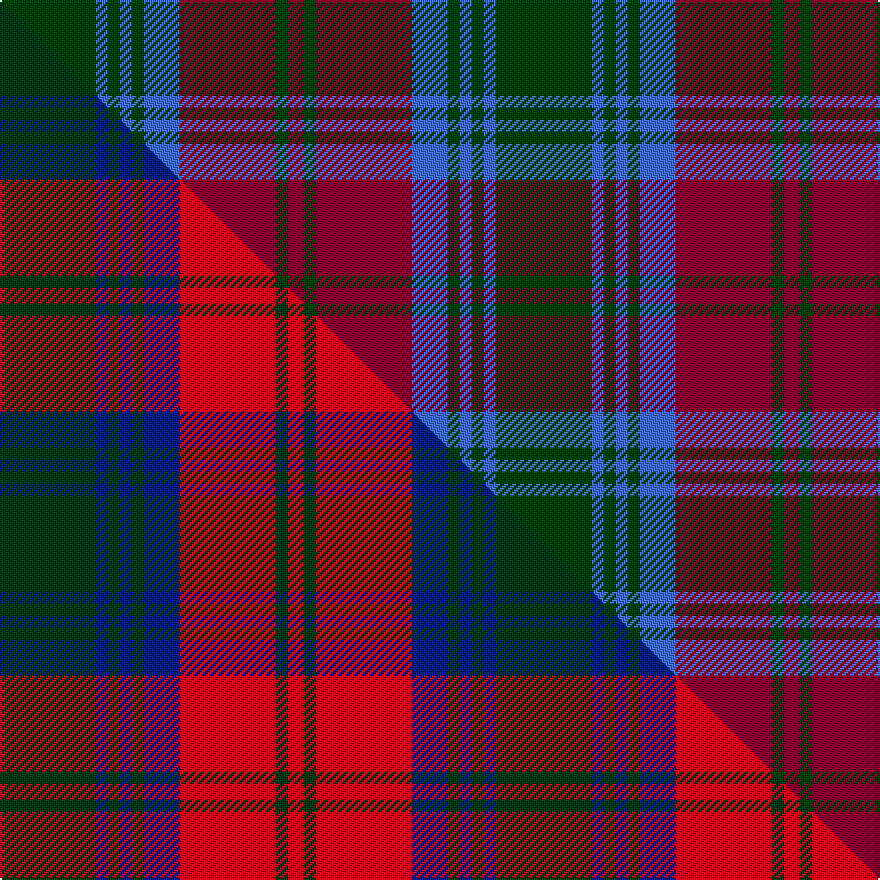

This page is one **sett** — a single exact thread-count. It belongs to the [tartan](/setts/dg24b3dg3b3dg3b9r24dg3r4/)
(the same proportion at any scale), whose colour order is pattern [GBGBGBRGR](/stripes/gbgbgbrgr/).

Part of the [Lindsay](/tartans/lindsay-2/) tartan — the named design grouping this sett with its other cloths.

Sourced from weddslist.  It is a [9 stripe tartan](/stripes/stripes9/).

Original link http://www.weddslist.com/cgi-bin/tartans/pg.pl?source=sts

## Thread count
DG/48 B6 DG6 B6 DG6 B18 R48 DG6 R/8

One full sett is **248 threads**.

## Palette
<table><thead><tr><th>Colour</th><th>Shade</th><th>OKLCh</th></tr></thead><tbody><tr><td>B</td><td><code style="background-color:#466CC8;">#466CC8</code> <small style="color:#888">#466CC8</small></td><td><small style="color:#888">oklch(55.1% 0.149 265.0)</small></td></tr><tr><td>DG</td><td><code style="background-color:#004010;">#004010</code> <small style="color:#888">#004010</small></td><td><small style="color:#888">oklch(32.3% 0.098 146.3)</small></td></tr><tr><td>R</td><td><code style="background-color:#800030;">#800030</code> <small style="color:#888">#800030</small></td><td><small style="color:#888">oklch(38.3% 0.153 10.1)</small></td></tr></tbody></table>

# Sample pattern

## Compared to the master

This cloth is one sett of its design; the master sett (the exemplar the design is anchored on) is below for comparison.

Its **ΔTartan distance** from the master is **0.18** — the same measure the nearest-tartans table ranks by (0 is identical; a re-scale of the same cloth is near 0, a recolour or a different proportion further).

<figure class="master-compare" style="margin:0">

this sett
master sett ★

<figcaption style="color:#888;font-size:smaller">One weave of this sett against the <a href="/setts/dg24db3dg3db3dg3db9r24dg3r4/">master sett ★</a>, split on the diagonal: a shared proportion runs seamlessly across it with only the shades shifting; a different proportion breaks on it.</figcaption>
</figure>

## Nearest tartan variants

The nearest existing variants by ΔTartan distance, with this cloth at the top so the swatches line up against it.

ΔTartan

Threads

Variant

Sett

—

248

<a href="/variants/s9/dg24b3dg3b3dg3b9r24dg3r4~x2~dg1304144-r1506009/">Lindsay</a>

<a href="/ttd/edit/#slug=dg24db3dg3db3dg3db9r24dg3r4~x2&amp;base=dg24b3dg3b3dg3b9r24dg3r4~x2~dg1304144-r1506009" title="compare in the TTD">0.18</a>

248

<a href="/variants/s9/dg24db3dg3db3dg3db9r24dg3r4~x2/">Lindsay (Chisholm Red)</a>

<a href="/ttd/edit/#slug=dg2r1dg8db2dg1db2dg1db10r2~x4&amp;base=dg24b3dg3b3dg3b9r24dg3r4~x2~dg1304144-r1506009" title="compare in the TTD">0.91</a>

216

<a href="/variants/s9/dg2r1dg8db2dg1db2dg1db10r2~x4/">Barnaby Brown Pibroch</a>

<a href="/ttd/edit/#slug=dg20db2dg2db2dg2db8r24db2r3~x2&amp;base=dg24b3dg3b3dg3b9r24dg3r4~x2~dg1304144-r1506009" title="compare in the TTD">1.43</a>

214

<a href="/variants/s9/dg20db2dg2db2dg2db8r24db2r3~x2/">Lindsay</a>

<a href="/ttd/edit/#slug=dg20db2dg2db2dg2db8r24db2r3&amp;base=dg24b3dg3b3dg3b9r24dg3r4~x2~dg1304144-r1506009" title="compare in the TTD">1.43</a>

107

<a href="/variants/s9/dg20db2dg2db2dg2db8r24db2r3/">Lindsay MINI Design Tartan</a>

<a href="/ttd/edit/#slug=g20db2g2db2g2db8dr24db2dr3~x2&amp;base=dg24b3dg3b3dg3b9r24dg3r4~x2~dg1304144-r1506009" title="compare in the TTD">1.43</a>

214

<a href="/variants/s9/g20db2g2db2g2db8dr24db2dr3~x2/">Lindsay</a>

<a href="/ttd/edit/#slug=r12y4r38dg25db8dg10db8dg8db25r3&amp;base=dg24b3dg3b3dg3b9r24dg3r4~x2~dg1304144-r1506009" title="compare in the TTD">2.06</a>

267

<a href="/variants/s10/r12y4r38dg25db8dg10db8dg8db25r3/">MacEdward (Personal)</a>

<a href="/ttd/edit/#slug=g18db3g3db3g2db8r23db2r4g2~x2&amp;base=dg24b3dg3b3dg3b9r24dg3r4~x2~dg1304144-r1506009" title="compare in the TTD">2.65</a>

232

<a href="/variants/s10/g18db3g3db3g2db8r23db2r4g2~x2/">McGlynn</a>

<a href="/ttd/edit/#slug=do12r1do2r1do2lb2do3n9r1n2r1n3~x4&amp;base=dg24b3dg3b3dg3b9r24dg3r4~x2~dg1304144-r1506009" title="compare in the TTD">3.13</a>

252

<a href="/variants/s12/do12r1do2r1do2lb2do3n9r1n2r1n3~x4/">Shieldhall (Fashion)</a>

<a href="/ttd/edit/#slug=dy5dt9r3dt5dy2dt4dy26lb3r4~x2~dt1204274&amp;base=dg24b3dg3b3dg3b9r24dg3r4~x2~dg1304144-r1506009" title="compare in the TTD">3.20</a>

226

<a href="/variants/s9/dy5db9r3db5dy2db4dy26lb3r4~x2~db1204274/">Bracken</a>

<a href="/ttd/edit/#slug=dp3o23dp3o26dp3o3dp25o3g24o3~x2~dp1607327&amp;base=dg24b3dg3b3dg3b9r24dg3r4~x2~dg1304144-r1506009" title="compare in the TTD">3.21</a>

452

<a href="/variants/s10/dp3o23dp3o26dp3o3dp25o3g24o3~x2~dp1607327/">Unidentified 18th Century</a>

## Neighbour map

Every grey dot is one of 13620 variants placed by the first two principal components of the ΔTartan feature space (42% of its variance). Red is this tartan; blue dots are its nearest — click one to open its page.

<svg viewBox="0 0 640 380" role="img" style="max-width:100%;height:auto;border:1px solid #e0e0e0;border-radius:4px;display:block" xmlns="http://www.w3.org/2000/svg"><image href="/nn/cloud.v1.png" width="640" height="380"/><a href="/variants/s9/dg24db3dg3db3dg3db9r24dg3r4~x2/"><circle cx="281.7" cy="208.2" r="4" fill="#3465a4"><title>Lindsay (Chisholm Red)</title></circle></a><a href="/variants/s9/dg2r1dg8db2dg1db2dg1db10r2~x4/"><circle cx="370.7" cy="225.5" r="4" fill="#3465a4"><title>Barnaby Brown Pibroch</title></circle></a><a href="/variants/s9/dg20db2dg2db2dg2db8r24db2r3~x2/"><circle cx="291.2" cy="184.0" r="4" fill="#3465a4"><title>Lindsay</title></circle></a><a href="/variants/s9/dg20db2dg2db2dg2db8r24db2r3/"><circle cx="291.2" cy="184.0" r="4" fill="#3465a4"><title>Lindsay MINI Design Tartan</title></circle></a><a href="/variants/s9/g20db2g2db2g2db8dr24db2dr3~x2/"><circle cx="320.8" cy="210.5" r="4" fill="#3465a4"><title>Lindsay</title></circle></a><a href="/variants/s10/r12y4r38dg25db8dg10db8dg8db25r3/"><circle cx="224.1" cy="191.8" r="4" fill="#3465a4"><title>MacEdward (Personal)</title></circle></a><a href="/variants/s10/g18db3g3db3g2db8r23db2r4g2~x2/"><circle cx="259.6" cy="186.3" r="4" fill="#3465a4"><title>McGlynn</title></circle></a><a href="/variants/s12/do12r1do2r1do2lb2do3n9r1n2r1n3~x4/"><circle cx="348.5" cy="187.1" r="4" fill="#3465a4"><title>Shieldhall (Fashion)</title></circle></a><a href="/variants/s9/dy5db9r3db5dy2db4dy26lb3r4~x2~db1204274/"><circle cx="361.8" cy="186.9" r="4" fill="#3465a4"><title>Bracken</title></circle></a><a href="/variants/s10/dp3o23dp3o26dp3o3dp25o3g24o3~x2~dp1607327/"><circle cx="344.9" cy="222.6" r="4" fill="#3465a4"><title>Unidentified 18th Century</title></circle></a><circle cx="323.1" cy="225.6" r="5" fill="#c00000"/><text x="320" y="376" text-anchor="middle" font-size="11" fill="#999">ground</text><text x="11" y="190" text-anchor="middle" font-size="11" fill="#999" transform="rotate(-90 11 190)">complexity</text></svg>

ID: /variants/s9/dg24b3dg3b3dg3b9r24dg3r4~x2~dg1304144-r1506009/
