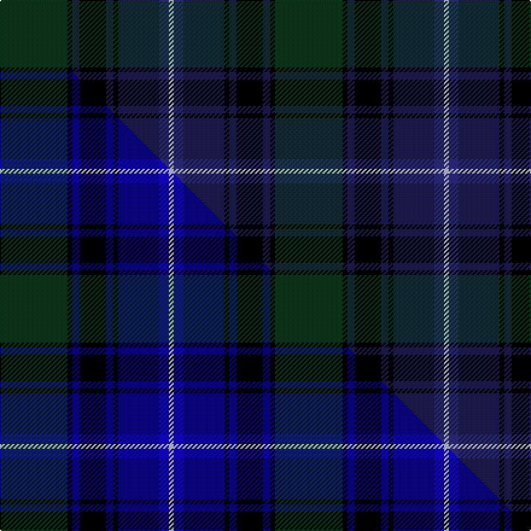

This page is one **sett** — a single exact thread-count. It belongs to the [tartan](/setts/dg28k2db3k11db3k2db17dbi4lb2/)
(the same proportion at any scale), whose colour order is pattern [GKBKBKBBW](/stripes/gkbkbkbbw/).

Part of the [West of Wells](/tartans/west-of-wells/) tartan — the named design grouping this sett with its other cloths.

Sourced from tartans-authority.  It is a [9 stripe tartan](/stripes/stripes9/).

Original link http://www.tartansauthority.com/tartan-ferret/display/10012/

## Provenance

Earliest known date: Mar. 2009 This sett is based on the Roxburghshire tartan because the Barony of Wells based in Jedburgh now belongs to Mr Bryce L. West.The chosen colours are the traditional navy and green often seen in tartans such as the Black Watch with the addition of a second blue for extra depth. The silver grey was a special request from Mr West. Exclusively designed by Kinloch Anderson. Restricted availability. Please contact Kinloch Anderson regarding use.

2 attestations — the source records this cloth was collapsed from (oldest owns this page)

<ul>
<li>Mar. 2009 — West of Wells (Personal) (tartans-authority, <a href="http://www.tartansauthority.com/tartan-ferret/display/10012/">record</a>)  <em>This sett is based on the Roxburghshire tartan because the Barony of Wells based in Jedburgh now belongs to Mr Bryce L. West.The chosen colours are the traditional navy and green often seen in tartans such as the Black Watch with the addition of a second blue for extra depth. The silver grey was a special request from Mr West. Exclusively designed by Kinloch Anderson. Restricted availability. Please contact Kinloch Anderson regarding use. The responsibility for any development of this tartan has been given to Kinloch Anderson.</em></li>
<li>undated — West of Wells Personal Tartan (house-of-tartan, <a href="http://www.house-of-tartan.scotland.net/house/TartanViewjs.asp?colr=Def&tnam=10012">record</a>) </li>
</ul>

## Register references

External register numbers recorded for this tartan.

- Scottish Register of Tartans: [10012](https://www.tartanregister.gov.uk/tartanDetails?ref=10012)
- Scottish Tartans Authority (ITI): 10012

## Thread count
DG/56 K4 DB6 K22 DB6 K4 DB34 DBi8 LB/4

One full sett is **228 threads**.

## Palette
<table><thead><tr><th>Colour</th><th>Shade</th><th>OKLCh</th></tr></thead><tbody><tr><td>DB</td><td><code style="background-color:#2C2C80;">#2C2C80</code> <small style="color:#888">#2C2C80</small></td><td><small style="color:#888">oklch(35.0% 0.138 276.6)</small></td></tr><tr><td>DB</td><td><code style="background-color:#1C1C50;">#1C1C50</code> <small style="color:#888">#1C1C50</small></td><td><small style="color:#888">oklch(26.2% 0.093 277.9)</small></td></tr><tr><td>DG</td><td><code style="background-color:#053819;">#053819</code> <small style="color:#888">#053819</small></td><td><small style="color:#888">oklch(30.0% 0.075 151.3)</small></td></tr><tr><td>K</td><td><code style="background-color:#000000;">#000000</code> <small style="color:#888">#000000</small></td><td><small style="color:#888">oklch(0.0% 0.000 0.0)</small></td></tr><tr><td>LB</td><td><code style="background-color:#B5BBDE;">#B5BBDE</code> <small style="color:#888">#B5BBDE</small></td><td><small style="color:#888">oklch(79.9% 0.050 277.6)</small></td></tr></tbody></table>

# Sample pattern

## Compared to the master

This cloth is one sett of its design; the master sett (the exemplar the design is anchored on) is below for comparison.

Its **ΔTartan distance** from the master is **1.35** — the same measure the nearest-tartans table ranks by (0 is identical; a re-scale of the same cloth is near 0, a recolour or a different proportion further).

<figure class="master-compare" style="margin:0">

this sett
master sett ★

<figcaption style="color:#888;font-size:smaller">One weave of this sett against the <a href="/setts/dg28k2db3k11db3k2db17b4lb2/">master sett ★</a>, split on the diagonal: a shared proportion runs seamlessly across it with only the shades shifting; a different proportion breaks on it.</figcaption>
</figure>

## Nearest tartan variants

The nearest existing variants by ΔTartan distance, with this cloth at the top so the swatches line up against it.

ΔTartan

Threads

Variant

Sett

—

228

<a href="/variants/s9/dg28k2db3k11db3k2db17dbi4lb2~x2~db1004274-dbi1406275/">West of Wells (Personal)</a>

0.00

—

<a href="/variants/s9/dg28k2db3k11db3k2db17b4lb2~x2~db1108266-b1511266/">West of Wells</a>

1.14

—

<a href="/variants/s9/db11k1db1k1db1k7dg8r1n7~x4~db1204274-n2203265/">Damm, Alexander (Personal)</a>

1.26

—

<a href="/variants/s10/dp2dg16k16db2k2db2k2db15dbi3y2~x2~db1204274-dbi1406275/">Brydon (2013)</a>

<a href="/ttd/edit/#slug=dp2dg16k16dt2k2dt2k2dt15db3y2~x2~dt1102249-db1108266&amp;base=dg28k2db3k11db3k2db17dbi4lb2~x2~db1004274-dbi1406275" title="compare in the TTD">1.26</a>

240

<a href="/variants/s10/dp2dg16k16dt2k2dt2k2dt15db3y2~x2~dt1102249-db1108266/">Brydon (Scottish Borders)</a>

<a href="/ttd/edit/#slug=db44k3ly20dr3db8k34db5k15~x2~k0700000-ly2705081&amp;base=dg28k2db3k11db3k2db17dbi4lb2~x2~db1004274-dbi1406275" title="compare in the TTD">2.53</a>

410

<a href="/variants/s8/db44k3ly20dr3db8k34db5k15~x2~k0700000-ly2705081/">U.S. Air Force Reserve P. B. (Corpor</a>

## Neighbour map

Every grey dot is one of 13620 variants placed by the first two principal components of the ΔTartan feature space (42% of its variance). Red is this tartan; blue dots are its nearest — click one to open its page.

<svg viewBox="0 0 640 380" role="img" style="max-width:100%;height:auto;border:1px solid #e0e0e0;border-radius:4px;display:block" xmlns="http://www.w3.org/2000/svg"><image href="/nn/cloud.v1.png" width="640" height="380"/><a href="/variants/s9/dg28k2db3k11db3k2db17b4lb2~x2~db1108266-b1511266/"><circle cx="219.3" cy="155.1" r="4" fill="#3465a4"><title>West of Wells</title></circle></a><a href="/variants/s9/db11k1db1k1db1k7dg8r1n7~x4~db1204274-n2203265/"><circle cx="161.7" cy="171.7" r="4" fill="#3465a4"><title>Damm, Alexander (Personal)</title></circle></a><a href="/variants/s10/dp2dg16k16db2k2db2k2db15dbi3y2~x2~db1204274-dbi1406275/"><circle cx="172.9" cy="169.5" r="4" fill="#3465a4"><title>Brydon (2013)</title></circle></a><a href="/variants/s10/dp2dg16k16dt2k2dt2k2dt15db3y2~x2~dt1102249-db1108266/"><circle cx="188.5" cy="176.4" r="4" fill="#3465a4"><title>Brydon (Scottish Borders)</title></circle></a><a href="/variants/s8/db44k3ly20dr3db8k34db5k15~x2~k0700000-ly2705081/"><circle cx="240.8" cy="169.3" r="4" fill="#3465a4"><title>U.S. Air Force Reserve P. B. (Corpor</title></circle></a><circle cx="251.2" cy="165.1" r="5" fill="#c00000"/><text x="320" y="376" text-anchor="middle" font-size="11" fill="#999">ground</text><text x="11" y="190" text-anchor="middle" font-size="11" fill="#999" transform="rotate(-90 11 190)">complexity</text></svg>

ID: /variants/s9/dg28k2db3k11db3k2db17dbi4lb2~x2~db1004274-dbi1406275/
