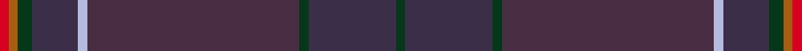
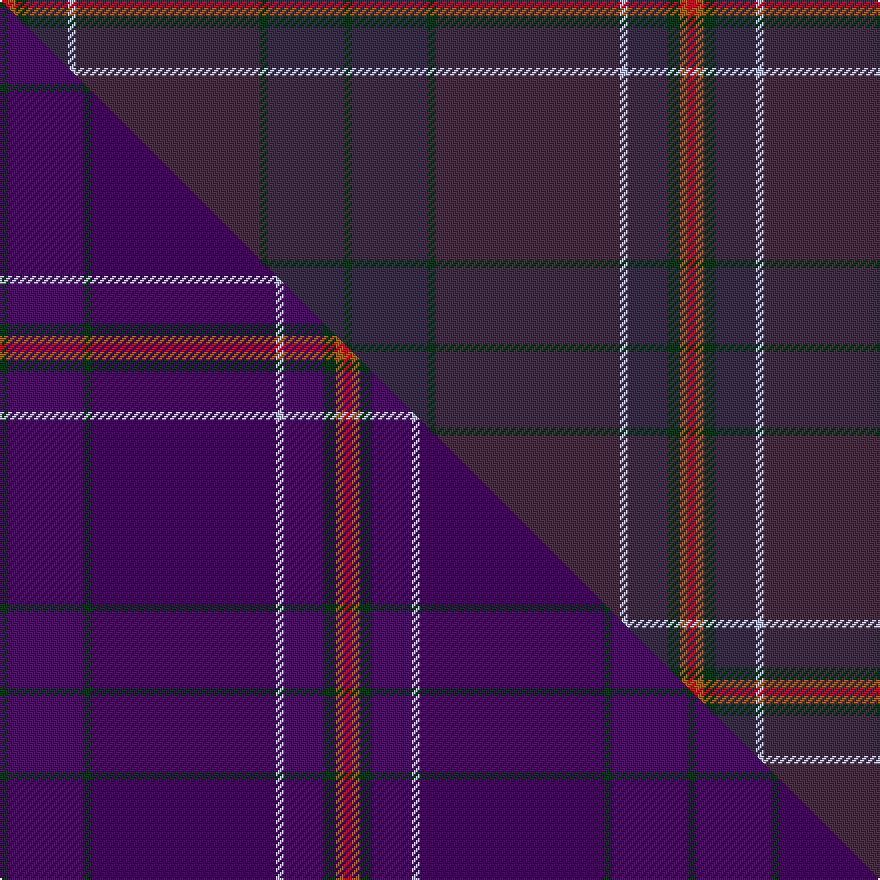

This is one **variant** — a specific cloth: this exact thread count and colourway, with its own
provenance below. It is one weaving of the [sett](/tartans/s/sp/spirit-of-hoxa/) (the scale-free proportion — the
same cloth at any scale or shade), whose colour order is pattern [GBGBWBGRR](/stripes/gbgbwbgrr/).

Part of the [Spirit of Hoxa](/tartans/s/sp/spirit-of-hoxa/) tartan — the named design grouping this sett with its other cloths.

Sourced from house-of-tartan.  It is a [9 stripe tartan](/stripes/stripes9/).

Original link [http://www.house-of-tartan.scotland.net/house/TartanViewjs.asp?colr=Def&tnam=10705](http://www.house-of-tartan.scotland.net/house/TartanViewjs.asp?colr=Def&tnam=10705)

## Provenance

Earliest known date: 24 September 2012 Allison Dearness, who was born and bred in the district of Hoxa in Orkney, has designed this tartan, with Lochcarron of Scotland. Prior to the opening of the Churchill barriers (causeways) in 1945, the parish of South Ronaldsay was an island, which was made up of various districts, one of which was, and still is, called Hoxa. Situated on the South West corner of South Ronaldsay, this district is mainly agricultural, although its main claim to fame is that this area houses the remains of the gun emplacements which defended the RN Home Fleet in Scapa Flow during two world wars. As a consequence not only does this district have a prominent part in Orcadian history, but also for the huge numbers of ex servicemen-women who defended Scapa Flow during those wars. This tartan will be available from Allisons Formal Dress Hire Ltd, 105 Rosemount Place, Aberdeen AB25 2YG Email: allisonskilts@onebillnet.co.uk

Dataset <small>— provenance for this record, inherited from the source manifest</small>

<dl class="dataset-prov">
<dt>source</dt><dd><a href="/sources/house-of-tartan/">House of Tartan</a></dd>
<dt>data captured from</dt><dd><a href="https://github.com/thetartan/tartan-database/blob/master/data/house-of-tartan/data.csv">https://github.com/thetartan/tartan-database/blob/master/data/house-of-tartan/data.csv</a></dd>
<dt>data date</dt><dd>24 September 2012 <small>(this record)</small></dd>
<dt>licence</dt><dd><a href="https://creativecommons.org/licenses/by-nc-nd/4.0/">CC BY-NC-ND 4.0</a></dd>
</dl>

Capture chain <small>— the hands this data passed through, oldest first; each capture carries its own licence</small>

<ol class="capture-chain">
<li><a href="http://www.house-of-tartan.scotland.net/">House of Tartan</a> <small>the weaver/retailer's database — the site is now offline; the URL is kept as the ultimate source's identity</small></li>
<li><a href="https://github.com/thetartan/tartan-database">thetartan/tartan-database</a> <small>2016-2017</small> · <a href="https://creativecommons.org/licenses/by-nc-nd/4.0/">CC BY-NC-ND 4.0</a> <small>Levko Kravets's frozen compilation — the capture we vendored, and where its CC licence text came from</small></li>
<li>this dictionary <small>captured 2026-06-10 · commit 5bf86c7566</small> <small>each re-capture is a git commit to data/sources</small></li>
</ol>

## Thread count
R/4 O4 DG6 DT20 LB4 DO92 DG4 DT38 DG/4

One full sett is **344 threads**.

## Palette
<table><thead><tr><th>Colour</th><th>Shade</th><th>OKLCh</th></tr></thead><tbody><tr><td>DT</td><td><code style="background-color:#3A2E49;">#3A2E49</code> <small style="color:#888">#3A2E49</small></td><td><small style="color:#888">oklch(32.7% 0.049 304.2)</small></td></tr><tr><td>DG</td><td><code style="background-color:#053819;">#053819</code> <small style="color:#888">#053819</small></td><td><small style="color:#888">oklch(30.0% 0.075 151.3)</small></td></tr><tr><td>LB</td><td><code style="background-color:#B5BBDE;">#B5BBDE</code> <small style="color:#888">#B5BBDE</small></td><td><small style="color:#888">oklch(79.9% 0.050 277.6)</small></td></tr><tr><td>R</td><td><code style="background-color:#D60020;">#D60020</code> <small style="color:#888">#D60020</small></td><td><small style="color:#888">oklch(55.2% 0.224 25.5)</small></td></tr><tr><td>O</td><td><code style="background-color:#A65C11;">#A65C11</code> <small style="color:#888">#A65C11</small></td><td><small style="color:#888">oklch(55.0% 0.125 58.3)</small></td></tr><tr><td>DO</td><td><code style="background-color:#482D43;">#482D43</code> <small style="color:#888">#482D43</small></td><td><small style="color:#888">oklch(33.9% 0.053 333.5)</small></td></tr></tbody></table>

# Sample pattern

## Compared to the master

This cloth is one sett of its design; the master sett (the exemplar the design is anchored on) is below for comparison.

Its **ΔTartan distance** from the master is **5.81** — the same measure the nearest-tartans table ranks by (0 is identical; a re-scale of the same cloth is near 0, a recolour or a different proportion further).

<figure class="master-compare" style="margin:0">

this sett
master sett ★

<figcaption style="color:#888;font-size:smaller">One weave of this sett against the <a href="/setts/dg2dpi19dg2dp46lb2dpi10dg3o2r2/">master sett ★</a>, split on the diagonal: a shared proportion runs seamlessly across it with only the shades shifting; a different proportion breaks on it.</figcaption>
</figure>

ID: /variants/s9/dg2dt19dg2do46lb2dt10dg3o2r2~x2~dt1302305-do1402332/
