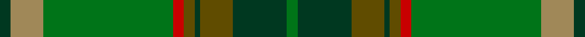

This page is one **sett** — a single exact thread-count. It belongs to the [tartan](/setts/dg2lo6g24r2y2dg1y6dg10g2/)
(the same proportion at any scale), whose colour order is pattern [GGGGGRGYG](/stripes/gggggrgyg/).

Part of the [Fitzgibbon](/tartans/fitzgibbon/) tartan — the named design grouping this sett with its other cloths.

Sourced from tartans-authority.  It is a [9 stripe tartan](/stripes/stripes9/).

Original link http://www.tartansauthority.com/tartan-ferret/display/6919/

## Also known as

This cloth is also recorded under:

- Fitzgibbon Red

2 attestations — the source records this cloth was collapsed from (oldest owns this page)

<ul>
<li>2005 — Fitzgibbon (Name) (tartans-authority, <a href="http://www.tartansauthority.com/tartan-ferret/display/6919/">record</a>)</li>
<li>01/01/2006 — Fitzgibbon (register-of-tartans, <a href="https://www.tartanregister.gov.uk/tartanDetails.aspx?ref=1198">record</a>)</li>
</ul>

## Register references

External register numbers recorded for this tartan.

- Scottish Register of Tartans: [1198](https://www.tartanregister.gov.uk/tartanDetails.aspx?ref=1198)
- Scottish Tartans Authority (ITI): 6919

## Thread count
DG/4 LT12 G48 R4 T4 DG2 T12 DG20 G/4

One full sett is **212 threads**.

## Palette

Palette: <strong>Tartan Register</strong> <small style="color:#888">(3 of 5 colours)</small>
<table><thead><tr><th>Colour</th><th>Threads</th><th>Shade</th><th>Base</th><th>OKLCh</th></tr></thead><tbody><tr><td>DG/</td><td style="text-align:right;font-variant-numeric:tabular-nums">4</td><td><code style="background-color:#003820;">#003820</code> <small style="color:#888">#003820</small></td><td>G <code style="background-color:#006100;">#006100</code></td><td><small style="color:#888">oklch(30.0% 0.070 158.3)</small></td></tr><tr><td>LT</td><td style="text-align:right;font-variant-numeric:tabular-nums">12</td><td><code style="background-color:#A08858;">#A08858</code> <small style="color:#888">#A08858</small></td><td>Y <code style="background-color:#F2BF00;">#F2BF00</code></td><td><small style="color:#888">oklch(63.7% 0.071 84.0)</small></td></tr><tr><td>G</td><td style="text-align:right;font-variant-numeric:tabular-nums">48</td><td><code style="background-color:#007418;">#007418</code> <small style="color:#888">#007418</small></td><td>G <code style="background-color:#006100;">#006100</code></td><td><small style="color:#888">oklch(48.5% 0.155 144.4)</small></td></tr><tr><td>R</td><td style="text-align:right;font-variant-numeric:tabular-nums">4</td><td><code style="background-color:#C80000;">#C80000</code> <small style="color:#888">#C80000</small></td><td>R <code style="background-color:#CC0000;">#CC0000</code></td><td><small style="color:#888">oklch(52.3% 0.215 29.2)</small></td></tr><tr><td>T</td><td style="text-align:right;font-variant-numeric:tabular-nums">4</td><td><code style="background-color:#604C00;">#604C00</code> <small style="color:#888">#604C00</small></td><td>G <code style="background-color:#006100;">#006100</code></td><td><small style="color:#888">oklch(42.5% 0.087 91.4)</small></td></tr><tr><td>DG</td><td style="text-align:right;font-variant-numeric:tabular-nums">2</td><td><code style="background-color:#003820;">#003820</code> <small style="color:#888">#003820</small></td><td>G <code style="background-color:#006100;">#006100</code></td><td><small style="color:#888">oklch(30.0% 0.070 158.3)</small></td></tr><tr><td>T</td><td style="text-align:right;font-variant-numeric:tabular-nums">12</td><td><code style="background-color:#604C00;">#604C00</code> <small style="color:#888">#604C00</small></td><td>G <code style="background-color:#006100;">#006100</code></td><td><small style="color:#888">oklch(42.5% 0.087 91.4)</small></td></tr><tr><td>DG</td><td style="text-align:right;font-variant-numeric:tabular-nums">20</td><td><code style="background-color:#003820;">#003820</code> <small style="color:#888">#003820</small></td><td>G <code style="background-color:#006100;">#006100</code></td><td><small style="color:#888">oklch(30.0% 0.070 158.3)</small></td></tr><tr><td>G/</td><td style="text-align:right;font-variant-numeric:tabular-nums">4</td><td><code style="background-color:#007418;">#007418</code> <small style="color:#888">#007418</small></td><td>G <code style="background-color:#006100;">#006100</code></td><td><small style="color:#888">oklch(48.5% 0.155 144.4)</small></td></tr></tbody></table>

## Compared to the master

This cloth is one sett of its design; the master sett (the exemplar the design is anchored on) is below for comparison.

<figure style="margin:0"><figcaption style="color:#888;font-size:smaller">this sett</figcaption></figure>
<figure style="margin:0"><figcaption style="color:#888;font-size:smaller"><a href="/setts/r2dt1ri6r1ri2dg2ri24dt6ri2/">master sett →</a></figcaption></figure>

## Nearest tartans

The nearest existing variants by ΔTartan distance, with this tartan at the top so the swatches line up against it.

ΔTartan

Tartan

Sett

—

<a href="/ttd/edit/#slug=dg2lo6g24r2y2dg1y6dg10g2~x2">Fitzgibbon (Name)</a> <a class="nn-out" href="/variants/s9/dg2lo6g24r2y2dg1y6dg10g2~x2/" title="open its dictionary page">↗</a>

1.11

<a href="/ttd/edit/#slug=gi6g2r2gi30y2g4y2dg2y1dg20y1g2r4~x2&amp;base=dg2lo6g24r2y2dg1y6dg10g2~x2">All Ireland Green (Fashion)</a> <a class="nn-out" href="/variants/s13/gi6g2r2gi30y2g4y2dg2y1dg20y1g2r4~x2/" title="open its dictionary page">↗</a>

1.19

<a href="/ttd/edit/#slug=gi6g2r2gi30o2g4o2dg2o1dg20o1g2r4~x2&amp;base=dg2lo6g24r2y2dg1y6dg10g2~x2">All Irish Green Irish District Tartan</a> <a class="nn-out" href="/variants/s13/gi6g2r2gi30o2g4o2dg2o1dg20o1g2r4~x2/" title="open its dictionary page">↗</a>

1.33

<a href="/ttd/edit/#slug=dp4g4y2w3g27y30ly1r3~x2&amp;base=dg2lo6g24r2y2dg1y6dg10g2~x2">Hannigan of Dirleton (Personal)</a> <a class="nn-out" href="/variants/s8/dp4g4y2w3g27y30ly1r3~x2/" title="open its dictionary page">↗</a>

1.46

<a href="/ttd/edit/#slug=g1r7g7n2r1dg15lb1~x4&amp;base=dg2lo6g24r2y2dg1y6dg10g2~x2">Ramsay (Green Fashion)</a> <a class="nn-out" href="/variants/s7/g1r7g7n2r1dg15lb1~x4/" title="open its dictionary page">↗</a>

1.48

<a href="/ttd/edit/#slug=r4g46r10db10dy33db5dy4lo3~x2&amp;base=dg2lo6g24r2y2dg1y6dg10g2~x2">State Seal of Minnesota (Fashion)</a> <a class="nn-out" href="/variants/s8/r4g46r10db10dy33db5dy4lo3~x2/" title="open its dictionary page">↗</a>

1.54

<a href="/ttd/edit/#slug=y5do5y5do5y5g24do1db12g6do3~x2&amp;base=dg2lo6g24r2y2dg1y6dg10g2~x2">Royal Scottish Agricultural Benevolent Institution</a> <a class="nn-out" href="/variants/s10/y5do5y5do5y5g24do1db12g6do3~x2/" title="open its dictionary page">↗</a>

1.55

<a href="/ttd/edit/#slug=dy6w1dy24db6g2db1g2db1g12r1~x2&amp;base=dg2lo6g24r2y2dg1y6dg10g2~x2">Chisholm Hunting Clan Tartan</a> <a class="nn-out" href="/variants/s10/dy6w1dy24db6g2db1g2db1g12r1~x2/" title="open its dictionary page">↗</a>

1.62

<a href="/ttd/edit/#slug=g11r6dt6do2g3do2dt6r6g36lo2do3lo2dt5r5~x2&amp;base=dg2lo6g24r2y2dg1y6dg10g2~x2">Westmeath (District)</a> <a class="nn-out" href="/variants/s14/g11r6dt6do2g3do2dt6r6g36lo2do3lo2dt5r5~x2/" title="open its dictionary page">↗</a>

1.66

<a href="/ttd/edit/#slug=g21k1r4k1dy21g3dy3g3dy21g3ly4g21dy3g3dy3~x2&amp;base=dg2lo6g24r2y2dg1y6dg10g2~x2">Ensign of Ontario Canadian Tartan</a> <a class="nn-out" href="/variants/s15/g21k1r4k1dy21g3dy3g3dy21g3ly4g21dy3g3dy3~x2/" title="open its dictionary page">↗</a>

1.66

<a href="/ttd/edit/#slug=p4g4dy2w3g27dy30ly1r3~x2&amp;base=dg2lo6g24r2y2dg1y6dg10g2~x2">Hannigan of Dirleton</a> <a class="nn-out" href="/variants/s8/p4g4dy2w3g27dy30ly1r3~x2/" title="open its dictionary page">↗</a>

## Neighbour map

Every grey dot is one of 14360 variants placed by the first two principal components of the ΔTartan feature space (44% of its variance). Red is this tartan; blue dots are its nearest — click one to open its page.

<svg viewBox="0 0 640 380" role="img" style="max-width:100%;height:auto;border:1px solid #e0e0e0;border-radius:4px;display:block" xmlns="http://www.w3.org/2000/svg"><image href="/nn/cloud.v1.png" width="640" height="380"/><a href="/variants/s13/gi6g2r2gi30y2g4y2dg2y1dg20y1g2r4~x2/"><circle cx="334.7" cy="132.2" r="4" fill="#3465a4"><title>All Ireland Green (Fashion)</title></circle></a><a href="/variants/s13/gi6g2r2gi30o2g4o2dg2o1dg20o1g2r4~x2/"><circle cx="327.9" cy="126.3" r="4" fill="#3465a4"><title>All Irish Green Irish District Tartan</title></circle></a><a href="/variants/s8/dp4g4y2w3g27y30ly1r3~x2/"><circle cx="332.8" cy="146.3" r="4" fill="#3465a4"><title>Hannigan of Dirleton (Personal)</title></circle></a><a href="/variants/s7/g1r7g7n2r1dg15lb1~x4/"><circle cx="314.2" cy="212.4" r="4" fill="#3465a4"><title>Ramsay (Green Fashion)</title></circle></a><a href="/variants/s8/r4g46r10db10dy33db5dy4lo3~x2/"><circle cx="289.3" cy="195.3" r="4" fill="#3465a4"><title>State Seal of Minnesota (Fashion)</title></circle></a><a href="/variants/s10/y5do5y5do5y5g24do1db12g6do3~x2/"><circle cx="301.8" cy="197.3" r="4" fill="#3465a4"><title>Royal Scottish Agricultural Benevolent Institution</title></circle></a><a href="/variants/s10/dy6w1dy24db6g2db1g2db1g12r1~x2/"><circle cx="389.7" cy="159.4" r="4" fill="#3465a4"><title>Chisholm Hunting Clan Tartan</title></circle></a><a href="/variants/s14/g11r6dt6do2g3do2dt6r6g36lo2do3lo2dt5r5~x2/"><circle cx="331.1" cy="145.4" r="4" fill="#3465a4"><title>Westmeath (District)</title></circle></a><a href="/variants/s15/g21k1r4k1dy21g3dy3g3dy21g3ly4g21dy3g3dy3~x2/"><circle cx="366.0" cy="168.0" r="4" fill="#3465a4"><title>Ensign of Ontario Canadian Tartan</title></circle></a><a href="/variants/s8/p4g4dy2w3g27dy30ly1r3~x2/"><circle cx="305.6" cy="129.9" r="4" fill="#3465a4"><title>Hannigan of Dirleton</title></circle></a><circle cx="328.9" cy="171.5" r="5" fill="#c00000"/></svg>

ID: /variants/s9/dg2lo6g24r2y2dg1y6dg10g2~x2/
