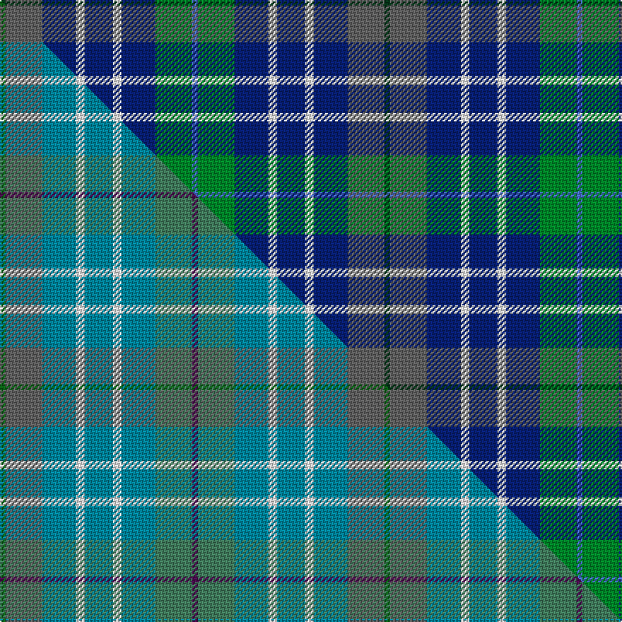

This page is one **sett** — a single exact thread-count. It belongs to the [tartan](/setts/dg2n13db12w3db10w3db12g13b2/)
(the same proportion at any scale), whose colour order is pattern [BGBWBWBBG](/stripes/bgbwbwbbg/).

Part of the [Mounth, The](/tartans/mounth-the/) tartan — the named design grouping this sett with its other cloths.

Sourced from weddslist.  It is a [9 stripe tartan](/stripes/stripes9/).

Original link http://www.weddslist.com/cgi-bin/tartans/pg.pl?source=sts

## Thread count
DG/4 N26 DB24 W6 DB20 W6 DB24 G26 B/4

One full sett is **272 threads**.

## Palette
<table><thead><tr><th>Colour</th><th>Shade</th><th>OKLCh</th></tr></thead><tbody><tr><td>DB</td><td><code style="background-color:#082077;">#082077</code> <small style="color:#888">#082077</small></td><td><small style="color:#888">oklch(30.0% 0.149 265.1)</small></td></tr><tr><td>DG</td><td><code style="background-color:#053819;">#053819</code> <small style="color:#888">#053819</small></td><td><small style="color:#888">oklch(30.0% 0.075 151.3)</small></td></tr><tr><td>B</td><td><code style="background-color:#466CC8;">#466CC8</code> <small style="color:#888">#466CC8</small></td><td><small style="color:#888">oklch(55.1% 0.149 265.0)</small></td></tr><tr><td>G</td><td><code style="background-color:#008B2A;">#008B2A</code> <small style="color:#888">#008B2A</small></td><td><small style="color:#888">oklch(55.4% 0.170 145.9)</small></td></tr><tr><td>W</td><td><code style="background-color:#F7F7F7;">#F7F7F7</code> <small style="color:#888">#F7F7F7</small></td><td><small style="color:#888">oklch(97.6% 0.000 89.9)</small></td></tr><tr><td>N</td><td><code style="background-color:#636363;">#636363</code> <small style="color:#888">#636363</small></td><td><small style="color:#888">oklch(50.0% 0.000 89.9)</small></td></tr></tbody></table>

# Sample pattern

## Compared to the master

This cloth is one sett of its design; the master sett (the exemplar the design is anchored on) is below for comparison.

Its **ΔTartan distance** from the master is **0.44** — the same measure the nearest-tartans table ranks by (0 is identical; a re-scale of the same cloth is near 0, a recolour or a different proportion further).

<figure class="master-compare" style="margin:0">

this sett
master sett ★

<figcaption style="color:#888;font-size:smaller">One weave of this sett against the <a href="/setts/dg2n13t12w3t10w3t12g13dp2/">master sett ★</a>, split on the diagonal: a shared proportion runs seamlessly across it with only the shades shifting; a different proportion breaks on it.</figcaption>
</figure>

## Nearest tartan variants

The nearest existing variants by ΔTartan distance, with this cloth at the top so the swatches line up against it.

ΔTartan

Threads

Variant

Sett

—

272

<a href="/variants/s9/dg2n13db12w3db10w3db12g13b2~x2/">Mounth, The</a>

<a href="/ttd/edit/#slug=lb8dbi11w3dbi11db12g10dr2~x2~dbi1404245-db1106275&amp;base=dg2n13db12w3db10w3db12g13b2~x2" title="compare in the TTD">2.91</a>

208

<a href="/variants/s7/lb8dbi11w3dbi11db12g10dr2~x2~dbi1404245-db1106275/">Loch Katrine</a>

<a href="/ttd/edit/#slug=y3lb6lg20db5g3db15ly3db3lg3~x2~lg2904173-db1404245-g2304202-ly3104101&amp;base=dg2n13db12w3db10w3db12g13b2~x2" title="compare in the TTD">3.13</a>

232

<a href="/variants/s9/y3lb6lg20db5g3db15ly3db3lg3~x2~lg2904173-db1404245-g2304202-ly3104101/">WestJet</a>

<a href="/ttd/edit/#slug=g4do21ly10do5ly4dr4db10g6db30w4~x2&amp;base=dg2n13db12w3db10w3db12g13b2~x2" title="compare in the TTD">3.38</a>

376

<a href="/variants/s10/g4do21ly10do5ly4dr4db10g6db30w4~x2/">State Seal of Arizona (Fashion)</a>

<a href="/ttd/edit/#slug=n6dbi8n8g12db29w3db4~x2~dbi1105279&amp;base=dg2n13db12w3db10w3db12g13b2~x2" title="compare in the TTD">3.42</a>

260

<a href="/variants/s7/n6dbi8n8g12db29w3db4~x2~dbi1105279/">Dickson Name Tartan</a>

<a href="/ttd/edit/#slug=b9dr1db5g5lb2g5db5dr1b9db2~x4&amp;base=dg2n13db12w3db10w3db12g13b2~x2" title="compare in the TTD">3.42</a>

308

<a href="/variants/s10/b9dr1db5g5lb2g5db5dr1b9db2~x4/">American Express Corporate Tartan</a>

<a href="/ttd/edit/#slug=db5t43db18w4t6dr5dy25ly5~x2&amp;base=dg2n13db12w3db10w3db12g13b2~x2" title="compare in the TTD">3.43</a>

424

<a href="/variants/s8/db5t43db18w4t6dr5dy25ly5~x2/">State Seal of Iowa (Fashion)</a>

<a href="/ttd/edit/#slug=db20n2lb2n4g20w2db16n7lb2db3lb5~x2&amp;base=dg2n13db12w3db10w3db12g13b2~x2" title="compare in the TTD">3.49</a>

282

<a href="/variants/s11/db20n2lb2n4g20w2db16n7lb2db3lb5~x2/">U.S.I. Limited</a>

<a href="/ttd/edit/#slug=g18dp3db10dbi2db10dp20g20dp3y2db2~x2~dp1607327-db0805267-dbi1307262&amp;base=dg2n13db12w3db10w3db12g13b2~x2" title="compare in the TTD">3.54</a>

320

<a href="/variants/s10/g18dp3db10dbi2db10dp20g20dp3y2db2~x2~dp1607327-db0805267-dbi1307262/">Glasgow Cathedral Corporate Tartan</a>

<a href="/ttd/edit/#slug=db2dr1db10w1dy4g8ly1g2~x4&amp;base=dg2n13db12w3db10w3db12g13b2~x2" title="compare in the TTD">3.57</a>

216

<a href="/variants/s8/db2dr1db10w1dy4g8ly1g2~x4/">Ayrshire (District)</a>

<a href="/ttd/edit/#slug=g16lb2g4t4g4lb2g6db12dr2db20y3~x2&amp;base=dg2n13db12w3db10w3db12g13b2~x2" title="compare in the TTD">3.59</a>

262

<a href="/variants/s11/g16lb2g4t4g4lb2g6db12dr2db20y3~x2/">First Command Fin. Planning (Corp)</a>

## Neighbour map

Every grey dot is one of 13620 variants placed by the first two principal components of the ΔTartan feature space (42% of its variance). Red is this tartan; blue dots are its nearest — click one to open its page.

<svg viewBox="0 0 640 380" role="img" style="max-width:100%;height:auto;border:1px solid #e0e0e0;border-radius:4px;display:block" xmlns="http://www.w3.org/2000/svg"><image href="/nn/cloud.v1.png" width="640" height="380"/><a href="/variants/s7/lb8dbi11w3dbi11db12g10dr2~x2~dbi1404245-db1106275/"><circle cx="127.2" cy="260.3" r="4" fill="#3465a4"><title>Loch Katrine</title></circle></a><a href="/variants/s9/y3lb6lg20db5g3db15ly3db3lg3~x2~lg2904173-db1404245-g2304202-ly3104101/"><circle cx="191.5" cy="213.1" r="4" fill="#3465a4"><title>WestJet</title></circle></a><a href="/variants/s10/g4do21ly10do5ly4dr4db10g6db30w4~x2/"><circle cx="169.0" cy="190.8" r="4" fill="#3465a4"><title>State Seal of Arizona (Fashion)</title></circle></a><a href="/variants/s7/n6dbi8n8g12db29w3db4~x2~dbi1105279/"><circle cx="250.3" cy="206.0" r="4" fill="#3465a4"><title>Dickson Name Tartan</title></circle></a><a href="/variants/s10/b9dr1db5g5lb2g5db5dr1b9db2~x4/"><circle cx="227.1" cy="237.2" r="4" fill="#3465a4"><title>American Express Corporate Tartan</title></circle></a><a href="/variants/s8/db5t43db18w4t6dr5dy25ly5~x2/"><circle cx="233.6" cy="189.9" r="4" fill="#3465a4"><title>State Seal of Iowa (Fashion)</title></circle></a><a href="/variants/s11/db20n2lb2n4g20w2db16n7lb2db3lb5~x2/"><circle cx="244.7" cy="191.3" r="4" fill="#3465a4"><title>U.S.I. Limited</title></circle></a><a href="/variants/s10/g18dp3db10dbi2db10dp20g20dp3y2db2~x2~dp1607327-db0805267-dbi1307262/"><circle cx="225.5" cy="200.7" r="4" fill="#3465a4"><title>Glasgow Cathedral Corporate Tartan</title></circle></a><a href="/variants/s8/db2dr1db10w1dy4g8ly1g2~x4/"><circle cx="209.5" cy="191.1" r="4" fill="#3465a4"><title>Ayrshire (District)</title></circle></a><a href="/variants/s11/g16lb2g4t4g4lb2g6db12dr2db20y3~x2/"><circle cx="227.2" cy="185.6" r="4" fill="#3465a4"><title>First Command Fin. Planning (Corp)</title></circle></a><circle cx="195.5" cy="227.5" r="5" fill="#c00000"/><text x="320" y="376" text-anchor="middle" font-size="11" fill="#999">ground</text><text x="11" y="190" text-anchor="middle" font-size="11" fill="#999" transform="rotate(-90 11 190)">complexity</text></svg>

ID: /variants/s9/dg2n13db12w3db10w3db12g13b2~x2/
