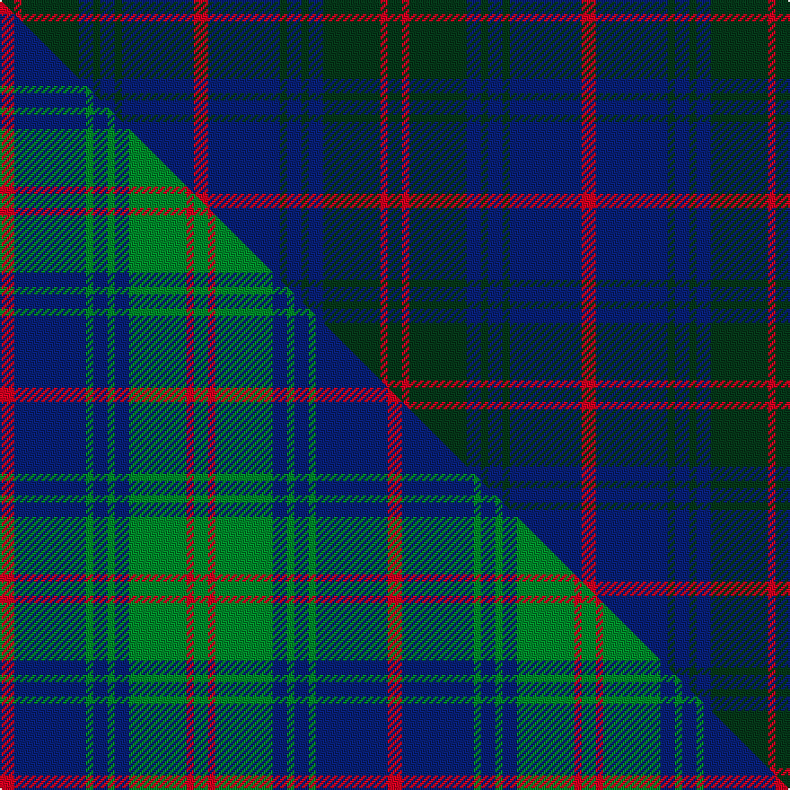

This is one **variant** — a specific cloth: this exact thread count and colourway, with its own
provenance below. It is one weaving of the [sett](/setts/dg2r1dg8db2dg1db2dg1db10r2/) (the scale-free proportion — the
same cloth at any scale or shade), whose colour order is pattern [GRGBGBGBR](/stripes/grgbgbgbr/).

Part of the [Barnaby Brown Pibroch](/tartans/barnaby-brown-pibroch/) tartan — the named design grouping this sett with its other cloths.

Sourced from weddslist.  It is a [9 stripe tartan](/stripes/stripes9/).

Original link [http://www.weddslist.com/cgi-bin/tartans/pg.pl?source=sts](http://www.weddslist.com/cgi-bin/tartans/pg.pl?source=sts)

Dataset <small>— provenance for this record, inherited from the source manifest</small>

<dl class="dataset-prov">
<dt>source</dt><dd><a href="/sources/weddslist/">Weddslist</a></dd>
<dt>data captured from</dt><dd><a href="https://github.com/thetartan/tartan-database/blob/master/data/weddslist/data.csv">https://github.com/thetartan/tartan-database/blob/master/data/weddslist/data.csv</a></dd>
<dt>data date</dt><dd>2016-11-17 <small>(dataset default)</small></dd>
<dt>licence</dt><dd><a href="https://creativecommons.org/licenses/by-nc-nd/4.0/">CC BY-NC-ND 4.0</a></dd>
</dl>

Capture chain <small>— the hands this data passed through, oldest first; each capture carries its own licence</small>

<ol class="capture-chain">
<li><a href="https://www.weddslist.com/tartans/">Weddslist</a> <small>the living privately compiled reference</small></li>
<li><a href="https://github.com/thetartan/tartan-database">thetartan/tartan-database</a> <small>2016-2017</small> · <a href="https://creativecommons.org/licenses/by-nc-nd/4.0/">CC BY-NC-ND 4.0</a> <small>Levko Kravets's frozen compilation — the capture we vendored, and where its CC licence text came from</small></li>
<li>this dictionary <small>captured 2026-06-10 · commit 5bf86c7566</small> <small>each re-capture is a git commit to data/sources</small></li>
</ol>

## Thread count
DG/8 R4 DG32 DB8 DG4 DB8 DG4 DB40 R/8

One full sett is **216 threads**.

## Palette
<table><thead><tr><th>Colour</th><th>Shade</th><th>OKLCh</th></tr></thead><tbody><tr><td>DB</td><td><code style="background-color:#082077;">#082077</code> <small style="color:#888">#082077</small></td><td><small style="color:#888">oklch(30.0% 0.149 265.1)</small></td></tr><tr><td>DG</td><td><code style="background-color:#053819;">#053819</code> <small style="color:#888">#053819</small></td><td><small style="color:#888">oklch(30.0% 0.075 151.3)</small></td></tr><tr><td>R</td><td><code style="background-color:#D60020;">#D60020</code> <small style="color:#888">#D60020</small></td><td><small style="color:#888">oklch(55.2% 0.224 25.5)</small></td></tr></tbody></table>

# Sample pattern

## Compared to the master

This cloth is one sett of its design; the master sett (the exemplar the design is anchored on) is below for comparison.

Its **ΔTartan distance** from the master is **0.17** — the same measure the nearest-tartans table ranks by (0 is identical; a re-scale of the same cloth is near 0, a recolour or a different proportion further).

<figure class="master-compare" style="margin:0">

this sett
master sett ★

<figcaption style="color:#888;font-size:smaller">One weave of this sett against the <a href="/setts/r2db10g1db2g1db2g8r1g2/">master sett ★</a>, split on the diagonal: a shared proportion runs seamlessly across it with only the shades shifting; a different proportion breaks on it.</figcaption>
</figure>

## Nearest tartan variants

The nearest existing variants by ΔTartan distance, with this cloth at the top so the swatches line up against it.

ΔTartan

Threads

Variant

Sett

—

216

<a href="/variants/s9/dg2r1dg8db2dg1db2dg1db10r2~x4/">Barnaby Brown Pibroch</a>

<a href="/ttd/edit/#slug=r2db10g1db2g1db2g8r1g2~x4&amp;base=dg2r1dg8db2dg1db2dg1db10r2~x4" title="compare in the TTD">0.17</a>

216

<a href="/variants/s9/r2db10g1db2g1db2g8r1g2~x4/">Brown, Barnaby (Personal)</a>

<a href="/ttd/edit/#slug=b23dt2b2dt2b2dt28r2dt4t2~x2&amp;base=dg2r1dg8db2dg1db2dg1db10r2~x4" title="compare in the TTD">0.88</a>

218

<a href="/variants/s9/b23dt2b2dt2b2dt28r2dt4t2~x2/">Trotter (Personal)</a>

<a href="/ttd/edit/#slug=dg24b3dg3b3dg3b9r24dg3r4~x2~dg1304144-r1506009&amp;base=dg2r1dg8db2dg1db2dg1db10r2~x4" title="compare in the TTD">0.91</a>

248

<a href="/variants/s9/dg24b3dg3b3dg3b9r24dg3r4~x2~dg1304144-r1506009/">Lindsay</a>

<a href="/ttd/edit/#slug=dg7r4dg14db10dg5db10w2db10dg5db5~x2&amp;base=dg2r1dg8db2dg1db2dg1db10r2~x4" title="compare in the TTD">2.16</a>

264

<a href="/variants/s10/dg7r4dg14db10dg5db10w2db10dg5db5~x2/">Edmonstone of Duntreath</a>

<a href="/ttd/edit/#slug=db51dg5r15dg37db17r6dg5~x2&amp;base=dg2r1dg8db2dg1db2dg1db10r2~x4" title="compare in the TTD">2.56</a>

432

<a href="/variants/s7/db51dg5r15dg37db17r6dg5~x2/">Cadence</a>

<a href="/ttd/edit/#slug=db37r10dg22db11dg3r3~x2&amp;base=dg2r1dg8db2dg1db2dg1db10r2~x4" title="compare in the TTD">2.98</a>

264

<a href="/variants/s6/db37r10dg22db11dg3r3~x2/">Perthshire, New /Tourist Board</a>

<a href="/ttd/edit/#slug=db22g3db3g3db3g9n28g3n6~x2&amp;base=dg2r1dg8db2dg1db2dg1db10r2~x4" title="compare in the TTD">3.09</a>

264

<a href="/variants/s9/db22g3db3g3db3g9n28g3n6~x2/">Manx Centenary</a>

<a href="/ttd/edit/#slug=r3dg10r3dg14db16dg3dy2~x2&amp;base=dg2r1dg8db2dg1db2dg1db10r2~x4" title="compare in the TTD">3.21</a>

194

<a href="/variants/s7/r3dg10r3dg14db16dg3dy2~x2/">Cameron of Locheil Htg (1952) (Clan)</a>

<a href="/ttd/edit/#slug=db18y2dy6y2dy19r3~x2&amp;base=dg2r1dg8db2dg1db2dg1db10r2~x4" title="compare in the TTD">3.22</a>

158

<a href="/variants/s6/db18y2dy6y2dy19r3~x2/">Balfour #2</a>

<a href="/ttd/edit/#slug=db18y2dy6y2dy19r3~x4&amp;base=dg2r1dg8db2dg1db2dg1db10r2~x4" title="compare in the TTD">3.22</a>

316

<a href="/variants/s6/db18y2dy6y2dy19r3~x4/">Balfour (Clan)</a>

## Neighbour map

Every grey dot is one of 13621 variants placed by the first two principal components of the ΔTartan feature space (42% of its variance). Red is this tartan; blue dots are its nearest — click one to open its page.

<svg viewBox="0 0 640 380" role="img" style="max-width:100%;height:auto;border:1px solid #e0e0e0;border-radius:4px;display:block" xmlns="http://www.w3.org/2000/svg"><image href="/nn/cloud.v1.png" width="640" height="380"/><a href="/variants/s9/r2db10g1db2g1db2g8r1g2~x4/"><circle cx="300.2" cy="205.8" r="4" fill="#3465a4"><title>Brown, Barnaby (Personal)</title></circle></a><a href="/variants/s9/b23dt2b2dt2b2dt28r2dt4t2~x2/"><circle cx="399.6" cy="177.3" r="4" fill="#3465a4"><title>Trotter (Personal)</title></circle></a><a href="/variants/s9/dg24b3dg3b3dg3b9r24dg3r4~x2~dg1304144-r1506009/"><circle cx="323.3" cy="225.8" r="4" fill="#3465a4"><title>Lindsay</title></circle></a><a href="/variants/s10/dg7r4dg14db10dg5db10w2db10dg5db5~x2/"><circle cx="284.5" cy="264.7" r="4" fill="#3465a4"><title>Edmonstone of Duntreath</title></circle></a><a href="/variants/s7/db51dg5r15dg37db17r6dg5~x2/"><circle cx="346.9" cy="235.8" r="4" fill="#3465a4"><title>Cadence</title></circle></a><a href="/variants/s6/db37r10dg22db11dg3r3~x2/"><circle cx="381.7" cy="234.9" r="4" fill="#3465a4"><title>Perthshire, New /Tourist Board</title></circle></a><a href="/variants/s9/db22g3db3g3db3g9n28g3n6~x2/"><circle cx="347.9" cy="245.0" r="4" fill="#3465a4"><title>Manx Centenary</title></circle></a><a href="/variants/s7/r3dg10r3dg14db16dg3dy2~x2/"><circle cx="345.8" cy="248.5" r="4" fill="#3465a4"><title>Cameron of Locheil Htg (1952) (Clan)</title></circle></a><a href="/variants/s6/db18y2dy6y2dy19r3~x2/"><circle cx="361.6" cy="237.6" r="4" fill="#3465a4"><title>Balfour #2</title></circle></a><a href="/variants/s6/db18y2dy6y2dy19r3~x4/"><circle cx="361.6" cy="237.6" r="4" fill="#3465a4"><title>Balfour (Clan)</title></circle></a><circle cx="370.8" cy="225.7" r="5" fill="#c00000"/><text x="320" y="376" text-anchor="middle" font-size="11" fill="#999">ground</text><text x="11" y="190" text-anchor="middle" font-size="11" fill="#999" transform="rotate(-90 11 190)">complexity</text></svg>

ID: /variants/s9/dg2r1dg8db2dg1db2dg1db10r2~x4/
