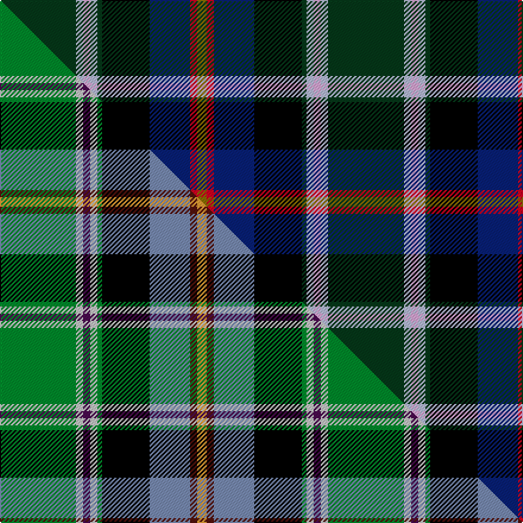

This is one **variant** — a specific cloth: this exact thread count and colourway, with its own
provenance below. It is one weaving of the [sett](/tartans/c/co/colorado/) (the scale-free proportion — the
same cloth at any scale or shade), whose colour order is pattern [GRBKGWWWG](/stripes/grbkgwwwg/).

Part of the [Colorado](/tartans/c/co/colorado/) tartan — the named design grouping this sett with its other cloths.

Sourced from tartans-authority.  It is a [9 stripe tartan](/stripes/stripes9/).

Original link <code>http://www.tartansauthority.com/tartan-ferret/display/4554/</code> — retired · [Internet Archive copy](https://web.archive.org/web/*/http://www.tartansauthority.com/tartan-ferret/display/4554/*)

Dataset <small>— provenance for this record, inherited from the source manifest</small>

<dl class="dataset-prov">
<dt>source</dt><dd><a href="/sources/tartans-authority/">Scottish Tartans Authority</a></dd>
<dt>data captured from</dt><dd><a href="https://github.com/thetartan/tartan-database/blob/master/data/tartans-authority/data.csv">https://github.com/thetartan/tartan-database/blob/master/data/tartans-authority/data.csv</a></dd>
<dt>data date</dt><dd>1995 <small>(this record)</small></dd>
<dt>licence</dt><dd><a href="https://creativecommons.org/licenses/by-nc-nd/4.0/">CC BY-NC-ND 4.0</a></dd>
</dl>

Capture chain <small>— the hands this data passed through, oldest first; each capture carries its own licence</small>

<ol class="capture-chain">
<li><a href="https://www.tartansauthority.com/">Scottish Tartans Authority</a> <small>the heritage body’s archive — its tartan-ferret record browser is retired; dead record links are shown unlinked, with an Internet Archive copy (ITI numbers are not SRT references)</small></li>
<li><a href="https://github.com/thetartan/tartan-database">thetartan/tartan-database</a> <small>2016-2017</small> · <a href="https://creativecommons.org/licenses/by-nc-nd/4.0/">CC BY-NC-ND 4.0</a> <small>Levko Kravets's frozen compilation — the capture we vendored, and where its CC licence text came from</small></li>
<li>this dictionary <small>captured 2026-06-10 · commit 5bf86c7566</small> <small>each re-capture is a git commit to data/sources</small></li>
</ol>

## Register references

External register numbers recorded for this tartan.

- Scottish Tartans Authority (ITI): 4554

## Thread count
DG/64 LB6 LP6 LB6 DG4 K40 DB34 R6 Y/8

One full sett is **276 threads**.

## Palette
<table><thead><tr><th>Colour</th><th>Shade</th><th>OKLCh</th></tr></thead><tbody><tr><td>DB</td><td><code style="background-color:#082077;">#082077</code> <small style="color:#888">#082077</small></td><td><small style="color:#888">oklch(30.0% 0.149 265.1)</small></td></tr><tr><td>DG</td><td><code style="background-color:#053819;">#053819</code> <small style="color:#888">#053819</small></td><td><small style="color:#888">oklch(30.0% 0.075 151.3)</small></td></tr><tr><td>K</td><td><code style="background-color:#000000;">#000000</code> <small style="color:#888">#000000</small></td><td><small style="color:#888">oklch(0.0% 0.000 0.0)</small></td></tr><tr><td>LP</td><td><code style="background-color:#E4A6DB;">#E4A6DB</code> <small style="color:#888">#E4A6DB</small></td><td><small style="color:#888">oklch(80.0% 0.100 331.6)</small></td></tr><tr><td>LB</td><td><code style="background-color:#B5BBDE;">#B5BBDE</code> <small style="color:#888">#B5BBDE</small></td><td><small style="color:#888">oklch(79.9% 0.050 277.6)</small></td></tr><tr><td>R</td><td><code style="background-color:#D60020;">#D60020</code> <small style="color:#888">#D60020</small></td><td><small style="color:#888">oklch(55.2% 0.224 25.5)</small></td></tr><tr><td>Y</td><td><code style="background-color:#8B6E00;">#8B6E00</code> <small style="color:#888">#8B6E00</small></td><td><small style="color:#888">oklch(55.1% 0.113 90.4)</small></td></tr></tbody></table>

# Sample pattern

## Compared to the master

This cloth is one sett of its design; the master sett (the exemplar the design is anchored on) is below for comparison.

Its **ΔTartan distance** from the master is **0.92** — the same measure the nearest-tartans table ranks by (0 is identical; a re-scale of the same cloth is near 0, a recolour or a different proportion further).

<figure class="master-compare" style="margin:0">

this sett
master sett ★

<figcaption style="color:#888;font-size:smaller">One weave of this sett against the <a href="/setts/g32lb3dp3lb3g2k20b17dr3lo4/">master sett ★</a>, split on the diagonal: a shared proportion runs seamlessly across it with only the shades shifting; a different proportion breaks on it.</figcaption>
</figure>

## Nearest tartan variants

The nearest existing variants by ΔTartan distance, with this cloth at the top so the swatches line up against it.

ΔTartan

Threads

Variant

Sett

—

276

<a href="/variants/s9/dg32lb3lp3lb3dg2k20db17r3y4~x2/">Colorado (District)</a>

<a href="/ttd/edit/#slug=dg32lb3p3lb3dg2k20db17r3y4~x2&amp;base=dg32lb3lp3lb3dg2k20db17r3y4~x2" title="compare in the TTD">0.02</a>

276

<a href="/variants/s9/dg32lb3p3lb3dg2k20db17r3y4~x2/">Colorado American District Tartan</a>

<a href="/ttd/edit/#slug=db40lb3db11k7g22k7db3w3n10k32y13~x2&amp;base=dg32lb3lp3lb3dg2k20db17r3y4~x2" title="compare in the TTD">2.03</a>

498

<a href="/variants/s11/db40lb3db11k7g22k7db3w3n10k32y13~x2/">Aurora House Check</a>

<a href="/ttd/edit/#slug=k3dbi3g15db15dp5r3y2dp1~x2~dbi3911270-db1913264-dp4118336-r6817039&amp;base=dg32lb3lp3lb3dg2k20db17r3y4~x2" title="compare in the TTD">2.11</a>

180

<a href="/variants/s8/k3dbi3g15db15dp5r3y2dp1~x2~dbi3911270-db1913264-dp4118336-r6817039/">Young</a>

<a href="/ttd/edit/#slug=dr3ti16k12g2k2dg32t2dg2lr3~x2~ti6107234-t5912243&amp;base=dg32lb3lp3lb3dg2k20db17r3y4~x2" title="compare in the TTD">2.16</a>

284

<a href="/variants/s9/dr3ti16k12g2k2dg32t2dg2lr3~x2~ti6107234-t5912243/">Scottish Ambulance Service (Corporat</a>

<a href="/ttd/edit/#slug=b2db18y4k5y1k1w1k2g8k1r3w1~x4&amp;base=dg32lb3lp3lb3dg2k20db17r3y4~x2" title="compare in the TTD">2.24</a>

364

<a href="/variants/s12/b2db18y4k5y1k1w1k2g8k1r3w1~x4/">Bethune</a>

<a href="/ttd/edit/#slug=r3g2db27k19g27dp2y3~x2&amp;base=dg32lb3lp3lb3dg2k20db17r3y4~x2" title="compare in the TTD">2.28</a>

320

<a href="/variants/s7/r3g2db27k19g27dp2y3~x2/">Christian Hunting (Personal)</a>

<a href="/ttd/edit/#slug=dp27y2dp2k12g6o2g12k12db12r2db2~x2&amp;base=dg32lb3lp3lb3dg2k20db17r3y4~x2" title="compare in the TTD">2.29</a>

306

<a href="/variants/s11/dp27y2dp2k12g6o2g12k12db12r2db2~x2/">Boxell, Baron (Personal)</a>

<a href="/ttd/edit/#slug=dp27y2dp2k12g6o2g12k12db12r2db2~x2~dp2712327&amp;base=dg32lb3lp3lb3dg2k20db17r3y4~x2" title="compare in the TTD">2.32</a>

306

<a href="/variants/s11/dp27y2dp2k12g6o2g12k12db12r2db2~x2~dp2712327/">Boxell of West Niddry, Baron (Personal)</a>

<a href="/ttd/edit/#slug=dbi11db5g4w3r3k16db28lb2~x2~dbi3912267-db3409246&amp;base=dg32lb3lp3lb3dg2k20db17r3y4~x2" title="compare in the TTD">2.35</a>

262

<a href="/variants/s8/dbi11db5g4w3r3k16db28lb2~x2~dbi3912267-db3409246/">Scottish Italian</a>

<a href="/ttd/edit/#slug=k1dr4k1w3k1g7k2db16r2ly1~x2&amp;base=dg32lb3lp3lb3dg2k20db17r3y4~x2" title="compare in the TTD">2.46</a>

148

<a href="/variants/s10/k1dr4k1w3k1g7k2db16r2ly1~x2/">Twempy</a>

## Neighbour map

Every grey dot is one of 13662 variants placed by the first two principal components of the ΔTartan feature space (42% of its variance). Red is this tartan; blue dots are its nearest — click one to open its page. The map is a flat projection of a many-dimensional space — [how to read it](/posts/neighbourhood-maps/).

<svg viewBox="0 0 640 380" role="img" style="max-width:100%;height:auto;border:1px solid #e0e0e0;border-radius:4px;display:block" xmlns="http://www.w3.org/2000/svg"><image href="/nn/cloud.v1.png" width="640" height="380"/><a href="/variants/s9/dg32lb3p3lb3dg2k20db17r3y4~x2/"><circle cx="141.2" cy="112.1" r="4" fill="#3465a4"><title>Colorado American District Tartan</title></circle></a><a href="/variants/s11/db40lb3db11k7g22k7db3w3n10k32y13~x2/"><circle cx="91.1" cy="119.9" r="4" fill="#3465a4"><title>Aurora House Check</title></circle></a><a href="/variants/s8/k3dbi3g15db15dp5r3y2dp1~x2~dbi3911270-db1913264-dp4118336-r6817039/"><circle cx="102.1" cy="131.4" r="4" fill="#3465a4"><title>Young</title></circle></a><a href="/variants/s9/dr3ti16k12g2k2dg32t2dg2lr3~x2~ti6107234-t5912243/"><circle cx="177.9" cy="101.8" r="4" fill="#3465a4"><title>Scottish Ambulance Service (Corporat</title></circle></a><a href="/variants/s12/b2db18y4k5y1k1w1k2g8k1r3w1~x4/"><circle cx="114.0" cy="79.5" r="4" fill="#3465a4"><title>Bethune</title></circle></a><a href="/variants/s7/r3g2db27k19g27dp2y3~x2/"><circle cx="134.4" cy="148.9" r="4" fill="#3465a4"><title>Christian Hunting (Personal)</title></circle></a><a href="/variants/s11/dp27y2dp2k12g6o2g12k12db12r2db2~x2/"><circle cx="93.9" cy="119.5" r="4" fill="#3465a4"><title>Boxell, Baron (Personal)</title></circle></a><a href="/variants/s11/dp27y2dp2k12g6o2g12k12db12r2db2~x2~dp2712327/"><circle cx="94.1" cy="119.4" r="4" fill="#3465a4"><title>Boxell of West Niddry, Baron (Personal)</title></circle></a><a href="/variants/s8/dbi11db5g4w3r3k16db28lb2~x2~dbi3912267-db3409246/"><circle cx="158.9" cy="125.1" r="4" fill="#3465a4"><title>Scottish Italian</title></circle></a><a href="/variants/s10/k1dr4k1w3k1g7k2db16r2ly1~x2/"><circle cx="127.7" cy="90.8" r="4" fill="#3465a4"><title>Twempy</title></circle></a><circle cx="135.6" cy="110.8" r="5" fill="#c00000"/><text x="320" y="376" text-anchor="middle" font-size="11" fill="#999">ground</text><text x="11" y="190" text-anchor="middle" font-size="11" fill="#999" transform="rotate(-90 11 190)">complexity</text></svg>

ID: /variants/s9/dg32lb3lp3lb3dg2k20db17r3y4~x2/
