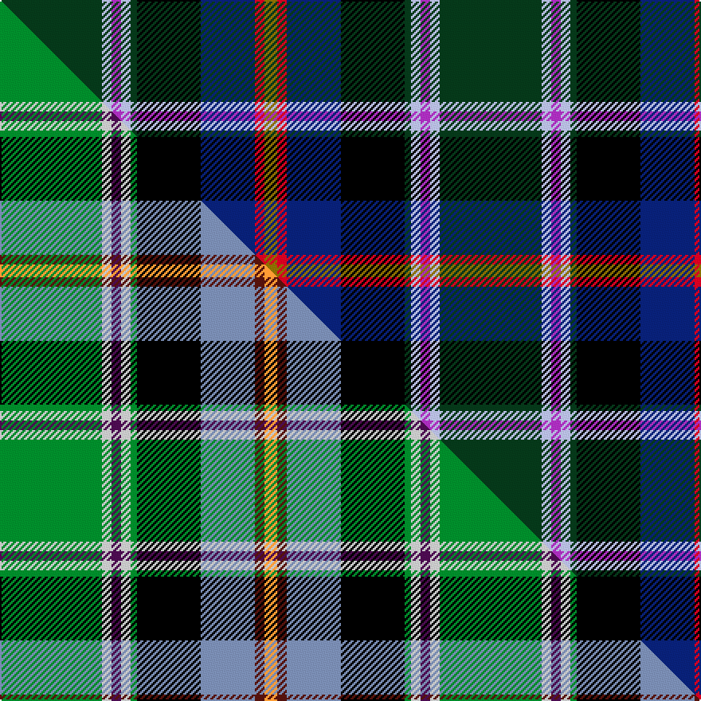

This page is one **sett** — a single exact thread-count. It belongs to the [tartan](/setts/dg32lb3p3lb3dg2k20db17r3y4/)
(the same proportion at any scale), whose colour order is pattern [GRBKGWBWG](/stripes/grbkgwbwg/).

Part of the [Colorado](/tartans/colorado/) tartan — the named design grouping this sett with its other cloths.

Sourced from house-of-tartan.  It is a [9 stripe tartan](/stripes/stripes9/).

Original link http://www.house-of-tartan.scotland.net/house/TartanViewjs.asp?colr=Def&tnam=4554

## Provenance

Earliest known date: 1995 Designed by Rev. John B. Pahls, 1995. Adopted by the Colorado general Assembly on March 3rd 1997. House Joint Resolution 97-1016 described the colour symbolism: "The crispness of the color blue captures the beauty of the clear Colorado skies and the coolness of forest green renders images of pine and spruce that grace the mountains with dignity . . . . the contrasting colors of lavender and white are reflective of the granite mountain peaks and the snow that crowns them in the winter months . . . . and are also found in the state flower, the white and lavender columbine. The brilliance of the color gold signifies the vast wealth of mineral resources to which the mining industry was attracted and on which the state's early economy was built; and the color red distinguishes the "C" on the state flag and signifies the red sandstone soil which gave the area its name Colorado, meaning red in Spanish."

## Thread count
DG/64 LB6 P6 LB6 DG4 K40 DB34 R6 Y/8

One full sett is **276 threads**.

## Palette
<table><thead><tr><th>Colour</th><th>Shade</th><th>OKLCh</th></tr></thead><tbody><tr><td>DB</td><td><code style="background-color:#082077;">#082077</code> <small style="color:#888">#082077</small></td><td><small style="color:#888">oklch(30.0% 0.149 265.1)</small></td></tr><tr><td>DG</td><td><code style="background-color:#053819;">#053819</code> <small style="color:#888">#053819</small></td><td><small style="color:#888">oklch(30.0% 0.075 151.3)</small></td></tr><tr><td>K</td><td><code style="background-color:#000000;">#000000</code> <small style="color:#888">#000000</small></td><td><small style="color:#888">oklch(0.0% 0.000 0.0)</small></td></tr><tr><td>P</td><td><code style="background-color:#AA2DBD;">#AA2DBD</code> <small style="color:#888">#AA2DBD</small></td><td><small style="color:#888">oklch(55.0% 0.225 322.0)</small></td></tr><tr><td>LB</td><td><code style="background-color:#B5BBDE;">#B5BBDE</code> <small style="color:#888">#B5BBDE</small></td><td><small style="color:#888">oklch(79.9% 0.050 277.6)</small></td></tr><tr><td>R</td><td><code style="background-color:#D60020;">#D60020</code> <small style="color:#888">#D60020</small></td><td><small style="color:#888">oklch(55.2% 0.224 25.5)</small></td></tr><tr><td>Y</td><td><code style="background-color:#8B6E00;">#8B6E00</code> <small style="color:#888">#8B6E00</small></td><td><small style="color:#888">oklch(55.1% 0.113 90.4)</small></td></tr></tbody></table>

# Sample pattern

## Compared to the master

This cloth is one sett of its design; the master sett (the exemplar the design is anchored on) is below for comparison.

Its **ΔTartan distance** from the master is **1.77** — the same measure the nearest-tartans table ranks by (0 is identical; a re-scale of the same cloth is near 0, a recolour or a different proportion further).

<figure class="master-compare" style="margin:0">

this sett
master sett ★

<figcaption style="color:#888;font-size:smaller">One weave of this sett against the <a href="/setts/g32lb3dp3lb3g2k20b17dr3lo4/">master sett ★</a>, split on the diagonal: a shared proportion runs seamlessly across it with only the shades shifting; a different proportion breaks on it.</figcaption>
</figure>

## Nearest tartan variants

The nearest existing variants by ΔTartan distance, with this cloth at the top so the swatches line up against it.

ΔTartan

Threads

Variant

Sett

—

276

<a href="/variants/s9/dg32lb3p3lb3dg2k20db17r3y4~x2/">Colorado American District Tartan</a>

<a href="/ttd/edit/#slug=dg32lb3lp3lb3dg2k20db17r3y4~x2&amp;base=dg32lb3p3lb3dg2k20db17r3y4~x2" title="compare in the TTD">0.00</a>

276

<a href="/variants/s9/dg32lb3lp3lb3dg2k20db17r3y4~x2/">Colorado (District)</a>

## Neighbour map

Every grey dot is one of 13620 variants placed by the first two principal components of the ΔTartan feature space (42% of its variance). Red is this tartan; blue dots are its nearest — click one to open its page.

<svg viewBox="0 0 640 380" role="img" style="max-width:100%;height:auto;border:1px solid #e0e0e0;border-radius:4px;display:block" xmlns="http://www.w3.org/2000/svg"><image href="/nn/cloud.v1.png" width="640" height="380"/><a href="/variants/s9/dg32lb3lp3lb3dg2k20db17r3y4~x2/"><circle cx="136.0" cy="110.7" r="4" fill="#3465a4"><title>Colorado (District)</title></circle></a><circle cx="141.6" cy="112.1" r="5" fill="#c00000"/><text x="320" y="376" text-anchor="middle" font-size="11" fill="#999">ground</text><text x="11" y="190" text-anchor="middle" font-size="11" fill="#999" transform="rotate(-90 11 190)">complexity</text></svg>

ID: /variants/s9/dg32lb3p3lb3dg2k20db17r3y4~x2/
