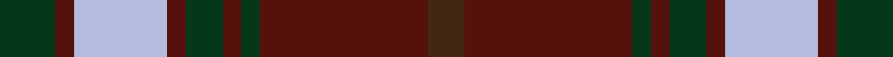

This page is one **sett** — a single exact thread-count. It belongs to the [tartan](/setts/dg3dr1lb5dr1dg2dr1dg1dr9do2/)
(the same proportion at any scale), whose colour order is pattern [BBGBGBWBG](/stripes/bbgbgbwbg/).

Part of the [Redwood Dress](/tartans/redwood-dress/) tartan — the named design grouping this sett with its other cloths.

Sourced from tartans-authority.  It is a [9 stripe tartan](/stripes/stripes9/).

Original link http://www.tartansauthority.com/tartan-ferret/display/5423/

## Register references

External register numbers recorded for this tartan.

- Scottish Tartans Authority (ITI): 5423

## Thread count
DG/12 DR4 LB20 DR4 DG8 DR4 DG4 DR36 DO/8

One full sett is **180 threads**.

## Palette
<table><thead><tr><th>Colour</th><th>Shade</th><th>OKLCh</th></tr></thead><tbody><tr><td>DR</td><td><code style="background-color:#55120C;">#55120C</code> <small style="color:#888">#55120C</small></td><td><small style="color:#888">oklch(30.0% 0.099 29.3)</small></td></tr><tr><td>G</td><td><code style="background-color:#053819;">#053819</code> <small style="color:#888">#053819</small></td><td><small style="color:#888">oklch(30.0% 0.075 151.3)</small></td></tr><tr><td>T</td><td><code style="background-color:#412714;">#412714</code> <small style="color:#888">#412714</small></td><td><small style="color:#888">oklch(30.1% 0.050 55.7)</small></td></tr><tr><td>W</td><td><code style="background-color:#B5BBDE;">#B5BBDE</code> <small style="color:#888">#B5BBDE</small></td><td><small style="color:#888">oklch(79.9% 0.050 277.6)</small></td></tr></tbody></table>

# Sample pattern

## Compared to the master

This cloth is one sett of its design; the master sett (the exemplar the design is anchored on) is below for comparison.

Its **ΔTartan distance** from the master is **0.17** — the same measure the nearest-tartans table ranks by (0 is identical; a re-scale of the same cloth is near 0, a recolour or a different proportion further).

<figure style="margin:0"><figcaption style="color:#888;font-size:smaller">this sett</figcaption></figure>
<figure style="margin:0"><figcaption style="color:#888;font-size:smaller"><a href="/setts/dg3dr1lb5dr1dg2dr1dg1dr9dy2/">master sett →</a></figcaption></figure>

## Nearest variants

The nearest existing variants by ΔTartan distance, with this cloth at the top so the swatches line up against it.

ΔTartan

Threads

Variant

Sett

—

180

<a href="/variants/s9/dg3dr1lb5dr1dg2dr1dg1dr9do2~x4/">Redwood Dress (Fashion)</a>

<a href="/ttd/edit/#slug=dg3dr1lb5dr1dg2dr1dg1dr9dy2~x4&amp;base=dg3dr1lb5dr1dg2dr1dg1dr9do2~x4" title="compare in the TTD">0.30</a>

180

<a href="/variants/s9/dg3dr1lb5dr1dg2dr1dg1dr9dy2~x4/">Redwood Dress</a>

<a href="/ttd/edit/#slug=g3r9lb1g9r1g1r9db9r1~x4&amp;base=dg3dr1lb5dr1dg2dr1dg1dr9do2~x4" title="compare in the TTD">1.32</a>

328

<a href="/variants/s9/g3r9lb1g9r1g1r9db9r1~x4/">Convention of the Baronage (Corp)</a>

<a href="/ttd/edit/#slug=g3r9lb1g9r1g1r8db9r1~x4&amp;base=dg3dr1lb5dr1dg2dr1dg1dr9do2~x4" title="compare in the TTD">1.34</a>

320

<a href="/variants/s9/g3r9lb1g9r1g1r8db9r1~x4/">Baronage</a>

<a href="/ttd/edit/#slug=lb1dr1g1dr11db6dr1g14dr1g1lb1~x4&amp;base=dg3dr1lb5dr1dg2dr1dg1dr9do2~x4" title="compare in the TTD">1.88</a>

296

<a href="/variants/s10/lb1dr1g1dr11db6dr1g14dr1g1lb1~x4/">Glen Tilt #1</a>

## Neighbour map

Every grey dot is one of 13620 variants placed by the first two principal components of the ΔTartan feature space (42% of its variance). Red is this tartan; blue dots are its nearest — click one to open its page.

<svg viewBox="0 0 640 380" role="img" style="max-width:100%;height:auto;border:1px solid #e0e0e0;border-radius:4px;display:block" xmlns="http://www.w3.org/2000/svg"><image href="/nn/cloud.v1.png" width="640" height="380"/><a href="/variants/s9/dg3dr1lb5dr1dg2dr1dg1dr9dy2~x4/"><circle cx="280.4" cy="211.2" r="4" fill="#3465a4"><title>Redwood Dress</title></circle></a><a href="/variants/s9/g3r9lb1g9r1g1r9db9r1~x4/"><circle cx="245.2" cy="201.3" r="4" fill="#3465a4"><title>Convention of the Baronage (Corp)</title></circle></a><a href="/variants/s9/g3r9lb1g9r1g1r8db9r1~x4/"><circle cx="238.6" cy="202.2" r="4" fill="#3465a4"><title>Baronage</title></circle></a><a href="/variants/s10/lb1dr1g1dr11db6dr1g14dr1g1lb1~x4/"><circle cx="291.9" cy="177.9" r="4" fill="#3465a4"><title>Glen Tilt #1</title></circle></a><circle cx="283.9" cy="213.1" r="5" fill="#c00000"/><text x="320" y="376" text-anchor="middle" font-size="11" fill="#999">ground</text><text x="11" y="190" text-anchor="middle" font-size="11" fill="#999" transform="rotate(-90 11 190)">complexity</text></svg>

ID: /variants/s9/dg3dr1lb5dr1dg2dr1dg1dr9do2~x4/
