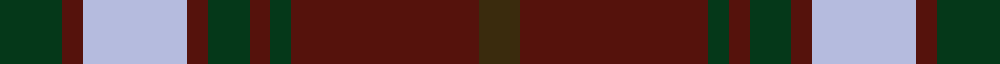

This is one **variant** — a specific cloth: this exact thread count and colourway, with its own
provenance below. It is one weaving of the [sett](/tartans/r/re/redwood-dress/) (the scale-free proportion — the
same cloth at any scale or shade), whose colour order is pattern [GBGBGBWBG](/stripes/gbgbgbwbg/).

Part of the [Redwood Dress](/tartans/r/re/redwood-dress/) tartan — the named design grouping this sett with its other cloths.

Sourced from register-of-tartans.  It is a [9 stripe tartan](/stripes/stripes9/).

Original link [https://www.tartanregister.gov.uk/tartanDetails.aspx?ref=3483](https://www.tartanregister.gov.uk/tartanDetails.aspx?ref=3483)

Dataset <small>— provenance for this record, inherited from the source manifest</small>

<dl class="dataset-prov">
<dt>source</dt><dd><a href="/sources/register-of-tartans/">Scottish Register of Tartans</a></dd>
<dt>data captured from</dt><dd><a href="https://github.com/thetartan/tartan-database/blob/master/data/register-of-tartans/data.csv">https://github.com/thetartan/tartan-database/blob/master/data/register-of-tartans/data.csv</a></dd>
<dt>data date</dt><dd>1972 <small>(this record)</small></dd>
<dt>licence</dt><dd><a href="https://www.tartanregister.gov.uk/copyright">Crown copyright</a></dd>
</dl>

Capture chain <small>— the hands this data passed through, oldest first; each capture carries its own licence</small>

<ol class="capture-chain">
<li><a href="https://www.tartanregister.gov.uk/">Scottish Register of Tartans</a> · <a href="https://www.tartanregister.gov.uk/copyright">Crown copyright</a> <small>the living register — still published by National Records of Scotland</small></li>
<li><a href="https://github.com/thetartan/tartan-database">thetartan/tartan-database</a> <small>2016-2017</small> · <a href="https://creativecommons.org/licenses/by-nc-nd/4.0/">CC BY-NC-ND 4.0</a> <small>Levko Kravets's frozen compilation — the capture we vendored, and where its CC licence text came from</small></li>
<li>this dictionary <small>captured 2026-06-10 · commit 5bf86c7566</small> <small>each re-capture is a git commit to data/sources</small></li>
</ol>

## Register references

External register numbers recorded for this tartan.

- Scottish Register of Tartans: [3483](https://www.tartanregister.gov.uk/tartanDetails.aspx?ref=3483)
- Scottish Tartans Authority (ITI): 5423

## Thread count
DG/12 DR4 LB20 DR4 DG8 DR4 DG4 DR36 DY/8

One full sett is **180 threads**.

## Palette
<table><thead><tr><th>Colour</th><th>Shade</th><th>OKLCh</th></tr></thead><tbody><tr><td>DR</td><td><code style="background-color:#55120C;">#55120C</code> <small style="color:#888">#55120C</small></td><td><small style="color:#888">oklch(30.0% 0.099 29.3)</small></td></tr><tr><td>DG</td><td><code style="background-color:#053819;">#053819</code> <small style="color:#888">#053819</small></td><td><small style="color:#888">oklch(30.0% 0.075 151.3)</small></td></tr><tr><td>DY</td><td><code style="background-color:#3A2B0D;">#3A2B0D</code> <small style="color:#888">#3A2B0D</small></td><td><small style="color:#888">oklch(30.0% 0.049 82.0)</small></td></tr><tr><td>LB</td><td><code style="background-color:#B5BBDE;">#B5BBDE</code> <small style="color:#888">#B5BBDE</small></td><td><small style="color:#888">oklch(79.9% 0.050 277.6)</small></td></tr></tbody></table>

# Sample pattern

## Nearest tartan variants

The nearest existing variants by ΔTartan distance, with this cloth at the top so the swatches line up against it.

ΔTartan

Threads

Variant

Sett

—

180

<a href="/variants/s9/dg3dr1lb5dr1dg2dr1dg1dr9dy2~x4/">Redwood Dress</a>

<a href="/ttd/edit/#slug=dg3dr1lb5dr1dg2dr1dg1dr9do2~x4&amp;base=dg3dr1lb5dr1dg2dr1dg1dr9dy2~x4" title="compare in the TTD">0.30</a>

180

<a href="/variants/s9/dg3dr1lb5dr1dg2dr1dg1dr9do2~x4/">Redwood Dress (Fashion)</a>

<a href="/ttd/edit/#slug=g3r9lb1g9r1g1r9db9r1~x4&amp;base=dg3dr1lb5dr1dg2dr1dg1dr9dy2~x4" title="compare in the TTD">1.32</a>

328

<a href="/variants/s9/g3r9lb1g9r1g1r9db9r1~x4/">Convention of the Baronage (Corp)</a>

<a href="/ttd/edit/#slug=g3r9lb1g9r1g1r8db9r1~x4&amp;base=dg3dr1lb5dr1dg2dr1dg1dr9dy2~x4" title="compare in the TTD">1.34</a>

320

<a href="/variants/s9/g3r9lb1g9r1g1r8db9r1~x4/">Baronage</a>

<a href="/ttd/edit/#slug=lb1dr1g1dr11db6dr1g14dr1g1lb1~x4&amp;base=dg3dr1lb5dr1dg2dr1dg1dr9dy2~x4" title="compare in the TTD">1.88</a>

296

<a href="/variants/s10/lb1dr1g1dr11db6dr1g14dr1g1lb1~x4/">Glen Tilt #1</a>

<a href="/ttd/edit/#slug=db28dr26w2db5w2dr26g28dr5w2dr5~x2&amp;base=dg3dr1lb5dr1dg2dr1dg1dr9dy2~x4" title="compare in the TTD">2.49</a>

450

<a href="/variants/s10/db28dr26w2db5w2dr26g28dr5w2dr5~x2/">Glenfinnan (Clan?)</a>

<a href="/ttd/edit/#slug=w2dr12g6dr1n6dr1~x4&amp;base=dg3dr1lb5dr1dg2dr1dg1dr9dy2~x4" title="compare in the TTD">2.51</a>

212

<a href="/variants/s6/w2dr12g6dr1n6dr1~x4/">Fraser Green</a>

<a href="/ttd/edit/#slug=r4lb3r32db30r4g32r3g32r3g3~x2&amp;base=dg3dr1lb5dr1dg2dr1dg1dr9dy2~x4" title="compare in the TTD">2.83</a>

570

<a href="/variants/s10/r4lb3r32db30r4g32r3g32r3g3~x2/">Unidentified Plaid #15</a>

<a href="/ttd/edit/#slug=do24g2do5ly14g2ly5dy17do2~x2&amp;base=dg3dr1lb5dr1dg2dr1dg1dr9dy2~x4" title="compare in the TTD">2.92</a>

232

<a href="/variants/s8/do24g2do5ly14g2ly5dy17do2~x2/">Loch Rannoch Trade Tartan</a>

<a href="/ttd/edit/#slug=dr18ly2b6ly2b4ly2b12ly3dr4g2~x2&amp;base=dg3dr1lb5dr1dg2dr1dg1dr9dy2~x4" title="compare in the TTD">2.96</a>

180

<a href="/variants/s10/dr18ly2b6ly2b4ly2b12ly3dr4g2~x2/">Unnamed</a>

<a href="/ttd/edit/#slug=g4y9g3db4g3w3dr32g4y3~x2~db2820264&amp;base=dg3dr1lb5dr1dg2dr1dg1dr9dy2~x4" title="compare in the TTD">3.07</a>

246

<a href="/variants/s9/g4y9g3db4g3w3dr32g4y3~x2~db2820264/">Antrim County, Crest Range</a>

## Neighbour map

Every grey dot is one of 13662 variants placed by the first two principal components of the ΔTartan feature space (42% of its variance). Red is this tartan; blue dots are its nearest — click one to open its page. The map is a flat projection of a many-dimensional space — [how to read it](/posts/neighbourhood-maps/).

<svg viewBox="0 0 640 380" role="img" style="max-width:100%;height:auto;border:1px solid #e0e0e0;border-radius:4px;display:block" xmlns="http://www.w3.org/2000/svg"><image href="/nn/cloud.v1.png" width="640" height="380"/><a href="/variants/s9/dg3dr1lb5dr1dg2dr1dg1dr9do2~x4/"><circle cx="283.9" cy="212.9" r="4" fill="#3465a4"><title>Redwood Dress (Fashion)</title></circle></a><a href="/variants/s9/g3r9lb1g9r1g1r9db9r1~x4/"><circle cx="245.4" cy="200.8" r="4" fill="#3465a4"><title>Convention of the Baronage (Corp)</title></circle></a><a href="/variants/s9/g3r9lb1g9r1g1r8db9r1~x4/"><circle cx="238.7" cy="201.8" r="4" fill="#3465a4"><title>Baronage</title></circle></a><a href="/variants/s10/lb1dr1g1dr11db6dr1g14dr1g1lb1~x4/"><circle cx="291.9" cy="177.9" r="4" fill="#3465a4"><title>Glen Tilt #1</title></circle></a><a href="/variants/s10/db28dr26w2db5w2dr26g28dr5w2dr5~x2/"><circle cx="293.2" cy="194.4" r="4" fill="#3465a4"><title>Glenfinnan (Clan?)</title></circle></a><a href="/variants/s6/w2dr12g6dr1n6dr1~x4/"><circle cx="305.7" cy="224.9" r="4" fill="#3465a4"><title>Fraser Green</title></circle></a><a href="/variants/s10/r4lb3r32db30r4g32r3g32r3g3~x2/"><circle cx="253.0" cy="184.1" r="4" fill="#3465a4"><title>Unidentified Plaid #15</title></circle></a><a href="/variants/s8/do24g2do5ly14g2ly5dy17do2~x2/"><circle cx="264.0" cy="209.4" r="4" fill="#3465a4"><title>Loch Rannoch Trade Tartan</title></circle></a><a href="/variants/s10/dr18ly2b6ly2b4ly2b12ly3dr4g2~x2/"><circle cx="249.2" cy="206.4" r="4" fill="#3465a4"><title>Unnamed</title></circle></a><a href="/variants/s9/g4y9g3db4g3w3dr32g4y3~x2~db2820264/"><circle cx="286.0" cy="169.3" r="4" fill="#3465a4"><title>Antrim County, Crest Range</title></circle></a><circle cx="280.4" cy="211.0" r="5" fill="#c00000"/><text x="320" y="376" text-anchor="middle" font-size="11" fill="#999">ground</text><text x="11" y="190" text-anchor="middle" font-size="11" fill="#999" transform="rotate(-90 11 190)">complexity</text></svg>

ID: /variants/s9/dg3dr1lb5dr1dg2dr1dg1dr9dy2~x4/
