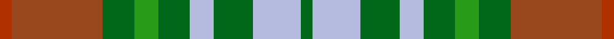

This page is one **sett** — a single exact thread-count. It belongs to the [tartan](/setts/dg3lb12dg10lb6dg8g6dg8o23oi3/)
(the same proportion at any scale), whose colour order is pattern [GWGWGGGRR](/stripes/gwgwgggrr/).

Sourced from tartans-authority.  It is a [9 stripe tartan](/stripes/stripes9/).

Original link http://www.tartansauthority.com/tartan-ferret/display/11062/

## Register references

External register numbers recorded for this tartan.

- Scottish Register of Tartans: [11062](https://www.tartanregister.gov.uk/tartanDetails?ref=11062)
- Scottish Tartans Authority (ITI): 11062

## Thread count
Oi/6 O46 DG16 G12 DG16 LB12 DG20 LB24 DG/6

One full sett is **304 threads**.

## Palette
<table><thead><tr><th>Colour</th><th>Shade</th><th>OKLCh</th></tr></thead><tbody><tr><td>LB</td><td><code style="background-color:#B5BBDE;">#B5BBDE</code> <small style="color:#888">#B5BBDE</small></td><td><small style="color:#888">oklch(79.9% 0.050 277.6)</small></td></tr><tr><td>G</td><td><code style="background-color:#289C18;">#289C18</code> <small style="color:#888">#289C18</small></td><td><small style="color:#888">oklch(60.6% 0.191 141.6)</small></td></tr><tr><td>DG</td><td><code style="background-color:#006818;">#006818</code> <small style="color:#888">#006818</small></td><td><small style="color:#888">oklch(45.0% 0.142 145.0)</small></td></tr><tr><td>O</td><td><code style="background-color:#B03000;">#B03000</code> <small style="color:#888">#B03000</small></td><td><small style="color:#888">oklch(50.3% 0.171 36.3)</small></td></tr><tr><td>O</td><td><code style="background-color:#98481C;">#98481C</code> <small style="color:#888">#98481C</small></td><td><small style="color:#888">oklch(49.6% 0.121 46.1)</small></td></tr></tbody></table>

# Sample pattern

## Nearest tartan variants

The nearest existing variants by ΔTartan distance, with this cloth at the top so the swatches line up against it.

ΔTartan

Threads

Variant

Sett

—

304

<a href="/variants/s9/dg3lb12dg10lb6dg8g6dg8o23oi3~x2~dg1806142-g2408144-o2005046-oi2007033/">Lawrence's Seven Pillars of Khaki</a>

<a href="/ttd/edit/#slug=r2y2r2y2g5lb5g11n11g5lb11y2~x2&amp;base=dg3lb12dg10lb6dg8g6dg8o23oi3~x2~dg1806142-g2408144-o2005046-oi2007033" title="compare in the TTD">2.27</a>

224

<a href="/variants/s11/r2y2r2y2g5lb5g11n11g5lb11y2~x2/">Vasseur Mignon (Personal)</a>

<a href="/ttd/edit/#slug=y3dg14g9db4g8w2g12r12g2r5w2~x2~dg1806142-g2203152&amp;base=dg3lb12dg10lb6dg8g6dg8o23oi3~x2~dg1806142-g2408144-o2005046-oi2007033" title="compare in the TTD">2.40</a>

282

<a href="/variants/s11/y3dg14g9db4g8w2g12r12g2r5w2~x2~dg1806142-g2203152/">Muirhead (Clan)</a>

<a href="/ttd/edit/#slug=b3do2o14g17do14b8o14do2b3~x2&amp;base=dg3lb12dg10lb6dg8g6dg8o23oi3~x2~dg1806142-g2408144-o2005046-oi2007033" title="compare in the TTD">2.62</a>

296

<a href="/variants/s9/b3do2o14g17do14b8o14do2b3~x2/">Monaghan</a>

<a href="/ttd/edit/#slug=g6y1r1lb2r2~x4&amp;base=dg3lb12dg10lb6dg8g6dg8o23oi3~x2~dg1806142-g2408144-o2005046-oi2007033" title="compare in the TTD">2.76</a>

64

<a href="/variants/s5/g6y1r1lb2r2~x4/">Wilson's No.179</a>

<a href="/ttd/edit/#slug=r3dy23y8g6y8db6y10db12y3~x2~y2303114-g2208144&amp;base=dg3lb12dg10lb6dg8g6dg8o23oi3~x2~dg1806142-g2408144-o2005046-oi2007033" title="compare in the TTD">2.79</a>

304

<a href="/variants/s9/r3dy23y8g6y8db6y10db12y3~x2~y2303114-g2208144/">Lawrence's Seven Pillars of Khaki</a>

<a href="/ttd/edit/#slug=o5ly3o19do6ly5do6dg12db5dg12db3~x2&amp;base=dg3lb12dg10lb6dg8g6dg8o23oi3~x2~dg1806142-g2408144-o2005046-oi2007033" title="compare in the TTD">2.86</a>

288

<a href="/variants/s10/o5ly3o19do6ly5do6dg12db5dg12db3~x2/">Roscommon, County</a>

<a href="/ttd/edit/#slug=o5lo3o19do6lo5do6dg12n5dg12n3~x2&amp;base=dg3lb12dg10lb6dg8g6dg8o23oi3~x2~dg1806142-g2408144-o2005046-oi2007033" title="compare in the TTD">2.88</a>

288

<a href="/variants/s10/o5lo3o19do6lo5do6dg12n5dg12n3~x2/">Roscommon Irish County Tartan</a>

<a href="/ttd/edit/#slug=g10dp42r5dg42g42ly5g6~g2408144-dg1806142&amp;base=dg3lb12dg10lb6dg8g6dg8o23oi3~x2~dg1806142-g2408144-o2005046-oi2007033" title="compare in the TTD">2.88</a>

288

<a href="/variants/s7/g10dp42r5dg42g42ly5g6~g2408144-dg1806142/">New Mexico (Fashion)</a>

<a href="/ttd/edit/#slug=g4r1db2r1g10dy5r3dy10y1~x4&amp;base=dg3lb12dg10lb6dg8g6dg8o23oi3~x2~dg1806142-g2408144-o2005046-oi2007033" title="compare in the TTD">2.90</a>

276

<a href="/variants/s9/g4r1db2r1g10dy5r3dy10y1~x4/">Moncton, City of</a>

<a href="/ttd/edit/#slug=r2ly1t8r1g7ly1r2~x6&amp;base=dg3lb12dg10lb6dg8g6dg8o23oi3~x2~dg1806142-g2408144-o2005046-oi2007033" title="compare in the TTD">2.95</a>

240

<a href="/variants/s7/r2ly1t8r1g7ly1r2~x6/">Cercle de Fermieres de St-Elie . . .</a>

## Neighbour map

Every grey dot is one of 13620 variants placed by the first two principal components of the ΔTartan feature space (42% of its variance). Red is this tartan; blue dots are its nearest — click one to open its page.

<svg viewBox="0 0 640 380" role="img" style="max-width:100%;height:auto;border:1px solid #e0e0e0;border-radius:4px;display:block" xmlns="http://www.w3.org/2000/svg"><image href="/nn/cloud.v1.png" width="640" height="380"/><a href="/variants/s11/r2y2r2y2g5lb5g11n11g5lb11y2~x2/"><circle cx="186.5" cy="238.2" r="4" fill="#3465a4"><title>Vasseur Mignon (Personal)</title></circle></a><a href="/variants/s11/y3dg14g9db4g8w2g12r12g2r5w2~x2~dg1806142-g2203152/"><circle cx="182.2" cy="210.3" r="4" fill="#3465a4"><title>Muirhead (Clan)</title></circle></a><a href="/variants/s9/b3do2o14g17do14b8o14do2b3~x2/"><circle cx="227.8" cy="241.9" r="4" fill="#3465a4"><title>Monaghan</title></circle></a><a href="/variants/s5/g6y1r1lb2r2~x4/"><circle cx="210.4" cy="240.6" r="4" fill="#3465a4"><title>Wilson's No.179</title></circle></a><a href="/variants/s9/r3dy23y8g6y8db6y10db12y3~x2~y2303114-g2208144/"><circle cx="196.4" cy="231.2" r="4" fill="#3465a4"><title>Lawrence's Seven Pillars of Khaki</title></circle></a><a href="/variants/s10/o5ly3o19do6ly5do6dg12db5dg12db3~x2/"><circle cx="146.6" cy="231.6" r="4" fill="#3465a4"><title>Roscommon, County</title></circle></a><a href="/variants/s10/o5lo3o19do6lo5do6dg12n5dg12n3~x2/"><circle cx="169.8" cy="238.7" r="4" fill="#3465a4"><title>Roscommon Irish County Tartan</title></circle></a><a href="/variants/s7/g10dp42r5dg42g42ly5g6~g2408144-dg1806142/"><circle cx="200.3" cy="217.4" r="4" fill="#3465a4"><title>New Mexico (Fashion)</title></circle></a><a href="/variants/s9/g4r1db2r1g10dy5r3dy10y1~x4/"><circle cx="235.2" cy="200.2" r="4" fill="#3465a4"><title>Moncton, City of</title></circle></a><a href="/variants/s7/r2ly1t8r1g7ly1r2~x6/"><circle cx="241.6" cy="233.7" r="4" fill="#3465a4"><title>Cercle de Fermieres de St-Elie . . .</title></circle></a><circle cx="187.7" cy="229.4" r="5" fill="#c00000"/><text x="320" y="376" text-anchor="middle" font-size="11" fill="#999">ground</text><text x="11" y="190" text-anchor="middle" font-size="11" fill="#999" transform="rotate(-90 11 190)">complexity</text></svg>

ID: /variants/s9/dg3lb12dg10lb6dg8g6dg8o23oi3~x2~dg1806142-g2408144-o2005046-oi2007033/
