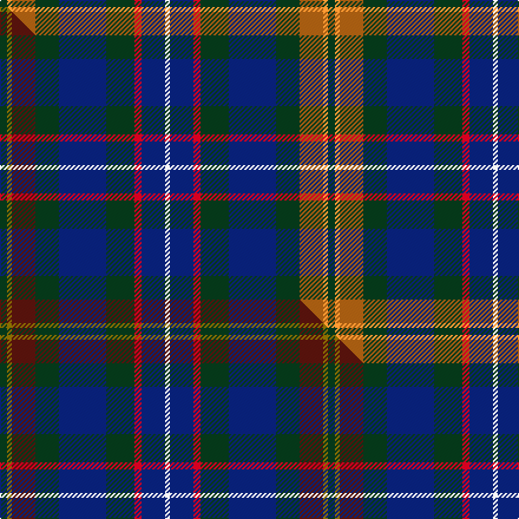

This page is one **sett** — a single exact thread-count. It belongs to the [tartan](/setts/dg3lo2o10dg10db20dg12r3db10w2/)
(the same proportion at any scale), whose colour order is pattern [GYRGBGRBW](/stripes/gyrgbgrbw/).

Part of the [Patel](/tartans/patel/) tartan — the named design grouping this sett with its other cloths.

Sourced from house-of-tartan.  It is a [9 stripe tartan](/stripes/stripes9/).

Original link http://www.house-of-tartan.scotland.net/house/TartanViewjs.asp?colr=Def&tnam=10924

## Provenance

Earliest known date: 2013 Designed for the Patel family using colours associated with the Gujarat, a state in the North-West coast of India known locally as Jewel of the West.

## Thread count
DG/6 LO4 O20 DG20 DB40 DG24 R6 DB20 W/4

One full sett is **278 threads**.

## Palette
<table><thead><tr><th>Colour</th><th>Shade</th><th>OKLCh</th></tr></thead><tbody><tr><td>DB</td><td><code style="background-color:#082077;">#082077</code> <small style="color:#888">#082077</small></td><td><small style="color:#888">oklch(30.0% 0.149 265.1)</small></td></tr><tr><td>DG</td><td><code style="background-color:#053819;">#053819</code> <small style="color:#888">#053819</small></td><td><small style="color:#888">oklch(30.0% 0.075 151.3)</small></td></tr><tr><td>O</td><td><code style="background-color:#A65C11;">#A65C11</code> <small style="color:#888">#A65C11</small></td><td><small style="color:#888">oklch(55.0% 0.125 58.3)</small></td></tr><tr><td>R</td><td><code style="background-color:#D60020;">#D60020</code> <small style="color:#888">#D60020</small></td><td><small style="color:#888">oklch(55.2% 0.224 25.5)</small></td></tr><tr><td>LO</td><td><code style="background-color:#FF9C34;">#FF9C34</code> <small style="color:#888">#FF9C34</small></td><td><small style="color:#888">oklch(77.9% 0.161 61.8)</small></td></tr><tr><td>W</td><td><code style="background-color:#F7F7F7;">#F7F7F7</code> <small style="color:#888">#F7F7F7</small></td><td><small style="color:#888">oklch(97.6% 0.000 89.9)</small></td></tr></tbody></table>

# Sample pattern

## Compared to the master

This cloth is one sett of its design; the master sett (the exemplar the design is anchored on) is below for comparison.

Its **ΔTartan distance** from the master is **1.09** — the same measure the nearest-tartans table ranks by (0 is identical; a re-scale of the same cloth is near 0, a recolour or a different proportion further).

<figure class="master-compare" style="margin:0">

this sett
master sett ★

<figcaption style="color:#888;font-size:smaller">One weave of this sett against the <a href="/setts/dg3y2dr10dg10db20dg12r3db10w2/">master sett ★</a>, split on the diagonal: a shared proportion runs seamlessly across it with only the shades shifting; a different proportion breaks on it.</figcaption>
</figure>

## Nearest tartan variants

The nearest existing variants by ΔTartan distance, with this cloth at the top so the swatches line up against it.

ΔTartan

Threads

Variant

Sett

—

278

<a href="/variants/s9/dg3lo2o10dg10db20dg12r3db10w2~x2/">Patel Name Tartan</a>

<a href="/ttd/edit/#slug=dg3y2dr10dg10db20dg12r3db10w2~x2&amp;base=dg3lo2o10dg10db20dg12r3db10w2~x2" title="compare in the TTD">0.90</a>

278

<a href="/variants/s9/dg3y2dr10dg10db20dg12r3db10w2~x2/">Patel (2013)</a>

<a href="/ttd/edit/#slug=dg3b22do10o5dg21r6b3~x2&amp;base=dg3lo2o10dg10db20dg12r3db10w2~x2" title="compare in the TTD">2.21</a>

268

<a href="/variants/s7/dg3b22do10o5dg21r6b3~x2/">Swankie</a>

<a href="/ttd/edit/#slug=db2r1db10w1dy4g8y1g2~x4&amp;base=dg3lo2o10dg10db20dg12r3db10w2~x2" title="compare in the TTD">2.46</a>

216

<a href="/variants/s8/db2r1db10w1dy4g8y1g2~x4/">Ayrshire District Tartan</a>

<a href="/ttd/edit/#slug=db2r1db10w1o4g8y1g2~x4&amp;base=dg3lo2o10dg10db20dg12r3db10w2~x2" title="compare in the TTD">2.46</a>

216

<a href="/variants/s8/db2r1db10w1o4g8y1g2~x4/">Ayrshire</a>

<a href="/ttd/edit/#slug=db1dy4g8y1g8db12w1db2r1~x4&amp;base=dg3lo2o10dg10db20dg12r3db10w2~x2" title="compare in the TTD">2.81</a>

296

<a href="/variants/s9/db1dy4g8y1g8db12w1db2r1~x4/">Connor (Personal)</a>

2.88

—

<a href="/variants/s8/db16g8dbi8g8db16r3o3b3~x2~db0805267-dbi1604274/">Glen Erin</a>

## Neighbour map

Every grey dot is one of 13620 variants placed by the first two principal components of the ΔTartan feature space (42% of its variance). Red is this tartan; blue dots are its nearest — click one to open its page.

<svg viewBox="0 0 640 380" role="img" style="max-width:100%;height:auto;border:1px solid #e0e0e0;border-radius:4px;display:block" xmlns="http://www.w3.org/2000/svg"><image href="/nn/cloud.v1.png" width="640" height="380"/><a href="/variants/s9/dg3y2dr10dg10db20dg12r3db10w2~x2/"><circle cx="229.9" cy="203.3" r="4" fill="#3465a4"><title>Patel (2013)</title></circle></a><a href="/variants/s7/dg3b22do10o5dg21r6b3~x2/"><circle cx="203.3" cy="229.8" r="4" fill="#3465a4"><title>Swankie</title></circle></a><a href="/variants/s8/db2r1db10w1dy4g8y1g2~x4/"><circle cx="196.1" cy="180.1" r="4" fill="#3465a4"><title>Ayrshire District Tartan</title></circle></a><a href="/variants/s8/db2r1db10w1o4g8y1g2~x4/"><circle cx="190.9" cy="176.6" r="4" fill="#3465a4"><title>Ayrshire</title></circle></a><a href="/variants/s9/db1dy4g8y1g8db12w1db2r1~x4/"><circle cx="215.1" cy="169.5" r="4" fill="#3465a4"><title>Connor (Personal)</title></circle></a><a href="/variants/s8/db16g8dbi8g8db16r3o3b3~x2~db0805267-dbi1604274/"><circle cx="176.8" cy="221.2" r="4" fill="#3465a4"><title>Glen Erin</title></circle></a><circle cx="196.4" cy="191.6" r="5" fill="#c00000"/><text x="320" y="376" text-anchor="middle" font-size="11" fill="#999">ground</text><text x="11" y="190" text-anchor="middle" font-size="11" fill="#999" transform="rotate(-90 11 190)">complexity</text></svg>

ID: /variants/s9/dg3lo2o10dg10db20dg12r3db10w2~x2/
