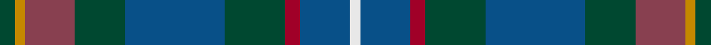

This page is one **sett** — a single exact thread-count. It belongs to the [tartan](/setts/dg3lo2o10dg10db20dg12r3db10w2/)
(the same proportion at any scale), whose colour order is pattern [GYRGBGRBW](/stripes/gyrgbgrbw/).

Sourced from house-of-tartan.  It is a [9 stripe tartan](/stripes/stripes9/).

Original link http://www.house-of-tartan.scotland.net/house/TartanViewjs.asp?colr=Def&tnam=10924

## Provenance

Earliest known date: 2013 Designed for the Patel family using colours associated with the Gujarat, a state in the North-West coast of India known locally as Jewel of the West.

## Thread count
DG/6 DY4 DR20 DG20 B40 DG24 DRa6 B20 LN/4

One full sett is **278 threads**.

## Palette

Palette: <strong>custom</strong>
<table><thead><tr><th>Colour</th><th>Threads</th><th>Shade</th><th>Base</th><th>OKLCh</th></tr></thead><tbody><tr><td>DG/</td><td style="text-align:right;font-variant-numeric:tabular-nums">6</td><td><code style="background-color:#004830;">#004830</code> <small style="color:#888">#004830</small></td><td>G <code style="background-color:#006100;">#006100</code></td><td><small style="color:#888">oklch(35.5% 0.077 163.0)</small></td></tr><tr><td>DY</td><td style="text-align:right;font-variant-numeric:tabular-nums">4</td><td><code style="background-color:#C48800;">#C48800</code> <small style="color:#888">#C48800</small></td><td>Y <code style="background-color:#F2BF00;">#F2BF00</code></td><td><small style="color:#888">oklch(67.0% 0.140 77.5)</small></td></tr><tr><td>DR</td><td style="text-align:right;font-variant-numeric:tabular-nums">20</td><td><code style="background-color:#884050;">#884050</code> <small style="color:#888">#884050</small></td><td>R <code style="background-color:#CC0000;">#CC0000</code></td><td><small style="color:#888">oklch(46.9% 0.099 7.7)</small></td></tr><tr><td>DG</td><td style="text-align:right;font-variant-numeric:tabular-nums">20</td><td><code style="background-color:#004830;">#004830</code> <small style="color:#888">#004830</small></td><td>G <code style="background-color:#006100;">#006100</code></td><td><small style="color:#888">oklch(35.5% 0.077 163.0)</small></td></tr><tr><td>B</td><td style="text-align:right;font-variant-numeric:tabular-nums">40</td><td><code style="background-color:#085088;">#085088</code> <small style="color:#888">#085088</small></td><td>B <code style="background-color:#2A418A;">#2A418A</code></td><td><small style="color:#888">oklch(42.3% 0.113 249.3)</small></td></tr><tr><td>DG</td><td style="text-align:right;font-variant-numeric:tabular-nums">24</td><td><code style="background-color:#004830;">#004830</code> <small style="color:#888">#004830</small></td><td>G <code style="background-color:#006100;">#006100</code></td><td><small style="color:#888">oklch(35.5% 0.077 163.0)</small></td></tr><tr><td>DRa</td><td style="text-align:right;font-variant-numeric:tabular-nums">6</td><td><code style="background-color:#A00028;">#A00028</code> <small style="color:#888">#A00028</small></td><td>R <code style="background-color:#CC0000;">#CC0000</code></td><td><small style="color:#888">oklch(44.7% 0.179 19.5)</small></td></tr><tr><td>B</td><td style="text-align:right;font-variant-numeric:tabular-nums">20</td><td><code style="background-color:#085088;">#085088</code> <small style="color:#888">#085088</small></td><td>B <code style="background-color:#2A418A;">#2A418A</code></td><td><small style="color:#888">oklch(42.3% 0.113 249.3)</small></td></tr><tr><td>LN/</td><td style="text-align:right;font-variant-numeric:tabular-nums">4</td><td><code style="background-color:#E8E8E8;">#E8E8E8</code> <small style="color:#888">#E8E8E8</small></td><td>W <code style="background-color:#F7F7F7;">#F7F7F7</code></td><td><small style="color:#888">oklch(93.1% 0.000 89.9)</small></td></tr></tbody></table>

## Nearest tartans

The nearest existing variants by ΔTartan distance, with this tartan at the top so the swatches line up against it.

ΔTartan

Tartan

Sett

—

<a href="/ttd/edit/#slug=dg3lo2o10dg10db20dg12r3db10w2~x2">Patel Name Tartan</a> <a class="nn-out" href="/variants/s9/dg3lo2o10dg10db20dg12r3db10w2~x2/" title="open its dictionary page">↗</a>

1.08

<a href="/ttd/edit/#slug=db17lb2db2r2db2do12dg16lo3~x4&amp;base=dg3lo2o10dg10db20dg12r3db10w2~x2">Blairmore House (Corporate)</a> <a class="nn-out" href="/variants/s8/db17lb2db2r2db2do12dg16lo3~x4/" title="open its dictionary page">↗</a>

1.19

<a href="/ttd/edit/#slug=g20gi6dg15dt5dg2dt15o4dt10r2~x2&amp;base=dg3lo2o10dg10db20dg12r3db10w2~x2">Copar a'Beannichte (Personal)</a> <a class="nn-out" href="/variants/s9/g20gi6dg15dt5dg2dt15o4dt10r2~x2/" title="open its dictionary page">↗</a>

1.19

<a href="/ttd/edit/#slug=dg15y3dr2y3dg8b12db20r2db4~x2&amp;base=dg3lo2o10dg10db20dg12r3db10w2~x2">Westbrook (2013)</a> <a class="nn-out" href="/variants/s9/dg15y3dr2y3dg8b12db20r2db4~x2/" title="open its dictionary page">↗</a>

1.29

<a href="/ttd/edit/#slug=t3dt3t12dt26dg26r3dg26dt28w3&amp;base=dg3lo2o10dg10db20dg12r3db10w2~x2">Seaford House</a> <a class="nn-out" href="/variants/s9/t3dt3t12dt26dg26r3dg26dt28w3/" title="open its dictionary page">↗</a>

1.31

<a href="/ttd/edit/#slug=dg3lo2m10dg10b20dg12r3b10w2~x2&amp;base=dg3lo2o10dg10db20dg12r3db10w2~x2">Patel (2013)</a> <a class="nn-out" href="/variants/s9/dg3lo2m10dg10b20dg12r3b10w2~x2/" title="open its dictionary page">↗</a>

1.34

<a href="/ttd/edit/#slug=dg5g2dbi2db15r2lg2dg5r2~x4&amp;base=dg3lo2o10dg10db20dg12r3db10w2~x2">Remember the Somme 1916</a> <a class="nn-out" href="/variants/s8/dg5g2dbi2db15r2lg2dg5r2~x4/" title="open its dictionary page">↗</a>

1.35

<a href="/ttd/edit/#slug=dt5b43dt18lb4b6r5dy25lo5~x2&amp;base=dg3lo2o10dg10db20dg12r3db10w2~x2">State Seal of Iowa (Fashion)</a> <a class="nn-out" href="/variants/s8/dt5b43dt18lb4b6r5dy25lo5~x2/" title="open its dictionary page">↗</a>

1.36

<a href="/ttd/edit/#slug=r3dt24k7db11g11ly2~x2&amp;base=dg3lo2o10dg10db20dg12r3db10w2~x2">Cowie</a> <a class="nn-out" href="/variants/s6/r3dt24k7db11g11ly2~x2/" title="open its dictionary page">↗</a>

1.39

<a href="/ttd/edit/#slug=db17w2db2r2db2do12dg16lo3~x4&amp;base=dg3lo2o10dg10db20dg12r3db10w2~x2">Blairmore House</a> <a class="nn-out" href="/variants/s8/db17w2db2r2db2do12dg16lo3~x4/" title="open its dictionary page">↗</a>

1.39

<a href="/ttd/edit/#slug=dt20dg6dt6lb2dg20r8dg6r4dg10lr3~x2&amp;base=dg3lo2o10dg10db20dg12r3db10w2~x2">MacConnell</a> <a class="nn-out" href="/variants/s10/dt20dg6dt6lb2dg20r8dg6r4dg10lr3~x2/" title="open its dictionary page">↗</a>

## Neighbour map

Every grey dot is one of 14360 variants placed by the first two principal components of the ΔTartan feature space (44% of its variance). Red is this tartan; blue dots are its nearest — click one to open its page.

<svg viewBox="0 0 640 380" role="img" style="max-width:100%;height:auto;border:1px solid #e0e0e0;border-radius:4px;display:block" xmlns="http://www.w3.org/2000/svg"><image href="/nn/cloud.v1.png" width="640" height="380"/><a href="/variants/s8/db17lb2db2r2db2do12dg16lo3~x4/"><circle cx="193.7" cy="199.3" r="4" fill="#3465a4"><title>Blairmore House (Corporate)</title></circle></a><a href="/variants/s9/g20gi6dg15dt5dg2dt15o4dt10r2~x2/"><circle cx="192.3" cy="220.2" r="4" fill="#3465a4"><title>Copar a'Beannichte (Personal)</title></circle></a><a href="/variants/s9/dg15y3dr2y3dg8b12db20r2db4~x2/"><circle cx="176.0" cy="196.4" r="4" fill="#3465a4"><title>Westbrook (2013)</title></circle></a><a href="/variants/s9/t3dt3t12dt26dg26r3dg26dt28w3/"><circle cx="248.9" cy="222.0" r="4" fill="#3465a4"><title>Seaford House</title></circle></a><a href="/variants/s9/dg3lo2m10dg10b20dg12r3b10w2~x2/"><circle cx="185.6" cy="190.5" r="4" fill="#3465a4"><title>Patel (2013)</title></circle></a><a href="/variants/s8/dg5g2dbi2db15r2lg2dg5r2~x4/"><circle cx="222.6" cy="202.8" r="4" fill="#3465a4"><title>Remember the Somme 1916</title></circle></a><a href="/variants/s8/dt5b43dt18lb4b6r5dy25lo5~x2/"><circle cx="219.5" cy="176.8" r="4" fill="#3465a4"><title>State Seal of Iowa (Fashion)</title></circle></a><a href="/variants/s6/r3dt24k7db11g11ly2~x2/"><circle cx="197.2" cy="208.6" r="4" fill="#3465a4"><title>Cowie</title></circle></a><a href="/variants/s8/db17w2db2r2db2do12dg16lo3~x4/"><circle cx="176.9" cy="190.5" r="4" fill="#3465a4"><title>Blairmore House</title></circle></a><a href="/variants/s10/dt20dg6dt6lb2dg20r8dg6r4dg10lr3~x2/"><circle cx="279.0" cy="225.7" r="4" fill="#3465a4"><title>MacConnell</title></circle></a><circle cx="220.1" cy="210.8" r="5" fill="#c00000"/></svg>

ID: /variants/s9/dg3lo2o10dg10db20dg12r3db10w2~x2/
