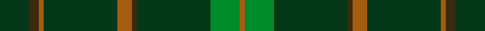

This is one **variant** — a specific cloth: this exact thread count and colourway, with its own
provenance below. It is one weaving of the [sett](/tartans/m/mc/mccall-f-w/) (the scale-free proportion — the
same cloth at any scale or shade), whose colour order is pattern [GGRGRGGGR](/stripes/ggrgrgggr/).

Part of the [McCall, F W](/tartans/m/mc/mccall-f-w/) tartan — the named design grouping this sett with its other cloths.

Sourced from register-of-tartans.  It is a [9 stripe tartan](/stripes/stripes9/).

Original link [https://www.tartanregister.gov.uk/tartanDetails.aspx?ref=11183](https://www.tartanregister.gov.uk/tartanDetails.aspx?ref=11183)

2 attestations — the source records this cloth was collapsed from (oldest owns this page)

<ul>
<li>20/08/2012 — McCall, F W (Personal) (register-of-tartans, <a href="https://www.tartanregister.gov.uk/tartanDetails.aspx?ref=11183">record</a>)  <em>A personal family tartan to commemorate the designer's father, F W McCall.</em></li>
<li>2014 — McCall, F.W. (Personal) (tartans-authority, <a href="https://web.archive.org/web/*/http://www.tartansauthority.com/tartan-ferret/display/11183/*">record</a>)  <em>A personal family tartan to commemorate the designer's father, F W McCall.</em></li>
</ul>

Dataset <small>— provenance for this record, inherited from the source manifest</small>

<dl class="dataset-prov">
<dt>source</dt><dd><a href="/sources/register-of-tartans/">Scottish Register of Tartans</a></dd>
<dt>data captured from</dt><dd><a href="https://github.com/thetartan/tartan-database/blob/master/data/register-of-tartans/data.csv">https://github.com/thetartan/tartan-database/blob/master/data/register-of-tartans/data.csv</a></dd>
<dt>data date</dt><dd>20/08/2012 <small>(this record)</small></dd>
<dt>licence</dt><dd><a href="https://www.tartanregister.gov.uk/copyright">Crown copyright</a></dd>
</dl>

Capture chain <small>— the hands this data passed through, oldest first; each capture carries its own licence</small>

<ol class="capture-chain">
<li><a href="https://www.tartanregister.gov.uk/">Scottish Register of Tartans</a> · <a href="https://www.tartanregister.gov.uk/copyright">Crown copyright</a> <small>the living register — still published by National Records of Scotland</small></li>
<li><a href="https://github.com/thetartan/tartan-database">thetartan/tartan-database</a> <small>2016-2017</small> · <a href="https://creativecommons.org/licenses/by-nc-nd/4.0/">CC BY-NC-ND 4.0</a> <small>Levko Kravets's frozen compilation — the capture we vendored, and where its CC licence text came from</small></li>
<li>this dictionary <small>captured 2026-06-10 · commit 5bf86c7566</small> <small>each re-capture is a git commit to data/sources</small></li>
</ol>

## Register references

External register numbers recorded for this tartan.

- Scottish Register of Tartans: [11183](https://www.tartanregister.gov.uk/tartanDetails?ref=11183)
- Scottish Tartans Authority (ITI): 11183

## Thread count
DG/12 DY4 O2 DG30 O6 DY2 DG30 G12 O/2

One full sett is **186 threads**.

## Palette
<table><thead><tr><th>Colour</th><th>Shade</th><th>OKLCh</th></tr></thead><tbody><tr><td>DG</td><td><code style="background-color:#053819;">#053819</code> <small style="color:#888">#053819</small></td><td><small style="color:#888">oklch(30.0% 0.075 151.3)</small></td></tr><tr><td>DY</td><td><code style="background-color:#3A2B0D;">#3A2B0D</code> <small style="color:#888">#3A2B0D</small></td><td><small style="color:#888">oklch(30.0% 0.049 82.0)</small></td></tr><tr><td>G</td><td><code style="background-color:#008B2A;">#008B2A</code> <small style="color:#888">#008B2A</small></td><td><small style="color:#888">oklch(55.4% 0.170 145.9)</small></td></tr><tr><td>O</td><td><code style="background-color:#A65C11;">#A65C11</code> <small style="color:#888">#A65C11</small></td><td><small style="color:#888">oklch(55.0% 0.125 58.3)</small></td></tr></tbody></table>

# Sample pattern

## Nearest tartan variants

The nearest existing variants by ΔTartan distance, with this cloth at the top so the swatches line up against it.

ΔTartan

Threads

Variant

Sett

—

186

<a href="/variants/s9/dg6dy2o1dg15o3dy1dg15g6o1~x2/">McCall, F W (Personal)</a>

<a href="/ttd/edit/#slug=g46o20g9o20g46lg5~x2&amp;base=dg6dy2o1dg15o3dy1dg15g6o1~x2" title="compare in the TTD">1.63</a>

482

<a href="/variants/s6/g46o20g9o20g46lg5~x2/">O'Neill, Red</a>

<a href="/ttd/edit/#slug=o1g1o5g8lg1g1lg1~x4&amp;base=dg6dy2o1dg15o3dy1dg15g6o1~x2" title="compare in the TTD">1.66</a>

136

<a href="/variants/s7/o1g1o5g8lg1g1lg1~x4/">O'Neill Pipe Band 1983 (Corporate)</a>

<a href="/ttd/edit/#slug=o20g40w5g40o20g9~x2&amp;base=dg6dy2o1dg15o3dy1dg15g6o1~x2" title="compare in the TTD">1.95</a>

478

<a href="/variants/s6/o20g40w5g40o20g9~x2/">O'Neill (Australia)</a>

<a href="/ttd/edit/#slug=g3dyi3g4k4dy14k3g41gi2~x2~g1903114-dyi1603076-dy1503076-gi2203152&amp;base=dg6dy2o1dg15o3dy1dg15g6o1~x2" title="compare in the TTD">2.31</a>

286

<a href="/variants/s8/g3dyi3g4k4dy14k3g41gi2~x2~g1903114-dyi1603076-dy1503076-gi2203152/">Huntsman</a>

<a href="/ttd/edit/#slug=dr3dg24k4dg10g3dg10dr5dy3n3~x2&amp;base=dg6dy2o1dg15o3dy1dg15g6o1~x2" title="compare in the TTD">2.59</a>

248

<a href="/variants/s9/dr3dg24k4dg10g3dg10dr5dy3n3~x2/">Battle of the Somme Centenary</a>

<a href="/ttd/edit/#slug=g30t8g5lb4g5r2~x4~t2405244-lb3203246&amp;base=dg6dy2o1dg15o3dy1dg15g6o1~x2" title="compare in the TTD">2.61</a>

304

<a href="/variants/s6/g30t8g5lb4g5r2~x4~t2405244-lb3203246/">Annapolis Valley</a>

<a href="/ttd/edit/#slug=dg5db1g5dp1dg5dbi1dg5~x2~db1004274-dbi1406275&amp;base=dg6dy2o1dg15o3dy1dg15g6o1~x2" title="compare in the TTD">2.99</a>

72

<a href="/variants/s7/dg5db1g5dp1dg5dbi1dg5~x2~db1004274-dbi1406275/">Blackwood (Corporate)</a>

<a href="/ttd/edit/#slug=g16dg1y4dg41y1dg6gi2dg2~x2~g2203152-gi2408144&amp;base=dg6dy2o1dg15o3dy1dg15g6o1~x2" title="compare in the TTD">3.15</a>

256

<a href="/variants/s8/g16dg1y4dg41y1dg6gi2dg2~x2~g2203152-gi2408144/">Semper</a>

<a href="/ttd/edit/#slug=g13dy3g1do3dy1~x6&amp;base=dg6dy2o1dg15o3dy1dg15g6o1~x2" title="compare in the TTD">3.30</a>

168

<a href="/variants/s5/g13dy3g1do3dy1~x6/">Glen Boig</a>

<a href="/ttd/edit/#slug=g37dy9g3do9dy3~x2&amp;base=dg6dy2o1dg15o3dy1dg15g6o1~x2" title="compare in the TTD">3.33</a>

164

<a href="/variants/s5/g37dy9g3do9dy3~x2/">Glen Boig Trade Tartan</a>

## Neighbour map

Every grey dot is one of 13656 variants placed by the first two principal components of the ΔTartan feature space (42% of its variance). Red is this tartan; blue dots are its nearest — click one to open its page. The map is a flat projection of a many-dimensional space — [how to read it](/posts/neighbourhood-maps/).

<svg viewBox="0 0 640 380" role="img" style="max-width:100%;height:auto;border:1px solid #e0e0e0;border-radius:4px;display:block" xmlns="http://www.w3.org/2000/svg"><image href="/nn/cloud.v1.png" width="640" height="380"/><a href="/variants/s6/g46o20g9o20g46lg5~x2/"><circle cx="532.6" cy="298.8" r="4" fill="#3465a4"><title>O'Neill, Red</title></circle></a><a href="/variants/s7/o1g1o5g8lg1g1lg1~x4/"><circle cx="430.2" cy="258.2" r="4" fill="#3465a4"><title>O'Neill Pipe Band 1983 (Corporate)</title></circle></a><a href="/variants/s6/o20g40w5g40o20g9~x2/"><circle cx="462.5" cy="294.4" r="4" fill="#3465a4"><title>O'Neill (Australia)</title></circle></a><a href="/variants/s8/g3dyi3g4k4dy14k3g41gi2~x2~g1903114-dyi1603076-dy1503076-gi2203152/"><circle cx="440.1" cy="142.5" r="4" fill="#3465a4"><title>Huntsman</title></circle></a><a href="/variants/s9/dr3dg24k4dg10g3dg10dr5dy3n3~x2/"><circle cx="423.4" cy="202.7" r="4" fill="#3465a4"><title>Battle of the Somme Centenary</title></circle></a><a href="/variants/s6/g30t8g5lb4g5r2~x4~t2405244-lb3203246/"><circle cx="523.6" cy="216.8" r="4" fill="#3465a4"><title>Annapolis Valley</title></circle></a><a href="/variants/s7/dg5db1g5dp1dg5dbi1dg5~x2~db1004274-dbi1406275/"><circle cx="401.7" cy="288.8" r="4" fill="#3465a4"><title>Blackwood (Corporate)</title></circle></a><a href="/variants/s8/g16dg1y4dg41y1dg6gi2dg2~x2~g2203152-gi2408144/"><circle cx="564.4" cy="162.0" r="4" fill="#3465a4"><title>Semper</title></circle></a><a href="/variants/s5/g13dy3g1do3dy1~x6/"><circle cx="494.1" cy="247.7" r="4" fill="#3465a4"><title>Glen Boig</title></circle></a><a href="/variants/s5/g37dy9g3do9dy3~x2/"><circle cx="483.4" cy="251.6" r="4" fill="#3465a4"><title>Glen Boig Trade Tartan</title></circle></a><circle cx="516.1" cy="208.7" r="5" fill="#c00000"/><text x="320" y="376" text-anchor="middle" font-size="11" fill="#999">ground</text><text x="11" y="190" text-anchor="middle" font-size="11" fill="#999" transform="rotate(-90 11 190)">complexity</text></svg>

ID: /variants/s9/dg6dy2o1dg15o3dy1dg15g6o1~x2/
